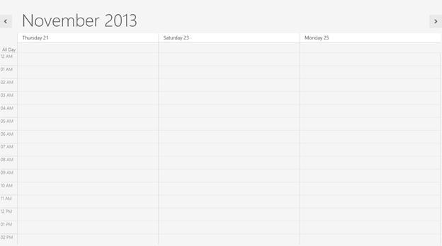
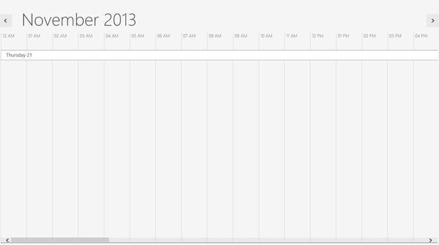

# Visible Dates Customization

All views in the schedule have their own number of visible dates. The SfSchedule control allows users to view multiple dates in the day and time line views.

If users want to view particular dates in a single view, users can provide a DateTime collection to the **ScheduleDateRange** property to view the particular dates in the day and time line view types.

>**Note:-When you set the ScheduleDateRange.schedule changes its type to day view automatically.**



        ObservableCollection<DateTime> visibleDates = new ObservableCollection<DateTime>();
        DateTime Date1 = new DateTime(2013, 9, 21);
        DateTime Date2 = new DateTime(2013, 9, 23);
        DateTime Date3 = new DateTime(2013, 9, 23);
        visibleDates.Add(Date1);
        visibleDates.Add(Date2);
        visibleDates.Add(Date3);
        SfSchedule schedule = new SfSchedule();
        schedule.ScheduleDateRange= visibleDates;



