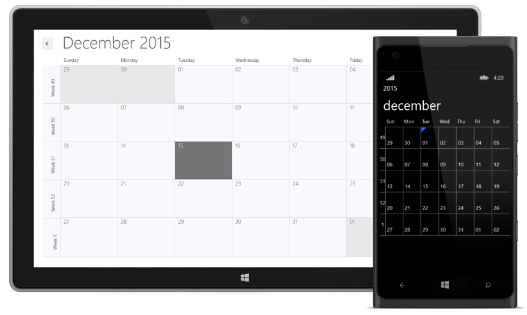

# Week Number

You can display the week number of the year in month view by using the **ShowWeekNumber** property. By default value of **ShowWeekNumber** property is false.

>**Note:-ShowWeekNumber is only applicable in Month view.**




    <schedule:SfSchedule  x:Name="schedule"  ScheduleType="Month"  ShowWeekNumber="True"/>
    




            SfSchedule schedule = new SfSchedule();
            schedule.ScheduleType = ScheduleType.Month;
            schedule.ShowWeekNumber = true;
            this.grid.Children.Add(schedule);




