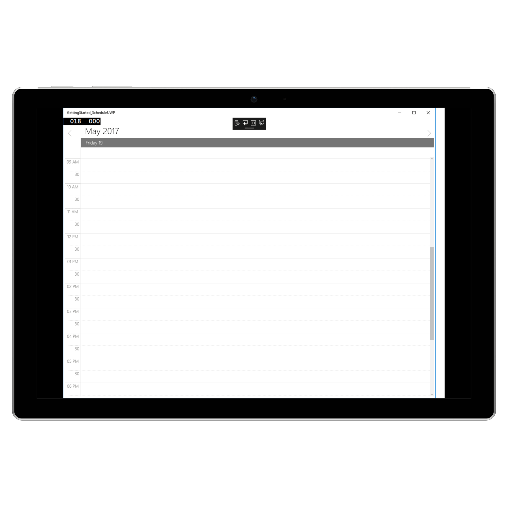

---     
layout: post     
title: Getting Started with UWP Scheduler control | Syncfusion
description: Learn here about getting started with Syncfusion UWP Scheduler (SfSchedule) control, its elements and more.
platform: uwp     
control: SfSchedule     
documentation: ug     
---     
      
# Getting Started with UWP Scheduler (SfSchedule)
      
This section provides you an overview for working with SfSchedule for UWP and also provides a walk through to configure SfSchedule control in real time scenario. 
 
## Assembly Configuration     
      
SfSchedule can be included in your UWP project in two ways,    
   
* [Assembly Reference](#assembly-reference)    
* [NuGet Configuration](#nuget-configuration)    

### Assembly Reference    
   
You can download our UWP components directly from our website, refer [here](https://help.syncfusion.com/uwp/system-requirements) for assistance.  
 
Once the assemblies have been downloaded and explored, you can find all the required assemblies in the installation folders [location](https://help.syncfusion.com/uwp/system-requirements). 
 
The following list of assemblies need to be added as reference from the installed folder to use SfSchedule in your application.    
     
<table>    
<tr>    
<th>Project</th>   
<th>Required assembly</th> 
</tr>    
<tr>    
<td>UWP</td>    
<td>Syncfusion.SfSchedule.UWP </td>    
</tr>   
</table>    
      
### NuGet Configuration    
      
Alternatively you can refer SfSchedule in your application by configuring NuGet packages.     
   
* [Configuration in Visual Studio](https://help.syncfusion.com/uwp/system-requirements)
   
* [Configuration from command line](https://help.syncfusion.com/uwp/system-requirements)   

## Create a simple application with SfSchedule    
      
This section explains how to create a simple application using SfSchedule control.This is how the final output will look like on UWP Desktop devices. 

 

You can download the entire source code of this demo for UWP from    
here [ScheduleGettingStarted](https://www.syncfusion.com/downloads/support/directtrac/general/ze/GettingStarted_ScheduleUWP1114729068.zip)    
     
This section provides a walks through to create `MeetingRoomScheduler` using our Schedule control.   
     
* [Creating a new project](#creating-a-new-project)    
* [Adding SfSchedule to the project](#adding-sfschedule-to-the-project)
* [Changing Schedule Views](#changing-schedule-views)      
* [Binding data to SfSchedule control](#binding-data-to-sfschedule-control)   

## Creating a new project    
      
Create a new Blank App (Universal Windows) application in Visual Studio.   
     
Add the required assembly references to the project as discussed in the [Assembly Configuration](#assembly-configuration) section.    
     
Import SfSchedule control namespace `Syncfusion.UI.Xaml.Schedule`.  
 
## Adding SfSchedule to the project   
 
 
 
 
    <Page x:Class="GettingStarted.MainPage" 
      xmlns="http://schemas.microsoft.com/winfx/2006/xaml/presentation" 
      xmlns:x="http://schemas.microsoft.com/winfx/2006/xaml" 
      xmlns:d="http://schemas.microsoft.com/expression/blend/2008" 
      xmlns:local="using:GettingStarted" 
      xmlns:mc="http://schemas.openxmlformats.org/markup-compatibility/2006" 
      xmlns:syncfusion="using:Syncfusion.UI.Xaml.Schedule" 
      mc:Ignorable="d"> 
    <syncfusion:SfSchedule x:Name="schedule" /> 
    </Page> 
     
 
 
 
     
    using Syncfusion.UI.Xaml.Schedule; 
     
    namespace GettingStarted_ScheduleUWP 
    { 
        public sealed partial class MainPage : Page 
        { 
            SfSchedule schedule; 
            public MainPage() 
            { 
                this.InitializeComponent(); 
                //Creating new instance for SfSchedule    
                schedule = new SfSchedule(); 
                this.Content = schedule; 
            } 
        } 
    } 
 
 
 
      
## Changing Schedule Views     
      
SfSchedule control provides different types of views to display dates and it can be assigned to the control by using [SfSchedule.ScheduleType](https://help.syncfusion.com/cr/uwp/Syncfusion.UI.Xaml.Schedule.SfSchedule.html#Syncfusion_UI_Xaml_Schedule_SfSchedule_ScheduleTypeProperty) property. By default the control is assigned with `DayView`. Current date will be displayed initially for all the Schedule views.   
   
Schedule control will be rendered with `Sunday` as the first day of the week, but you can customize to any day by using [SfSchedule.FirstDayOfWeek](https://help.syncfusion.com/cr/uwp/Syncfusion.UI.Xaml.Schedule.SfSchedule.html#Syncfusion_UI_Xaml_Schedule_SfSchedule_FirstDayOfWeekProperty) property of `SfSchedule`.   
     
   
    
     
    <syncfusion:SfSchedule x:Name="schedule"  FirstDayOfWeek="Tuesday" />    
     
    
   
     
    //setting first day of the week     
    schedule.FirstDayOfWeek = DayOfWeek.Tuesday;    
     
   
   

 

### Day View    
     
DayView is used to display a single day, current day will be visible by default. Appointments on a specific day will be arranged in respective timeslots based on its duration.    
     
    
    
     
    <syncfusion:SfSchedule x:Name="schedule"  ScheduleType="Day" />    
     
    
    
     
     schedule.ScheduleType = ScheduleType.Day; 
     
    
    

 

### Week View    
  
`WeekView` is to view all days of a particular week. Appointments will be arranged based on the dates on the week in respective timeslots.   
     
    
    
     
    <syncfusion:SfSchedule x:Name="schedule" ScheduleType="Week" />    
             
    
    
     
    schedule.ScheduleType = ScheduleType.Week;   
     
    
    

 

### Work Week View    
  
`WorkWeekView` is to view only working days of a particular week. By default, Saturday and Sunday are the non-working days. You can be customize it with any days of a Week. Appointments arranged in timeslots based on its duration with respective day of the week.   
     
    
    
     
    <syncfusion:SfSchedule x:Name="schedule" ScheduleType="WorkWeek" />    
     
    
    
     
    schedule.ScheduleType = ScheduleType.WorkWeek; 
     
    
    
 
>**Notes**: Appointments in non-working days will not be displayed.   

 

### Month View    
     
`MonthView` in Schedule control is to view entire dates of a particular month.Appointments arranged in timeslots based on its duration with respective day of the month.   
     
    
    
     
    <syncfusion:SfSchedule x:Name="schedule" ScheduleType="Month" /> 
     
   
    
     
    schedule.ScheduleType = ScheduleType.Month; 
     
    
    
     
  
 
### TimeLine View    
     
`TimeLineView` is used to displays complete TimeLine in selected day, the default visible day of Schedule will be current day. Appointments are added in particular timeslot based on its timeline.   
     
    
    
     
    <syncfusion:SfSchedule x:Name="schedule" ScheduleType="TimeLine" /> 
     
   
    
     
     schedule.ScheduleType = ScheduleType.TimeLine; 
             
    
    

 

## Binding data to SfSchedule control    
   
Schedule control has a built-in capability to handle the appointment arrangement internally based on the ScheduleAppointment collections. You need to assign the created collection to the [SfSchedule.Appointments](https://help.syncfusion.com/cr/uwp/Syncfusion.UI.Xaml.Schedule.SfSchedule.html#Syncfusion_UI_Xaml_Schedule_SfSchedule_Appointments) property of `SfSchedule`. 
   
### Adding Appointments    
   
 [ScheduleAppointment](https://help.syncfusion.com/cr/uwp/Syncfusion.UI.Xaml.Schedule.ScheduleAppointment.html) is a class, which holds the details about the appointment to be rendered in schedule. It has some basic properties such as [ScheduleAppointment.StartTime](https://help.syncfusion.com/cr/uwp/Syncfusion.UI.Xaml.Schedule.ScheduleAppointment.html#Syncfusion_UI_Xaml_Schedule_ScheduleAppointment_StartTimeProperty), [ScheduleAppointment.EndTime](https://help.syncfusion.com/cr/uwp/Syncfusion.UI.Xaml.Schedule.ScheduleAppointment.html#Syncfusion_UI_Xaml_Schedule_ScheduleAppointment_EndTimeProperty), [ScheduleAppointment.Subject](https://help.syncfusion.com/cr/uwp/Syncfusion.UI.Xaml.Schedule.ScheduleAppointment.html#Syncfusion_UI_Xaml_Schedule_ScheduleAppointment_SubjectProperty) and some additional information about the appointment can be added using [ScheduleAppointment.AppointmentBackground](https://help.syncfusion.com/cr/uwp/Syncfusion.UI.Xaml.Schedule.ScheduleAppointment.html#Syncfusion_UI_Xaml_Schedule_ScheduleAppointment_AppointmentBackgroundProperty), [ScheduleAppointment.Notes](https://help.syncfusion.com/cr/uwp/Syncfusion.UI.Xaml.Schedule.ScheduleAppointment.html#Syncfusion_UI_Xaml_Schedule_ScheduleAppointment_NotesProperty), [ScheduleAppointment.Location](https://help.syncfusion.com/cr/uwp/Syncfusion.UI.Xaml.Schedule.ScheduleAppointment.html#Syncfusion_UI_Xaml_Schedule_ScheduleAppointment_LocationProperty), [ScheduleAppointment.AllDay](https://help.syncfusion.com/cr/uwp/Syncfusion.UI.Xaml.Schedule.ScheduleAppointment.html#Syncfusion_UI_Xaml_Schedule_ScheduleAppointment_AllDayProperty), [ScheduleAppointment.IsRecursive](https://help.syncfusion.com/cr/uwp/Syncfusion.UI.Xaml.Schedule.ScheduleAppointment.html#Syncfusion_UI_Xaml_Schedule_ScheduleAppointment_IsRecursiveProperty) properties.    
     
    
     
    ScheduleAppointmentCollection appointmentCollection = new ScheduleAppointmentCollection(); 
    //Creating new event    
    ScheduleAppointment clientMeeting = new ScheduleAppointment(); 
    DateTime currentDate = DateTime.Now; 
    DateTime startTime = new DateTime(currentDate.Year, currentDate.Month, currentDate.Day, 10, 0, 0); 
    DateTime endTime = new DateTime(currentDate.Year, currentDate.Month, currentDate.Day, 12, 0, 0); 
    clientMeeting.StartTime = startTime; 
    clientMeeting.EndTime = endTime; 
    clientMeeting.AppointmentBackground = new SolidColorBrush(Colors.Green); 
    clientMeeting.Subject = "ClientMeeting"; 
    appointmentCollection.Add(clientMeeting); 
    schedule.Appointments = appointmentCollection; 
     
    
 
### Adding Custom Appointments    
   
You can also map custom appointments data to our schedule.    
   
>**Notes**: CustomAppointment class should contain two DateTime fields and a string field as mandatory.   
  
Here steps to render `MeetingRoomScheduler` using SfSchedule control with respective custom data properties created in a class Meeting.   
   
* [Creating custom class for appointments](#creating-custom-class-for appointments)  
* [Creating view model](#creating-view-model) 
* [Mapping custom class](#mapping-custom-class)   
* [Setting data source for SfSchedule](#setting-data-source-for-sfschedule)   

#### Creating custom class  for appointments 
  
You can create a custom class `Meeting` with mandatory fields "From", "To" and "EventName".  
  
    
        
    /// 
    
    /// Represents custom data properties.    
    /// 
    
    public class Meeting 
    { 
        public string EventName { get; set; } 
        public string Organizer { get; set; } 
        public string ContactID { get; set; } 
        public int Capacity { get; set; } 
        public DateTime From { get; set; } 
        public DateTime To { get; set; } 
        public Brush color { get; set; } 
    }    
     
    
     
>**Notes**: You can inherit this class from `INotifyPropertyChanged` for dynamic changes in custom data.   
 
#### Mapping custom class   
  
You can map those properties of `Meeting` class with our schedule control by using [ScheduleAppointmentMapping](https://help.syncfusion.com/cr/uwp/Syncfusion.UI.Xaml.Schedule.SfSchedule.html#Syncfusion_UI_Xaml_Schedule_SfSchedule_AppointmentMappingProperty).    



    
    <syncfusion:SfSchedule x:Name="schedule" ScheduleType="Week">
        <syncfusion:SfSchedule.AppointmentMapping>
            <syncfusion:ScheduleAppointmentMapping
                AppointmentBackgroundMapping="color"
                EndTimeMapping="To"
                StartTimeMapping="From"
                SubjectMapping="EventName" />
        </syncfusion:SfSchedule.AppointmentMapping>
    </syncfusion:SfSchedule>
    

    
     
    ScheduleAppointmentMapping dataMapping = new ScheduleAppointmentMapping();
    dataMapping.SubjectMapping = "EventName"; 
    dataMapping.StartTimeMapping = "From"; 
    dataMapping.EndTimeMapping = "To"; 
    dataMapping.AppointmentBackgroundMapping = "color"; 
    schedule.AppointmentMapping = dataMapping;  
     
    

   
#### Creating view model   
     
You can schedule meetings for a particular day by setting `From` and `To` of `Meeting` class.Also you can change subject and color of appointment using `EventName` and `color` of Meeting class. In a separate ViewModel class you can describe the collection of custom appointments.    
     
    
     
    /// 
    
    /// Represents collection of appointments.    
    /// 
  
    public class ScheduleViewModel 
    { 
        public ObservableCollection<Meeting> Meetings { get; set; } 
        private List<Point> randomTimeCollection; 
        List<string> eventNameCollection; 
        List<Brush> colorCollection; 
 
        public ScheduleViewModel() 
        { 
            Meetings = new ObservableCollection<Meeting>(); 
            CreateEventNameCollection(); 
            CreateColorCollection(); 
            BookingAppointments(); 
        } 
 
        private void BookingAppointments() 
        { 
            Random randomTime = new Random(); 
            randomTimeCollection = GettingTimeRanges(); 
 
            DateTime date; 
            DateTime DateFrom = DateTime.Now.AddMonths(-1); 
            DateTime DateTo = DateTime.Now.AddMonths(1); 
            DateTime dateRangeStart = DateTime.Now.AddDays(-3); 
            DateTime dateRangeEnd = DateTime.Now.AddDays(3); 
 
            for (date = DateFrom; date < DateTo; date = date.AddDays(1)) 
            { 
                if ((DateTime.Compare(date, dateRangeStart) > 0) && (DateTime.Compare(date, dateRangeEnd) < 0)) 
                { 
                    for (int AdditionalAppointmentIndex = 0; AdditionalAppointmentIndex < 3; AdditionalAppointmentIndex++) 
                    { 
                        Meeting meeting = new Meeting(); 
                        int hour = (randomTime.Next((int)randomTimeCollection[AdditionalAppointmentIndex].X, (int)randomTimeCollection[AdditionalAppointmentIndex].Y)); 
                        meeting.From = new DateTime(date.Year, date.Month, date.Day, hour, 0, 0); 
                        meeting.To = (meeting.From.AddHours(1)); 
                        meeting.EventName = eventNameCollection[randomTime.Next(9)]; 
                        meeting.color = colorCollection[randomTime.Next(9)]; 
                        Meetings.Add(meeting); 
                    } 
                } 
                else 
                { 
                    Meeting meeting = new Meeting(); 
                    meeting.From = new DateTime(date.Year, date.Month, date.Day, randomTime.Next(9, 11), 0, 0); 
                    meeting.To = (meeting.From.AddHours(1)); 
                    meeting.EventName = eventNameCollection[randomTime.Next(9)]; 
                    meeting.color = colorCollection[randomTime.Next(9)]; 
                    Meetings.Add(meeting); 
                } 
            } 
        } 
 
        /// 
   
        /// Creates event names collection.   
        /// 
   
        private void CreateEventNameCollection() 
        { 
            eventNameCollection = new List<string>(); 
            eventNameCollection.Add("General Meeting"); 
            eventNameCollection.Add("Plan Execution"); 
            eventNameCollection.Add("Project Plan"); 
            eventNameCollection.Add("Consulting"); 
            eventNameCollection.Add("Performance Check"); 
            eventNameCollection.Add("Yoga Therapy"); 
            eventNameCollection.Add("Plan Execution"); 
            eventNameCollection.Add("Project Plan"); 
            eventNameCollection.Add("Consulting"); 
            eventNameCollection.Add("Performance Check"); 
        } 
 
        /// 
   
        /// Creates color collection.   
        /// 
   
        private void CreateColorCollection() 
        { 
            colorCollection = new List<Brush>(); 
            colorCollection.Add(new SolidColorBrush(Color.FromArgb(0XFF, 0X11, 0X7E, 0XB4))); 
            colorCollection.Add(new SolidColorBrush(Color.FromArgb(0XFF, 0XB4, 0X11, 0X2E))); 
            colorCollection.Add(new SolidColorBrush(Color.FromArgb(0XFF, 0XC4, 0X43, 0X43))); 
            colorCollection.Add(new SolidColorBrush(Color.FromArgb(0xFF, 0xA2, 0xC1, 0x39))); 
            colorCollection.Add(new SolidColorBrush(Color.FromArgb(0xFF, 0xD8, 0x00, 0x73))); 
            colorCollection.Add(new SolidColorBrush(Color.FromArgb(0xFF, 0x1B, 0xA1, 0xE2))); 
            colorCollection.Add(new SolidColorBrush(Color.FromArgb(0xFF, 0xE6, 0x71, 0xB8))); 
            colorCollection.Add(new SolidColorBrush(Color.FromArgb(0xFF, 0xF0, 0x96, 0x09))); 
            colorCollection.Add(new SolidColorBrush(Color.FromArgb(0xFF, 0x33, 0x99, 0x33))); 
            colorCollection.Add(new SolidColorBrush(Color.FromArgb(0xFF, 0x00, 0xAB, 0xA9))); 
            colorCollection.Add(new SolidColorBrush(Color.FromArgb(0xFF, 0xE6, 0x71, 0xB8))); 
        } 
 
        /// 
 
        /// Gets the time ranges. 
        /// 
 
        private List<Point> GettingTimeRanges() 
        { 
            randomTimeCollection = new List<Point>(); 
            randomTimeCollection.Add(new Point(9, 11)); 
            randomTimeCollection.Add(new Point(12, 14)); 
            randomTimeCollection.Add(new Point(15, 17)); 
            return randomTimeCollection; 
        } 
    } 

  

#### Setting data source for SfSchedule   
    
 Assign those appointments collection `Meetings` to the [SfSchedule.ItemsSource](https://help.syncfusion.com/cr/uwp/Syncfusion.UI.Xaml.Schedule.SfSchedule.html#Syncfusion_UI_Xaml_Schedule_SfSchedule_ItemsSource) property. 
   
   
   
    ScheduleViewModel viewModel = new ScheduleViewModel(); 
    schedule.ItemsSource = viewModel.Meetings;  
       
 

 

### Dispose SfSchedule

You can release the allocated resources of `Schedule` by calling the [Dispose](https://help.syncfusion.com/cr/uwp/Syncfusion.UI.Xaml.Schedule.SfSchedule.html#Syncfusion_UI_Xaml_Schedule_SfSchedule_Dispose) method. You can handle the memory leak issue by calling the `Dispose` method while unloading the `Schedule`.

 
private void Schedule_Unloaded(object sender, RoutedEventArgs e)
{
    (sender as SfSchedule).Dispose();
}

