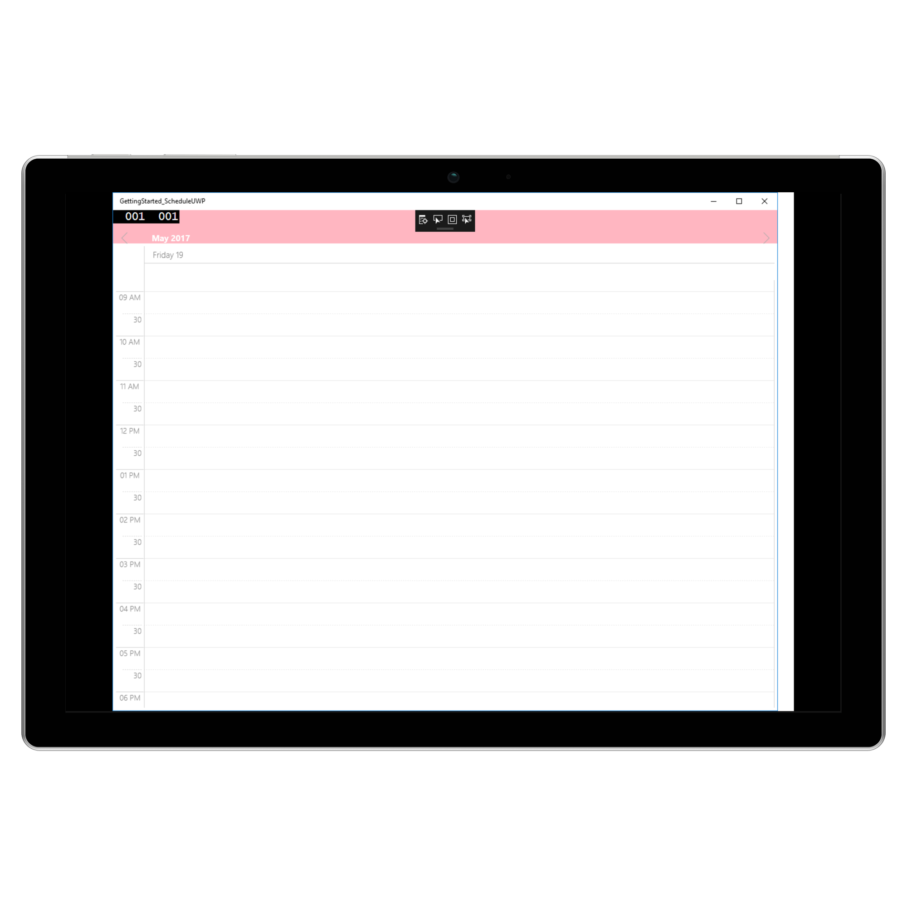

---     
layout: post     
title: Headers in UWP Scheduler control | Syncfusion
description: Learn here all about Headers support in Syncfusion UWP Scheduler (SfSchedule) control and more.
platform: uwp    
control: SfSchedule     
documentation: ug 
---  

# Headers in UWP Scheduler (SfSchedule)

You can customize the header of the Schedule using [SfSchedule.ScheduleHeaderStyle](https://help.syncfusion.com/cr/uwp/Syncfusion.UI.Xaml.Schedule.SfSchedule.html#Syncfusion_UI_Xaml_Schedule_SfSchedule_ScheduleHeaderStyle) property in Schedule and [ScheduleHeaderStyle.HeaderHeight](https://help.syncfusion.com/cr/uwp/Syncfusion.UI.Xaml.Schedule.ScheduleHeaderStyle.html#Syncfusion_UI_Xaml_Schedule_ScheduleHeaderStyle_HeaderHeight) property in `ScheduleHeaderStyle` of Schedule.

## Header Height

You can customize the height for the Header in Schedule using `HeaderHeight` in `ScheduleHeaderStyle` of Schedule.

 

        
    <syncfusion:SfSchedule x:Name="schedule">
        <syncfusion:SfSchedule.ScheduleHeaderStyle>
            <syncfusion:ScheduleHeaderStyle HeaderHeight="50" />
        </syncfusion:SfSchedule.ScheduleHeaderStyle>
    </syncfusion:SfSchedule>
    
 


	ScheduleHeaderStyle headerStyle = new ScheduleHeaderStyle();
    headerStyle.HeaderHeight = 50;
    schedule.ScheduleHeaderStyle = headerStyle;


 

## Appearance

You can change the header format and style using `ScheduleHeaderStyle` property in schedule.

You can change the background color,text style and text size using properties such as [ScheduleHeaderStyle.HeaderBackground](https://help.syncfusion.com/cr/uwp/Syncfusion.UI.Xaml.Schedule.ScheduleHeaderStyle.html#Syncfusion_UI_Xaml_Schedule_ScheduleHeaderStyle_HeaderBackground), [ScheduleHeaderStyle.HeaderTextStyle](https://help.syncfusion.com/cr/uwp/Syncfusion.UI.Xaml.Schedule.ScheduleHeaderStyle.html#Syncfusion_UI_Xaml_Schedule_ScheduleHeaderStyle_HeaderTextStyle), [ScheduleHeaderStyle.HeaderTextSize](https://help.syncfusion.com/cr/uwp/Syncfusion.UI.Xaml.Schedule.ScheduleHeaderStyle.html#Syncfusion_UI_Xaml_Schedule_ScheduleHeaderStyle_HeaderTextSize), [ScheduleHeaderStyle.HeaderTextColor](https://help.syncfusion.com/cr/uwp/Syncfusion.UI.Xaml.Schedule.ScheduleHeaderStyle.html#Syncfusion_UI_Xaml_Schedule_ScheduleHeaderStyle_HeaderTextColor), of Header using `ScheduleHeaderStyle` property in schedule.

 


    <syncfusion:SfSchedule x:Name="schedule" ScheduleType="Day">
        <syncfusion:SfSchedule.ScheduleHeaderStyle>
            <syncfusion:ScheduleHeaderStyle
                HeaderBackground="LightPink"
                HeaderTextColor="White"
                HeaderTextSize="15"
                HeaderTextStyle="Bold" />
        </syncfusion:SfSchedule.ScheduleHeaderStyle>
    </syncfusion:SfSchedule>




	ScheduleHeaderStyle headerStyle = new ScheduleHeaderStyle();
    headerStyle.HeaderBackground = new SolidColorBrush(Colors.LightPink);
    headerStyle.HeaderTextColor = new SolidColorBrush(Colors.White);
    headerStyle.HeaderTextSize = 15;
    headerStyle.HeaderTextStyle = FontWeights.Bold;
    schedule.ScheduleHeaderStyle = headerStyle;


 

 

## Loading Custom Headers

You can collapse the default header of schedule by setting `HeaderHeight` property of `ScheduleHeaderStyle` of `SfSchedule` as 0. Instead you can use your own custom header for it. While navigating views in schedule, text labels available in the header will be changed based on it visible dates, so while using custom header , respective text value can be obtained from the `VisibleDatesChanging` event of `SfSchedule`.


    
    //triggering the visible dates changing event.
    schedule.VisibleDatesChanging += Schedule_VisibleDatesChanging; 

    private void Schedule_VisibleDatesChanging(object sender, VisibleDatesChangingEventArgs e)
        {
            DateTime dateTime = ((ObservableCollection<System.DateTime>)e.NewValue).LastOrDefault();
            String month = null;
            var headerString = string.Empty;
            if (schedule.ScheduleType == ScheduleType.Month)
            {
                month = CultureInfo.CurrentCulture.DateTimeFormat.GetMonthName(CultureInfo.CurrentCulture.Calendar.GetMonth((e.NewValue as ObservableCollection<System.DateTime>)[(e.NewValue as ObservableCollection<System.DateTime>).Count / 2].Date));
                headerString = month + "," + " " + (e.NewValue as ObservableCollection<System.DateTime>)[(e.NewValue as ObservableCollection<System.DateTime>).Count / 2].Year.ToString();
            }
            else
                headerString = String.Format("{0:MMMM, yyyy}", dateTime);
        }



You can get the complete sample for customizing the Header of Schedule [here](http://www.syncfusion.com/downloads/support/directtrac/general/ze/HeaderSample_UWP-317998418.zip) 
