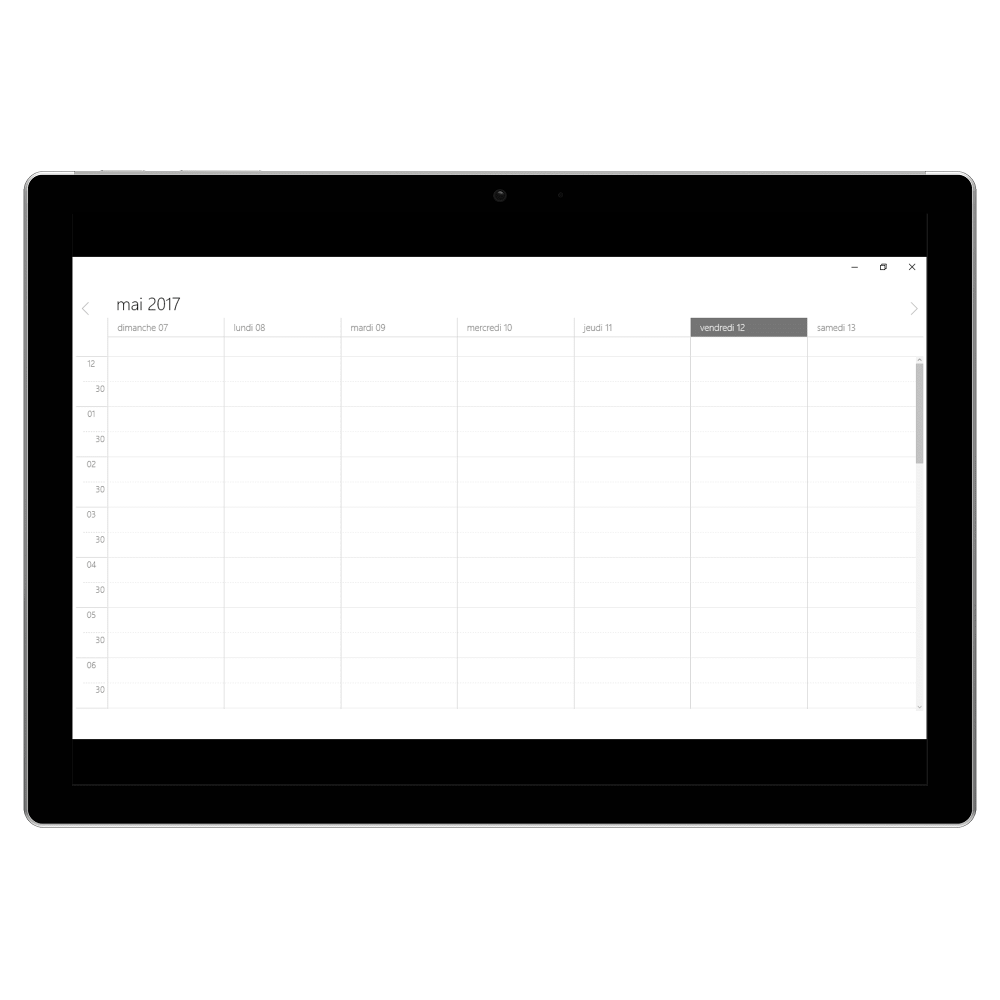
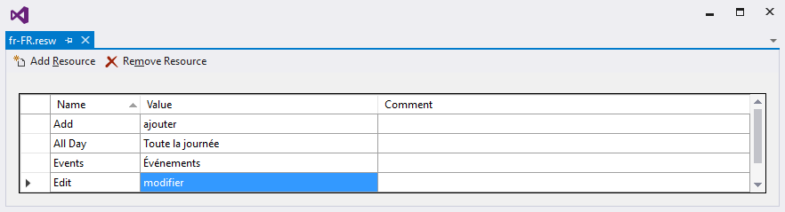

# Localization in UWP Scheduler (SfSchedule)
The Schedule control is available with complete localization support. Localization can be specified by setting the local language to the `PrimaryLanguageOverride` in the format of `Language code`.

## Change default control language
Based on the locale specified, the strings in the control such as Date, time, and days are localized accordingly.
By default, the schedule control is available with the en locale, which is English.

 

using Syncfusion.UI.Xaml.Schedule;

ApplicationLanguages.PrimaryLanguageOverride = "fr";

   

>**Note:** AM/PM in the timeline will not be localized in the Schedule views.

## Localizing custom text in UWP renderer.
You can localize custom text available in the control by adding equivalent localized strings in the fr.resw file. Here we have used the French language.

>**Note:** The resw file name should match with the given locale language code.

