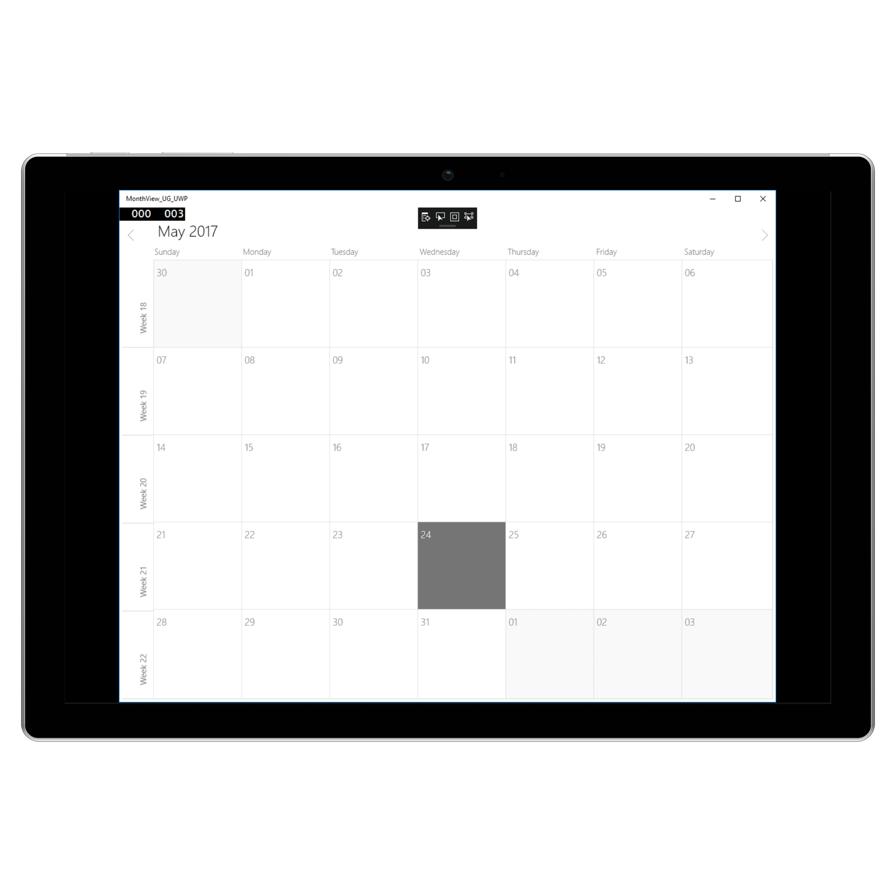

---   
layout: post   
title: MonthView   
description: Overview of MonthView related features
platform: uwp   
control: SfSchedule   
documentation: ug   
---   
    
# Month View
`MonthView` of `SfSchedule` used to display entire dates of the specific month, current month will be displayed by default initially. Current date color is differentiated with other dates of the current month, also the color differentiation for dates will be applicable for previous and next month dates. Single notation will be displayed in the cell to indicate the appointment availability in the specific cell.




        <schedule:SfSchedule 
				x:Name="schedule" 
				ScheduleType="Month">
		</schedule:SfSchedule>




			//setting schedule type
			schedule.ScheduleType = ScheduleType.Month;




## Month Navigation direction
MonthView of Schedule can be navigated to both horizontal and vertical direction. You can change the direction of navigation by using the [MonthNavigationDirection](https://help.syncfusion.com/cr/uwp/Syncfusion.UI.Xaml.Schedule.SfSchedule.html#Syncfusion_UI_Xaml_Schedule_SfSchedule_MonthNavigationDirection) property of `SfSchedule`, by default Month navigation direction is `Horizontal`.




        <schedule:SfSchedule 
                x:Name="schedule"
                MonthNavigationDirection="Vertical"
			    ScheduleType="Month">
        </schedule:SfSchedule> 




			//To navigate vertically
			schedule.MonthNavigationDirection = MonthNavigationDirections.Vertical;




## Restricted days in Month
You can disable the interaction for certain date in Month view by using [MonthBlockOutDates](https://help.syncfusion.com/cr/uwp/Syncfusion.UI.Xaml.Schedule.SfSchedule.html#Syncfusion_UI_Xaml_Schedule_SfSchedule_MonthBlockOutDates) of `SfSchedule`, using this you can allocate / restrict the specific date for predefined events.




			schedule.MonthBlockOutDates.Add(DateTime.Now.Date.AddDays(1));
            schedule.MonthBlockOutDates.Add(DateTime.Now.Date.AddDays(2));
            schedule.MonthBlockOutDates.Add(DateTime.Now.Date.AddDays(3));




## First day of Week in Month
You can change the first day of week by using the [FirstDayOfWeek](https://help.syncfusion.com/cr/uwp/Syncfusion.UI.Xaml.Schedule.SfSchedule.html#Syncfusion_UI_Xaml_Schedule_SfSchedule_FirstDayOfWeek) property of `SfSchedule`, by default schedule control will rendered with `Sunday` as the first day of the week. 




        <schedule:SfSchedule 
                x:Name="schedule"
                FirstDayOfWeek="Monday"
			    ScheduleType="Month">
        </schedule:SfSchedule>




			//setting FirstDayOfWeek
			schedule.FirstDayOfWeek = DayOfWeek.Monday;




## Week Number of the Year in Month
You can display the Week Number of the year in `MonthView` by setting [ShowWeekNumber](https://help.syncfusion.com/cr/uwp/Syncfusion.UI.Xaml.Schedule.SfSchedule.html#Syncfusion_UI_Xaml_Schedule_SfSchedule_ShowWeekNumber) property of `SfSchedule` as `true`, by default it is `false`.




        <schedule:SfSchedule 
                x:Name="schedule"
                ShowWeekNumber="True"
			    ScheduleType="Month">
        </schedule:SfSchedule>  




			schedule.ShowWeekNumber = true;




## Week Number Appearance
You can customize the Week Number appearance by using [WeekNumberStyle](https://help.syncfusion.com/cr/uwp/Syncfusion.UI.Xaml.Schedule.SfSchedule.html#Syncfusion_UI_Xaml_Schedule_SfSchedule_WeekNumberStyle) property of `SfSchedule`. Week number [Background](https://help.syncfusion.com/cr/uwp/Syncfusion.UI.Xaml.Schedule.WeekNumberStyle.html#Syncfusion_UI_Xaml_Schedule_WeekNumberStyle_Background), [Foreground](https://help.syncfusion.com/cr/uwp/Syncfusion.UI.Xaml.Schedule.WeekNumberStyle.html#Syncfusion_UI_Xaml_Schedule_WeekNumberStyle_Foreground), [FontFamily](https://help.syncfusion.com/cr/uwp/Syncfusion.UI.Xaml.Schedule.WeekNumberStyle.html#Syncfusion_UI_Xaml_Schedule_WeekNumberStyle_FontFamily), [FontSize](https://help.syncfusion.com/cr/uwp/Syncfusion.UI.Xaml.Schedule.WeekNumberStyle.html#Syncfusion_UI_Xaml_Schedule_WeekNumberStyle_FontSize) and  [FontWeight](https://help.syncfusion.com/cr/uwp/Syncfusion.UI.Xaml.Schedule.WeekNumberStyle.html#Syncfusion_UI_Xaml_Schedule_WeekNumberStyle_FontWeight) can be customized using `WeekNumberStyle` properties.




        <schedule:SfSchedule  
                x:Name="schedule"
                ShowWeekNumber="True"
			    ScheduleType="Month">
            <schedule:SfSchedule.WeekNumberStyle>
                <schedule:WeekNumberStyle 
                    Background="Blue" 
                    Foreground ="White" 
                    FontSize="15" 
                    FontFamily="Times New Roman" 
                    FontWeight="Bold">
                </schedule:WeekNumberStyle>
            </schedule:SfSchedule.WeekNumberStyle>
        </schedule:SfSchedule>  




		    //creating new instance for WeekNumberStyle
            WeekNumberStyle weekNumberStyle = new WeekNumberStyle();
            weekNumberStyle.FontFamily = new FontFamily("Times New Roman");
            weekNumberStyle.Background = new SolidColorBrush(Colors.Blue);
            weekNumberStyle.Foreground = new SolidColorBrush(Colors.White);
            weekNumberStyle.FontSize = 15;
            weekNumberStyle.FontWeight = FontWeights.Bold;
            schedule.WeekNumberStyle = weekNumberStyle;




## View Header Appearance  
You can customize the Month View Header appearance by using [MonthViewHeaderStyle](https://help.syncfusion.com/cr/uwp/Syncfusion.UI.Xaml.Schedule.SfSchedule.html#Syncfusion_UI_Xaml_Schedule_SfSchedule_MonthViewHeaderStyle) property of SfSchedule. Month View Header  [MonthViewHeaderBackground](https://help.syncfusion.com/cr/uwp/Syncfusion.UI.Xaml.Schedule.ScheduleMonthViewHeaderStyle.html#Syncfusion_UI_Xaml_Schedule_ScheduleMonthViewHeaderStyle_MonthViewHeaderBackground), [MonthViewHeaderTextColor](https://help.syncfusion.com/cr/uwp/Syncfusion.UI.Xaml.Schedule.ScheduleMonthViewHeaderStyle.html#Syncfusion_UI_Xaml_Schedule_ScheduleMonthViewHeaderStyle_MonthViewHeaderTextColor), [MonthViewHeaderTextSize](https://help.syncfusion.com/cr/uwp/Syncfusion.UI.Xaml.Schedule.ScheduleMonthViewHeaderStyle.html#Syncfusion_UI_Xaml_Schedule_ScheduleMonthViewHeaderStyle_MonthViewHeaderTextSize), [MonthViewHeaderHeight](https://help.syncfusion.com/cr/uwp/Syncfusion.UI.Xaml.Schedule.ScheduleMonthViewHeaderStyle.html#Syncfusion_UI_Xaml_Schedule_ScheduleMonthViewHeaderStyle_MonthViewHeaderHeight), [MonthViewHeaderTextStyle](https://help.syncfusion.com/cr/uwp/Syncfusion.UI.Xaml.Schedule.ScheduleMonthViewHeaderStyle.html#Syncfusion_UI_Xaml_Schedule_ScheduleMonthViewHeaderStyle_MonthViewHeaderTextStyle), [MonthViewHeaderTextHorizontalAlignment](https://help.syncfusion.com/cr/uwp/Syncfusion.UI.Xaml.Schedule.ScheduleMonthViewHeaderStyle.html), [MonthViewHeaderTextMargin](https://help.syncfusion.com/cr/uwp/Syncfusion.UI.Xaml.Schedule.ScheduleMonthViewHeaderStyle.html#Syncfusion_UI_Xaml_Schedule_ScheduleMonthViewHeaderStyle_MonthViewHeaderTextMargin) and [MonthViewHeaderTextVerticalAlignment](https://help.syncfusion.com/cr/uwp/Syncfusion.UI.Xaml.Schedule.ScheduleMonthViewHeaderStyle.html#Syncfusion_UI_Xaml_Schedule_ScheduleMonthViewHeaderStyle_MonthViewHeaderTextVerticalAlignment) can be customized using `ScheduleMonthViewHeaderStyle` properties.




         <schedule:SfSchedule  
                x:Name="schedule"
                ScheduleType="Month">
            <schedule:SfSchedule.MonthViewHeaderStyle>
                <schedule:ScheduleMonthViewHeaderStyle 
                    MonthViewHeaderBackground="Blue" 
                    MonthViewHeaderTextColor ="White" 
                    MonthViewHeaderTextSize="15"
                    MonthViewHeaderHeight="15"
                    MonthViewHeaderTextStyle="Bold"
                    MonthViewHeaderTextHorizontalAlignment ="Center"
                    MonthViewHeaderTextVerticalAlignment ="Center"
                    MonthViewHeaderTextMargin="2,2,2,2">
                </schedule:ScheduleMonthViewHeaderStyle>
            </schedule:SfSchedule.MonthViewHeaderStyle>
        </schedule:SfSchedule>




			//creating new instance for ScheduleMonthViewHeaderStyle
            ScheduleMonthViewHeaderStyle scheduleMonthViewHeaderStyle = new ScheduleMonthViewHeaderStyle();       
            scheduleMonthViewHeaderStyle.MonthViewHeaderBackground = new SolidColorBrush(Colors.Blue);
            scheduleMonthViewHeaderStyle.MonthViewHeaderTextColor = new SolidColorBrush(Colors.White);
            scheduleMonthViewHeaderStyle.MonthViewHeaderTextSize = 15;
            scheduleMonthViewHeaderStyle.MonthViewHeaderHeight = 25;
            scheduleMonthViewHeaderStyle.MonthViewHeaderTextStyle = FontWeights.Bold;
            scheduleMonthViewHeaderStyle.MonthViewHeaderTextHorizontalAlignment = HorizontalAlignment.Center;
            scheduleMonthViewHeaderStyle.MonthViewHeaderTextMargin = new Thickness(2, 2, 2, 2);
            scheduleMonthViewHeaderStyle.MonthViewHeaderTextVerticalAlignment = VerticalAlignment.Center;
            schedule.MonthViewHeaderStyle = scheduleMonthViewHeaderStyle;




## MonthCell Appearance 
You can customize the Month view cell in three ways,

* [Customize month cell using style](#customize-month-cell-using-style)
* [Customize month cell using event](#customize-month-cell-using-event)
* [Customize month cell with custom UI](#customize-month-cell-with-custom-ui)

### Customize month cell using style
By using [MonthCellStyle](https://help.syncfusion.com/cr/uwp/Syncfusion.UI.Xaml.Schedule.SfSchedule.html#Syncfusion_UI_Xaml_Schedule_SfSchedule_ScheduleMonthCellStyle) of `SfSchedule` you can customize the month cell properties such as [MonthCellTextSize](https://help.syncfusion.com/cr/uwp/Syncfusion.UI.Xaml.Schedule.MonthCellStyle.html#Syncfusion_UI_Xaml_Schedule_MonthCellStyle_MonthCellTextSize), [MonthCellTextFontFamily](https://help.syncfusion.com/cr/uwp/Syncfusion.UI.Xaml.Schedule.MonthCellStyle.html#Syncfusion_UI_Xaml_Schedule_MonthCellStyle_MonthCellTextFontFamily), [CurrentDateCellBackground](https://help.syncfusion.com/cr/uwp/Syncfusion.UI.Xaml.Schedule.MonthCellStyle.html#Syncfusion_UI_Xaml_Schedule_MonthCellStyle_CurrentDateCellBackground), [CurrentDateTextForeground](https://help.syncfusion.com/cr/uwp/Syncfusion.UI.Xaml.Schedule.MonthCellStyle.html#Syncfusion_UI_Xaml_Schedule_MonthCellStyle_CurrentDateTextForeground), [CurrentMonthCellBackground](https://help.syncfusion.com/cr/uwp/Syncfusion.UI.Xaml.Schedule.MonthCellStyle.html#Syncfusion_UI_Xaml_Schedule_MonthCellStyle_CurrentMonthCellBackground), [CurrentMonthTextForeground](https://help.syncfusion.com/cr/uwp/Syncfusion.UI.Xaml.Schedule.MonthCellStyle.html#Syncfusion_UI_Xaml_Schedule_MonthCellStyle_CurrentMonthTextForeground), [CurrentDateHighlight](https://help.syncfusion.com/cr/uwp/Syncfusion.UI.Xaml.Schedule.MonthCellStyle.html#Syncfusion_UI_Xaml_Schedule_MonthCellStyle_CurrentDateHighlight), [NextMonthCellBackground](https://help.syncfusion.com/cr/uwp/Syncfusion.UI.Xaml.Schedule.MonthCellStyle.html#Syncfusion_UI_Xaml_Schedule_MonthCellStyle_NextMonthCellBackground), [NextMonthTextForeground](https://help.syncfusion.com/cr/uwp/Syncfusion.UI.Xaml.Schedule.MonthCellStyle.html#Syncfusion_UI_Xaml_Schedule_MonthCellStyle_NextMonthTextForeground), [PreviousMonthCellBackground](https://help.syncfusion.com/cr/uwp/Syncfusion.UI.Xaml.Schedule.MonthCellStyle.html#Syncfusion_UI_Xaml_Schedule_MonthCellStyle_PreviousMonthCellBackground), [PreviousMonthTextForeground](https://help.syncfusion.com/cr/uwp/Syncfusion.UI.Xaml.Schedule.MonthCellStyle.html#Syncfusion_UI_Xaml_Schedule_MonthCellStyle_PreviousMonthTextForeground), [CellTextHorizontalAlignment](https://help.syncfusion.com/cr/uwp/Syncfusion.UI.Xaml.Schedule.MonthCellStyle.html#Syncfusion_UI_Xaml_Schedule_MonthCellStyle_CellTextHorizontalAlignment), [CellTextVerticalAlignment](https://help.syncfusion.com/cr/uwp/Syncfusion.UI.Xaml.Schedule.MonthCellStyle.html#Syncfusion_UI_Xaml_Schedule_MonthCellStyle_CellTextVerticalAlignment) and [MonthCellTextFontWeight](https://help.syncfusion.com/cr/uwp/Syncfusion.UI.Xaml.Schedule.MonthCellStyle.html#Syncfusion_UI_Xaml_Schedule_MonthCellStyle_MonthCellTextFontWeight).
   



        <schedule:SfSchedule  
                x:Name="schedule"               
			    ScheduleType="Month">
            <schedule:SfSchedule.ScheduleMonthCellStyle>
                <schedule:MonthCellStyle 
                    MonthCellTextSize ="20"
                    MonthCellTextFontFamily ="Times New Roman"
                    CurrentDateCellBackground ="Red"
                    CurrentDateTextForeground="SkyBlue"
                    CurrentMonthCellBackground="Blue"
                    CurrentMonthTextForeground="White"
                    CurrentDateHighlight ="LightSkyBlue"
                    NextMonthCellBackground ="LightGray"
                    NextMonthTextForeground ="Black"
                    PreviousMonthCellBackground ="LightGray"
                    PreviousMonthTextForeground ="Black"
                    CellTextHorizontalAlignment="Center"
                    CellTextVerticalAlignment="Center"
                    MonthCellTextFontWeight="Bold">
                </schedule:MonthCellStyle>
            </schedule:SfSchedule.ScheduleMonthCellStyle>
        </schedule:SfSchedule> 




			//creating new instance for MonthCellStyle
            MonthCellStyle monthCellStyle = new MonthCellStyle();
            monthCellStyle.MonthCellTextSize = 20;
            monthCellStyle.MonthCellTextFontFamily = new FontFamily("Times New Roman");
            monthCellStyle.CurrentDateCellBackground = new SolidColorBrush(Colors.Red);
            monthCellStyle.CurrentDateTextForeground = new SolidColorBrush(Colors.SkyBlue);
            monthCellStyle.CurrentMonthCellBackground = new SolidColorBrush(Colors.Blue);
            monthCellStyle.CurrentMonthTextForeground = new SolidColorBrush(Colors.White);
            monthCellStyle.CurrentDateHighlight = new SolidColorBrush(Colors.LightSkyBlue);
            monthCellStyle.NextMonthCellBackground = new SolidColorBrush(Colors.LightGray);
            monthCellStyle.NextMonthTextForeground = new SolidColorBrush(Colors.Black);
            monthCellStyle.PreviousMonthCellBackground = new SolidColorBrush(Colors.LightGray);
            monthCellStyle.PreviousMonthTextForeground = new SolidColorBrush(Colors.Black);
            monthCellStyle.CellTextHorizontalAlignment = HorizontalAlignment.Center;
            monthCellStyle.CellTextVerticalAlignment = VerticalAlignment.Center;
            monthCellStyle.MonthCellTextFontWeight = FontWeights.Bold;
            schedule.ScheduleMonthCellStyle = monthCellStyle;




    
### Customize month cell using event
By using [MonthCellLoaded](https://help.syncfusion.com/cr/uwp/Syncfusion.UI.Xaml.Schedule.SfSchedule.html) event of `SfSchedule`, you can customize the month cell properties in the run time. In `MonthCellLoaded`, arguments such as [MonthCellStyle](https://help.syncfusion.com/cr/uwp/Syncfusion.UI.Xaml.Schedule.MonthCellLoadedEventArgs.html#Syncfusion_UI_Xaml_Schedule_MonthCellLoadedEventArgs_MonthCellStyle), [MonthCellDate](https://help.syncfusion.com/cr/uwp/Syncfusion.UI.Xaml.Schedule.MonthCellLoadedEventArgs.html#Syncfusion_UI_Xaml_Schedule_MonthCellLoadedEventArgs_MonthCellDate), [View](https://help.syncfusion.com/cr/uwp/Syncfusion.UI.Xaml.Schedule.MonthCellLoadedEventArgs.html#Syncfusion_UI_Xaml_Schedule_MonthCellLoadedEventArgs_View) and boolean properties such as [IsToday](https://help.syncfusion.com/cr/uwp/Syncfusion.UI.Xaml.Schedule.MonthCellLoadedEventArgs.html#Syncfusion_UI_Xaml_Schedule_MonthCellLoadedEventArgs_IsToday), [IsNextMonth](https://help.syncfusion.com/cr/uwp/Syncfusion.UI.Xaml.Schedule.MonthCellLoadedEventArgs.html#Syncfusion_UI_Xaml_Schedule_MonthCellLoadedEventArgs_IsNextMonth), [IsPreviousMonth](https://help.syncfusion.com/cr/uwp/Syncfusion.UI.Xaml.Schedule.MonthCellLoadedEventArgs.html#Syncfusion_UI_Xaml_Schedule_MonthCellLoadedEventArgs_IsPreviousMonth) and [IsBlackOutDay](https://help.syncfusion.com/cr/uwp/Syncfusion.UI.Xaml.Schedule.MonthCellLoadedEventArgs.html#Syncfusion_UI_Xaml_Schedule_MonthCellLoadedEventArgs_IsBlackOutDay) are in the [MonthCellLoadedEventArgs](https://help.syncfusion.com/cr/uwp/Syncfusion.UI.Xaml.Schedule.MonthCellLoadedEventArgs.html). 




			schedule.MonthCellLoaded += Schedule_MonthCellLoaded;
			...
			 private void Schedule_MonthCellLoaded(object sender, MonthCellLoadedEventArgs e)
        {      
            if (e.IsBlackOutDay)
            {
                e.MonthCellStyle.MonthCellTextSize = 20;
                e.MonthCellStyle.MonthCellTextFontFamily = new FontFamily("Arial");
                e.MonthCellStyle.MonthCellTextFontWeight = FontWeights.ExtraBold;
            }
            else
            {
                e.MonthCellStyle.MonthCellTextSize = 15;
                e.MonthCellStyle.MonthCellTextFontFamily = new FontFamily("Times New Roman");
                e.MonthCellStyle.CurrentDateCellBackground = new SolidColorBrush(Colors.Red);
                e.MonthCellStyle.CurrentDateTextForeground = new SolidColorBrush(Colors.SkyBlue);
                e.MonthCellStyle.CurrentMonthCellBackground = new SolidColorBrush(Colors.Blue);
                e.MonthCellStyle.CurrentMonthTextForeground = new SolidColorBrush(Colors.White);
                e.MonthCellStyle.CurrentDateHighlight = new SolidColorBrush(Colors.LightSkyBlue);
                e.MonthCellStyle.NextMonthCellBackground = new SolidColorBrush(Colors.LightGray);
                e.MonthCellStyle.NextMonthTextForeground = new SolidColorBrush(Colors.Black);
                e.MonthCellStyle.PreviousMonthCellBackground = new SolidColorBrush(Colors.LightGray);
                e.MonthCellStyle.PreviousMonthTextForeground = new SolidColorBrush(Colors.Black);
                e.MonthCellStyle.CellTextHorizontalAlignment = HorizontalAlignment.Center;
                e.MonthCellStyle.CellTextVerticalAlignment = VerticalAlignment.Center;
                e.MonthCellStyle.MonthCellTextFontWeight = FontWeights.Normal;
            }
        }




#### Customize month cell with custom UI 
You can set the Custom UI for the month cell using [View](https://help.syncfusion.com/cr/uwp/Syncfusion.UI.Xaml.Schedule.MonthCellLoadedEventArgs.html#Syncfusion_UI_Xaml_Schedule_MonthCellLoadedEventArgs_View) property of `MonthCellLoadedEventArgs` in the `OnMonthCellLoadedEvent`.




			schedule.MonthCellLoaded += Schedule_MonthCellLoaded;
			...
			private void Schedule_MonthCellLoaded(object sender, MonthCellLoadedEventArgs e)
        {
            Button button = new Button();
            button.Content = e.MonthCellDate.Day.ToString();
            button.Background = new SolidColorBrush(Colors.Blue);
            button.Foreground = new SolidColorBrush(Colors.White);         
            e.View = button;
            if (e.IsToday)
            {
                button.Background = new SolidColorBrush(Colors.Red);              
            }
        }




## Month InlineView
Month Inline view is not applicable for desktop, applicable only for mobile by default.

>**Notes**: If appointments not there in the selected day, Inline view displays the text as "No Events".      

## InlineView Appearance  
By using [InlineLoaded](https://help.syncfusion.com/cr/uwp/Syncfusion.UI.Xaml.Schedule.SfSchedule.html) event of `SfSchedule`, you can customize the month inline view properties in the run time. In `InlineLoaded`, arguments such as [ScheduleExpandedAppointments](https://help.syncfusion.com/cr/uwp/Syncfusion.UI.Xaml.Schedule.InLineLoadedEventArgs.html#Syncfusion_UI_Xaml_Schedule_InLineLoadedEventArgs_ScheduleExpandedAppointments), [ScheduleExpandedAppointmentStyle](https://help.syncfusion.com/cr/uwp/Syncfusion.UI.Xaml.Schedule.InLineLoadedEventArgs.html#Syncfusion_UI_Xaml_Schedule_InLineLoadedEventArgs_ScheduleExpandedAppointmentStyle), [Calendar](https://help.syncfusion.com/cr/uwp/Syncfusion.UI.Xaml.Schedule.InLineLoadedEventArgs.html#Syncfusion_UI_Xaml_Schedule_InLineLoadedEventArgs_Calendar) are in the [InLineLoadedEventArgs](https://help.syncfusion.com/cr/uwp/Syncfusion.UI.Xaml.Schedule.InLineLoadedEventArgs.html).




			schedule.InlineLoaded += Schedule_InlineLoaded;
			...
			private void Schedule_InlineLoaded(object sender, InLineLoadedEventArgs e)
        {
            e.ScheduleExpandedAppointmentStyle.ExpandedAppointmentBackground = new SolidColorBrush(Colors.Blue);
            e.ScheduleExpandedAppointmentStyle.ExpandedAppointmentFontFamily = new FontFamily("Times New Roman");
            e.ScheduleExpandedAppointmentStyle.ExpandedAppointmentFontStyle = FontStyle.Italic;
            e.ScheduleExpandedAppointmentStyle.ExpandedAppointmentFontWeight = FontWeights.SemiBold;
            e.ScheduleExpandedAppointmentStyle.ExpandedAppointmentTextColor = new SolidColorBrush(Colors.White);
            e.ScheduleExpandedAppointmentStyle.ExpandedAppointmentTextHorizontalAlignment = HorizontalAlignment.Center;
            e.ScheduleExpandedAppointmentStyle.ExpandedAppointmentTextSize = 20;
            e.ScheduleExpandedAppointmentStyle.ExpandedAppointmentTextVerticalAlignment = VerticalAlignment.Center;
            e.ScheduleExpandedAppointmentStyle.ExpandedAppointmentTimeFontFamily = new FontFamily("Arial");
            e.ScheduleExpandedAppointmentStyle.ExpandedAppointmentTimeForeground = new SolidColorBrush(Colors.Green);
            e.ScheduleExpandedAppointmentStyle.ExpandedAppointmentTimeTextSize = 15;
        }




## Configuration Resources
The Schedule control allows you to define [Resource](https://help.syncfusion.com/cr/uwp/Syncfusion.UI.Xaml.Schedule.SfSchedule.html#Syncfusion_UI_Xaml_Schedule_SfSchedule_Resource) that can be assigned to appointments. Resources let you associate additional information with your appointments. The schedule can group appointments based on the resources associated with them.

### Adding resources
Resource can be added to the schedule control by setting `Resource` and [ScheduleResourceTypeCollection](https://help.syncfusion.com/cr/uwp/Syncfusion.UI.Xaml.Schedule.SfSchedule.html#Syncfusion_UI_Xaml_Schedule_SfSchedule_ScheduleResourceTypeCollection) of `SfSchedule`. After that add the [ResourceType](https://help.syncfusion.com/cr/uwp/Syncfusion.UI.Xaml.Schedule.SfSchedule.html#Syncfusion_UI_Xaml_Schedule_SfSchedule_Resource) for `ScheduleResourceTypeCollection` and assign `Resource` to `ResourceType`.




        <schedule:SfSchedule Name="schedule" 
                             ScheduleType="Month" 
                             Resource="Doctors">
            <schedule:SfSchedule.ScheduleResourceTypeCollection>
                <schedule:ResourceType TypeName="Doctors">
                    <schedule:Resource
                        DisplayName="Dr.Jacob John, M.D "
                        ResourceName="Dr.Jacob" />
                    <schedule:Resource
                        DisplayName="Dr.Darsy Mascio, M.D"
                        ResourceName="Dr.Darsy" />
                </schedule:ResourceType>
            </schedule:SfSchedule.ScheduleResourceTypeCollection>
        </schedule:SfSchedule>




			//setting resource for schedule
            schedule.Resource = "Doctor";        
            //Creating Appointment style 
            ResourceType resourceType = new ResourceType { TypeName = "Doctor" };
            resourceType.ResourceCollection.Add(new Resource { DisplayName = "Dr.Jacob", ResourceName = "Dr.Jacob", });
            resourceType.ResourceCollection.Add(new Resource { DisplayName = "Dr.Darsy", ResourceName = "Dr.Darsy" });
            schedule.DayHeaderOrder = DayHeaderOrder.OrderByDate;
            //setting resource type
            schedule.ScheduleResourceTypeCollection = new ObservableCollection<ResourceType> { resourceType };




>**Notes**: Sub resource support is not available for `MonthView`.

