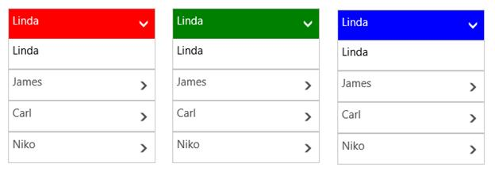

# Appearance and Styling

`AccentBrush` property is used to decorate the hot spots of a control with a solid color





<layout:SfAccordion HorizontalAlignment="Center"

VerticalAlignment="Center"            

DisplayMemberPath="Name" 

AccentBrush="Green"

ItemsSource="{Binding Employees}" />





accordion.AccentBrush = new SolidColorBrush() { Color = Windows.UI.Colors.Red };





