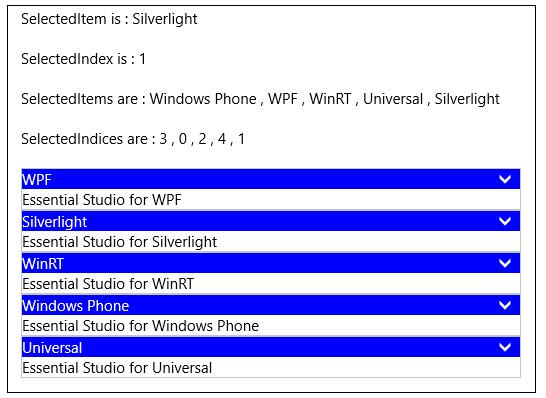
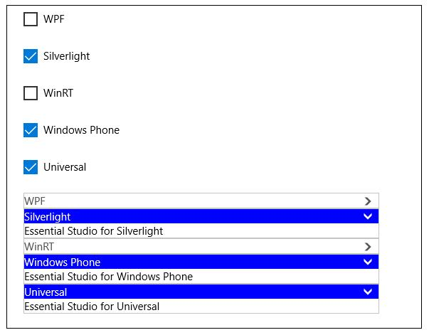
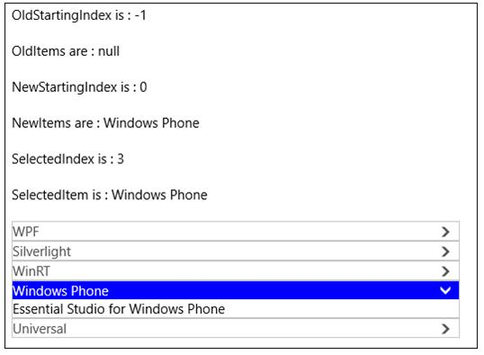
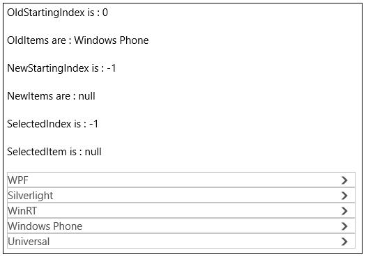

# Selecting Items

Items can be selected programmatically using the properties `SelectedIndex`, `SelectedItem` and `SelectedItems`.

## SelectedIndex

`SelectedIndex` property is used to select an item using its index. It contains the index of most recently selected item in case of OneOrMore, ZeroOrMore SelectionModes. 

## SelectedItem

`SelectedItem` property is used to select an item using its instance. It contains the instance of most recently selected item in case of OneOrMore, ZeroOrMore SelectionModes. 

## SelectedItems

`SelectedItems` property contains a collection of selected items instances for all the SelectionModes. It is a read only property and it cannot be set.

## SelectedIndices

`SelectedIndices` property contains a collection of selected items indices for all the SelectionModes. It is a read only property and it cannot be set.

Here is an example showing the functioning of these properties in which items are selected in run time by touch: 





<Grid>

<StackPanel>

<TextBlock x:Name="selectedItem"/>

<TextBlock x:Name="selectedIndex"/>

<TextBlock x:Name="selectedItems"/>

<TextBlock x:Name="selectedIndices"/>

<layout:SfAccordion SelectionMode="ZeroOrMore" x:Name="accordion"
                    SelectedItemsChanged="accordion_SelectedItemsChanged">

<layout:SfAccordionItem Header="WPF" Content="Essential Studio for WPF"/>

<layout:SfAccordionItem Header="Silverlight" Content="Essential Studio for Silverlight"/>

<layout:SfAccordionItem Header="WinRT" Content="Essential Studio for WinRT"/>

<layout:SfAccordionItem Header="Windows Phone" Content="Essential Studio for Windows Phone"/>

<layout:SfAccordionItem Header="Universal" Content="Essential Studio for Universal"/>

</layout:SfAccordion>

</StackPanel>

</Grid>









private void accordion_SelectedItemsChanged(object sender, System.Collections.Specialized.NotifyCollectionChangedEventArgs e)

{

string items = string.Empty;

string indices = string.Empty;

foreach (var item in accordion.SelectedItems)

items += (item as SfAccordionItem).Header + " , ";            

foreach (var item in accordion.SelectedIndices)

indices += item + " , ";

selectedItem.Text = "SelectedItem is : " + (accordion.SelectedItem as SfAccordionItem).Header;

selectedIndex.Text = "SelectedIndex is : " + accordion.SelectedIndex;

selectedItems.Text = "SelectedItems are : " + items;

selectedIndices.Text = "SelectedIndices are : " + indices;

}





## IsSelected

`SfAccordionItem` has a property `IsSelected` that determines whether the item is expanded or collapsed. More than one accordion item can have IsSelected as `True` based on the `SelectionMode`.

* IsSelected=true – Item is expanded
* IsSelected=false – Item is collapsed





<layout:SfAccordion>

<layout:SfAccordionItem Header="Linda" IsSelected="True" Content="Description about Linda">

</layout:SfAccordion>           





SfAccordion accordion = new SfAccordion();

accordion.Items.Add(new SfAccordionItem() { Header = "Linda",
Content = "Description about Linda" , IsSelected = true });





Here is an example showing the behavior of this property by binding SfAccordionItem.IsSelected property to CheckBox.IsChecked property in Twoway.





<Grid>

<StackPanel>            

<CheckBox Content="WPF" IsChecked="{Binding ElementName=wpf,Path=IsSelected,Mode=TwoWay}"/>

<CheckBox Content="Silverlight" IsChecked="{Binding ElementName=silverlight,Path=IsSelected,Mode=TwoWay}"/>

<CheckBox Content="WinRT" IsChecked="{Binding ElementName=winrt,Path=IsSelected,Mode=TwoWay}"/>

<CheckBox Content="Windows Phone" IsChecked="{Binding ElementName=phone,Path=IsSelected,Mode=TwoWay}"/>

<CheckBox Content="Universal" IsChecked="{Binding ElementName=universal,Path=IsSelected,Mode=TwoWay}"/>

<layout:SfAccordion SelectionMode="ZeroOrMore">

<layout:SfAccordionItem x:Name="wpf"  Header="WPF" Content="Essential Studio for WPF"/>

<layout:SfAccordionItem x:Name="silverlight" Header="Silverlight" 

Content="Essential Studio for Silverlight"/>

<layout:SfAccordionItem x:Name="winrt" Header="WinRT" Content="Essential Studio for WinRT"/>

<layout:SfAccordionItem x:Name="phone" IsSelected="True" Header="Windows Phone" 

Content="Essential Studio for Windows Phone"/>

<layout:SfAccordionItem x:Name="universal" Header="Universal" 

Content="Essential Studio for Universal"/>

</layout:SfAccordion>           

</StackPanel>

</Grid>





## IsLocked

`SfAccordionItem` provides a read-only property `IsLocked` to check whether an item is locked or not. An accordion item is said to be locked when it cannot be unselected/collapsed. 
For example: In One SelectionMode, the selected item cannot be collapsed directly by clicking on its header, it is locked. It can be unlocked by selecting another accordion item, now the newly selected item is locked.

## SelectAll the Items

`SfAccordion` provides a method `SelectAll()` to select all the items. In One and ZeroOrOne SelectionModes, only the last item is selected.





accordion.SelectAll();




 
## UnselectAll the Items

`SfAccordion` provides a method `UnselectAll()` to unselect all the items. In One SelectionMode, there is no change in calling this method. In OneOrMore SelectionMode, the element which has higher index remains selected whereas others are unselected.





accordion.UnselectAll();





## SelectedItemChanged event

`SelectedItemChanged` event is fired whenever an item is expanded or collapsed. The arguments of the event are

<table>
<tr>
<td>
S.No</td><td>
Argument</td><td>
Item expanded</td><td>
Item collapsed</td></tr>
<tr>
<td>
1</td><td>
OldStartingIndex</td><td>
-1</td><td>
Index of collapsed item</td></tr>
<tr>
<td>
2</td><td>
OldItems</td><td>
null</td><td>
Instance of collapsed</td></tr>
<tr>
<td>
3</td><td>
NewStartingIndex</td><td>
SelectedIndex</td><td>
-1</td></tr>
<tr>
<td>
4</td><td>
NewItems</td><td>
SelectedItem</td><td>
null</td></tr>
</table>

Here is an example to demonstrate the values of event arguments:





<Grid>

<StackPanel>

<TextBlock x:Name="oldStartingIndex"/>

<TextBlock x:Name="oldItems"/>

<TextBlock x:Name="newStartingIndex"/>

<TextBlock x:Name="newItems"/>

<TextBlock x:Name="selectedIndex"/>

<TextBlock x:Name="selectedItem"/>   
 
<layout:SfAccordion SelectionMode="ZeroOrMore" x:Name="accordion"
                    SelectedItemsChanged="accordion_SelectedItemsChanged">

<layout:SfAccordionItem Header="WPF" Content="Essential Studio for WPF"/>

<layout:SfAccordionItem Header="Silverlight" 

Content="Essential Studio for Silverlight"/>

<layout:SfAccordionItem Header="WinRT" Content="Essential Studio for WinRT"/>

<layout:SfAccordionItem Header="Windows Phone" Content="Essential Studio for Windows Phone"/>

<layout:SfAccordionItem Header="Universal" Content="Essential Studio for Universal"/>

</layout:SfAccordion>

</StackPanel>

</Grid>









private void accordion_SelectedItemsChanged(object sender, System.Collections.Specialized.NotifyCollectionChangedEventArgs e)

{
    
string olditems = string.Empty;

string newitems = string.Empty;

if (e.OldItems != null)

{
    
foreach (var item in e.OldItems)

olditems += (item as SfAccordionItem).Header + " , ";

}

else

olditems = "null";

if (e.NewItems != null)

{
    
foreach (var item in e.NewItems)

newitems += (item as SfAccordionItem).Header + " , ";

 }
 
else

newitems = "null";

oldStartingIndex.Text = "OldStartingIndex is : " + e.OldStartingIndex;

newStartingIndex.Text = "NewStartingIndex is : " + e.NewStartingIndex;

selectedIndex.Text = "SelectedIndex is : " + accordion.SelectedIndex;

selectedItem.Text = "SelectedItem is : " + ((accordion.SelectedItem == null)? "null":(accordion.SelectedItem as SfAccordionItem).Header);

oldItems.Text = "OldItems are : " + olditems;

newItems.Text = "NewItems are : " + newitems;
 
}





Expand the item with header Windows Phone

Collapse the item with header Windows Phone

## Trigger on SfAccordionItem Selected

SfAccordionItem.Selected event is fired whenever the item is selected/expanded.





<layout:SfAccordionItem x:Name="wpf" Selected="Selected"
                        Header="WPF" Content="Essential Studio for WPF"/>









private void Selected(object sender, RoutedEventArgs e)
{
    
}





## Trigger on SfAccordionItem Unselected

SfAccordionItem.Unselected event is fired whenever the item is unselected/collapsed.





<layout:SfAccordionItem x:Name="wpf" Unselected="Unselected"
                        Header="WPF" Content="Essential Studio for WPF"/>









private void Unselected(object sender, RoutedEventArgs e)

{
    
}





## SelectionChanged on SfAccordion

SelectionChanged event fires when an item is selected and unselected. It behaves same as that of SelectedItemChanged event. 
The difference between these two events are the event argument parameters. The parameters of SelectionChanged event are AddedItems and RemovedItems.Added items have the list of recently selected items whereas RemovedItems have the list of recently unselected items.

