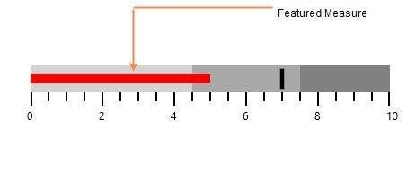

# Measures

## Featured Measure

Featured measure is used to display the primary data, or the current value of the data that you are measuring. It should usually be encoded as a bar.

**Customizing Featured Measure**

The value of the featured measure of the bullet graph is set by the **FeaturedMeasure** property. By setting the **FeaturedMeasureBarStroke** property, the stroke of the feature measure bar can be customized. The thickness of the featured measure bar is modified by using **FeaturedMeasureBarStrokeThickness**. 




    <syncfusion:SfBulletGraph FeaturedMeasure="5" FeaturedMeasureBarStroke="Red"
    FeaturedMeasureBarStrokeThickness="10">                             
    </syncfusion:SfBulletGraph>




 
    SfBulletGraph bulletgraph = new SfBulletGraph();
    bulletgraph.FeaturedMeasure = 5;
    bulletgraph.FeaturedMeasureBarStroke = new SolidColorBrush(Colors.Black);
    bulletgraph.FeaturedMeasureBarStrokeThickness = 10;
    this.Grid.Children.Add(bulletgraph);




## Comparative Measure

Comparative measure should be less visually dominant than the featured measure. It should always be encoded as a short line that runs perpendicular to the orientation of the graph. A good example would be a target for YTD revenue. Whenever the featured measure intersects a comparative measure, the comparative measure should appear behind the featured measure.

**Customizing Comparative Measure**

The value of the comparative measure is set by using the **ComparativeMeasure** property. By setting the **ComparativeMeasureSymbolStroke** property, the stroke of the comparative measure symbol is customized. The thickness of the comparative measure symbol is modified by using **ComparativeMeasureSymbolStrokeThickness**. 




    <syncfusion:SfBulletGraph ComparativeMeasure="7"
    ComparativeMeasureSymbolStroke="Red"
    ComparativeMeasureSymbolStrokeThickness="6">
    </syncfusion:SfBulletGraph>





    SfBulletGraph bulletgraph = new SfBulletGraph();
    bulletgraph.ComparativeMeasure = 7;
    bulletgraph.ComparativeMeasureSymbolStroke = new SolidColorBrush(Colors.Black);
    bulletgraph.ComparativeMeasureSymbolStrokeThickness = 10;
    this.Grid.Children.Add(bulletgraph);




