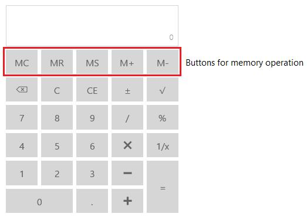

# Memory

`Memory` property in the `SfCalculator` control is used to retrieve the value stored in memory. The following buttons are available in `SfCalculator` control that are needed for memory operations. `Memory` property is a read-only decimal property.

## MS (Memory Storage)

* Performs memory storage. 
* Clicking the button, stores the current value in memory. 
* The value can be retrieved whenever required.

## MR (Memory Restore)

* Performs memory restore. 
* Clicking the button, retrieves the value from memory for further usage.
* Retrieved value is displayed in display pane.

## M+ (Memory increment)

Clicking the button, increments the stored value by the incremental value (i.e., current value). 
The incremented value is then stored in memory.

## M- (Memory decrement)

Clicking the button, decrements the stored value from decrement value (i.e., current value). 
The decremented value is then stored in memory. 

## MC (Memory Clear)

Performs memory clear. 
Clicking the button, clears the value stored in the memory and reset it to 0.

