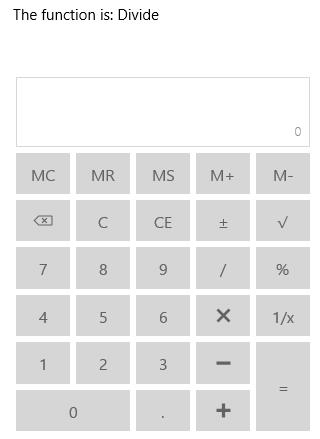

# Utilities

Several utility functions are available in `SfCalculator` control.

## Check Function

This method is used to identify the mathematical operation based on the input string.





<StackPanel>

<TextBlock x:Name="functionText"/>

<input:SfCalculator x:Name="calculator"/>

</StackPanel>









CalculatorFunctions function = calculator.CheckFunction("/");

functionText.Text = "The function is: " + function.ToString();





## Clear

`Clear` function is used to clear both the expression and value in `SfCalculator`.





calculator.Clear();





## ClearEntry

`ClearEntry` function is used to clear the entered/computed value in `SfCalculator`.





calculator.ClearEntry();





## Reset

`Reset` function is used to clear and reset the expression.





calculator.Reset();





## TrailingZeros

`TrailingZeros` method is used to remove the trailing zeroes at the end of value.





calculator.TrailingZeros();





## Culture

`SfCalculator` has Culture support that allows to have decimal separator symbols based on the culture.





<input:SfCalculator x:Name="calculator"/>









calculator.Culture = new System.Globalization.CultureInfo("de-DE");





