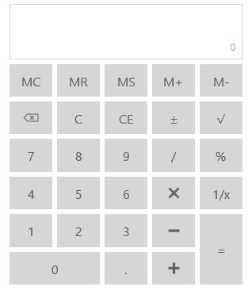
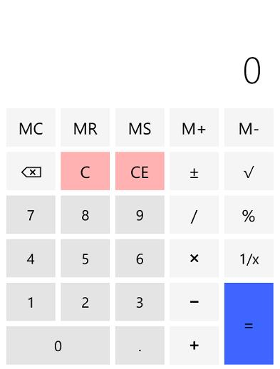
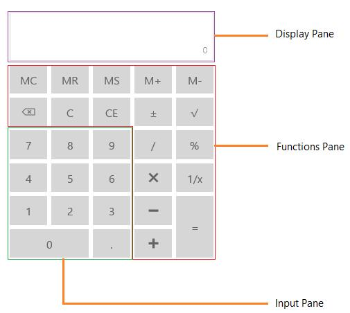

# Overview

`SfCalculator` control allows you to perform basic mathematical operations without switching to external applications.

## Features

* Support for memory operations
* Current value can be easily retrieved
* Provide culture support

## Visual Structure

WinRT

Windows phone

