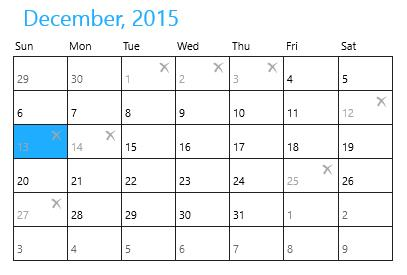
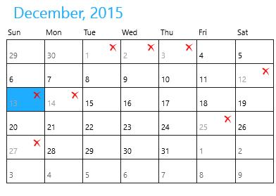

# Blocking Dates

`SfCalendar` allows to block out dates so that a blocked date will look disabled, skipped in key navigation and unable to select.

## BlackOutDates

`BlackOutDates` property is used to specify the collection of DateTime that are to be blocked.





<input:SfCalendar x:Name="calendar"/>









calendar.BlackOutDates.Add(new DateTime(2015, 12, 1));

calendar.BlackOutDates.Add(new DateTime(2015, 12, 2));

calendar.BlackOutDates.Add(new DateTime(2015, 12, 3));

calendar.BlackOutDates.Add(new DateTime(2015, 12, 12));

calendar.BlackOutDates.Add(new DateTime(2015, 12, 13));

calendar.BlackOutDates.Add(new DateTime(2015, 12, 14));

calendar.BlackOutDates.Add(new DateTime(2015, 12, 25));

calendar.BlackOutDates.Add(new DateTime(2015, 12, 27));





## BlackOutCellTemplate

The template of blocked cells can be customized using `BlackOutCellTemplate` property.





<input:SfCalendar x:Name="calendar">

<input:SfCalendar.BlackOutCellTemplate>

<DataTemplate>

<Grid>

<TextBlock Text="&#xE106;" Foreground="Red"
           VerticalAlignment="Top" FontFamily="Segoe UI Symbol"
		   Margin="3" HorizontalAlignment="Right"/>
		   
<TextBlock Text="{Binding Day}" Foreground="#FFA5A5A5"
           VerticalAlignment="Bottom" Margin="3"/>
</Grid>

</DataTemplate>

</input:SfCalendar.BlackOutCellTemplate>

</input:SfCalendar>









calendar.BlackOutDates.Add(new DateTime(2015, 12, 1));

calendar.BlackOutDates.Add(new DateTime(2015, 12, 2));

calendar.BlackOutDates.Add(new DateTime(2015, 12, 3));

calendar.BlackOutDates.Add(new DateTime(2015, 12, 12));

calendar.BlackOutDates.Add(new DateTime(2015, 12, 13));

calendar.BlackOutDates.Add(new DateTime(2015, 12, 14));

calendar.BlackOutDates.Add(new DateTime(2015, 12, 25));

calendar.BlackOutDates.Add(new DateTime(2015, 12, 27));





