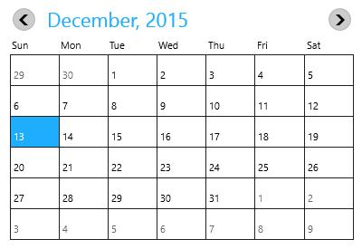

# Month Navigation

Navigating between months are much simpler with touch. Navigation buttons are also provided.

## Enabling Navigation Button

By default, navigation buttons are collapsed. Navigation button support can be enabled or disabled using the `ShowNavigationButton` property.





<input:SfCalendar x:Name="calendar" ShowNavigationButton="True"/>









SfCalendar calendar = new SfCalendar();

calendar.ShowNavigationButton = true;





## Navigating to Previous Month

Month navigation can also be done programmatically by invoking `PreviousMonth` method.





calendar.PreviousMonth();





## Navigating to Next Month

Month navigation can also be done programmatically by invoking `NextMonth` method





calendar.NextMonth();





## Notifying the Previous Button Click

`PreviousScrollButtonClicked` event is fired when the previous button is clicked.





<input:SfCalendar x:Name="calendar" ShowNavigationButton="True"
                  PreviousScrollButtonClicked="calendar_PreviousScrollButtonClicked"/>









private void calendar_PreviousScrollButtonClicked(object sender, SelectionChangedEventArgs e)

{

}





## Notifying the Next Button Click

`NextScrollButtonClicked` event is fired when the next button is clicked.





<input:SfCalendar x:Name="calendar" ShowNavigationButton="True"
                  NextScrollButtonClicked="calendar_NextScrollButtonClicked"/>








private void calendar_NextScrollButtonClicked(object sender, SelectionChangedEventArgs e)

{

}





