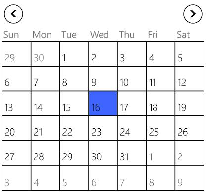
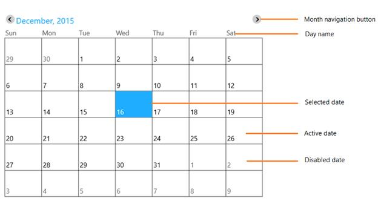

# Overview

SfCalendar control allows to select single or multiple dates from year 0 to 1999 A.D with each touch navigation.

## Features

* Support for blocking out dates
* Multiple dates can be selected
* Touch friendly navigation support
* Culture support for day and month names
* Customizable day buttons for marking appointments

## Visual structure

1.WinRT

2.Windows Phone

