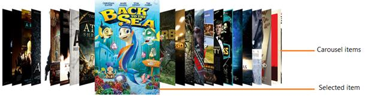

# Overview

`SfCarousel` control provides a rich animated layout to arrange items in touch device.

## Features

* Accepts any type of business object
* Rotation and transformation options makes animation richer
* Offsets can be set to items to arrange them in modular way

## Visual structure

1.WinRT

2.Windows Phone

