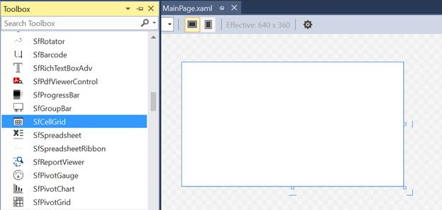
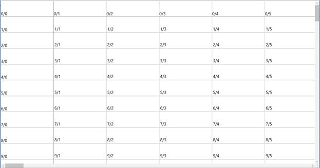

# Getting Started

This sections helps you to get started with SfCellGrid.

## Assemblies Deployment

Below table describes, list of assemblies required to be added in project when the SfCellGrid control is used in your application.

<table>
<tr>
<td>
**Assembly**  </td><td>
**Description**  </td></tr>
<tr>
<td>
Syncfusion.SfCellGrid.UWP.dll  </td><td>
Contains the base and fundamental classes which holds the underlying architecture for displaying cells with virtualized behavior and selection/interaction of cells.  </td></tr>
<tr>
<td>
Syncfusion.SfGridCommon.UWP.dll  </td><td>
Covers the classes which holds the properties of scroll viewer and disposable elements.  </td></tr>
<tr>
<td>
Syncfusion.SfInput.UWP.dll  </td><td>
Contains the classes which holds the controls like SfDropDownButton, SfTextBoxExt, SfMaskedEdit etc.  </td></tr>
<tr>
<td>
Syncfusion.SfShared.UWP.dll  </td><td>
Contains the classes which holds the properties and operations of the controls like SfUpDown, SfNavigator, Looping control, etc.,  </td></tr>
</table>

### Optional Assemblies

Below Assembly can be added when you want to enable importing support in SfCellGrid. 

<table>
<tr>
<td>
**Optional Assembly**  </td><td>
**Description**  </td></tr>
<tr>
<td>
Syncfusion.XlsIO.UWP.dll  </td><td>
Contains the base classes which is responsible for read and write in Excel files, Worksheet Manipulations, Formula calculations etc.  </td></tr>
</table>

## Create a Simple Application with SfCellGrid

SfCellGrid control can be added into the Application either via designer or via coding.

### Adding a control via Designer

1. Create a new UWP Application in Visual Studio.
2. Open the Visual Studio **Tool** **box**. Navigate to “Syncfusion Controls” tab, and find the SfCellGrid in toolbox items.
3. Drag **SfCellGrid** and drop in to the Designer area from the Toolbox.

### Adding Control Via Coding

SfCellGrid is available in the following namespace “__Syncfusion__.__UI__.__Xaml__.__CellGrid__” and it can be created programmatically either by using XAML or C# code.





    <Page
	
	x:Class="CellGridDemo.MainPage"
	
	xmlns="http://schemas.microsoft.com/winfx/2006/xaml/presentation"
	
	xmlns:x="http://schemas.microsoft.com/winfx/2006/xaml"
	
	xmlns:d="http://schemas.microsoft.com/expression/blend/2008"
	
	xmlns:local="using:CellGridDemo"
	
	xmlns:mc="http://schemas.openxmlformats.org/markup-compatibility/2006"
	
	xmlns:syncfusion="using:Syncfusion.UI.Xaml.CellGrid"
	
	mc:Ignorable="d">
	
	<syncfusion:SfCellGrid x:Name="CellGrid" />
	
	</Page>





SfCellGrid cellGrid = new SfCellGrid();

this.Grid.Children.Add(cellGrid);





## Populating the Data

To populate the data in SfCellGrid, **RowCount** and **ColumnCount** are mandatory. Once **ColumnCount** and **RowCount** are specified, data can be populated by using one of the following methods.

### Internal Storage

User can populate the grid by storing the cell style in its internal storage. SfCellGrid holds all the data and style related information in **GridStyleInfo**. Individual cells can be accessed using the **GridModel** indexer, which takes row and column indices. Below code explains this scenario.




// Specifying Row Count and Column Count

cellGrid.RowCount = 100;

cellGrid.ColumnCount = 100;

// Looping through the cells and assigning the values based on row and column index.

for (int row = 0; row < 100; row++)
{
	for (int column = 0; column < 20; column++)
	{
		cellGrid.Model[row, column].CellValue = string.Format("{0}/{1}", row, column);  
	}
}




### Virtual Mode

User can also populate the data by on-demand using `QueryCellInfo` event where the gird does not store cell style in its internal storage.




// Specifying Row Count and Column Count.

cellGrid.RowCount = 100;

cellGrid.ColumnCount = 100;

cellGrid.Model.QueryCellInfo += Model_QueryCellInfo;

//Assigning values by handling the QueryCellInfo event

private void Model_QueryCellInfo(object sender, Syncfusion.UI.Xaml.CellGrid.Styles.GridQueryCellInfoEventArgs e)
{
	e.Style.CellValue = string.Format("{0}/{1}", e.Cell.RowIndex, e.Cell.ColumnIndex);
}




Run the application, Grid will appear as follows,

## Formatting the Cell:

**GridStyleInfo** is used to maintain the data and style information of SfCellGrid. User can change formatting of a cell by changing background, foreground, font, borders, etc., Below code explains this scenario,




cellGrid.Model[3, 3].Background = new SolidColorBrush(Colors.Blue);




User can also change formatting of a cell by using `QueryCellInfo` event. Below code explains this scenario,




private void Model_QueryCellInfo(object sender, Syncfusion.UI.Xaml.CellGrid.Styles.GridQueryCellInfoEventArgs e)
{
	if (e.Style.ColumnIndex == 3 && e.Style.RowIndex == 3)
	{
		e.Style.Background = new SolidColorBrush(Colors.Blue);
	}
}




Background will be set for the specified cell like below,

