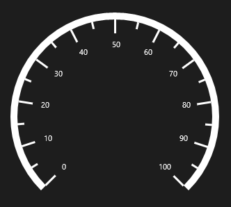
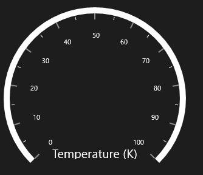
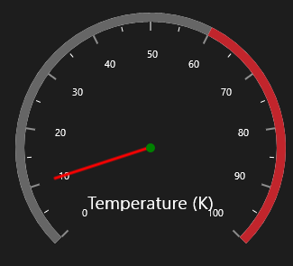

# Getting Started

This section explains you the steps required to configure the **SfCircularGauge** and also explains the steps to add basic elements of **SfCircularGauge** through various API’s available within it.

## Configuring SfCircularGauge

**SfCircularGauge** is available in the following assembly and namespace:

**Assembly**: Syncfusion.SfGauge.UWP

**Namespace**: Syncfusion.UI.Xaml.Gauges



    <syncfusion:SfCircularGauge/>
    


Run the above code and now the default SfCircularGauge can be displays as follows. In order to customize scales and other SfCircularGauge elements, you have to add the respecting element to SfCircularGauge.

As you can see now in the above image, the SfCircularGauge displays its default elements. To customize the basic look and feel of the SfCircularGauge you have to add respective elements to SfCircularGauge, which will be explained in the next section.

## Adding Header 

You can assign a unique header to **SfCircularGauge** by making use of **GaugeHeader** property and you can positioned it wherever you want using **GaugeHeaderPosition** and **HeaderAlignment** property.




    <syncfusion:SfCircularGauge GaugeHeaderPosition="0.45,0.8" HeaderAlignment="Custom">
            <syncfusion:SfCircularGauge.GaugeHeader>
                <TextBlock Text="Temperature (K)" 
                              Height="20" Width="150" 
                              FontSize="20" Foreground="White"/>
            </syncfusion:SfCircularGauge.GaugeHeader>
        </syncfusion:SfCircularGauge>




    
            SfCircularGauge circularGauge = new SfCircularGauge();
            circularGauge.GaugeHeaderPosition = new Point(0.45, 0.8);
            circularGauge.HeaderAlignment = HeaderAlignment.Custom;
            TextBlock _textBlock = new TextBlock()
            {
                Text = "Temperature (K)",
                Height = 20,
                Width = 150,
                FontSize = 20,
                Foreground = new SolidColorBrush(Colors.White)
            };
            circularGauge.GaugeHeader = _textBlock;
            this.Grid.Children.Add(circularGauge);




## Configuring Scales

You can configure the **CircularScale** elements by making use of following API’s available in SfCircularGage.

They are:

* StartAngle
* SweepAngle
* StartValue
* EndValue
* Interval
* TickStroke
* LabelStroke




    <Grid Background="{StaticResource ApplicationPageBackgroundThemeBrush}">
            <syncfusion:SfCircularGauge x:Name="gauge" GaugeHeaderPosition="0.45,0.8" HeaderAlignment="Custom" >

                <syncfusion:SfCircularGauge.GaugeHeader>

                    <TextBlock Text="Temperature (K)" 
                              Height="40" Width="150" 
                              FontSize="20" Foreground="White"/>

                </syncfusion:SfCircularGauge.GaugeHeader>
                <syncfusion:SfCircularGauge.Scales>
                    <syncfusion:CircularScale StartAngle="135" 
                                   SweepAngle="270" 
                                   StartValue="0"
                                   LabelStroke="White" TickStroke="White"
                                   EndValue="100"
                                   Interval="10">
                    </syncfusion:CircularScale>
                </syncfusion:SfCircularGauge.Scales>
            </syncfusion:SfCircularGauge>
        </Grid>





            SfCircularGauge circularGauge = new SfCircularGauge();
            circularGauge.GaugeHeaderPosition = new Point(0.45, 0.8);
            circularGauge.HeaderAlignment = HeaderAlignment.Custom;
            CircularScale scale = new CircularScale();
            scale.StartAngle = 135;
            scale.SweepAngle = 270;
            scale.StartValue = 0;
            scale.EndValue = 100;
            scale.Interval = 10;
            circularGauge.Scales.Add(scale);
            TextBlock _textBlock = new TextBlock()
            {
                Text = "Temperature (K)",
                Height = 20,
                Width = 150,
                FontSize = 20,
                Foreground = new SolidColorBrush(Colors.White)
            };
            circularGauge.GaugeHeader = _textBlock;
            this.Grid.Children.Add(circularGauge);




## Adding Ranges 

You can add ranges to SfCircularGauge by creating ranges collection using **Ranges**.



           <Grid Background="{StaticResource ApplicationPageBackgroundThemeBrush}">
            <syncfusion:SfCircularGauge x:Name="gauge" GaugeHeaderPosition="0.45,0.8" HeaderAlignment="Custom" >

                <syncfusion:SfCircularGauge.GaugeHeader>

                    <TextBlock Text="Temperature (K)" 
                              Height="40" Width="150" 
                              FontSize="20" Foreground="White"/>

                </syncfusion:SfCircularGauge.GaugeHeader>
                <syncfusion:SfCircularGauge.Scales>
                    <syncfusion:CircularScale StartAngle="135" 
                                   SweepAngle="270" 
                                   StartValue="0"
                                   EndValue="100"
                                   Interval="10">

                        <syncfusion:CircularScale.Ranges>
                            <syncfusion:CircularRange StartValue="0" 
                                             EndValue="60" Stroke="#666666" />
                            <syncfusion:CircularRange StartValue="60" 
                                             EndValue="100" Stroke="#C1252C" />
                        </syncfusion:CircularScale.Ranges>
                    </syncfusion:CircularScale>
                </syncfusion:SfCircularGauge.Scales>
            </syncfusion:SfCircularGauge>
        </Grid>





            SfCircularGauge circularGauge = new SfCircularGauge();
            circularGauge.GaugeHeaderPosition = new Point(0.45, 0.8);
            circularGauge.HeaderAlignment = HeaderAlignment.Custom;
            CircularScale scale = new CircularScale();
            scale.StartAngle = 135;
            scale.SweepAngle = 270;
            scale.StartValue = 0;
            scale.EndValue = 100;
            scale.Interval = 10;
            scale.Ranges.Add(new CircularRange()
            {
                StartValue = 0,
                EndValue = 60,
                Stroke = new SolidColorBrush(Color.FromArgb(0XFF, 0X66, 0X66, 0X66))
            });
            scale.Ranges.Add(new CircularRange()
            {
                StartValue = 60,
                EndValue = 100,
                Stroke = new SolidColorBrush(Color.FromArgb(0XFF, 0XC1, 0X25, 0X2C))
            });
            circularGauge.Scales.Add(scale);
            TextBlock _textBlock = new TextBlock()
            {
                Text = "Temperature (K)",
                Height = 20,
                Width = 150,
                FontSize = 20,
                Foreground = new SolidColorBrush(Colors.White)
            };
            circularGauge.GaugeHeader = _textBlock;
            this.Grid.Children.Add(circularGauge);




## Adding Pointers 

You can add Pointers to SfCircularGauge to point a values on the scale.




            <Grid Background="{StaticResource ApplicationPageBackgroundThemeBrush}">
            <syncfusion:SfCircularGauge x:Name="gauge" GaugeHeaderPosition="0.45,0.8" HeaderAlignment="Custom" >

                <syncfusion:SfCircularGauge.GaugeHeader>

                    <TextBlock Text="Temperature (K)" 
                              Height="40" Width="150" 
                              FontSize="20" Foreground="White"/>

                </syncfusion:SfCircularGauge.GaugeHeader>
                <syncfusion:SfCircularGauge.Scales>
                    <syncfusion:CircularScale StartAngle="135" 
                                   SweepAngle="270" 
                                   StartValue="0"
                                   EndValue="100"
                                   Interval="10">

                        <syncfusion:CircularScale.Ranges>
                            <syncfusion:CircularRange StartValue="0" 
                                             EndValue="60" Stroke="#666666" />
                            <syncfusion:CircularRange StartValue="60" 
                                             EndValue="100" Stroke="#C1252C" />
                        </syncfusion:CircularScale.Ranges>

                        <syncfusion:CircularScale.Pointers>
                            <syncfusion:CircularPointer PointerType="NeedlePointer" Value="10"/>
                        </syncfusion:CircularScale.Pointers>
                    </syncfusion:CircularScale>
                </syncfusion:SfCircularGauge.Scales>
            </syncfusion:SfCircularGauge>
        </Grid>





            SfCircularGauge circularGauge = new SfCircularGauge();
            circularGauge.GaugeHeaderPosition = new Point(0.45, 0.8);
            circularGauge.HeaderAlignment = HeaderAlignment.Custom;
            CircularScale scale = new CircularScale();
            scale.StartAngle = 135;
            scale.SweepAngle = 270;
            scale.StartValue = 0;
            scale.EndValue = 100;
            scale.Interval = 10;
            scale.Ranges.Add(new CircularRange()
            {
                StartValue = 0,
                EndValue = 60,
                Stroke = new SolidColorBrush(Color.FromArgb(0XFF, 0X66, 0X66, 0X66))
            });
            scale.Ranges.Add(new CircularRange()
            {
                StartValue = 60,
                EndValue = 100,
                Stroke = new SolidColorBrush(Color.FromArgb(0XFF, 0XC1, 0X25, 0X2C))
            });
            scale.Pointers.Add(new CircularPointer()
            {
                PointerType = PointerType.NeedlePointer,
                Value = 10
            });
            circularGauge.Scales.Add(scale);
            TextBlock _textBlock = new TextBlock()
            {
                Text = "Temperature (K)",
                Height = 20,
                Width = 150,
                FontSize = 20,
                Foreground = new SolidColorBrush(Colors.White)
            };
            circularGauge.GaugeHeader = _textBlock;
            this.Grid.Children.Add(circularGauge);




