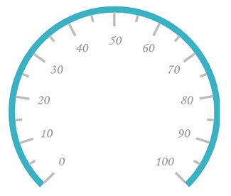
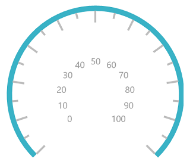
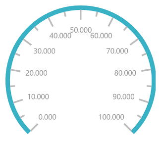
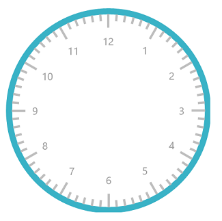
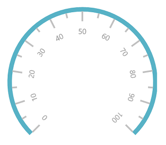

# Labels 

The [`Scale`](https://help.syncfusion.com/cr/cref_files/uwp/Syncfusion.SfGauge.UWP~Syncfusion.UI.Xaml.Gauges.CircularScale.html)  labels associate numeric values with major scale tick marks.

## Label stroke customization

The label color can be changed using the [`LabelStroke`](https://help.syncfusion.com/cr/cref_files/uwp/Syncfusion.SfGauge.UWP~Syncfusion.UI.Xaml.Gauges.CircularScale~LabelStroke.html)  property.





    <gauge:SfCircularGauge>

    <gauge:SfCircularGauge.Scales>

    <gauge:CircularScale  Radius="150"

    RimStroke="#39B2C6" RimStrokeThickness="8"

    TickStroke="#BEBEBE" LabelStroke="DeepPink" SmallTickStroke="#BEBEBE">

    <gauge:CircularScale.Pointers>

    <gauge:CircularPointer NeedlePointerVisibility="Collapsed"/>

    </gauge:CircularScale.Pointers>

    </gauge:CircularScale>

    </gauge:SfCircularGauge.Scales>

    </gauge:SfCircularGauge>





SfCircularGauge sfCircularGauge = new SfCircularGauge();

CircularScale circularScale = new CircularScale();

circularScale.RimStrokeThickness = 8;

circularScale.Radius = 150;

circularScale.RimStroke = new SolidColorBrush(Color.FromArgb(0xff, 0x57, 0xb2, 0xc6));

circularScale.TickStroke = new SolidColorBrush(Color.FromArgb(0xff, 0xc1, 0xc1, 0xc1));

circularScale.SmallTickStroke = new SolidColorBrush(Color.FromArgb(0xff, 0xc1, 0xc1, 0xc1));

circularScale.LabelStroke = new SolidColorBrush(Colors.DeepPink);

CircularPointer circularPointer = new CircularPointer();

circularPointer.NeedlePointerVisibility = Windows.UI.Xaml.Visibility.Collapsed;

circularScale.Pointers.Add(circularPointer);

sfCircularGauge.Scales.Add(circularScale);





## Label font customization

The label font can be customized using the `FontSize`, `FontFamily`, and `FontStyle` properties.





    <gauge:SfCircularGauge>

    <gauge:SfCircularGauge.Scales>

    <gauge:CircularScale  Radius="150" FontFamily="Monotype Corsiva" FontSize="20" 

    FontStyle="Italic"

    RimStroke="#39B2C6" RimStrokeThickness="8"

    TickStroke="#BEBEBE" LabelStroke="#9E9E9E" SmallTickStroke="#BEBEBE">

    <gauge:CircularScale.Pointers>

    <gauge:CircularPointer NeedlePointerVisibility="Collapsed"/>

    </gauge:CircularScale.Pointers>

    </gauge:CircularScale>

    </gauge:SfCircularGauge.Scales>

    </gauge:SfCircularGauge>





SfCircularGauge sfCircularGauge = new SfCircularGauge();

sfCircularGauge.FontSize = 20;

sfCircularGauge.FontFamily = new FontFamily("Monotype Corsiva");

sfCircularGauge.FontStyle = Windows.UI.Text.FontStyle.Italic;

CircularScale circularScale = new CircularScale();

circularScale.RimStrokeThickness = 8;

circularScale.Radius = 150;

circularScale.RimStroke = new SolidColorBrush(Color.FromArgb(0xff, 0x57, 0xb2, 0xc6));

circularScale.TickStroke = new SolidColorBrush(Color.FromArgb(0xff, 0xc1, 0xc1, 0xc1));

circularScale.SmallTickStroke = new SolidColorBrush(Color.FromArgb(0xff, 0xc1, 0xc1, 0xc1));

circularScale.LabelStroke = new SolidColorBrush(Color.FromArgb(0xff, 0x99, 0x99, 0x99));

CircularPointer circularPointer = new CircularPointer();

circularPointer.NeedlePointerVisibility = Windows.UI.Xaml.Visibility.Collapsed;

circularScale.Pointers.Add(circularPointer);

sfCircularGauge.Scales.Add(circularScale);





## Setting position for labels

The `Labels` can be placed inside the scale, outside the scale, or on the scale using the following two ways:

1. Placing the labels by selecting one of the options available in the [`LabelPosition`](https://help.syncfusion.com/cr/cref_files/uwp/Syncfusion.SfGauge.UWP~Syncfusion.UI.Xaml.Gauges.CircularScale~LabelPosition.html) property. 

They are,

1.Inside (Default)

2.Outside

3.Custom





    <gauge:SfCircularGauge>

    <gauge:SfCircularGauge.Scales>

    <gauge:CircularScale  Radius="150" LabelPosition="Outside"

    RimStroke="#39B2C6" RimStrokeThickness="8"

    TickStroke="#BEBEBE" LabelStroke="#9E9E9E" SmallTickStroke="#BEBEBE">

    <gauge:CircularScale.Pointers>

    <gauge:CircularPointer NeedlePointerVisibility="Collapsed"/>

    </gauge:CircularScale.Pointers>

    </gauge:CircularScale>

    </gauge:SfCircularGauge.Scales>

    </gauge:SfCircularGauge>





SfCircularGauge sfCircularGauge = new SfCircularGauge();

CircularScale circularScale = new CircularScale();

circularScale.RimStrokeThickness = 8;

circularScale.Radius = 150;

circularScale.LabelPosition = LabelPosition.Outside;

circularScale.RimStroke = new SolidColorBrush(Color.FromArgb(0xff, 0x57, 0xb2, 0xc6));

circularScale.TickStroke = new SolidColorBrush(Color.FromArgb(0xff, 0xc1, 0xc1, 0xc1));

circularScale.SmallTickStroke = new SolidColorBrush(Color.FromArgb(0xff, 0xc1, 0xc1, 0xc1));

circularScale.LabelStroke = new SolidColorBrush(Color.FromArgb(0xff, 0x99, 0x99, 0x99));

CircularPointer circularPointer = new CircularPointer();

circularPointer.NeedlePointerVisibility = Windows.UI.Xaml.Visibility.Collapsed;

circularScale.Pointers.Add(circularPointer);

sfCircularGauge.Scales.Add(circularScale);





2. Positioning the labels far away from the ticks using the [`LabelOffset`](https://help.syncfusion.com/cr/cref_files/uwp/Syncfusion.SfGauge.UWP~Syncfusion.UI.Xaml.Gauges.CircularScale~LabelOffset.html)  property. First, set the [`LabelPosition`](https://help.syncfusion.com/cr/cref_files/uwp/Syncfusion.SfGauge.UWP~Syncfusion.UI.Xaml.Gauges.CircularScale~LabelPosition.html)  to custom, and then position the label using the [`LabelOffset`](https://help.syncfusion.com/cr/cref_files/uwp/Syncfusion.SfGauge.UWP~Syncfusion.UI.Xaml.Gauges.CircularScale~LabelOffset.html)  property.





    <gauge:SfCircularGauge>

    <gauge:SfCircularGauge.Scales>

    <gauge:CircularScale  Radius="150" LabelPosition="Custom" LabelOffset="0.5" 

    RimStroke="#39B2C6" RimStrokeThickness="8"

    TickStroke="#BEBEBE" LabelStroke="#9E9E9E" SmallTickStroke="#BEBEBE">

    <gauge:CircularScale.Pointers>

    <gauge:CircularPointer NeedlePointerVisibility="Collapsed"/>

    </gauge:CircularScale.Pointers>

    </gauge:CircularScale>

    </gauge:SfCircularGauge.Scales>

    </gauge:SfCircularGauge>





SfCircularGauge sfCircularGauge = new SfCircularGauge();

CircularScale circularScale = new CircularScale();

circularScale.RimStrokeThickness = 8;

circularScale.Radius = 150;

circularScale.LabelPosition = LabelPosition.Custom;

circularScale.LabelOffset = 0.5;

circularScale.RimStroke = new SolidColorBrush(Color.FromArgb(0xff, 0x57, 0xb2, 0xc6));

circularScale.TickStroke = new SolidColorBrush(Color.FromArgb(0xff, 0xc1, 0xc1, 0xc1));

circularScale.SmallTickStroke = new SolidColorBrush(Color.FromArgb(0xff, 0xc1, 0xc1, 0xc1));

circularScale.LabelStroke = new SolidColorBrush(Color.FromArgb(0xff, 0x99, 0x99, 0x99));

CircularPointer circularPointer = new CircularPointer();

circularPointer.NeedlePointerVisibility = Windows.UI.Xaml.Visibility.Collapsed;

circularScale.Pointers.Add(circularPointer);

sfCircularGauge.Scales.Add(circularScale);





## Setting smart labels

Smart labels allow to change the numeric scale type of the labels displayed in a gauge scale and customize the labels by adding prefixes or suffixes to the scale labels.

###  Enable/disable smart labels

The [`EnableSmartLabels`](https://help.syncfusion.com/cr/cref_files/uwp/Syncfusion.SfGauge.UWP~Syncfusion.UI.Xaml.Gauges.CircularScale~EnableSmartLabels.html)  property is a Boolean property that enables or disables the smart label feature of the circular gauge.

## Setting numeric scale type

The [`NumericScaleType`](https://help.syncfusion.com/cr/cref_files/uwp/Syncfusion.SfGauge.UWP~Syncfusion.UI.Xaml.Gauges.CircularScale~NumericScaleType.html)  property allows to set the type of label. The following types can be applied to labels:

•Auto

•Thousands

•Millions

•Billions

•Trillions

•Quadrillions

•Quintillions





    <gauge:SfCircularGauge>

    <gauge:SfCircularGauge.Scales>

    <gauge:CircularScale  Radius="150" StartValue="0" EndValue="100" 

    EnableSmartLabels="True" NumericScaleType="Thousands" 

    RimStroke="#39B2C6" RimStrokeThickness="8"

    TickStroke="#BEBEBE" LabelStroke="#9E9E9E" SmallTickStroke="#BEBEBE">

    <gauge:CircularScale.Pointers>

    <gauge:CircularPointer NeedlePointerVisibility="Collapsed"/>

    </gauge:CircularScale.Pointers>

    </gauge:CircularScale>

    </gauge:SfCircularGauge.Scales>

    </gauge:SfCircularGauge>





SfCircularGauge sfCircularGauge = new SfCircularGauge();

CircularScale circularScale = new CircularScale();

circularScale.StartValue = 0;

circularScale.EndValue = 100;

circularScale.EnableSmartLabels = true;

circularScale.NumericScaleType = NumericScaleType.Thousands;

circularScale.RimStrokeThickness = 8;

circularScale.Radius = 150;

circularScale.RimStroke = new SolidColorBrush(Color.FromArgb(0xff, 0x57, 0xb2, 0xc6));

circularScale.TickStroke = new SolidColorBrush(Color.FromArgb(0xff, 0xc1, 0xc1, 0xc1));

circularScale.SmallTickStroke = new SolidColorBrush(Color.FromArgb(0xff, 0xc1, 0xc1, 0xc1));

circularScale.LabelStroke = new SolidColorBrush(Color.FromArgb(0xff, 0x99, 0x99, 0x99));

CircularPointer circularPointer = new CircularPointer();

circularPointer.NeedlePointerVisibility = Windows.UI.Xaml.Visibility.Collapsed;

circularScale.Pointers.Add(circularPointer);

sfCircularGauge.Scales.Add(circularScale);





## Setting number of fraction digits for labels

The [`NoOfFractionDigit`](https://help.syncfusion.com/cr/cref_files/uwp/Syncfusion.SfGauge.UWP~Syncfusion.UI.Xaml.Gauges.CircularScale~NoOfFractionalDigit.html)  property is used to set the number of fractional digits to be displayed in the scale labels.





    <gauge:SfCircularGauge>

    <gauge:SfCircularGauge.Scales>

    <gauge:CircularScale  Radius="150" NoOfFractionalDigit="3"

    RimStroke="#39B2C6" RimStrokeThickness="8"

    TickStroke="#BEBEBE" LabelStroke="#9E9E9E" SmallTickStroke="#BEBEBE">

    <gauge:CircularScale.Pointers>

    <gauge:CircularPointer NeedlePointerVisibility="Collapsed"/>

    </gauge:CircularScale.Pointers>

    </gauge:CircularScale>

    </gauge:SfCircularGauge.Scales>

    </gauge:SfCircularGauge>





SfCircularGauge sfCircularGauge = new SfCircularGauge();

CircularScale circularScale = new CircularScale();

circularScale.NoOfFractionalDigit = 3;

circularScale.RimStrokeThickness = 8;

circularScale.Radius = 150;

circularScale.RimStroke = new SolidColorBrush(Color.FromArgb(0xff, 0x57, 0xb2, 0xc6));

circularScale.TickStroke = new SolidColorBrush(Color.FromArgb(0xff, 0xc1, 0xc1, 0xc1));

circularScale.SmallTickStroke = new SolidColorBrush(Color.FromArgb(0xff, 0xc1, 0xc1, 0xc1));

circularScale.LabelStroke = new SolidColorBrush(Color.FromArgb(0xff, 0x99, 0x99, 0x99));

CircularPointer circularPointer = new CircularPointer();

circularPointer.NeedlePointerVisibility = Windows.UI.Xaml.Visibility.Collapsed;

circularScale.Pointers.Add(circularPointer);

sfCircularGauge.Scales.Add(circularScale);





## Setting postfix and prefix for labels

You can postfix/prefix values to the scale labels using the [`LabelPostfix`](https://help.syncfusion.com/cr/cref_files/uwp/Syncfusion.SfGauge.UWP~Syncfusion.UI.Xaml.Gauges.CircularScale~LabelPostfix.html)  and [`LabelPrefix`](https://help.syncfusion.com/cr/cref_files/uwp/Syncfusion.SfGauge.UWP~Syncfusion.UI.Xaml.Gauges.CircularScale~LabelPrefix.html)  properties, respectively.

### Label postfix

The [`LabelPostfix`](https://help.syncfusion.com/cr/cref_files/uwp/Syncfusion.SfGauge.UWP~Syncfusion.UI.Xaml.Gauges.CircularScale~LabelPostfix.html) property allows to postfix the values to the scale labels.





     <gauge:SfCircularGauge>

     <gauge:SfCircularGauge.Scales>

    <gauge:CircularScale  Radius="150" LabelPostfix="k"

     RimStroke="#39B2C6" RimStrokeThickness="8"

     TickStroke="#BEBEBE" LabelStroke="#9E9E9E" SmallTickStroke="#BEBEBE">

    <gauge:CircularScale.Pointers>

    <gauge:CircularPointer NeedlePointerVisibility="Collapsed"/>

    </gauge:CircularScale.Pointers>

    </gauge:CircularScale>

    </gauge:SfCircularGauge.Scales>

    </gauge:SfCircularGauge>





SfCircularGauge sfCircularGauge = new SfCircularGauge();

CircularScale circularScale = new CircularScale();

circularScale.LabelPostfix = "k";

circularScale.RimStrokeThickness = 8;

circularScale.Radius = 150;

circularScale.RimStroke = new SolidColorBrush(Color.FromArgb(0xff, 0x57, 0xb2, 0xc6));

circularScale.TickStroke = new SolidColorBrush(Color.FromArgb(0xff, 0xc1, 0xc1, 0xc1));

circularScale.SmallTickStroke = new SolidColorBrush(Color.FromArgb(0xff, 0xc1, 0xc1, 0xc1));

circularScale.LabelStroke = new SolidColorBrush(Color.FromArgb(0xff, 0x99, 0x99, 0x99));

CircularPointer circularPointer = new CircularPointer();

circularPointer.NeedlePointerVisibility = Windows.UI.Xaml.Visibility.Collapsed;

circularScale.Pointers.Add(circularPointer);

sfCircularGauge.Scales.Add(circularScale);





### Label prefix

The [`LabelPrefix`](https://help.syncfusion.com/cr/cref_files/uwp/Syncfusion.SfGauge.UWP~Syncfusion.UI.Xaml.Gauges.CircularScale~LabelPrefix.html)  property allows to prefix the values to the scale labels.





     <gauge:SfCircularGauge>

    <gauge:SfCircularGauge.Scales>

    <gauge:CircularScale  Radius="150" LabelPrefix="$"

    RimStroke="#39B2C6" RimStrokeThickness="8"

    TickStroke="#BEBEBE" LabelStroke="#9E9E9E" SmallTickStroke="#BEBEBE">

    <gauge:CircularScale.Pointers>

    <gauge:CircularPointer NeedlePointerVisibility="Collapsed"/>

    </gauge:CircularScale.Pointers>

    </gauge:CircularScale>

    </gauge:SfCircularGauge.Scales>

    </gauge:SfCircularGauge>





SfCircularGauge sfCircularGauge = new SfCircularGauge();

CircularScale circularScale = new CircularScale();

circularScale.LabelPrefix = "$";

circularScale.RimStrokeThickness = 8;

circularScale.Radius = 150;

circularScale.RimStroke = new SolidColorBrush(Color.FromArgb(0xff, 0x57, 0xb2, 0xc6));

circularScale.TickStroke = new SolidColorBrush(Color.FromArgb(0xff, 0xc1, 0xc1, 0xc1));

circularScale.SmallTickStroke = new SolidColorBrush(Color.FromArgb(0xff, 0xc1, 0xc1, 0xc1));

circularScale.LabelStroke = new SolidColorBrush(Color.FromArgb(0xff, 0x99, 0x99, 0x99));

CircularPointer circularPointer = new CircularPointer();

circularPointer.NeedlePointerVisibility = Windows.UI.Xaml.Visibility.Collapsed;

circularScale.Pointers.Add(circularPointer);

sfCircularGauge.Scales.Add(circularScale);





## Edge label customization

You can customize the edge label by using the [`ShowFirstLabel`](https://help.syncfusion.com/cr/cref_files/uwp/Syncfusion.SfGauge.UWP~Syncfusion.UI.Xaml.Gauges.CircularScale~ShowFirstLabel.html)  and [`ShowLastLabel`](https://help.syncfusion.com/cr/cref_files/uwp/Syncfusion.SfGauge.UWP~Syncfusion.UI.Xaml.Gauges.CircularScale~ShowLastLabel.html)  properties, which are Boolean properties. The [`ShowFirstLabel`](https://help.syncfusion.com/cr/cref_files/uwp/Syncfusion.SfGauge.UWP~Syncfusion.UI.Xaml.Gauges.CircularScale~ShowFirstLabel.html)  property is used to enable or disable first label, and the [`ShowLastLabel`](https://help.syncfusion.com/cr/cref_files/uwp/Syncfusion.SfGauge.UWP~Syncfusion.UI.Xaml.Gauges.CircularScale~ShowLastLabel.html) property is used to enable or disable the last label in circular gauge.





      <gauge:SfCircularGauge>

      <gauge:SfCircularGauge.Scales>

     <gauge:CircularScale  Radius="150" ShowFirstLabel = "False" StartValue = "0"

       EndValue = "12" Interval ="1" 

      MinorTicksPerInterval = "5" StartAngle = "270" SweepAngle = "360" 

      RimStroke="#39B2C6" RimStrokeThickness="8"

      TickStroke="#BEBEBE" LabelStroke="#9E9E9E" SmallTickStroke="#BEBEBE">

     <gauge:CircularScale.Pointers>

     <gauge:CircularPointer NeedlePointerVisibility="Collapsed"/>

     </gauge:CircularScale.Pointers>

     </gauge:CircularScale>

     </gauge:SfCircularGauge.Scales>

     </gauge:SfCircularGauge>





SfCircularGauge sfCircularGauge = new SfCircularGauge();

CircularScale circularScale = new CircularScale();

circularScale.StartValue = 0;

circularScale.Interval = 1;

circularScale.MinorTicksPerInterval = 5;

circularScale.EndValue = 12;

circularScale.StartAngle = 270;

circularScale.SweepAngle = 360;

circularScale.ShowFirstLabel = false;

circularScale.RimStrokeThickness = 8;

circularScale.Radius = 150;

circularScale.RimStroke = new SolidColorBrush(Color.FromArgb(0xff, 0x57, 0xb2, 0xc6));

circularScale.TickStroke = new SolidColorBrush(Color.FromArgb(0xff, 0xc1, 0xc1, 0xc1));

circularScale.SmallTickStroke = new SolidColorBrush(Color.FromArgb(0xff, 0xc1, 0xc1, 0xc1));

circularScale.LabelStroke = new SolidColorBrush(Color.FromArgb(0xff, 0x99, 0x99, 0x99));

CircularPointer circularPointer = new CircularPointer();

circularPointer.NeedlePointerVisibility = Windows.UI.Xaml.Visibility.Collapsed;

circularScale.Pointers.Add(circularPointer);

sfCircularGauge.Scales.Add(circularScale);





## Setting auto angle for label

Scale labels can be rotated automatically based on the current angle. To enable or disable the auto angle, use the [`EnableAutoAngle`](https://help.syncfusion.com/cr/cref_files/uwp/Syncfusion.SfGauge.UWP~Syncfusion.UI.Xaml.Gauges.CircularScale~EnableAutoAngle.html)  property.





    <gauge:SfCircularGauge>

     <gauge:SfCircularGauge.Scales>

      <gauge:CircularScale  Radius="150" EnableAutoAngle="true"

       RimStroke="#39B2C6" RimStrokeThickness="8"

       TickStroke="#BEBEBE" LabelStroke="#9E9E9E" SmallTickStroke="#BEBEBE">

      <gauge:CircularScale.Pointers>

      <gauge:CircularPointer NeedlePointerVisibility="Collapsed"/>

      </gauge:CircularScale.Pointers>

      </gauge:CircularScale>

     </gauge:SfCircularGauge.Scales>

     </gauge:SfCircularGauge>





SfCircularGauge sfCircularGauge = new SfCircularGauge();

CircularScale circularScale = new CircularScale();

circularScale.EnableAutoAngle = true;

circularScale.RimStrokeThickness = 8;

circularScale.Radius = 150;

circularScale.RimStroke = new SolidColorBrush(Color.FromArgb(0xff, 0x57, 0xb2, 0xc6));

circularScale.TickStroke = new SolidColorBrush(Color.FromArgb(0xff, 0xc1, 0xc1, 0xc1));

circularScale.SmallTickStroke = new SolidColorBrush(Color.FromArgb(0xff, 0xc1, 0xc1, 0xc1));

circularScale.LabelStroke = new SolidColorBrush(Color.FromArgb(0xff, 0x99, 0x99, 0x99));

CircularPointer circularPointer = new CircularPointer();

circularPointer.NeedlePointerVisibility = Windows.UI.Xaml.Visibility.Collapsed;

circularScale.Pointers.Add(circularPointer);

sfCircularGauge.Scales.Add(circularScale);





