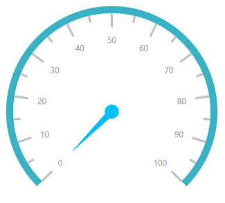
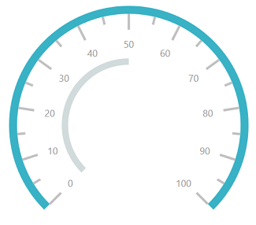
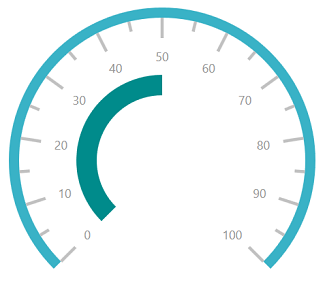
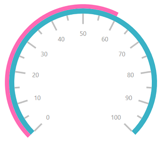
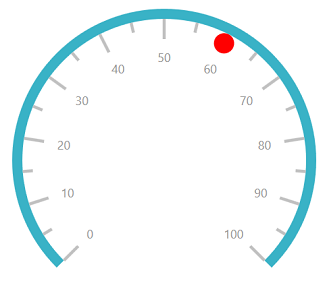
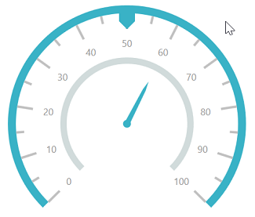

# Pointers

Pointers are used to indicate values on the scale. Value of the pointer can be modified using the [`Value`](https://help.syncfusion.com/cr/cref_files/uwp/Syncfusion.SfGauge.UWP~Syncfusion.UI.Xaml.Gauges.CircularPointer~Value.html) property.

## Pointer Type

There are three types of pointers. You can choose a pointer using the [`PointerType`](https://help.syncfusion.com/cr/cref_files/uwp/Syncfusion.SfGauge.UWP~Syncfusion.UI.Xaml.Gauges.CircularPointer~PointerType.html) property. 

## Needle pointer

A needle pointer contains two parts, a needle and a pointer cap, that can be placed on a gauge to mark values. 





     <gauge:SfCircularGauge >
            <gauge:SfCircularGauge.Scales>
                <gauge:CircularScale >
                    <gauge:CircularScale.Pointers>
                        <gauge:CircularPointer PointerType="NeedlePointer"/>
                    </gauge:CircularScale.Pointers>
                    </gauge:CircularScale>
            </gauge:SfCircularGauge.Scales>
        </gauge:SfCircularGauge>





SfCircularGauge sfCircularGauge = new SfCircularGauge();

CircularScale scale = new CircularScale();

CircularPointer circularPointer = new CircularPointer();

circularPointer.PointerType = PointerType.NeedlePointer;

scale.Pointers.Add(circularPointer);

sfCircularGauge.Scales.Add(scale);





### NeedlePointerType

The appearance of the needle pointer can be customized using the [`NeedlePointerType`](https://help.syncfusion.com/cr/cref_files/uwp/Syncfusion.SfGauge.UWP~Syncfusion.UI.Xaml.Gauges.CircularPointer~NeedlePointerType.html) property. The default value of this property is Rectangle.
The [`NeedlePointerType`](https://help.syncfusion.com/cr/cref_files/uwp/Syncfusion.SfGauge.UWP~Syncfusion.UI.Xaml.Gauges.CircularPointer~NeedlePointerType.html) is an `enum` property that includes the following options:

1.	Rectangle
2.	Triangle
3.	Tapered
4.	Arrow





      <gauge:SfCircularGauge >
            <gauge:SfCircularGauge.Scales>
                <gauge:CircularScale >
                    <gauge:CircularScale.Pointers>
                        <gauge:CircularPointer PointerType="NeedlePointer" NeedlePointerType="Triangle"/>
                    </gauge:CircularScale.Pointers>
                    </gauge:CircularScale>
            </gauge:SfCircularGauge.Scales>
        </gauge:SfCircularGauge>





SfCircularGauge sfCircularGauge = new SfCircularGauge();

CircularScale scale = new CircularScale();

CircularPointer circularPointer = new CircularPointer();

circularPointer.PointerType = PointerType.NeedlePointer;

circularPointer.NeedlePointerType = NeedlePointerType.Triangle;

scale.Pointers.Add(circularPointer);

sfCircularGauge.Scales.Add(scale);





### Needle pointer customization

The length of a needle is controlled using the [`NeedleLengthFactor`](https://help.syncfusion.com/cr/cref_files/uwp/Syncfusion.SfGauge.UWP~Syncfusion.UI.Xaml.Gauges.CircularPointer~NeedleLengthFactor.html) property. The minimum and maximum bounds of the [`NeedleLengthFactor`](https://help.syncfusion.com/cr/cref_files/uwp/Syncfusion.SfGauge.UWP~Syncfusion.UI.Xaml.Gauges.CircularPointer~NeedleLengthFactor.html) property are 0 and 1. The needle’s UI is customized using the [`NeedlePointerStroke`](https://help.syncfusion.com/cr/cref_files/uwp/Syncfusion.SfGauge.UWP~Syncfusion.UI.Xaml.Gauges.CircularPointer~NeedlePointerStroke.html) and [`NeedlePointerStrokeThickness`](https://help.syncfusion.com/cr/cref_files/uwp/Syncfusion.SfGauge.UWP~Syncfusion.UI.Xaml.Gauges.CircularPointer~NeedlePointerStrokeThickness.html) properties. The size of the pointer cap can be modified by changing the [`PointerCapDiameter`](https://help.syncfusion.com/cr/cref_files/uwp/Syncfusion.SfGauge.UWP~Syncfusion.UI.Xaml.Gauges.CircularPointer~PointerCapDiameter.html) property, and color can be modified using the [`PointerCapStroke`](https://help.syncfusion.com/cr/cref_files/uwp/Syncfusion.SfGauge.UWP~Syncfusion.UI.Xaml.Gauges.CircularPointer~PointerCapStroke.html) property.





      <gauge:SfCircularGauge >
            <gauge:SfCircularGauge.Scales>
                <gauge:CircularScale >
                    <gauge:CircularScale.Pointers>
                        <gauge:CircularPointer PointerType="NeedlePointer" NeedlePointerType="Triangle" NeedlePointerStroke="DeepSkyBlue" PointerCapDiameter="20" PointerCapStroke="DeepSkyBlue"
                                               NeedleLengthFactor="0.5" NeedlePointerStrokeThickness="10"/>
                    </gauge:CircularScale.Pointers>
                    </gauge:CircularScale>
            </gauge:SfCircularGauge.Scales>
        </gauge:SfCircularGauge>





  SfCircularGauge sfCircularGauge = new SfCircularGauge();

CircularScale scale = new CircularScale();

CircularPointer circularPointer = new CircularPointer();

circularPointer.PointerType = PointerType.NeedlePointer;

circularPointer.NeedlePointerType = NeedlePointerType.Triangle;

circularPointer.NeedlePointerStroke = new SolidColorBrush(Colors.DeepSkyBlue);

circularPointer.NeedlePointerStrokeThickness =10;

circularPointer.NeedleLengthFactor = 0.5;

circularPointer.PointerCapDiameter = 20;

circularPointer.PointerCapStroke = new SolidColorBrush(Colors.DeepSkyBlue);

scale.Pointers.Add(circularPointer);

sfCircularGauge.Scales.Add(scale);





### Setting visibility of needle pointer

The visibility of the needle pointer can be set using the [`NeedlePointerVisibility`](https://help.syncfusion.com/cr/cref_files/uwp/Syncfusion.SfGauge.UWP~Syncfusion.UI.Xaml.Gauges.CircularPointer~NeedlePointerVisibility.html) property.





     <gauge:SfCircularGauge >
            <gauge:SfCircularGauge.Scales>
                <gauge:CircularScale >
                    <gauge:CircularScale.Pointers>
                        <gauge:CircularPointer NeedlePointerVisibility="Hidden"/>
                    </gauge:CircularScale.Pointers>
                    </gauge:CircularScale>
            </gauge:SfCircularGauge.Scales>
        </gauge:SfCircularGauge>

        



SfCircularGauge sfCircularGauge = new SfCircularGauge();

CircularScale scale = new CircularScale();

CircularPointer circularPointer = new CircularPointer();

circularPointer.NeedlePointerVisibility = Visibility.Hidden;

scale.Pointers.Add(circularPointer);

sfCircularGauge.Scales.Add(scale);





## Range pointer

The range pointer is an accenting line or shaded background range that can be placed on a gauge to mark values. 





    <gauge:SfCircularGauge >
            <gauge:SfCircularGauge.Scales>
                <gauge:CircularScale >
                    <gauge:CircularScale.Pointers>
                        <gauge:CircularPointer PointerType="RangePointer" Value="50" />
                    </gauge:CircularScale.Pointers>
                    </gauge:CircularScale>
            </gauge:SfCircularGauge.Scales>
        </gauge:SfCircularGauge>





SfCircularGauge sfCircularGauge = new SfCircularGauge();

CircularScale scale = new CircularScale();

CircularPointer circularPointer = new CircularPointer();

circularPointer.PointerType = PointerType.RangePointer;

circularPointer.Value = 50;

scale.Pointers.Add(circularPointer);

sfCircularGauge.Scales.Add(scale);





### Range pointer customization

The range pointer’s UI is customized using the [`RangePointerStroke`](https://help.syncfusion.com/cr/cref_files/uwp/Syncfusion.SfGauge.UWP~Syncfusion.UI.Xaml.Gauges.CircularPointer~RangePointerStroke.html) and [`RangePointerStrokeThickness`](https://help.syncfusion.com/cr/cref_files/uwp/Syncfusion.SfGauge.UWP~Syncfusion.UI.Xaml.Gauges.CircularPointer~RangePointerStrokeThickness.html) properties.  





     <gauge:SfCircularGauge >
            <gauge:SfCircularGauge.Scales>
                <gauge:CircularScale >
                    <gauge:CircularScale.Pointers>
                        <gauge:CircularPointer PointerType="RangePointer" Value="50" RangePointerStroke="DarkCyan" RangePointerStrokeThickness="20"/>
                    </gauge:CircularScale.Pointers>
                    </gauge:CircularScale>
            </gauge:SfCircularGauge.Scales>
        </gauge:SfCircularGauge>





SfCircularGauge sfCircularGauge = new SfCircularGauge();

CircularScale scale = new CircularScale();

CircularPointer circularPointer = new CircularPointer();

circularPointer.PointerType = PointerType.RangePointer;

circularPointer.Value = 50;

circularPointer.RangePointerStroke = new SolidColorBrush(Colors.DarkCyan);

circularPointer.RangePointerStrokeThickness = 20;

scale.Pointers.Add(circularPointer);

sfCircularGauge.Scales.Add(scale);





### Setting visibility for range pointer

The [`RangePointerVisibility`](https://help.syncfusion.com/cr/cref_files/uwp/Syncfusion.SfGauge.UWP~Syncfusion.UI.Xaml.Gauges.CircularPointer~RangePointerVisibility.html) property is used to set the visibility of the range pointer.





    <gauge:SfCircularGauge >
            <gauge:SfCircularGauge.Scales>
                <gauge:CircularScale >
                    <gauge:CircularScale.Pointers>
                        <gauge:CircularPointer RangePointerVisibility="Hidden"/>
                    </gauge:CircularScale.Pointers>
                    </gauge:CircularScale>
            </gauge:SfCircularGauge.Scales>
        </gauge:SfCircularGauge>





SfCircularGauge sfCircularGauge = new SfCircularGauge();

CircularScale scale = new CircularScale();

CircularPointer circularPointer = new CircularPointer();

circularPointer.RangePointerVisibility = Visibility.Hidden;

scale.Pointers.Add(circularPointer);

sfCircularGauge.Scales.Add(scale);





### Setting position for range pointer

The `RangePointer` can be placed inside or outside the scale by the following two ways:
1.	Using the [`RangePointerPosition`](https://help.syncfusion.com/cr/cref_files/uwp/Syncfusion.SfGauge.UWP~Syncfusion.UI.Xaml.Gauges.CircularScale~RangePointerPosition.html) property.

You can place the range pointer by selecting one of the options available in the [`RangePointerPosition`](https://help.syncfusion.com/cr/cref_files/uwp/Syncfusion.SfGauge.UWP~Syncfusion.UI.Xaml.Gauges.CircularScale~RangePointerPosition.html) property. 

They are:

1.	Inside (Default)
2.	Outside
3.	Cross
4.	Custom





      <gauge:SfCircularGauge >
            <gauge:SfCircularGauge.Scales>
                <gauge:CircularScale RangePointerPosition="Outside">
                    <gauge:CircularScale.Pointers>
                        <gauge:CircularPointer PointerType="RangePointer" RangePointerStroke="HotPink" Value="60"/>
                    </gauge:CircularScale.Pointers>
                    </gauge:CircularScale>
            </gauge:SfCircularGauge.Scales>
        </gauge:SfCircularGauge>





SfCircularGauge sfCircularGauge = new SfCircularGauge();

CircularScale scale = new CircularScale();

scale.RangePointerPosition = RangePointerPosition.Outside;

CircularPointer circularPointer = new CircularPointer();

circularPointer.PointerType = PointerType.RangePointer;

circularPointer.RangePointerStroke = new SolidColorBrush(Colors.HotPink);

circularPointer.Value = 60;

scale.Pointers.Add(circularPointer);

sfCircularGauge.Scales.Add(scale);





2.	Using the [`RangePointerOffset`](https://help.syncfusion.com/cr/cref_files/uwp/Syncfusion.SfGauge.UWP~Syncfusion.UI.Xaml.Gauges.CircularScale~RangePointerOffset.html) property. First, set the [`RangePointerPosition`](https://help.syncfusion.com/cr/cref_files/uwp/Syncfusion.SfGauge.UWP~Syncfusion.UI.Xaml.Gauges.CircularScale~RangePointerPosition.html) to custom, and then set the [`RangePointerOffset`](https://help.syncfusion.com/cr/cref_files/uwp/Syncfusion.SfGauge.UWP~Syncfusion.UI.Xaml.Gauges.CircularScale~RangePointerOffset.html) property.





      <gauge:SfCircularGauge >
            <gauge:SfCircularGauge.Scales>
                <gauge:CircularScale RangePointerPosition="Custom" RangePointerOffset="0.5">
                    <gauge:CircularScale.Pointers>
                        <gauge:CircularPointer PointerType="RangePointer" RangePointerStroke="HotPink" Value="60"/>
                    </gauge:CircularScale.Pointers>
                    </gauge:CircularScale>
            </gauge:SfCircularGauge.Scales>
        </gauge:SfCircularGauge>





SfCircularGauge sfCircularGauge = new SfCircularGauge();

CircularScale scale = new CircularScale();

scale.RangePointerOffset = 0.5;

scale.RangePointerPosition = RangePointerPosition.Custom;

CircularPointer circularPointer = new CircularPointer();

circularPointer.PointerType = PointerType.RangePointer;

circularPointer.Value = 90;

scale.Pointers.Add(circularPointer);

sfCircularGauge.Scales.Add(scale);





## Symbol pointer

In symbol pointer, the value is pointed out using a symbol on the scale. The symbol is an enum property that provides symbol options for the symbol pointer, which contains several shapes such as rectangle, ellipse, and triangle.





      <gauge:SfCircularGauge >
            <gauge:SfCircularGauge.Scales>
                <gauge:CircularScale>
                    <gauge:CircularScale.Pointers>
                        <gauge:CircularPointer PointerType="SymbolPointer"  Value="60"/>
                    </gauge:CircularScale.Pointers>
                    </gauge:CircularScale>
            </gauge:SfCircularGauge.Scales>
        </gauge:SfCircularGauge>





SfCircularGauge sfCircularGauge = new SfCircularGauge();

CircularScale scale = new CircularScale();

CircularPointer circularPointer = new CircularPointer();

circularPointer.PointerType = PointerType.SymbolPointer;

circularPointer.Value = 60;

scale.Pointers.Add(circularPointer);

sfCircularGauge.Scales.Add(scale);





### Symbol pointer customization

You can modify the stroke of the symbol by changing the [`SymbolPointerStroke`](https://help.syncfusion.com/cr/cref_files/uwp/Syncfusion.SfGauge.UWP~Syncfusion.UI.Xaml.Gauges.CircularPointer~SymbolPointerStroke.html) property. The [`SymbolPointerHeight`](https://help.syncfusion.com/cr/cref_files/uwp/Syncfusion.SfGauge.UWP~Syncfusion.UI.Xaml.Gauges.CircularPointer~SymbolPointerHeight.html) property is used to set the height of the symbol pointer. The value should be given as a double value. The [`SymbolPointerWidth`](https://help.syncfusion.com/cr/cref_files/uwp/Syncfusion.SfGauge.UWP~Syncfusion.UI.Xaml.Gauges.CircularPointer~SymbolPointerWidth.html) property is used to set the width of the symbol pointer.





     <gauge:SfCircularGauge >
            <gauge:SfCircularGauge.Scales>
                <gauge:CircularScale>
                    <gauge:CircularScale.Pointers>
                        <gauge:CircularPointer PointerType="SymbolPointer"  Value="60" SymbolPointerStroke="Red"
                                               SymbolPointerHeight="20" SymbolPointerWidth="20"/>
                    </gauge:CircularScale.Pointers>
                    </gauge:CircularScale>
            </gauge:SfCircularGauge.Scales>
        </gauge:SfCircularGauge>





SfCircularGauge sfCircularGauge = new SfCircularGauge();

CircularScale scale = new CircularScale();

CircularPointer circularPointer = new CircularPointer();

circularPointer.PointerType = PointerType.SymbolPointer;

circularPointer.Value = 60;

circularPointer.SymbolPointerStroke = new SolidColorBrush(Colors.Red);

circularPointer.SymbolPointerHeight = 20;

circularPointer.SymbolPointerWidth = 20;

scale.Pointers.Add(circularPointer);

sfCircularGauge.Scales.Add(scale);





### Setting visibility of symbol pointer

The visibility of the symbol pointer can be set using the [`SymbolPointerVisibility`](https://help.syncfusion.com/cr/cref_files/uwp/Syncfusion.SfGauge.UWP~Syncfusion.UI.Xaml.Gauges.CircularPointer~SymbolPointerVisibility.html) Property.





      <gauge:SfCircularGauge >
            <gauge:SfCircularGauge.Scales>
                <gauge:CircularScale>
                    <gauge:CircularScale.Pointers>
                        <gauge:CircularPointer SymbolPointerVisibility="Hidden"/>
                    </gauge:CircularScale.Pointers>
                    </gauge:CircularScale>
            </gauge:SfCircularGauge.Scales>
        </gauge:SfCircularGauge>





SfCircularGauge sfCircularGauge = new SfCircularGauge();

CircularScale scale = new CircularScale();

CircularPointer circularPointer = new CircularPointer();

circularPointer.SymbolPointerVisibility = Visibility.Hidden;

scale.Pointers.Add(circularPointer);

sfCircularGauge.Scales.Add(scale);





### Setting multiple pointers

In addition to the default pointer, you can add n number of pointers to a scale using the [`Pointers`](https://help.syncfusion.com/cr/cref_files/uwp/Syncfusion.SfGauge.UWP~Syncfusion.UI.Xaml.Gauges.CircularScale~Pointers.html) property.





        <gauge:SfCircularGauge>
            <gauge:SfCircularGauge.Scales>
                <gauge:CircularScale >
                    <gauge:CircularScale.Pointers>
                        <gauge:CircularPointer PointerType="NeedlePointer" NeedleLengthFactor="0.4" Value="60"
                                               NeedlePointerType="Tapered" PointerCapStroke="#39B2C6" />
                        <gauge:CircularPointer PointerType="RangePointer"  Value="100"/>
                        <gauge:CircularPointer PointerType="SymbolPointer"  Value="50" Symbol="Pentagon"
                                               SymbolPointerHeight="20" SymbolPointerWidth="20"
                                               SymbolPointerStroke="#39B2C6"/>
                    </gauge:CircularScale.Pointers>
                </gauge:CircularScale>
            </gauge:SfCircularGauge.Scales>

        </gauge:SfCircularGauge>





SfCircularGauge sfCircularGauge = new SfCircularGauge();

CircularScale scale = new CircularScale();

CircularPointer circularPointer = new CircularPointer();

circularPointer.PointerType = PointerType.NeedlePointer;

circularPointer.NeedleLengthFactor = 0.4;

circularPointer.Value = 60;

circularPointer.NeedlePointerType = NeedlePointerType.Tapered;

circularPointer.PointerCapStroke = new SolidColorBrush(Color.FromArgb(0xff, 0x39, 0xb2, 0xc6));

scale.Pointers.Add(circularPointer);

CircularPointer circularPointer1 = new CircularPointer();

circularPointer1.PointerType = PointerType.RangePointer;

circularPointer1.Value = 100;

scale.Pointers.Add(circularPointer1);

CircularPointer circularPointer2 = new CircularPointer();

circularPointer2.PointerType = PointerType.SymbolPointer;

circularPointer2.Value = 50;

circularPointer2.Symbol = Symbol.Pentagon;

circularPointer2.SymbolPointerHeight = 20;

circularPointer2.SymbolPointerWidth = 20;

circularPointer2.SymbolPointerStroke = new SolidColorBrush(Color.FromArgb(0xff, 0x39, 0xb2, 0xc6));

scale.Pointers.Add(circularPointer2);

scale.Pointers.Add(circularPointer);

sfCircularGauge.Scales.Add(scale);





## Setting animation for pointer

The [`EnableAnimation`](https://help.syncfusion.com/cr/cref_files/uwp/Syncfusion.SfGauge.UWP~Syncfusion.UI.Xaml.Gauges.CircularPointer~EnableAnimation.html) property is a Boolean property that enables or disables the animation of the pointers in circular gauge.





       <gauge:SfCircularGauge>
            <gauge:SfCircularGauge.Scales>
                <gauge:CircularScale Radius="150" >
                    <gauge:CircularScale.Pointers>
                        <gauge:CircularPointer PointerType="NeedlePointer" NeedleLengthFactor="0.4" Value="60"
                                               NeedlePointerType="Triangle" PointerCapStroke="#39B2C6" PointerCapDiameter="20"/>
                        <gauge:CircularPointer PointerType="RangePointer"  Value="100" RangePointerStroke="#39B2C6"/>

                    </gauge:CircularScale.Pointers>
                </gauge:CircularScale>
            </gauge:SfCircularGauge.Scales>

        </gauge:SfCircularGauge>





            SfCircularGauge sfCircularGauge = new SfCircularGauge();

            CircularScale scale = new CircularScale();

            scale.Radius = 150;

            CircularPointer circularPointer = new CircularPointer();

            circularPointer.PointerType = PointerType.NeedlePointer;

            circularPointer.EnableAnimation = true;

            circularPointer.NeedleLengthFactor = 0.4;

            circularPointer.Value = 60;

            circularPointer.NeedlePointerType = NeedlePointerType.Triangle;

            circularPointer.PointerCapDiameter = 20;

            circularPointer.PointerCapStroke = new SolidColorBrush(Color.FromArgb(0xff, 0x39, 0xb2, 0xc6));

            scale.Pointers.Add(circularPointer);

            CircularPointer circularPointer1 = new CircularPointer();

            circularPointer1.PointerType = PointerType.RangePointer;

            circularPointer1.RangePointerStroke = new SolidColorBrush(Color.FromArgb(0xff, 0x39, 0xb2, 0xc6));

            circularPointer1.EnableAnimation = true;

            circularPointer1.Value = 100;

            scale.Pointers.Add(circularPointer1);

            scale.Pointers.Add(circularPointer);

            sfCircularGauge.Scales.Add(scale);





