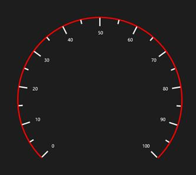

# Rim

Scale determines the structure of the circular gauge using the circular rim. By setting the StartAngle, SweepDirection and SweepAngle properties, you can shape the circular gauge into a full circular gauge, half circular gauge, or quarter circular gauge.

The StartValue and EndValue properties will determine the overall range of the circular rim. The rim’s stroke and stroke thickness can be set using the RimStroke and RimStrokeThickness properties.




    <syncfusion:SfCircularGauge x:Name="gauge">
            <syncfusion:SfCircularGauge.Scales >
                <syncfusion:CircularScale 
                                            StartAngle="180" 
                                            SweepAngle="180"
                                            SweepDirection="Clockwise"
                                            StartValue="0" 
                                            EndValue="100"
                                            RimStroke="Red" 
                                            RimStrokeThickness="3"
                                            >
                </syncfusion:CircularScale>
            </syncfusion:SfCircularGauge.Scales >
        </syncfusion:SfCircularGauge>





            SfCircularGauge circularGauge = new SfCircularGauge();
            CircularScale _scale = new CircularScale();
            _scale.StartAngle = 180;
            _scale.SweepAngle = 180;
            _scale.SweepDirection = SweepDirection.Clockwise;
            _scale.StartValue = 0;
            _scale.EndValue = 100;
            _scale.RimStroke = new SolidColorBrush(Colors.Red);
            _scale.RimStrokeThickness = 3;
            circularGauge.Scales.Add(_scale);
            this.Grid.Children.Add(circularGauge);




