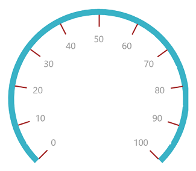
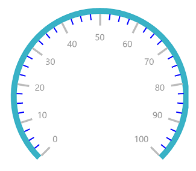
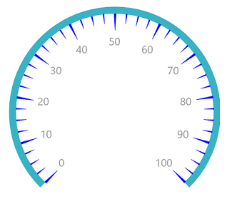
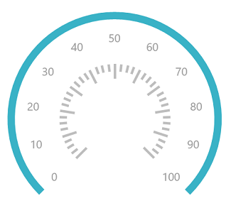
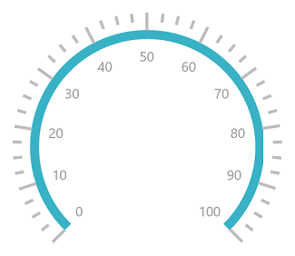

# Ticks

Ticks help you identify the gauge’s data value by marking the gauge scale in regular increments.

## Tick customization

The Interval property is used to calculate the tick count for a scale. Similar ticks, small ticks are calculated using the [`MinorTicksPerInterval`](https://help.syncfusion.com/cr/cref_files/uwp/sfgauge/Syncfusion.SfGauge.UWP~Syncfusion.UI.Xaml.Gauges.CircularScale~MinorTicksPerInterval.html) property.

The length, stroke, and stroke thickness of a tick are set using the [`TickLength`](https://help.syncfusion.com/cr/cref_files/uwp/sfgauge/Syncfusion.SfGauge.UWP~Syncfusion.UI.Xaml.Gauges.CircularScale~TickLength.html), [`TickStroke`](https://help.syncfusion.com/cr/cref_files/uwp/sfgauge/Syncfusion.SfGauge.UWP~Syncfusion.UI.Xaml.Gauges.CircularScale~TickStroke.html), and [`TickStrokeThickness`](https://help.syncfusion.com/cr/cref_files/uwp/sfgauge/Syncfusion.SfGauge.UWP~Syncfusion.UI.Xaml.Gauges.CircularScale~TickStrokeThickness.html) UI properties, respectively. Similar ticks, the length, stroke, and stroke thickness of a small tick are set using the [`SmallTickLength`](https://help.syncfusion.com/cr/cref_files/uwp/sfgauge/Syncfusion.SfGauge.UWP~Syncfusion.UI.Xaml.Gauges.CircularScale~SmallTickLength.html), [`SmallTickStroke`](https://help.syncfusion.com/cr/cref_files/uwp/sfgauge/Syncfusion.SfGauge.UWP~Syncfusion.UI.Xaml.Gauges.CircularScale~SmallTickStroke.html), and [`SmallTickStrokeThickness`](https://help.syncfusion.com/cr/cref_files/uwp/sfgauge/Syncfusion.SfGauge.UWP~Syncfusion.UI.Xaml.Gauges.CircularScale~SmallTickStrokeThickness.html) UI properties, respectively.

### Customize major ticks for scale





     <gauge:SfCircularGauge>

            <gauge:SfCircularGauge.Scales>

                <gauge:CircularScale Radius="150" RimStroke="#39B2C6" RimStrokeThickness="9" TickLength="20"
                                     TickStrokeThickness="2"
                                     TickStroke="Brown" LabelStroke="#9E9E9E" SmallTickStroke="White">

                    </gauge:CircularScale>

            </gauge:SfCircularGauge.Scales>

        </gauge:SfCircularGauge>





             SfCircularGauge sfCircularGauge = new SfCircularGauge();

            CircularScale circularScale = new CircularScale();

            circularScale.Radius = 150;

            circularScale.RimStroke = new SolidColorBrush(Color.FromArgb(0xff, 0x57, 0xb2, 0xc6));

            circularScale.TickLength = 20;

            circularScale.TickStrokeThickness = 2;

            circularScale.TickStroke = new SolidColorBrush(Colors.Brown);

            circularScale.SmallTickStroke = new SolidColorBrush(Colors.White);

            circularScale.RimStrokeThickness = 9;

            circularScale.LabelStroke = new SolidColorBrush(Color.FromArgb(0xff, 0x99, 0x99, 0x99));

            sfCircularGauge.Scales.Add(circularScale);





### Customize minor ticks for scale





        <gauge:SfCircularGauge>

            <gauge:SfCircularGauge.Scales>

                <gauge:CircularScale Radius="150" RimStroke="#39B2C6" RimStrokeThickness="9"
                                     MinorTicksPerInterval="3" SmallTickStrokeThickness="2"
                                     SmallTickLength="10"
                                     TickStroke="#BEBEBE" LabelStroke="#9E9E9E" SmallTickStroke="Blue">

                </gauge:CircularScale>

            </gauge:SfCircularGauge.Scales>

        </gauge:SfCircularGauge>





            SfCircularGauge sfCircularGauge = new SfCircularGauge();

            CircularScale circularScale = new CircularScale();

            circularScale.Radius = 150;

            circularScale.RimStroke = new SolidColorBrush(Color.FromArgb(0xff, 0x57, 0xb2, 0xc6));

            circularScale.SmallTickLength = 10;

            circularScale.SmallTickStrokeThickness = 2;

            circularScale.TickStroke = new SolidColorBrush(Color.FromArgb(0xff, 0xc1, 0xc1, 0xc1));

            circularScale.SmallTickStroke = new SolidColorBrush(Colors.Blue);

            circularScale.RimStrokeThickness = 9;

            circularScale.MinorTicksPerInterval = 3;

            circularScale.LabelStroke = new SolidColorBrush(Color.FromArgb(0xff, 0x99, 0x99, 0x99));

            sfCircularGauge.Scales.Add(circularScale);





## Setting shape for tick

The [`TickShape`](https://help.syncfusion.com/cr/cref_files/uwp/sfgauge/Syncfusion.SfGauge.UWP~Syncfusion.UI.Xaml.Gauges.CircularScale~TickShape.html) is an enum property that provides an option to select shape of the circular mark ticks, which contains several shapes such as rectangle, ellipse, and triangle.





      <gauge:SfCircularGauge>

            <gauge:SfCircularGauge.Scales>

                <gauge:CircularScale Radius="150" RimStroke="#39B2C6" RimStrokeThickness="9"
                                     MinorTicksPerInterval="3" SmallTickStrokeThickness="2"
                                     SmallTickLength="10" TickShape="Triangle"
                                     TickStroke="Blue" LabelStroke="#9E9E9E" SmallTickStroke="Blue">

                </gauge:CircularScale>

            </gauge:SfCircularGauge.Scales>

        </gauge:SfCircularGauge>





           SfCircularGauge sfCircularGauge = new SfCircularGauge();

            CircularScale circularScale = new CircularScale();

            circularScale.Radius = 150;

            circularScale.RimStroke = new SolidColorBrush(Color.FromArgb(0xff, 0x57, 0xb2, 0xc6));

            circularScale.SmallTickLength = 10;

            circularScale.SmallTickStrokeThickness = 2;

            circularScale.TickStroke = new SolidColorBrush(Colors.Blue);

            circularScale.SmallTickStroke = new SolidColorBrush(Colors.Blue);

            circularScale.RimStrokeThickness = 9;

            circularScale.TickShape = TickShape.Triangle;

            circularScale.MinorTicksPerInterval = 3;

            circularScale.LabelStroke = new SolidColorBrush(Color.FromArgb(0xff, 0x99, 0x99, 0x99));

            sfCircularGauge.Scales.Add(circularScale);





## Setting position for tick

The major and minor ticks can be positioned far away from the rim using the following two ways:
 
    1. Using the `MajorTickOffset` and `MinorTickOffset` properties. First, set the `TickPosition` property to custom, and then set the offset of the tick.





     <gauge:SfCircularGauge>

            <gauge:SfCircularGauge.Scales>

                <gauge:CircularScale Radius="150" RimStroke="#39B2C6" RimStrokeThickness="9"
                                     MinorTicksPerInterval="3" TickPosition="Custom"
                                     MajorTickOffset="0.5" MinorTickOffset="0.5"
                                    TickStroke="#BEBEBE" LabelStroke="#9E9E9E" SmallTickStroke="#BEBEBE">

                </gauge:CircularScale>

            </gauge:SfCircularGauge.Scales>

        </gauge:SfCircularGauge>

        



            SfCircularGauge sfCircularGauge = new SfCircularGauge();

            CircularScale circularScale = new CircularScale();

            circularScale.Radius = 150;

            circularScale.RimStroke = new SolidColorBrush(Color.FromArgb(0xff, 0x57, 0xb2, 0xc6));

            circularScale.TickStroke = new SolidColorBrush(Color.FromArgb(0xff, 0xc1, 0xc1, 0xc1));

            circularScale.SmallTickStroke = new SolidColorBrush(Color.FromArgb(0xff, 0xc1, 0xc1, 0xc1));

            circularScale.RimStrokeThickness = 9;

            circularScale.MinorTicksPerInterval = 3;

            circularScale.TickPosition = TickPosition.Custom;

            circularScale.MajorTickOffset = 0.5;

            circularScale.MinorTickOffset = 0.5;

            circularScale.LabelStroke = new SolidColorBrush(Color.FromArgb(0xff, 0x99, 0x99, 0x99));

            sfCircularGauge.Scales.Add(circularScale);





    2. Placing the ticks inside the scale, outside the scale, or across the scale by selecting one of the options available in the `TickPosition` property. 
    
    They are:

1.	Inside (Default)
2.	Outside
3.	Cross
4.	Custom





    <gauge:SfCircularGauge>

            <gauge:SfCircularGauge.Scales>

                <gauge:CircularScale Radius="150" RimStroke="#39B2C6" RimStrokeThickness="9"
                                     MinorTicksPerInterval="3" TickPosition="Outside"
                                    TickStroke="#BEBEBE" LabelStroke="#9E9E9E" SmallTickStroke="#BEBEBE">

                </gauge:CircularScale>

            </gauge:SfCircularGauge.Scales>

        </gauge:SfCircularGauge>





           SfCircularGauge sfCircularGauge = new SfCircularGauge();

            CircularScale circularScale = new CircularScale();

            circularScale.Radius = 150;

            circularScale.RimStroke = new SolidColorBrush(Color.FromArgb(0xff, 0x57, 0xb2, 0xc6));

            circularScale.TickStroke = new SolidColorBrush(Color.FromArgb(0xff, 0xc1, 0xc1, 0xc1));

            circularScale.SmallTickStroke = new SolidColorBrush(Color.FromArgb(0xff, 0xc1, 0xc1, 0xc1));

            circularScale.RimStrokeThickness = 9;

            circularScale.MinorTicksPerInterval = 3;

            circularScale.TickPosition = TickPosition.Outside;

            circularScale.LabelStroke = new SolidColorBrush(Color.FromArgb(0xff, 0x99, 0x99, 0x99));

            sfCircularGauge.Scales.Add(circularScale);





