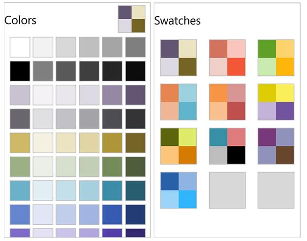
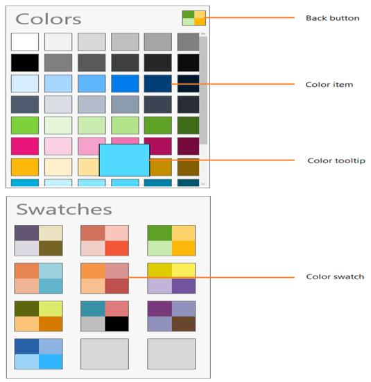

# Overview

`SfColorPalette` control allows to select a color from a set of swatches using touch navigation.

## Features

* Contains nearly 600 predefined solid colors
* Selected color can be changed by Mouse interaction

## Visual Structure

WinRT

Windows Phone

