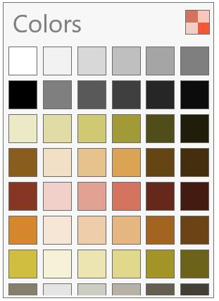
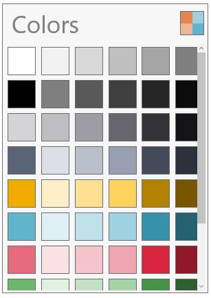
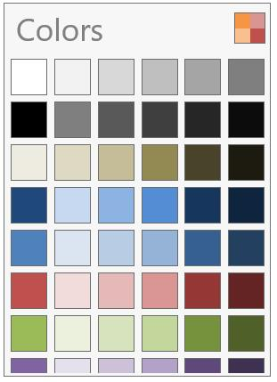
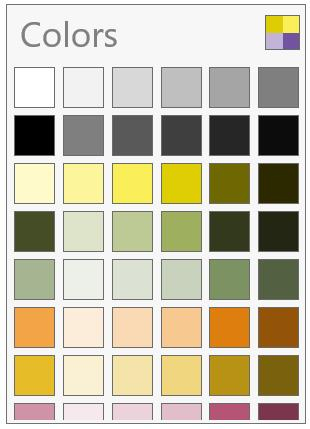
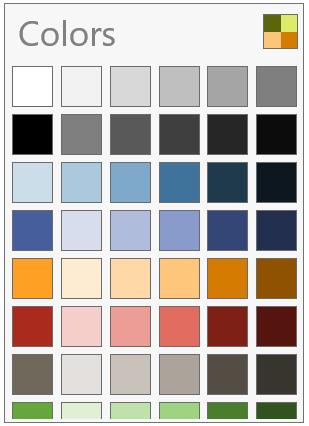
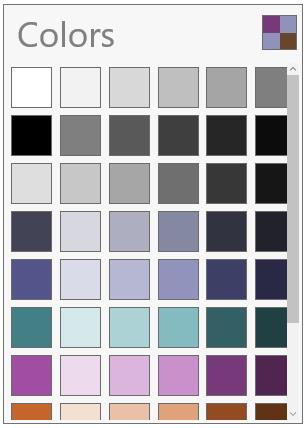
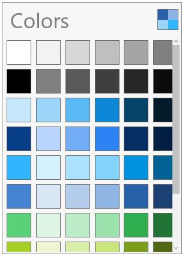

# Swatches and Colors

SfColorPalette have swatch buttons, which opens a collection of color items on click under a swatch.

**Apex**

**HardCover**

**Metro**

**Module**

**Office**

**Paper**

**Pushpin**

**Solstice**

**Urban**

**WaveForm**

