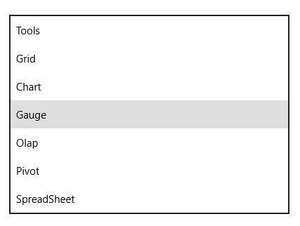
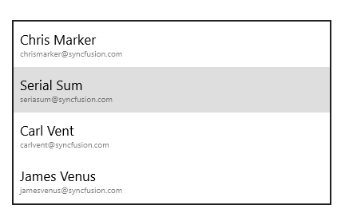

# Populating Items

## Items Source

SfComboBoxItems can be populated with the business object collection. The below example is illustrated to create a SfComboBox that display a list of employees. 

The Employee model is displayed as follows.





public class ProductList

  {

        public string Name { get; set; } 

 }





Public Class ProductList

    Public Property Name() As String

End Class





Create the employee collection as follows.





private List<ProductList> products;

     public List<ProductList> Products

     {

         get { return products; }

         set { products = value; }

     }





Private products_Renamed As List(Of ProductList)

Public Property Products() As List(Of ProductList)

		 Get
			 Return products_Renamed
		 End Get

		 Set(ByVal value As List(Of ProductList))
			 products_Renamed = value
		 End Set

End Property





### Populate the items.





  Products = new List<ProductList>();

 Products.Add(new ProductList() { Name = "Tools" });
            
 Products.Add(new ProductList() {  Name = "Grid" });
            
 Products.Add(new ProductList(){ Name = "Chart" });
            
 Products.Add(new ProductList(){ Name = "Gauge" }); 
            
 Products.Add(new ProductList(){ Name = "Olap" });
            
 Products.Add(new ProductList(){ Name = "Pivot" });
            
 Products.Add(new ProductList(){ Name = "SpreadSheet" });
   





 Products = New List(Of ProductList)()

 Products.Add(New ProductList() With {.Name = "Tools"})

 Products.Add(New ProductList() With {.Name = "Grid"})

 Products.Add(New ProductList() With {.Name = "Chart"})

 Products.Add(New ProductList() With {.Name = "Gauge"})

 Products.Add(New ProductList() With {.Name = "Olap"})

 Products.Add(New ProductList() With {.Name = "Pivot"})

 Products.Add(New ProductList() With {.Name = "SpreadSheet"})
   





Bind the Employees collection to the ItemsSource property of the SfComboBox.



<editors:SfComboBox ItemsSource="{Binding Products}" />



The above steps populate the SfComboBox as illustrated in the following screenshot.

## DisplayMemberPath

The DisplayMemberPath property of the SfComboBox is used to define the model’s property that is to be displayed inside the header of the tab items. 



< editors:SfComboBox

DisplayMemberPath="Name" ItemsSource="{Binding Products}" />



This populates the SfComboBox as illustrated in the following screenshot. 

## Item Template

The ItemTemplate property of the SfComboBox can be used to customize the content part of the SfComboBoxItems.



< editors:SfComboBox

            ItemsSource="{Binding Products}" >          <editors:SfComboBox.ItemTemplate>

                <DataTemplate>

                    <Grid>

                        <StackPanel>

             <TextBlock Text="{Binding Name}" FontSize="17"/>

             <TextBlock Text="{Binding Email}" FontSize="10" Opacity="0.5"/>

                        </StackPanel>

                    </Grid>

                </DataTemplate>

            </editors:SfComboBox.ItemTemplate>

</editors:SfComboBox>



This populates the SfComboBox as illustrated in the following screenshot.

