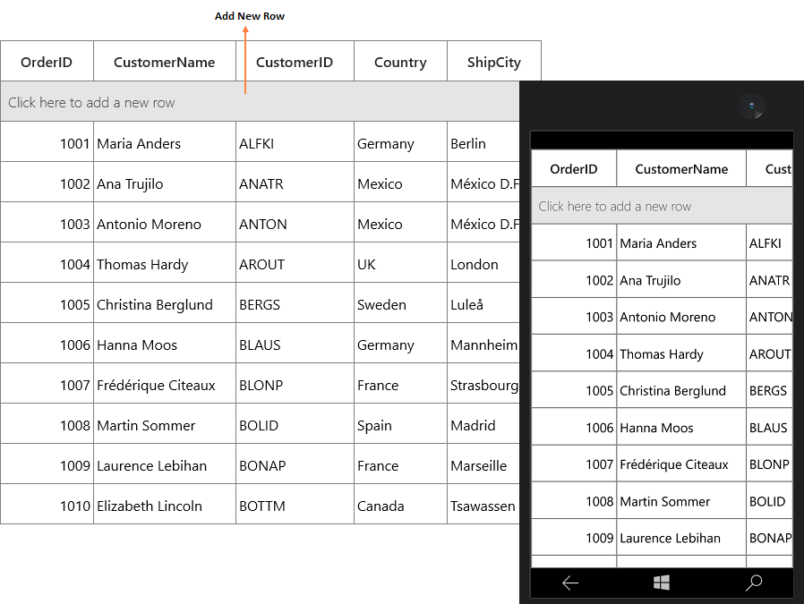
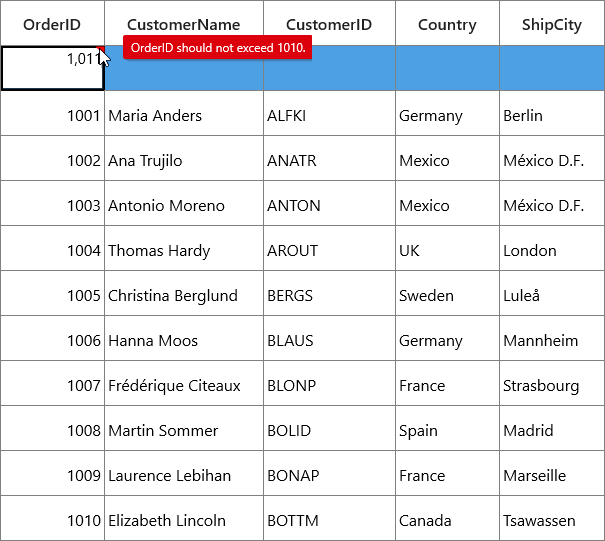
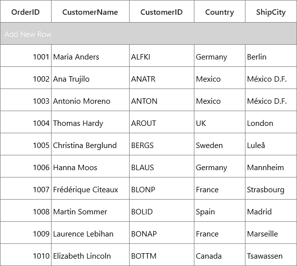
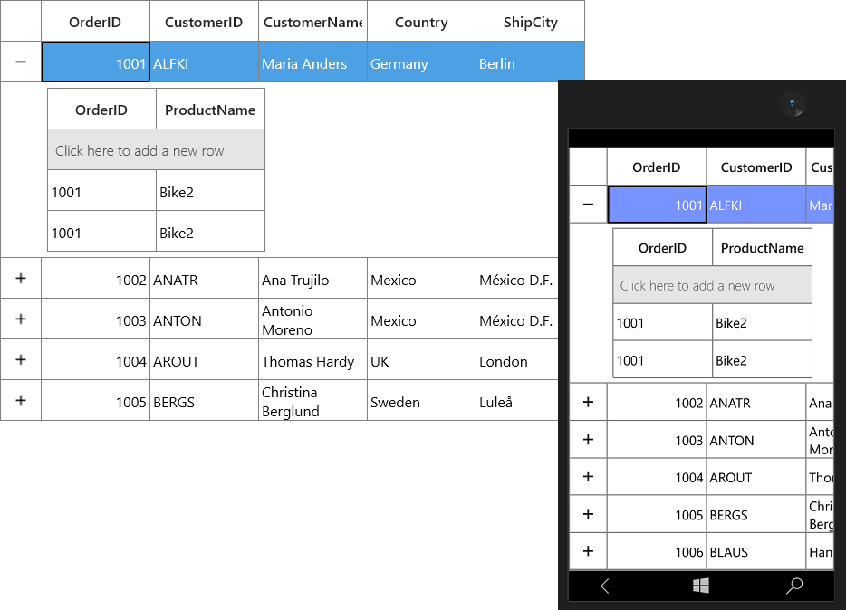

# Data Manipulation

SfDataGrid listens and responds to the manipulation operations such as add, delete and data update (property change) at runtime. DataGrid refresh the sorting, filtering, grouping and summaries based on [SfDataGrid.LiveDataUpdateMode](https://help.syncfusion.com/cr/cref_files/uwp/sfdatagrid/Syncfusion.SfGrid.UWP~Syncfusion.UI.Xaml.Grid.SfDataGrid~LiveDataUpdateMode.html) property.
 


<syncfusion:SfDataGrid x:Name="dataGrid"
                       AutoGenerateColumns="True"
                       ItemsSource="{Binding Orders}"
                       LiveDataUpdateMode="AllowDataShaping" />


this.dataGrid.LiveDataUpdateMode = LiveDataUpdateMode.AllowDataShaping;



##LiveDataUpdateMode

### LiveDataUpdateMode – Default 
<table>
<tr>
<th>
Grid operations / Data Manipulation operations
</th>
<th>
Add
</th>
<th>
Remove / delete
</th>
<th>
Property change
</th>
</tr>
<tr>
<td>
Sorting
</td>
<td>
Record added at last
</td>
<td>
Updated
</td>
<td>
Sort order not updated
</td>
</tr>
<tr>
<td>
Grouping
</td>
<td>
Updated
</td>
<td>
Updated
</td>
<td>
Groups not refreshed based on change
</td>
</tr>
<tr>
<td>
Filtering
</td>
<td>
Updated
</td>
<td>
Updated
</td>
<td>
Filter not refreshed based on change
</td>
</tr>
<tr>
<td>
Summaries
</td>
<td>
Not updated
</td>
<td>
Not updated
</td>
<td>
Not updated
</td>
</tr>
</table>

### LiveDataUpdateMode – AllowSummaryUpdate

<table>
<tr>
<td>
Grid operations/ Data Manipulation operations
</td>
<td>
Add
</td>
<td>
Remove / delete
</td>
<td>
Property change
</td>
</tr>
<tr>
<td>
Sorting
</td>
<td>
Record added at last
</td>
<td>
Updated
</td>
<td>
Sort order not updated
</td>
</tr>
<tr>
<td>
Grouping
</td>
<td>
Updated
</td>
<td>
Updated
</td>
<td>
Groups not refreshed based on change
</td>
</tr>
<tr>
<td>
Filtering
</td>
<td>
Updated
</td>
<td>
Updated
</td>
<td>
Filter not refreshed based on change
</td>
</tr>
<tr>
<td>
Summaries
</td>
<td>
Updated
</td>
<td>
Updated
</td>
<td>
Updated
</td>
</tr>
</table>

### LiveDataUpdateMode – AllowDataShaping

<table>
<tr>
<td>
Grid operations/ Data Manipulation operations
</td>
<td>
Add
</td>
<td>
Remove / delete
</td>
<td>
Property change
</td>
</tr>
<tr>
<td>
Sorting
</td>
<td>
Updated
</td>
<td>
Updated
</td>
<td>
Updated 
</td>
</tr>
<tr>
<td>
Grouping
</td>
<td>
Updated 
</td>
<td>
Updated
</td>
<td>
Updated
</td>
</tr>
<tr>
<td>
Filtering
</td>
<td>
Updated
</td>
<td>
Updated
</td>
<td>
Updated
</td>
</tr>
<tr>
<td>
Summaries
</td>
<td>
Updated
</td>
<td>
Updated
</td>
<td>
Updated
</td>
</tr>
</table>

#### Limitations

* `AllowDataShaping` and `AllowSummaryUpdate` is not supported when you are binding with dynamic data objects.

* Complex and indexer properties doesn’t support `LiveDataUpdateMode` - `AllowDataShaping` and `AllowSummaryUpdate`.

## Built-in AddNewRow

SfDataGrid provides built-in row (called AddNewRow) to add new records to underlying collection. You can enable the AddNewRow by specifying the position where it should be displayed by setting [SfDataGrid.AddNewRowPosition](https://help.syncfusion.com/cr/cref_files/uwp/sfdatagrid/Syncfusion.SfGrid.UWP~Syncfusion.UI.Xaml.Grid.SfDataGrid~AddNewRowPosition.html) property.

When you start editing in AddNewRow, the SfDataGrid control creates an instance for the underlying data object and adds it to underlying collection when editing completed.

N> The underlying data object must be defined with default constructor. Otherwise, create instance of data object by handling `AddNewRowInitiating` event.



<syncfusion:SfDataGrid x:Name="dataGrid"
                       AddNewRowPosition="Top"
                       AutoGenerateColumns="True"
                       ItemsSource="{Binding Orders}" />

        
this.dataGrid.AddNewRowPosition = AddNewRowPosition.Top;



You can get the row index of AddNewRow where it placed by using the [GridAddNewRowController.GetAddNewRowIndex](https://help.syncfusion.com/cr/cref_files/uwp/sfdatagrid/Syncfusion.SfGrid.UWP~Syncfusion.UI.Xaml.Grid.GridAddNewRowController~GetAddNewRowIndex.html) method.



using Syncfusion.UI.Xaml.Grid.Helpers

var addNewRowController=this.dataGrid.GetAddNewRowController();
int addNewRowIndex = addNewRowController.GetAddNewRowIndex();



You can check whether the specified row index is AddNewRow index, by using [SfDataGrid.IsAddNewIndex](https://help.syncfusion.com/cr/cref_files/uwp/sfdatagrid/Syncfusion.SfGrid.UWP~Syncfusion.UI.Xaml.Grid.GridIndexResolver~IsAddNewIndex.html) helper method.



bool isAddNewRowIndex = this.dataGrid.IsAddNewIndex(1);



### Customize the newly added row position

SfDataGrid adds new data item from AddNewRow at the end of collection. When data operations (sorting, grouping) performed, the new item added based on data operations. You can customize the newly added data item position by setting [SfDataGrid.NewItemPlaceHolderPosition](https://help.syncfusion.com/cr/cref_files/uwp/sfdatagrid/Syncfusion.SfGrid.UWP~Syncfusion.UI.Xaml.Grid.SfDataGrid~NewItemPlaceholderPosition.html).


<Syncfusion:SfDataGrid x:Name="datagrid"                               
                       AddNewRowPosition="Top"
                       NewItemPlaceholderPosition="AtBeginning"                            
                       ItemsSource="{Binding OrderInfoCollection }">


this.datagrid.AddNewRowPosition = AddNewRowPosition.Top;
this.datagrid.NewItemPlaceholderPosition = NewItemPlaceholderPosition.AtBeginning;



### Initializing default values for AddNewRow

SfDataGrid allows you to set the default values for AddNewRow while initiating, through [AddNewRowInitiatingEventArgs.NewObject](https://help.syncfusion.com/cr/cref_files/uwp/sfdatagrid/Syncfusion.SfGrid.UWP~Syncfusion.UI.Xaml.Grid.AddNewRowInitiatingEventArgs~NewObject.html) property in [SfDataGrid.AddNewRowInitiating](https://help.syncfusion.com/cr/cref_files/uwp/sfdatagrid/Syncfusion.SfGrid.UWP~Syncfusion.UI.Xaml.Grid.SfDataGrid~AddNewRowInitiating_EV.html) event.



this.dataGrid.AddNewRowInitiating += dataGrid_AddNewRowInitiating;

void dataGrid_AddNewRowInitiating(object sender, AddNewRowInitiatingEventArgs args)
{
    var data = args.NewObject as OrderInfo;
    data.OrderID = 101;
}



### Working with complex properties in AddNewRow

SfDataGrid control does not initiate values for complex properties defined in the data object. Hence, you need to initiate the default values for the complex properties externally by using the [SfDataGrid.AddNewRowInitiating](https://help.syncfusion.com/cr/cref_files/uwp/sfdatagrid/Syncfusion.SfGrid.UWP~Syncfusion.UI.Xaml.Grid.SfDataGrid~AddNewRowInitiating_EV.html) event.



<syncfusion:SfDataGrid AddNewRowInitiating="SfDataGrid_AddNewRowInitiating"
                       AutoGenerateColumns="False"
                       ItemsSource="{Binding Orders}">
    <syncfusion:SfDataGrid.Columns>
        <syncfusion:GridTextColumn MappingName="OrderID" />
        <syncfusion:GridTextColumn MappingName="Customer.CustomerID" />
        <syncfusion:GridTextColumn MappingName="ShipCity" />
    </syncfusion:SfDataGrid.Columns>
</syncfusion:SfDataGrid>


this.dataGrid.AddNewRowInitiating += dataGrid_AddNewRowInitiating;

private void SfDataGrid_AddNewRowInitiating(object sender, Syncfusion.UI.Xaml.Grid.AddNewRowInitiatingEventArgs args)
{
    var data = args.NewObject as OrderInfo;
    data.Customer = new Customer();
}



### Programmatically perform AddNewRow operations

You can commit or cancel the new record in AddNewRow by pressing the <kbd>Enter</kbd> and <kbd>Esc</kbd> key respectively. 

AddNewRow operations can be performed programmatically by using [GridAddNewRowController.CommitAddNew](https://help.syncfusion.com/cr/cref_files/uwp/sfdatagrid/Syncfusion.SfGrid.UWP~Syncfusion.UI.Xaml.Grid.GridAddNewRowController~CommitAddNew.html) and [GridAddNewRowController.CancelAddNew](https://help.syncfusion.com/cr/cref_files/uwp/sfdatagrid/Syncfusion.SfGrid.UWP~Syncfusion.UI.Xaml.Grid.GridAddNewRowController~CancelAddNew.html) methods at runtime.

#### Cancel AddNewRow



using Syncfusion.UI.Xaml.Grid.Helpers;

//Check whether the data is newly added 

if (this.dataGrid.View.IsAddingNew)
{

    // Which end edit the current cell. By passing false, it revert the entered value.

    if (this.dataGrid.SelectionController.CurrentCellManager.CurrentCell.IsEditing)
        this.dataGrid.SelectionController.CurrentCellManager.EndEdit(true);

    var addNewRowController = this.dataGrid.GetAddNewRowController();
    addNewRowController.CancelAddNew();
}



#### Commit AddNewRow



RowColumnIndex rowColumnIndex = new RowColumnIndex();

if (this.dataGrid.View.IsAddingNew)
{

    if (this.dataGrid.SelectionController.CurrentCellManager.CurrentCell.IsEditing)
        this.dataGrid.SelectionController.CurrentCellManager.EndEdit(true);
    rowColumnIndex = this.dataGrid.SelectionController.CurrentCellManager.CurrentRowColumnIndex;

    //Process the commit operation in AddNewRow.
    var addNewRowController = this.dataGrid.GetAddNewRowController();
    addNewRowController.CommitAddNew();

    //Gets the row index of AddNewRow 
    rowColumnIndex.RowIndex = addNewRowController.GetAddNewRowIndex();
    this.dataGrid.SelectedItems.Clear();

    //If the AddNewRowPosition is Top need to move the current cell to next row 

    if (this.dataGrid.AddNewRowPosition == AddNewRowPosition.Top)
        rowColumnIndex.RowIndex = rowColumnIndex.RowIndex + 1;

    // Which retains the current cell border in the row after canceling AddNewRow as you press ESC key operation.
    this.dataGrid.MoveCurrentCell(rowColumnIndex);
}



### Validating AddNewRow

You can validate the data in AddNewRow like other data rows through [built-in validation](http://help.syncfusion.com/uwp/sfdatagrid/data-validation#built-in-validations) or [custom validation](http://help.syncfusion.com/uwp/sfdatagrid/data-validation#custom-validation-through-events). 

Here, AddNewRow is validated using [RowValidating](https://help.syncfusion.com/cr/cref_files/uwp/sfdatagrid/Syncfusion.SfGrid.UWP~Syncfusion.UI.Xaml.Grid.SfDataGrid~RowValidating_EV.html) event by setting `RowValidatingEventArgs.IsValid` to `false` which doesn’t allow users to commit the AddNewRow until the validation gets succeeded.
  


this.dataGrid.RowValidating += dataGrid_RowValidating;

void dataGrid_RowValidating(object sender, RowValidatingEventArgs args)
{

    if(this.dataGrid.IsAddNewIndex(args.RowIndex))
    {
        var data = args.RowData as OrderInfo;

        if (data.OrderID >= 1010)
        {
            args.IsValid = false;
            args.ErrorMessages.Add("OrderID", "OrderID should not exceed 1010.");
        }
    }
}



Similarly, you can validate the cells in AddNewRow by using the [CurrentCellValidating](https://help.syncfusion.com/cr/cref_files/uwp/sfdatagrid/Syncfusion.SfGrid.UWP~Syncfusion.UI.Xaml.Grid.SfDataGrid~CurrentCellValidating_EV.html) event.

### Customizing AddNewRow text using default resource file

SfDataGrid enables you to customize the watermark text of AddNewRow by changing value of AddNewRowText in Resource Designer. For more information, you can refer [Editing default culture resource](https://help.syncfusion.com/uwp/sfdatagrid/localization#editing-default-culture-resource) section.

To customize the AddNewRowText, add the default `Syncfusion.SfDataGrid.UWP.resw` file and then customize the value of AddNewRowText.
 

### Customizing AddNewRow text using style

You can customize the watermark text of AddNewRow by editing the style of `AddNewRowControl` and change the content of `PART_AddNewRowTextBorder’s ContentPresenter`.



<Application.Resources>
    
</Application.Resources>



### AddNewRow support in Master-Details View

You can enable the AddNewRow in `DetailsViewDataGrid` by specifying the position to [SfDataGrid.AddNewRowPosition](https://help.syncfusion.com/cr/cref_files/uwp/sfdatagrid/Syncfusion.SfGrid.UWP~Syncfusion.UI.Xaml.Grid.SfDataGrid~AddNewRowPosition.html) property in [ViewDefinition.DataGrid](https://help.syncfusion.com/cr/cref_files/uwp/sfdatagrid/Syncfusion.SfGrid.UWP~Syncfusion.UI.Xaml.Grid.GridViewDefinition~DataGrid.html).
 


<syncfusion:SfDataGrid x:Name="dataGrid"
                       AutoGenerateColumns="True"
                       AutoGenerateRelations="False"
                       ItemsSource="{Binding Orders}">
    <syncfusion:SfDataGrid.DetailsViewDefinition>
        <syncfusion:GridViewDefinition RelationalColumn="ProductDetails">
            <syncfusion:GridViewDefinition.DataGrid>
                <syncfusion:SfDataGrid x:Name="FirstLevelNestedGrid"
                                       AddNewRowPosition="Top"                                       
                                       AutoGenerateColumns="True" />
            </syncfusion:GridViewDefinition.DataGrid>
        </syncfusion:GridViewDefinition>
    </syncfusion:SfDataGrid.DetailsViewDefinition>

</syncfusion:SfDataGrid>


this.FirstLevelNestedGrid.AddNewRowPosition = AddNewRowPosition.Top;



Similarly, you can wire [AddNewRowInitiating](https://help.syncfusion.com/cr/cref_files/uwp/sfdatagrid/Syncfusion.SfGrid.UWP~Syncfusion.UI.Xaml.Grid.SfDataGrid~AddNewRowInitiating_EV.html) event for `ViewDefinition.DataGrid`.



this.FirstLevelNestedGrid.AddNewRowInitiating += FirstLevelNestedGrid_AddNewRowInitiating;

void FirstLevelNestedGrid_AddNewRowInitiating(object sender, AddNewRowInitiatingEventArgs args)
{
}



For auto-generated relation (when the `AutoGenerateRelations` is set to `true`), the AddNewRow can be enabled by specifying the position to `AddNewRowPosition` property in [AutoGeneratingRelations](https://help.syncfusion.com/cr/cref_files/uwp/sfdatagrid/Syncfusion.SfGrid.UWP~Syncfusion.UI.Xaml.Grid.SfDataGrid~AutoGeneratingRelations_EV.html) event.



this.dataGrid.AutoGeneratingRelations+=dataGrid_AutoGeneratingRelations;

void dataGrid_AutoGeneratingRelations(object sender, Syncfusion.UI.Xaml.Grid.AutoGeneratingRelationsArgs e)
{
    e.GridViewDefinition.DataGrid.AddNewRowPosition = AddNewRowPosition.Top;
}



In the same way, you can wire `AddNewRowInitiating` event in the `AutoGeneratingRelations` event.



this.dataGrid.AutoGeneratingRelations+=dataGrid_AutoGeneratingRelations;

void dataGrid_AutoGeneratingRelations(object sender, Syncfusion.UI.Xaml.Grid.AutoGeneratingRelationsArgs e)
{
    e.GridViewDefinition.DataGrid.AddNewRowInitiating += DataGrid_AddNewRowInitiating;
}

void DataGrid_AddNewRowInitiating(object sender, AddNewRowInitiatingEventArgs args)
{
}



## Deletion

SfDataGrid provides built-in support to delete the selected records in user interface (UI) by pressing <kbd>Delete</kbd> key. You can enable the deleting support by setting the [SfDataGrid.AllowDeleting](https://help.syncfusion.com/cr/cref_files/uwp/sfdatagrid/Syncfusion.SfGrid.UWP~Syncfusion.UI.Xaml.Grid.SfDataGrid~AllowDeleting.html) property to `true`.



<syncfusion:SfDataGrid  x:Name="dataGrid"
                        AllowDeleting="True"
                        AutoGenerateColumns="True"
                        ItemsSource="{Binding Orders}" />


this.dataGrid.AllowDeleting = true;



You can delete record directly in underlying collection also using Remove () or RemoveAt (int index).
 


(dataGrid.DataContext as ViewModel).Orders.Remove(dataGrid.CurrentItem as OrderInfo);

// OR

(dataGrid.DataContext as ViewModel).Orders.RemoveAt(2);



### Events

#### RecordDeleting
 
[RecordDeleting](https://help.syncfusion.com/cr/cref_files/uwp/sfdatagrid/Syncfusion.SfGrid.UWP~Syncfusion.UI.Xaml.Grid.SfDataGrid~RecordDeleting_EV.html) event occurs when the record is being deleted from SfDataGrid. The [RecordDeletingEventArgs](https://help.syncfusion.com/cr/cref_files/uwp/sfdatagrid/Syncfusion.SfGrid.UWP~Syncfusion.UI.Xaml.Grid.RecordDeletingEventArgs.html) provides information to `RecordDeleting` event for deleting the record and it contains the following members.

`Cancel` - Gets or sets a value indicating whether the event should be canceled.

`OriginalSender` - Gets the original sender from where the event is raised.

`Items` - Gets or sets the items to be removed from the source collection.

You can cancel the delete operation through `Cancel` property in `RecordDeleting` event.



this.dataGrid.RecordDeleting += DataGrid_RecordDeleting;

void dataGrid_RecordDeleting(object sender, RecordDeletingEventArgs args)
{
    var item = args.Items[0] as OrderInfo;

    if (item.OrderID == 1005)
    {
        args.Cancel = true;
    }
}



#### RecordDeleted
	
[RecordDeleted](https://help.syncfusion.com/cr/cref_files/uwp/sfdatagrid/Syncfusion.SfGrid.UWP~Syncfusion.UI.Xaml.Grid.SfDataGrid~RecordDeleted_EV.html) event occurs after the record is deleted. The [RecordDeletedEventArgs](https://help.syncfusion.com/cr/cref_files/uwp/sfdatagrid/Syncfusion.SfGrid.UWP~Syncfusion.UI.Xaml.Grid.RecordDeletedEventArgs.html) of   `RecordDeleted` event contains the following members.

`Items` - Gets the records that were removed from the source collection.

`SelectedIndex` - Gets or sets the selected index for the SfDataGrid control.

### Handling selection after deleting the record from SfDataGrid

You handle the selection after remove the records through [SelectedIndex](https://help.syncfusion.com/cr/cref_files/uwp/sfdatagrid/Syncfusion.SfGrid.UWP~Syncfusion.UI.Xaml.Grid.SfGridBase~SelectedIndex.html) property of [RecordDeleted](https://help.syncfusion.com/cr/cref_files/uwp/sfdatagrid/Syncfusion.SfGrid.UWP~Syncfusion.UI.Xaml.Grid.SfDataGrid~RecordDeleted_EV.html) event.
 


this.dataGrid.RecordDeleted += dataGrid_RecordDeleted;

void dataGrid_RecordDeleted(object sender, RecordDeletedEventArgs args)
{
    args.SelectedIndex =-1;
}



### Deleting cell value in display mode

By default, the cell content can be cleared in edit mode by pressing <kbd>Delete</kbd> or <kbd>Backspace</kbd> key. It is also possible to delete the cell when it’s not in edit mode by handling the <kbd>Delete</kbd> key operation in the [ProcessKeyDown](https://help.syncfusion.com/cr/cref_files/uwp/sfdatagrid/Syncfusion.SfGrid.UWP~Syncfusion.UI.Xaml.Grid.GridSelectionController~ProcessKeyDown.html) method of [GridSelectionController](https://help.syncfusion.com/cr/cref_files/uwp/sfdatagrid/Syncfusion.SfGrid.UWP~Syncfusion.UI.Xaml.Grid.GridSelectionController.html) or [GridCellSelectionController](https://help.syncfusion.com/cr/cref_files/uwp/sfdatagrid/Syncfusion.SfGrid.UWP~Syncfusion.UI.Xaml.Grid.GridCellSelectionController.html). Based on type of [SelectionUnit](https://help.syncfusion.com/cr/cref_files/uwp/sfdatagrid/Syncfusion.SfGrid.UWP~Syncfusion.UI.Xaml.Grid.SfDataGrid~SelectionUnit.html), override right selection controller.



this.dataGrid.SelectionController = new GridSelectionControllerExt(dataGrid);

public class GridSelectionControllerExt : GridSelectionController
{
 
    public GridSelectionControllerExt(SfDataGrid dataGrid) : base(dataGrid)
    {
    }
 
    protected override void ProcessKeyDown(KeyEventArgs args)
    {
 
        //Customizes the Delete key operation.
 
        if (args.Key == Key.Delete)
        {
 
            //Gets the cell value of current column.
            var record = this.DataGrid.CurrentItem;
            var currentColumnIndex = this.CurrentCellManager.CurrentCell.ColumnIndex;
            var columnIndex = this.DataGrid.ResolveToGridVisibleColumnIndex(currentColumnIndex);
            var mappingName = this.DataGrid.Columns[columnIndex].MappingName;
            var cellVal = this.DataGrid.View.GetPropertyAccessProvider().GetValue(record, mappingName);

            //Returns the cell value when the current column's cell is not set to null.
 
            if (cellVal != null)
            {
                PropertyDescriptorExtensions.SetValue(this.DataGrid.View.GetItemProperties(), record, null, mappingName);
            }
        }

        else
            base.ProcessKeyDown(args);
    }
}



### Conditionally deleting records when pressing Delete key

You can cancel the record deletion by using the [RecordDeletingEventArgs.Cancel](http://msdn.microsoft.com/query/dev10.query?appId=Dev10IDEF1&l=EN-US&k=k(System.ComponentModel.CancelEventArgs.Cancel)&rd=true) of `RecordDeleting` event.
  


this.dataGrid.RecordDeleting += dataGrid_RecordDeleting;

void dataGrid_RecordDeleting(object sender, RecordDeletingEventArgs args)
{

    foreach(var item in args.Items)
    {

        if((item as OrderInfo).OrderID==1001)
        {
            args.Cancel = true;
        }
    }
}   


