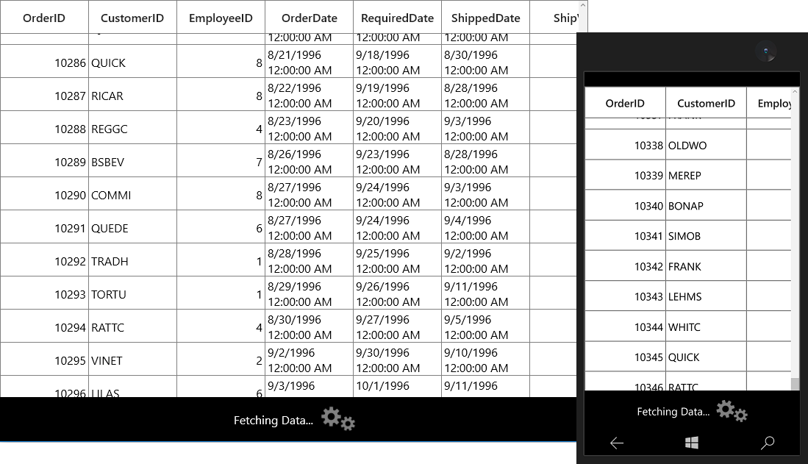

# Data Virtualization

SfDataGrid provides support to handle the large amount of data through built-in virtualization features. With Data virtualization, [SfDataGrid.View](https://help.syncfusion.com/cr/cref_files/uwp/sfdatagrid/frlrfSyncfusionUIXamlGridSfDataGridClassViewTopic.html) process the data in on-demand for better performance while loading large amount of data. Below are the different virtualization concepts available,

<table>
<tr>
<th>
Concept
</th>
<th>
Usage
</th>
</tr>
<tr>
<td>
VirtualizingCollectionView
</td>
<td>
Use to load large amount of data in less time.
</td>
</tr>
<tr>
<td>
Incremental Loading
</td>
<td>
Use to load subset of data from the services or servers in less time while loading and scrolling. On-demand request also supported.
</td>
</tr>
<tr>
<td>
Paging
</td>
<td>
Use to load large amount of data in less time with the help of <code>SfDataPager</code>.
</td>
</tr>
<tr>
<td>
On-demand paging
</td>
<td>
Use to load data in on-demand. You can load data only for current page from server. 
</td>
</tr>
</table>

## VirtualizingCollectionView
 
You can load the large amount of data in less time using [GridVirtualizingCollectionView](https://help.syncfusion.com/cr/cref_files/uwp/sfdatagrid/frlrfSyncfusionUIXamlGridGridVirtualizingCollectionViewClassTopic.html) which is derived from [VirtualizingCollectionView](https://help.syncfusion.com/cr/cref_files/uwp/data/frlrfSyncfusionDataVirtualizingCollectionViewClassTopic.html) to [SfDataGrid.ItemsSource](https://help.syncfusion.com/cr/cref_files/uwp/sfdatagrid/frlrfSyncfusionUIXamlGridSfDataGridClassItemsSourceTopic.html).
 
In the below code, ViewModel defined with `GridVirtualizingCollectionView` by passing complete records collection and bound to SfDataGrid.



public class ViewModel
{
    private GridVirtualizingCollectionView _gridVirtualizingItemsSource;
    public GridVirtualizingCollectionView GridVirtualizingItemsSource
    {
        get { return _gridVirtualizingItemsSource; }
        set { _gridVirtualizingItemsSource = value; }
    }

    public ViewModel()
    {
        var _orders = this.GenerateOrders();                        
        GridVirtualizingItemsSource = new GridVirtualizingCollectionView(_orders);
    }
}


<syncfusion:SfDataGrid x:Name="dataGrid"                               
                       ItemsSource="{Binding GridVirtualizingItemsSource}" />



### Limitations
 
1. Data update using [LiveDataUpdateMode](https://help.syncfusion.com/cr/cref_files/uwp/sfdatagrid/frlrfSyncfusionUIXamlGridSfDataGridClassLiveDataUpdateModeTopic.html) is not supported.

2. Details view is not supported.

3. [AllowFrozenGroupHeaders](https://help.syncfusion.com/cr/cref_files/uwp/sfdatagrid/frlrfSyncfusionUIXamlGridSfDataGridClassAllowFrozenGroupHeadersTopic.html) is not supported.

## Incremental Loading
 
SfDataGrid supports to load the data incrementally using `ISupportIncrementalLoading` interface.

`ISupportIncrementalLoading` interface has `LoadMoreItemsAsync` method which helps to load the data incrementally. [LoadMoreItemsAsync](https://help.syncfusion.com/cr/cref_files/uwp/sfdatagrid/frlrfSyncfusionUIXamlGridIncrementalList%601ClassLoadMoreItemsAsyncTopic.html) called in on-demand while scrolling based on [HasMoreItems](https://help.syncfusion.com/cr/cref_files/uwp/sfdatagrid/frlrfSyncfusionUIXamlGridIncrementalList%601ClassHasMoreItemsTopic.html) property.
If `HasMoreItems` is `false`, SfDataGrid stops calling `LoadMoreItemsAsync`.  

SfDataGrid have [IncrementalList](https://help.syncfusion.com/cr/cref_files/uwp/sfdatagrid/frlrfSyncfusionUIXamlGridIncrementalList%601ClassTopic.html) which is derived from `ISupportIncrementalLoading`. You can use `IncrementalList` or create collection derived from `ISupportIncrementalLoading` and bind it `SfDataGrid.ItemsSource`.

In the below code, `IncrementalList` is initialized by passing Action to its constructor for loading items incrementally.



<Page.DataContext>
    <local:ViewModel />
</Page.DataContext>

<syncfusion:SfDataGrid x:Name="dataGrid" ItemsSource="{Binding IncrementalItemsSource}" />



public class ViewModel
{

    private IncrementalList<OrderInfo> _incrementalItemsSource;

    public IncrementalList<OrderInfo> IncrementalItemsSource
    {
        get { return _incrementalItemsSource; }
        set { _incrementalItemsSource = value; }
    }

    public ViewModel()
    {
        IncrementalItemsSource = new IncrementalList<OrderInfo>(LoadMoreItems) { MaxItemCount = 1000 };          
    }
    
    async Task<IList<OrderInfo>> LoadMoreItems(CancellationToken c, uint count, int baseIndex)
    {
        IList<OrderInfo> list = null;

        await Task.Run(new Action(() =>
        {
            this.GenerateOrders();
            list = _orders.Skip(baseIndex).Take(10).ToList();
        }));

        return list;
    }
}   



You can download the sample from [here](http://www.syncfusion.com/downloads/support/directtrac/general/ze/IncrementalLoading1101987252.zip).

### Displaying animation when fetching data from services

You can display animations when fetching data from service for [LoadMoreItemsAsync](https://help.syncfusion.com/cr/cref_files/uwp/sfdatagrid/frlrfSyncfusionUIXamlGridIncrementalList%601ClassLoadMoreItemsAsyncTopic.html) method call, using [BackgroundWorker](https://msdn.microsoft.com/en-us/library/system.componentmodel.backgroundworker.aspx).
 
In the below code snippet data fetched from service using `BackgroundWorker` and `SfBusyIndicator` displayed over SfDataGrid based on `IsBusy` property in ViewModel, until `BackgroundWorker` completes its action.



<Page.DataContext>
    <local:ViewModel />
</Page.DataContext>
<Page.Resources>
    <local:BoolToVisibilityConverter x:Key="converter" />
</Page.Resources>
<syncfusion:SfDataGrid x:Name="dataGrid" ItemsSource="{Binding IncrementalItemsSource}" />
<Border Height="60"
        VerticalAlignment="Bottom"
        Background="Black"
        BorderBrush="Black"
        BorderThickness="1"
        Opacity="50"
        Visibility="{Binding IsBusy,
                                Mode=TwoWay,
                                Converter={StaticResource converter}}">
    <StackPanel HorizontalAlignment="Center"
                VerticalAlignment="Center"
                Orientation="Horizontal">
        <TextBlock Margin="5"
                    VerticalAlignment="Center"
                    FontSize="16"
                    Foreground="White"
                    Text="Fetching Data..." />
        <indicator:SfBusyIndicator Margin="5"
                                    VerticalAlignment="Center"
                                    AnimationType="Gear"
                                    Foreground="Gray" />
    </StackPanel>
</Border>
<Border Height="60"
        VerticalAlignment="Bottom"
        Background="White"
        BorderBrush="Black"
        BorderThickness="1"
        Opacity="50"
        Visibility="{Binding NoNetwork,
                                Mode=TwoWay,
                                Converter={StaticResource converter}}">
    <StackPanel HorizontalAlignment="Center"
                VerticalAlignment="Center"
                Orientation="Horizontal">
        <TextBlock Margin="5"
                    VerticalAlignment="Center"
                    FontSize="16"
                    Foreground="Red"
                    Text="Internet Connection Not found.." />
    </StackPanel>
</Border>





public class ViewModel : INotifyPropertyChanged
{
    #region Members

    NorthwindEntities northwindEntity;

    #endregion

    #region Properties

    private IncrementalList<Order> incrementalItemsSource;

    public IncrementalList<Order> IncrementalItemsSource
    {
        get { return incrementalItemsSource; }
        set { incrementalItemsSource = value; RaisePropertyChanged("IncrementalItemsSource"); }
    }

    private bool isBusy;

    public bool IsBusy
    {
        get { return isBusy; }
        set { isBusy = value; RaisePropertyChanged("IsBusy"); }
    }

    private bool noNetwork;

    public bool NoNetwork
    {
        get { return noNetwork; }
        set { noNetwork = value; RaisePropertyChanged("NoNetwork"); }
    }

    #endregion

    #region Ctor

    public ViewModel()
    {
        string uri = "http://services.odata.org/Northwind/Northwind.svc/";

        if (IsConnectedToInternet())
        {
            incrementalItemsSource = new IncrementalList<Order>(LoadMoreItems) { MaxItemCount = 10000 };

            northwindEntity = new NorthwindEntities(new Uri(uri));
        }
        else
        {
            NoNetwork = true;
            IsBusy = false;
        }
    }

    #endregion

    #region Methods

    async Task<IList<Order>> LoadMoreItems(CancellationToken c, uint count, int baseIndex)
    {
        IList<Order> list = null;
        IsBusy = true;

        await Task.Run(new Action(() =>
        {
            DataServiceQuery<Order> query = (northwindEntity.Orders as DataServiceQuery<Order>).Expand("Customer");

            query = query.Skip<Order>(baseIndex).Take<Order>(50) as DataServiceQuery<Order>;

            IAsyncResult ar = query.BeginExecute(null, null);

            var items = query.EndExecute(ar);

            list = items.ToList();
        }));

        IsBusy = false;
        return list;
    }

    public static bool IsConnectedToInternet()
    {
        ConnectionProfile connectionProfile = NetworkInformation.GetInternetConnectionProfile();

        return (connectionProfile != null && connectionProfile.GetNetworkConnectivityLevel() == NetworkConnectivityLevel.InternetAccess);
    }

    #endregion

    #region INotifyPropertyChanged Member

    public event PropertyChangedEventHandler PropertyChanged;

    void RaisePropertyChanged(string propertyName)
    {
        if (PropertyChanged != null)
        {
            PropertyChanged(this, new PropertyChangedEventArgs(propertyName));
        }
    }

    #endregion

    public void Dispose()
    {
        if (incrementalItemsSource != null)
            incrementalItemsSource.Clear();
    }
}



You can download the sample from [here](http://www.syncfusion.com/downloads/support/directtrac/general/ze/IncrementalLoading_Service-1432869387.zip).

### LoadMore using ISupportIncrementalLoading

You can fetch the data in some user action instead of scrolling using `IncrementalList.LoadItems` method.

In the below code, data fetched when you click the `Load Items` button.



<Page.DataContext>
    <local:ViewModel />
</Page.DataContext>

Grid x:Name="Root_Grid" Background="{ThemeResource ApplicationPageBackgroundThemeBrush}">

    <Grid.ColumnDefinitions>
        <ColumnDefinition Width="*" />
        <ColumnDefinition Width="50" />
    </Grid.ColumnDefinitions>

    <syncfusion:SfDataGrid x:Name="dataGrid"
                            Grid.Column="0"
                            DataFetchSize="5"
                            ItemsSource="{Binding IncrementalItemsSource}" />

    <Button x:Name="LoadItems"
            Grid.Column="1"
            Command="{Binding DataContext.LoadItems,
                                ElementName=dataGrid}"
            Content="Load Items" />

</Grid>


public class ViewModel : INotifyPropertyChanged
{
    #region Members

    NorthwindEntities northwindEntity;

    #endregion

    #region Properties

    private IncrementalList<Order> incrementalItemsSource;

    public IncrementalList<Order> IncrementalItemsSource
    {
        get { return incrementalItemsSource; }
        set { incrementalItemsSource = value; RaisePropertyChanged("IncrementalItemsSource"); }
    }

    private BaseCommand loadItems;
    public BaseCommand LoadItems
    {
        get
        {
            if (loadItems == null)

                loadItems = new BaseCommand(OnLoadItemsClicked, OnCanLoad);
            return loadItems;
        }
    }

    #endregion

    #region Ctor

    public ViewModel()
    {
        string uri = "http://services.odata.org/Northwind/Northwind.svc/";

        incrementalItemsSource = new IncrementalList<Order>(LoadMoreItems) { MaxItemCount = 20};

        northwindEntity = new NorthwindEntities(new Uri(uri));           
    }

    #endregion

    #region Methods

    async Task<IList<Order>> LoadMoreItems(CancellationToken c, uint count, int baseIndex)
    {
        IList<Order> list = null;

        await Task.Run(new Action(() =>
        {
            DataServiceQuery<Order> query = (northwindEntity.Orders as DataServiceQuery<Order>).Expand("Customer");

            query = query.Skip<Order>(baseIndex).Take<Order>((int)count) as DataServiceQuery<Order>;

            IAsyncResult ar = query.BeginExecute(null, null);

            var items = query.EndExecute(ar);

            list = items.ToList();
                
        }));
       

        return list;
    }

    private static bool OnCanLoad(object obj)
    {
        return true;
    }

    private  void OnLoadItemsClicked(object obj)
    {
        LoadMoreItems(CancellationToken.None, 10, incrementalItemsSource.Count);
        incrementalItemsSource.LoadMoreItemsAsync(10);
    }
    #endregion

    #region INotifyPropertyChanged Member

    public event PropertyChangedEventHandler PropertyChanged;

    void RaisePropertyChanged(string propertyName)
    {
        if (PropertyChanged != null)
        {
            PropertyChanged(this, new PropertyChangedEventArgs(propertyName));
        }
    }

    #endregion

    public void Dispose()
    {
        if (incrementalItemsSource != null)
            incrementalItemsSource.Clear();
    }
}



You can download the sample from [here](http://www.syncfusion.com/downloads/support/directtrac/general/ze/IncrementalLoading_LoadMoreItems-925087250.zip).

## Paging

SfDataGrid supports to load paged data source using `SfDataPager`. You can use the paging in SfDataGrid by go through the **Paging** section.