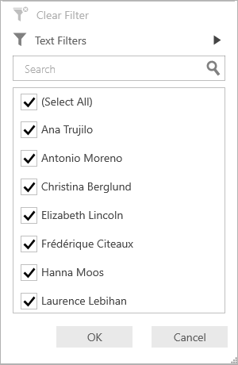

## Programmatic filtering  

SfDataGrid allows you to filter the data programmatically in below ways

* Through View Predicate
* Through Column Filter

### View Filtering

View filtering can be achieved by setting [SfDataGrid.View.Filter](https://help.syncfusion.com/cr/cref_files/uwp/data/frlrfSyncfusionDataCollectionViewAdvClassFilterTopic.html) delegate. You can refresh the view by calling [SfDataGrid.View.RefreshFilter](https://help.syncfusion.com/cr/cref_files/uwp/data/frlrfSyncfusionDataCollectionViewAdvClassRefreshFilterTopic.html) method.

Here, FilterRecords delegate filters the data based on Country name. FilterRecords delegate is assigned to [SfDataGrid.View.Filter](https://help.syncfusion.com/cr/cref_files/uwp/data/frlrfSyncfusionDataCollectionViewAdvClassFilterTopic.html) predicate to filter Country column. After that, [SfDataGrid.View.RefreshFilter](https://help.syncfusion.com/cr/cref_files/uwp/data/frlrfSyncfusionDataCollectionViewAdvClassRefreshFilterTopic.html) method is called to refresh the records. If the record satisfies the filter conditions, `true` will be returned. Else `false` is returned. 



public bool FilterRecords(object o)
{
   string filterText = "Germany";
   var item = o as OrderInfo;
   if (item != null)
   {
      if (item.Country.Equals(filterText))
          return true;
   }
   return false;
}

private void Button_Click(object sender, RoutedEventArgs e)
{
    dataGrid.View.Filter = FilterRecords;
    dataGrid.View.RefreshFilter();
}        



### Column Filtering

Column filtering is achieved by using [GridColumn.FilterPredicates](https://help.syncfusion.com/cr/cref_files/uwp/sfdatagrid/frlrfSyncfusionUIXamlGridGridColumnClassFilterPredicatesTopic.html) property and adding [FilterPredicate](https://help.syncfusion.com/cr/cref_files/uwp/data/frlrfSyncfusionDataFilterPredicateClassTopic.html) to it. 

Here, OrderID column is filtered for the data which has OrderID as 1005.



dataGrid.Columns["OrderID"].FilterPredicates.Add(new FilterPredicate() { FilterType = FilterType.Equals, FilterValue = "1005" });



#### Filter Behavior

* StringTyped - Records are filtered without considering the type and it takes [FilterValue](https://help.syncfusion.com/cr/cref_files/uwp/data/frlrfSyncfusionDataFilterPredicateClassFilterValueTopic.html) type as string.
* StronglyTyped - Records are filtered by considering the `FilterValue` underlying type.

### Clear Filtering

SfDataGrid allows you to clear the filters by clearing the filter predicates. This is achieved by invoking the following methods.

* [SfDataGrid.ClearFilters](https://help.syncfusion.com/cr/cref_files/uwp/sfdatagrid/frlrfSyncfusionUIXamlGridSfDataGridClassClearFiltersTopic.html) - Clears filters for all the columns programmatically.
* [SfDataGrid.ClearFilter(String columnName)](https://help.syncfusion.com/cr/cref_files/uwp/sfdatagrid/index.html#frlrfSyncfusionUIXamlGridSfDataGridClassClearFilterTopic.html) - Clears the filter for particular column that has the columnName as `MappingName`.
* [SfDataGrid.ClearFilter(GridColumn column)](https://help.syncfusion.com/cr/cref_files/uwp/sfdatagrid/index.html#frlrfSyncfusionUIXamlGridSfDataGridClassClearFilterTopic2.html) - Clears the filter for particular column alone.



this.dataGrid.ClearFilters();
this.dataGrid.ClearFilter("OrderID");
this.dataGrid.ClearFilter(this.dataGrid.Columns[0]);



## UI Filtering

SfDataGrid provides excel like filtering UI and also advanced filter UI to filter the data easily. UI filtering can be enabled by setting [SfDataGrid.AllowFiltering](https://help.syncfusion.com/cr/cref_files/uwp/sfdatagrid/frlrfSyncfusionUIXamlGridSfDataGridClassAllowFilteringTopic.html) property to `true`, where you can open filter UI by clicking the Filter icon in column header and filter the records.  



<syncfusion:SfDataGrid x:Name="dataGrid"
                       AllowFiltering="True"
                       AutoGenerateColumns="True"
                       ItemsSource="{Binding Orders}" />


dataGrid.AllowFiltering = true;



You can enable/disable filtering for particular column by setting [GridColumn.AllowFiltering](https://help.syncfusion.com/cr/cref_files/uwp/sfdatagrid/frlrfSyncfusionUIXamlGridGridColumnClassAllowFilteringTopic.html) property.



<syncfusion:GridTextColumn AllowFiltering="True" MappingName="OrderID" />


dataGrid.Columns["OrderID"].AllowFiltering = true;



N>
1. [GridColumn.AllowFiltering](https://help.syncfusion.com/cr/cref_files/uwp/sfdatagrid/frlrfSyncfusionUIXamlGridGridColumnClassAllowFilteringTopic.html) has higher priority than [SfDataGrid.AllowFiltering](https://help.syncfusion.com/cr/cref_files/uwp/sfdatagrid/frlrfSyncfusionUIXamlGridSfDataGridClassAllowFilteringTopic.html) property.
2.  UI filtering is not supported when using on-demand paging by setting `UseOnDemandPaging` to `true`.

#### Built-in UI Views

SfDataGrid filter UI comprises of two different UIs. 

* **Checkbox Filter UI** - Provides excel like filter interface with list of check box’s.

* **Advanced Filter UI** - Provides advanced filter options to filter the data.

By default, both Checkbox Filter and Advanced Filter are loaded while opening the filter pop-up. You can switch between AdvancedFilter and CheckboxFilter by using AdvancedFilter button in the UI View.

#### SfDataGrid with Checkbox Filter View
	

#### SfDataGrid with Advanced Filter View

## Choose between built-in UI Views

SfDataGrid lets you to customize the UI Views displayed for particular column or grid using [FilterMode](https://help.syncfusion.com/cr/cref_files/uwp/sfdatagrid/frlrfSyncfusionUIXamlGridGridFilterControlClassFilterModeTopic.html) property in [GridFilterControl](https://help.syncfusion.com/cr/cref_files/uwp/sfdatagrid/frlrfSyncfusionUIXamlGridGridFilterControlClassTopic.html).
 
Below are the options,

1. CheckboxFilter – Displays only Checkbox filter View.
2. AdvancedFilter – Displays only Advanced filter View.
3. Both – Displays both filters Views.

### Changing filter UI View for Grid

Filter UI view can be changed for all the columns in grid by changing `FilterMode` in `GridFilterControl` by writing style and assign it to [SfDataGrid.FilterPopupStyle](https://help.syncfusion.com/cr/cref_files/uwp/sfdatagrid/frlrfSyncfusionUIXamlGridSfDataGridClassFilterPopupStyleTopic.html).




<syncfusion:SfDataGrid x:Name="dataGrid"
                       AllowFiltering="True"
                       AutoGenerateColumns="True"
                       FilterPopupStyle="{StaticResource filterControlStyle}"
                       ItemsSource="{Binding Orders}"/>




### Changing filter UI View for columns

Filter UI view can be changed for the particular column by changing `FilterMode` in `GridFilterControl` by writing style and assign it to [SfDataGrid.FilterPopupStyle](https://help.syncfusion.com/cr/cref_files/uwp/sfdatagrid/frlrfSyncfusionUIXamlGridSfDataGridClassFilterPopupStyleTopic.html).




<syncfusion:GridTextColumn MappingName="OrderID"
                           FilterPopupStyle="{StaticResource filterControlStyle}"  />



### Changing filter UI View programmatically

You can change `FilterMode` programmatically by using `FilterItemsPopulating` event.



this.dataGrid.FilterItemsPopulating += dataGrid_FilterItemsPopulating;

void dataGrid_FilterItemsPopulating(object sender, Syncfusion.UI.Xaml.Grid.GridFilterItemsPopulatingEventArgs e)
{
     if (e.Column.MappingName == "OrderID")
           e.FilterControl.FilterMode = FilterMode.AdvancedFilter;
}



### Setting Default Filter popup style for particular column

You can skip the `GridFilterControl` styling for particular column from [SfDataGrid.FilterPopupStyle](https://help.syncfusion.com/cr/cref_files/uwp/sfdatagrid/frlrfSyncfusionUIXamlGridSfDataGridClassFilterPopupStyleTopic.html) by setting [GridColumn.FilterPopupStyle](https://help.syncfusion.com/cr/cref_files/uwp/sfdatagrid/frlrfSyncfusionUIXamlGridGridColumnClassFilterPopupStyleTopic.html) to `null`.
 


<Window.Resources>
    
</Window.Resources>
 
<syncfusion:SfDataGrid x:Name="dataGrid"
                       AllowFiltering="True"
                       FilterPopupStyle="{StaticResource filterControlStyle}"
                       ItemsSource="{Binding OrderList}">
                       
    <syncfusion:SfDataGrid.Columns>
      <syncfusion:GridTextColumn FilterPopupStyle="{x:Null}" MappingName="OrderID" />          
    </syncfusion:SfDataGrid.Columns>
    
</syncfusion:SfDataGrid>


this.dataGrid.Columns["OrderID"].FilterPopupStyle = null;



Here, advanced filter will be loaded for all the columns in grid except OrderID column since [GridColumn.FilterPopupStyle](https://help.syncfusion.com/cr/cref_files/uwp/sfdatagrid/frlrfSyncfusionUIXamlGridGridColumnClassFilterPopupStyleTopic.html) is set as `null` for OrderID column. So both checkbox filter and advanced filter (default style) will be loaded for OrderID column.

## Advanced Filter UI

Advanced filter UI provides multiple filter options to filter the data easily. Filter menu options are loaded based on Advanced filter type by automatically detecting the underlying date type. 

Below are the built-in filter types supported.
 
* Text Filters – Loads various menu options to filter the display text effectively.
* Number Filters – Loads various menu options to filter the numeric data.
* Date Filters – Loads various menu options and [DatePicker](https://msdn.microsoft.com/library/windows/apps/windows.ui.xaml.controls.datepicker.aspx) to filter DateTime type column.

<table>
<tr>
<th>
Text Filters
</th>
<th>
Number Filters
</th>
<th>
Date Filters
</th>
</tr>
<tr>
<td>
When the string value is bounded to the [GridColumn](https://help.syncfusion.com/cr/cref_files/uwp/sfdatagrid/frlrfSyncfusionUIXamlGridGridColumnClassTopic.html) or the items source is {{'[dynamic](https://msdn.microsoft.com/en-us/library/dd264741.aspx)'| markdownify }}, then TextFilters are loaded in [AdvancedFilterControl](https://help.syncfusion.com/cr/cref_files/uwp/sfdatagrid/frlrfSyncfusionUIXamlGridAdvancedFilterControlClassTopic.html). 
</td>
<td>
When integer, double, short, decimal, byte or long are bound to the [GridColumn](https://help.syncfusion.com/cr/cref_files/uwp/sfdatagrid/frlrfSyncfusionUIXamlGridGridColumnClassTopic.html) then Number Filters are loaded in [AdvancedFilterControl](https://help.syncfusion.com/cr/cref_files/uwp/sfdatagrid/frlrfSyncfusionUIXamlGridAdvancedFilterControlClassTopic.html).
</td>
<td>
When the `DateTime` type value is bound to the [GridColumn](https://help.syncfusion.com/cr/cref_files/uwp/sfdatagrid/frlrfSyncfusionUIXamlGridGridColumnClassTopic.html), then Date Filters are loaded in [AdvancedFilterControl](https://help.syncfusion.com/cr/cref_files/uwp/sfdatagrid/frlrfSyncfusionUIXamlGridAdvancedFilterControlClassTopic.html).
</td>
</tr>
<tr>
<td>

</td>
<td>

</td>
<td>

</td>
</tr>
<tr>
<td>
<b>Filter menu options</b>
<ol>
<li>Equals</li>
<li>Does Not Equal</li>
<li>Empty</li> 
<li>Not Empty</li>
<li>Null</li> 
<li>Not Null</li> 
</ol>
</td>
<td>
<b>Filter menu options</b>
<ol>
<li>Equals</li>
<li>Does Not Equal</li>
<li>Null</li>
<li>Not Null</li>
<li>Less Than</li>
<li>Less Than or Equal</li>
<li>Greater Than</li>
<li>Greater Than or Equal</li>
</ol>
</td>
<td>
<b>Filter menu options</b>
<ol>
<li>Equals</li>
<li>Does Not Equal</li>
<li>Before</li>
<li>Before Or Equal</li>
<li>After</li>
<li>After Or Equal</li>
<li>Null</li>
<li>Not Null</li>
</ol>
</td>
</tr>
</table>

N> 
1. Null and Not Null options are available only when [AllowBlankFilters](https://help.syncfusion.com/cr/cref_files/uwp/sfdatagrid/frlrfSyncfusionUIXamlGridGridColumnClassAllowBlankFiltersTopic.html) is set to ‘True’.
2. If the column is [GridUnboundColumn](https://help.syncfusion.com/cr/cref_files/uwp/sfdatagrid/frlrfSyncfusionUIXamlGridGridUnBoundColumnClassTopic.html) or `GridMaskColumn`, then Text Filters will be loaded.

### Changing Advanced Filter type

[FilterBehavior](https://help.syncfusion.com/cr/cref_files/uwp/sfdatagrid/frlrfSyncfusionUIXamlGridGridColumnClassFilterBehaviorTopic.html) determines the Advanced filter type loaded in [GridFilterControl](https://help.syncfusion.com/cr/cref_files/uwp/sfdatagrid/frlrfSyncfusionUIXamlGridGridFilterControlClassTopic.html). By using `FilterBehavior`, you can change Advanced filter type.

* **StringTyped** - TextFilters will be loaded in [AdvancedFilterControl](https://help.syncfusion.com/cr/cref_files/uwp/sfdatagrid/frlrfSyncfusionUIXamlGridAdvancedFilterControlClassTopic.html). 
* **Strongly Typed** – Advanced filter type is automatically detected based on underlying data type.



<syncfusion:SfDataGrid.Columns>
<syncfusion:GridTextColumn MappingName="OrderID" FilterBehavior="StringTyped"/>
</syncfusion:SfDataGrid.Columns>


dataGrid.Columns["OrderID"].FilterBehavior = FilterBehavior.StringTyped;



Advanced filter type can be changed programmatically by using [FilterItemsPopulating](https://help.syncfusion.com/cr/cref_files/uwp/sfdatagrid/frlrfSyncfusionUIXamlGridSfDataGridClassFilterItemsPopulatingTopic.html) event also.
 


this.dataGrid.FilterItemsPopulating += dataGrid_FilterItemsPopulating;

void dataGrid_FilterItemsPopulating(object sender, Syncfusion.UI.Xaml.Grid.GridFilterItemsPopulatingEventArgs e)
{
    if (e.Column.MappingName != "OrderID")
        return;
     e.FilterControl.AdvancedFilterType = AdvancedFilterType.TextFilter;
     e.FilterControl.SetColumnDataType(typeof(string));
     e.FilterControl.AscendingSortString = GridResourceWrapper.SortStringAscending;
     e.FilterControl.DescendingSortString = GridResourceWrapper.SortStringDescending;
}



### Case Sensitive

By default, casing is not considered while filtering. Because, filter predicates will be created with [IsCaseSensitive](https://help.syncfusion.com/cr/cref_files/uwp/data/frlrfSyncfusionDataFilterPredicateClassIsCaseSensitiveTopic.html) as `false`. If you want to filter the records with `IsCaseSensitive` as `true`, you need to click case sensitive button present in Advanced Filter.

## Performance tips

`GridFilterControl’s` loading performance can be increased by setting `FilterMode` as `AdvancedFilter` and [CanGenerateUniqueItems](https://help.syncfusion.com/cr/cref_files/uwp/sfdatagrid/frlrfSyncfusionUIXamlGridAdvancedFilterControlClassCanGenerateUniqueItemsTopic.html) as `False`. Because a textbox is loaded instead of AdvancedFilter ComboBox that allows you to manually enter text for filtering.




<syncfusion:SfDataGrid x:Name="dataGrid"
                       AllowFiltering="True"
                       AutoGenerateColumns="True"
                       FilterPopupStyle="{StaticResource filterControlStyle}"
                       ItemsSource="{Binding Orders}"/>




By default, [CanGenerateUniqueItems](https://help.syncfusion.com/cr/cref_files/uwp/sfdatagrid/frlrfSyncfusionUIXamlGridAdvancedFilterControlClassCanGenerateUniqueItemsTopic.html) is `true`. So all the unique items in the column are loaded in the AdvancedFilter ComboBox that allows you to select the value easily from the combo box and filter it.

## Filtering null values

To filter the null values, you need to set [AllowBlankFilters](https://help.syncfusion.com/cr/cref_files/uwp/sfdatagrid/frlrfSyncfusionUIXamlGridGridColumnClassAllowBlankFiltersTopic.html) property as `True`. So null values will be included in filter items list.  If you want to exclude the null values from filter items list, you need to set [AllowBlankFilters](https://help.syncfusion.com/cr/cref_files/uwp/sfdatagrid/frlrfSyncfusionUIXamlGridGridColumnClassAllowBlankFiltersTopic.html) as `False`.



<syncfusion:GridTextColumn AllowBlankFilters="False" MappingName="Country" />


dataGrid.Columns["Country"].AllowBlankFilters = false;



#### Checkbox Filter with AllowBlankFilters as True

#### Advanced Filter with AllowBlankFilters as True

## Instant Filtering

By default, filters are applied to the columns when OK button is clicked in UI filtering. If you want to update the filters immediately whenever update in filter popup, you need to set [ImmediateUpdateColumnFilter](https://help.syncfusion.com/cr/cref_files/uwp/sfdatagrid/frlrfSyncfusionUIXamlGridGridColumnClassImmediateUpdateColumnFilterTopic.html) as `True`.



<syncfusion:GridTextColumn ImmediateUpdateColumnFilter="True" MappingName="OrderID" />


dataGrid.Columns["OrderID"].ImmediateUpdateColumnFilter = true;



Here, the OK and Cancel buttons are unavailable and Done button is available to just close the popup.

#### Checkbox Filter with ImmediateUpdateColumnFilter is True

#### Advanced Filter with ImmediateUpdateColumnFilter is True

N> In Checkbox Filter, the `SelectAll` option is not reflected in the filter updates if `ImmediateUpdateColumnFilter` is `true`.

## Filtering based on DisplayText

In UI filtering, records are filtered based on actual value by default. If you want to filter the records based on DisplayText, you need to set [ColumnFilter](https://help.syncfusion.com/cr/cref_files/uwp/sfdatagrid/frlrfSyncfusionUIXamlGridGridColumnClassColumnFilterTopic.html) property as `DisplayText`.
 


<syncfusion:GridDateTimeColumn MappingName="OrderDate"  ColumnFilter="DisplayText"/>


dataGrid.Columns["OrderDate"].ColumnFilter = ColumnFilter.DisplayText;



Consider in the following DataGrid, first and second records have same display value for OrderDate column but both have different actual value (E.g. 2/10/2010 12:00:00 AM and 2/10/2010 6:30:00 PM).

By default, based on the actual value only filter will be applied. So it will consider both values as different. And while opening filter popup, both values will be displayed like below.

If you set `ColumnFilter` as `DisplayText`, display value only will be considered for filtering. So filter popup will be shown like below.

After filtering, both records having the same OrderDate display value will be displayed in view.

## Events 

SfDataGrid provides the following events for filtering.

### FilterChanging event

[FilterChanging](https://help.syncfusion.com/cr/cref_files/uwp/sfdatagrid/frlrfSyncfusionUIXamlGridSfDataGridClassFilterChangingTopic.html) event is raised while applying filters to a particular column. You can use this event to change the [FilterPredicates](https://help.syncfusion.com/cr/cref_files/uwp/sfdatagrid/frlrfSyncfusionUIXamlGridGridFilterEventArgsClassFilterPredicatesTopic.html), [FilterType](https://help.syncfusion.com/cr/cref_files/uwp/data/frlrfSyncfusionDataFilterPredicateClassFilterTypeTopic.html) and [FilterBehavior](https://help.syncfusion.com/cr/cref_files/uwp/data/frlrfSyncfusionDataFilterPredicateClassFilterBehaviorTopic.html).



this.dataGrid.FilterChanging += dataGrid_FilterChanging;

void dataGrid_FilterChanging(object sender, GridFilterEventArgs e)
{
}



### FilterChanged event

[FilterChanged](https://help.syncfusion.com/cr/cref_files/uwp/sfdatagrid/frlrfSyncfusionUIXamlGridSfDataGridClassFilterChangedTopic.html) event is raised after filter is applied. You can use this event to get filtered records.



this.dataGrid.FilterChanged += dataGrid_FilterChanged;

void dataGrid_FilterChanged(object sender, GridFilterEventArgs e)
{
}



### FilterItemsPopulating event

[FilterItemsPopulating](https://help.syncfusion.com/cr/cref_files/uwp/sfdatagrid/frlrfSyncfusionUIXamlGridSfDataGridClassFilterItemsPopulatingTopic.html) event is raised while populating the filter list items in [GridFilterControl](https://help.syncfusion.com/cr/cref_files/uwp/sfdatagrid/frlrfSyncfusionUIXamlGridGridFilterControlClassTopic.html). You can change GridFilterControl properties by using this event.



this.dataGrid.FilterItemsPopulating += dataGrid_FilterItemsPopulating;

void dataGrid_FilterItemsPopulating(object sender,                                             Syncfusion.UI.Xaml.Grid.GridFilterItemsPopulatingEventArgs e)
{
}



### FilterItemsPopulated event

[FilterItemsPopulated](https://help.syncfusion.com/cr/cref_files/uwp/sfdatagrid/frlrfSyncfusionUIXamlGridSfDataGridClassFilterItemsPopulatedTopic.html) event is raised after filter list items are populated. You can change GridFilterControl [ItemsSource](https://help.syncfusion.com/cr/cref_files/uwp/sfdatagrid/frlrfSyncfusionUIXamlGridGridFilterItemsPopulatingEventArgsClassItemsSourceTopic.html) by using this event.



this.dataGrid.FilterItemsPopulated += dataGrid_FilterItemsPopulated;

void dataGrid_FilterItemsPopulated(object sender, GridFilterItemsPopulatedEventArgs e)
{
}



## Getting the filtered records

You can get the filtered records from [View](https://help.syncfusion.com/cr/cref_files/uwp/sfdatagrid/frlrfSyncfusionUIXamlGridSfDataGridClassViewTopic.html) in [FilterChanged](https://help.syncfusion.com/cr/cref_files/uwp/sfdatagrid/frlrfSyncfusionUIXamlGridSfDataGridClassFilterChangedTopic.html) event. When filter is applied, the filtered records are available in [View.Records](https://help.syncfusion.com/cr/cref_files/uwp/data/frlrfSyncfusionDataCollectionViewAdvClassRecordsTopic.html).
 


this.dataGrid.FilterChanged += dataGrid_FilterChanged;
void dataGrid_FilterChanged(object sender, GridFilterEventArgs e)
{
    //OrderInfo is Model Class 
    ObservableCollection<OrderInfo> order = new ObservableCollection<OrderInfo>();

    // Get filtered records
    var records = (sender as SfDataGrid).View.Records;

    foreach (RecordEntry record in records)
        order.Add(record.Data as OrderInfo);
}



## Show image in CheckBoxFilterControl instead of image path

By default, in SfDataGrid image path is shown inside the CheckBoxFilterControl instead of image but you can show the image in CheckBoxFilterControl by setting [CheckBoxFilterControl.ItemTemplate](https://help.syncfusion.com/cr/cref_files/wpf/sfdatagrid/Syncfusion.SfGrid.WPF~Syncfusion.UI.Xaml.Grid.CheckboxFilterControl~ItemTemplate.html) as like below. 



<syncfusion:GridTextColumn AllowEditing="False" HeaderText="Country" MappingName="ImageLink">
                    <syncfusion:GridTextColumn.FilterPopupStyle>
                        
                                </Setter.Value>
                            </Setter>
                        </Style>
                    </syncfusion:GridTextColumn.FilterPopupStyle>
                    <syncfusion:GridTextColumn.CellTemplate>
                        <DataTemplate>
                            <Grid>
                                <Image Source="{Binding Path=ImageLink,Converter={StaticResource stringToImageConverter}}"/>
                            </Grid>
                        </DataTemplate>
                    </syncfusion:GridTextColumn.CellTemplate>
</syncfusion:GridTextColumn>


public class StringToImageConverter : IValueConverter
{
    public object Convert(object value, Type targetType, object parameter, string language)
    {
        string imagename = value as string;
        return new BitmapImage(new Uri(@"ms-appx:/Images/"+imagename, UriKind.Absolute));
    }      

    public object ConvertBack(object value, Type targetType, object parameter, string language)
    {
        return null;
    }     
}



You can get the sample from [here](http://www.syncfusion.com/downloads/support/directtrac/general/ze/SfDatagridDemo82863041).

## Functionality Customization

### Loading the Text Filters for the column having Number or Date value as underlying type

If you want to use the Text Filters for the column that has number or date value as underlying type, you need to set [FilterBehavior](https://help.syncfusion.com/cr/cref_files/uwp/data/frlrfSyncfusionDataFilterPredicateClassFilterValueTopic.html) property of the `GridColumn` as `StringTyped`. This loads the `TextFilter` instead of Number or Date Filters.



<syncfusion:GridNumericColumn MappingName="OrderID" FilterBehavior="StringTyped"/>



You can achieve this programmatically by using `FilterItemsPopulating` event also.
 


this.dataGrid.FilterItemsPopulating += dataGrid_FilterItemsPopulating;

void dataGrid_FilterItemsPopulating(object sender, GridFilterItemsPopulatingEventArgs e)
{
    if (e.Column.MappingName == "OrderID")
        e.FilterControl.AdvancedFilterType = AdvancedFilterType.TextFilter;

    e.FilterControl.SetColumnDataType(typeof(string));

    e.FilterControl.AscendingSortString = GridResourceWrapper.SortStringAscending;

    e.FilterControl.DescendingSortString = GridResourceWrapper.SortStringDescending;
}



### Changing AdvancedFilter type while loading dynamic ItemsSource  

By default, TextFilters will be loaded for the columns if ItemsSource is [dynamic](https://msdn.microsoft.com/en-us/library/dd264741.aspx).  If you want to load `NumberFilter` or `DateFilter` based on column values, you need to use `ColumnMemberType` property.



this.dataGrid.Columns["OrderID"].ColumnMemberType = typeof(double?);



You can achieve this by using `FilterItemsPopulating` event also. But in this case, nullable values will not be filtered in advanced filtering. So you need to set [ColumnMemberType](https://help.syncfusion.com/cr/cref_files/uwp/sfdatagrid/frlrfSyncfusionUIXamlGridGridColumnClassColumnMemberTypeTopic.html).

### Customizing Excel like Filter ItemsSource

When you want to restrict some data from filtering, you need to customize the `GridFilterControl` ItemsSource by using [FilterItemsPopulated](https://help.syncfusion.com/cr/cref_files/uwp/sfdatagrid/frlrfSyncfusionUIXamlGridSfDataGridClassFilterItemsPopulatedTopic.html) event. Here, [FilterElement](https://help.syncfusion.com/cr/cref_files/uwp/sfdatagrid/frlrfSyncfusionUIXamlGridFilterElementClassTopic.html) which has ActualValue as 1005 is removed from ItemsSource.



this.dataGrid.FilterItemsPopulated += dataGrid_FilterItemsPopulated;

void dataGrid_FilterItemsPopulated(object sender, GridFilterItemsPopulatedEventArgs e)
{
     if (e.Column.MappingName == "OrderID")
     {
         var itemsSource = e.ItemsSource as List<FilterElement>;
         
         //Get the FilterElement to remove from ItemsSource.
         var filterElement = itemsSource.FirstOrDefault(items => items.ActualValue.Equals(1005));
         
         //Remove the FilterElement from ItemsSource.
         itemsSource.Remove(filterElement);               
     }
}



Likewise, `FilterElement` also can be changed.

### Customizing Filter predicates

If you want to customize the filter predicates, you need to use [FilterChanging](https://help.syncfusion.com/cr/cref_files/uwp/sfdatagrid/frlrfSyncfusionUIXamlGridSfDataGridClassFilterChangingTopic.html) event. Here, [FilterValue](https://help.syncfusion.com/cr/cref_files/uwp/data/frlrfSyncfusionDataFilterPredicateClassFilterValueTopic.html) is changed according to some conditions.



this.dataGrid.FilterChanging += dataGrid_FilterChanging;

void dataGrid_FilterChanging(object sender, GridFilterEventArgs e)
{
    if (e.FilterPredicates == null || e.Column.MappingName != "CustomerID" || e.FilterPredicates.Count == 0)
        return;

    if (e.FilterPredicates[0].FilterValue.Equals("ALFKI"))
        e.FilterPredicates[0].FilterValue = "ANATR";

}



## Appearance customization

[GridFilterControl](https://help.syncfusion.com/cr/cref_files/uwp/sfdatagrid/frlrfSyncfusionUIXamlGridGridFilterControlClassTopic.html) is derived from ContentControl and has its own structure. This structure is customized using the properties [SfDataGrid.FilterPopupStyle](https://help.syncfusion.com/cr/cref_files/uwp/sfdatagrid/frlrfSyncfusionUIXamlGridSfDataGridClassFilterPopupStyleTopic.html) and [SfDataGrid.FilterPopupTemplate](https://help.syncfusion.com/cr/cref_files/uwp/sfdatagrid/frlrfSyncfusionUIXamlGridSfDataGridClassFilterPopupTemplateTopic.html) for all the columns in grid.

When you need to change the appearance of the GridFilterControl for a particular column, [GridColumn.FilterPopupStyle](https://help.syncfusion.com/cr/cref_files/uwp/sfdatagrid/frlrfSyncfusionUIXamlGridGridColumnClassFilterPopupStyleTopic.html) and [GridColumn.FilterPopupTemplate](https://help.syncfusion.com/cr/cref_files/uwp/sfdatagrid/frlrfSyncfusionUIXamlGridGridColumnClassFilterPopupTemplateTopic.html) properties are used. 

### Collapsing Sort Options in GridFilterControl

Sort Options can be collapsed by setting [SortOptionVisibility](https://help.syncfusion.com/cr/cref_files/uwp/sfdatagrid/frlrfSyncfusionUIXamlGridGridFilterControlClassSortOptionVisibilityTopic.html) property in `GridFilterControl`.




<syncfusion:SfDataGrid x:Name="dataGrid"
                      AllowFiltering="True"
                      AutoGenerateColumns="True"
                      FilterPopupStyle="{StaticResource  gridFilterControlStyle}"
                      ItemsSource="{Binding Orders}"/>



### Customizing Sort Options text

Sort Options text can be customized by using [AscendingSortString](https://help.syncfusion.com/cr/cref_files/uwp/sfdatagrid/frlrfSyncfusionUIXamlGridGridFilterControlClassAscendingSortStringTopic.html) and [DescendingSortString](https://help.syncfusion.com/cr/cref_files/uwp/sfdatagrid/frlrfSyncfusionUIXamlGridGridFilterControlClassDescendingSortStringTopic.html) properties in `GridFilterControl`.



this.dataGrid.FilterItemsPopulating += DataGrid_FilterItemsPopulating;

void DataGrid_FilterItemsPopulating(object sender, GridFilterItemsPopulatingEventArgs e)
{
    if(e.Column.MappingName=="CustomerName")
    {
        e.FilterControl.AscendingSortString = "Sort Ascending";
        e.FilterControl.DescendingSortString = "Sort Descending";
    }           
}



### Customize the FilterPopup size using GridFilterControl style

You can customize the FilterPopup size using [FilterPopupHeight](https://help.syncfusion.com/cr/cref_files/wpf/sfdatagrid/Syncfusion.SfGrid.WPF~Syncfusion.UI.Xaml.Grid.GridFilterControl~FilterPopupHeight.html) property by writing style of TargetType as GridFilterControl.



<Window.Resources>
        
</Window.Resources>



### Changing filter icon style after applying filters

You can change the filter icon style by editing the [FilterToggleButton](https://help.syncfusion.com/cr/cref_files/uwp/sfdatagrid/frlrfSyncfusionUIXamlGridFilterToggleButtonClassTopic.html) style. In FilterToggleButton style, you can see Filtered and UnFiltered VisualStates. In that, you can change `PathFillColor` for `FilterToggleButton`.
 






When you apply above style to [FilterToggleButton](https://help.syncfusion.com/cr/cref_files/uwp/sfdatagrid/frlrfSyncfusionUIXamlGridFilterToggleButtonClassTopic.html), FilterIcon changes from Default to Gray and to Red when filtering is applied. When you clear it, it changes from Red to Gray and to default style.
