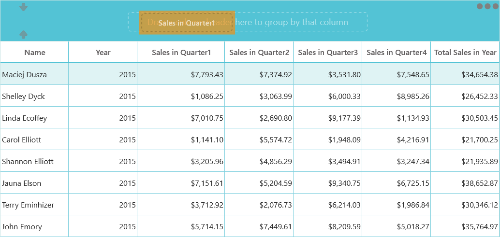

# InteractiveFeatures

## RowHeader

RowHeader is a special type of column used to indicate the currently focused row, editing status, and validation status. You can enable the RowHeader by setting [SfDataGrid.ShowRowHeader](https://help.syncfusion.com/cr/cref_files/uwp/Syncfusion.SfGrid.UWP~Syncfusion.UI.Xaml.Grid.SfGridBase~ShowRowHeader.html) property to true. 




<syncfusion:SfDataGrid x:Name="dataGrid"
                       ShowRowHeader="True"
                       ItemsSource="{Binding Orders}"  />





dataGrid.ShowRowHeader = true;




You can change the default width of the RowHeader by using [SfDataGrid.RowHeaderWidth](https://help.syncfusion.com/cr/cref_files/uwp/Syncfusion.SfGrid.UWP~Syncfusion.UI.Xaml.Grid.SfGridBase~RowHeaderWidth.html) property.




<syncfusion:SfDataGrid x:Name="dataGrid"
                       ShowRowHeader="True"
                       RowHeaderWidth="50"
                       ItemsSource="{Binding Orders}"  />




dataGrid.RowHeaderWidth = 50;




### Customizing RowHeader 

#### Display the RowIndex to the RowHeaderCell

You can display the corresponding row index in each RowHeader, by customizing the ControlTemplate of GridRowHeaderCell. You have to bind the RowIndex property to TextBlock.Text like the below code example.







You can get the sample from [here](http://www.syncfusion.com/downloads/support/directtrac/general/ze/DisplayRowIndex1237508699.zip).

#### Change the CurrentRow Indicator

You can change the CurrentRowIndicator in the RowHeader by customizing the control template of GridRowHeaderCell.







You can get the sample from [here](http://www.syncfusion.com/downloads/support/directtrac/general/ze/ChangingCurrentRowIndicator(1)970786330.zip).

## Touch Support

### ColumnResizing with the Touch

SfDataGrid allows you to re-size the columns in touch by press and hold the column header. You can enable resizing in SfDataGrid by setting AllowResizingColumns as True.




<syncfusion:SfDataGrid   x:Name="dataGrid" 
                         AllowResizingColumns="True" 
                         ShowGroupDropArea="True"
                         AllowGrouping="True"
                         AutoGenerateColumns="True"
                         ItemsSource="{Binding Orders}" >





this.dataGrid.AllowResizingColumns = true;




You can also resize the hidden column through the touch by setting the AllowResizingHiddenColumns by True. You have to press and hold the hidden line to resize the hidden column in touch.




<syncfusion:SfDataGrid  x:Name="dataGrid" 
                        AllowResizingHiddenColumns="True"
                        ShowGroupDropArea="True"
                        AllowGrouping="True" 
                        AutoGenerateColumns="True"
                        ItemsSource="{Binding Orders}" >





this.dataGrid.AllowResizingHiddenColumns = true;




N> you can resize the column by dragging the bubbles on the Tool-Tip

### Drag and Drop with the Touch Support

You can also drag and drop the columns through the touch by setting the AllowDraggingColumns as true. You have to press and drag the column header to move the column in touch.



<syncfusion:SfDataGrid x:Name="dataGrid" 
                       AllowDraggingColumns="True"
                       ShowGroupDropArea="True"
                       AllowGrouping="True" 
                       AutoGenerateColumns="True"
                       ItemsSource="{Binding Orders}" >





this.dataGrid.AllowDraggingColumns = true;




## Drag and Drop Rows

SfDataGrid allows you to row drag and drop by setting the [SfDataGrid.AllowDraggingRows](https://help.syncfusion.com/cr/cref_files/uwp/sfdatagrid/Syncfusion.SfGrid.UWP~Syncfusion.UI.Xaml.Grid.SfDataGrid~AllowDraggingRows.html) and [AllowDrop](https://msdn.microsoft.com/en-us/library/system.windows.uielement.allowdrop(v=vs.110).aspx) property. Also, you can do row drag-and-drop operations between SfDataGrid and other controls like ListView, TreeView.



<Syncfusion:SfDataGrid x:Name="datagrid" 
                               AllowDraggingRows="True"
                               AllowDrop="True"
                               ItemsSource="{Binding Source}"/>





this.datagrid.AllowDraggingRows = true;
this.datagrid.AllowDrop = true;




### Dragging multiple rows

The SfDataGrid allows to drag multiple selected rows. To enable multiple selection, set the [SfDataGrid.SelectionMode](https://help.syncfusion.com/cr/cref_files/uwp/sfdatagrid/Syncfusion.SfGrid.UWP~Syncfusion.UI.Xaml.Grid.SfGridBase~SelectionMode.html) as Multiple or Extended. 

N> The drag selection cannot be performed while the [AllowDraggingRows](https://help.syncfusion.com/cr/cref_files/uwp/sfdatagrid/Syncfusion.SfGrid.UWP~Syncfusion.UI.Xaml.Grid.SfDataGrid~AllowDraggingRows.html) enabled as true in the SfDataGrid.

### Customizing row drag and drop

#### Disable dragging of certain rows

To restrict dragging of certain rows, override the [ProcessOnDragStarting](https://help.syncfusion.com/cr/cref_files/uwp/sfdatagrid/Syncfusion.SfGrid.UWP~Syncfusion.UI.Xaml.Grid.GridRowDragDropController~ProcessOnDragStarting.html) method in the [GridRowDragDropController](https://help.syncfusion.com/cr/cref_files/uwp/sfdatagrid/Syncfusion.SfGrid.UWP~Syncfusion.UI.Xaml.Grid.GridRowDragDropController.html) class.




this.datagrid.RowDragDropController = new GridRowDragDropControllerExt();

public class GridRowDragDropControllerExt : GridRowDragDropController
{
    protected override void ProcessOnDragStarting(DragStartingEventArgs args, RowColumnIndex rowColumnIndex)
    {
        // Skip dragging of the rows less than 5.
        var rowIndex = rowColumnIndex.RowIndex;
        if (rowIndex < 0)
            return;
        var recordIndex = this.DataGrid.ResolveToRecordIndex(rowIndex);

        if (recordIndex < 5)
            return;
        base.ProcessOnDragStarting(args, rowColumnIndex);
    }
}




#### Disable drag over of certain rows

To restrict drop over specific node, override the [GetDropPosition](https://help.syncfusion.com/cr/cref_files/uwp/sfdatagrid/Syncfusion.SfGrid.UWP~Syncfusion.UI.Xaml.Grid.GridRowDragDropController~GetDropPosition.html) method in the [GridRowDragDropController](https://help.syncfusion.com/cr/cref_files/uwp/sfdatagrid/Syncfusion.SfGrid.UWP~Syncfusion.UI.Xaml.Grid.GridRowDragDropController.html) class.  




this.datagrid.RowDragDropController = new GridRowDragDropControllerExt();

public class GridRowDragDropControllerExt : GridRowDragDropController
{
    protected override DropPosition GetDropPosition(DragEventArgs args, RowColumnIndex rowColumnIndex, ObservableCollection<object> draggingRecords)
{
    var recordIndex = this.DataGrid.ResolveToRecordIndex(rowColumnIndex.RowIndex);

    if (recordIndex < 6)
    {
        return DropPosition.None;
    }

    return base.GetDropPosition(args, rowColumnIndex, draggingRecords);
}     
}




#### Customizing drag UI Text 

Drag UI text can be customized by overriding the [ProcessOnDragOver](https://help.syncfusion.com/cr/cref_files/uwp/sfdatagrid/Syncfusion.SfGrid.UWP~Syncfusion.UI.Xaml.Grid.GridRowDragDropController~ProcessOnDragOver.html) method in the [GridRowDragDropController](https://help.syncfusion.com/cr/cref_files/uwp/sfdatagrid/Syncfusion.SfGrid.UWP~Syncfusion.UI.Xaml.Grid.GridRowDragDropController.html) Class.




this.datagrid.RowDragDropController = new GridRowDragDropControllerExt();

protected override void ProcessOnDragOver(DragEventArgs args, RowColumnIndex rowColumnIndex)
{
    base.ProcessOnDragOver(args, rowColumnIndex);
    var draggingRecords = args.DataView.Properties["Records"] as ObservableCollection<object>;
    var dropPosition = GetDropPosition(args, rowColumnIndex, draggingRecords);
    if (dropPosition == DropPosition.DropAbove)
        args.DragUIOverride.Caption = "Drop above the row";
}




#### Customizing dragging records

While dragging, all selected records will be added to dragging records collection. To customize the dragging records collection, override the [ProcessOnDragStarting](https://help.syncfusion.com/cr/cref_files/uwp/sfdatagrid/Syncfusion.SfGrid.UWP~Syncfusion.UI.Xaml.Grid.GridRowDragDropController~ProcessOnDragStarting.html) method in the [GridRowDragDropController](https://help.syncfusion.com/cr/cref_files/uwp/sfdatagrid/Syncfusion.SfGrid.UWP~Syncfusion.UI.Xaml.Grid.GridRowDragDropController.html) class.




this.datagrid.RowDragDropController = new GridRowDragDropControllerExt();

public class GridRowDragDropControllerExt : GridRowDragDropController
    {
        public GridRowDragDropControllerExt()
        {

        }
        ObservableCollection<object> draggingRecords = new ObservableCollection<object>();

        protected override void ProcessOnDragStarting(DragStartingEventArgs args, RowColumnIndex rowColumnIndex)
        {
            var rowIndex = rowColumnIndex.RowIndex;
            if (rowIndex < 0)
                return;

            var recordIndex = this.DataGrid.ResolveToRecordIndex(rowIndex);

            // ResolveToRecordIndex returns -1 for AddNewRow, TableSummary, Filter, Unbound rows.
            if (recordIndex < 0)
                return;

            object record = null;
            
            var records = new ObservableCollection<object>();

            record = (this.DataGrid.View.Records[recordIndex]).Data;
            if (record == null)
                return;
            records.Add(record);

            args.Data.Properties.Add("Records", records);
            args.Data.Properties.Add("SourceDataGrid", DataGrid);
            args.Data.SetText(StandardDataFormats.Text);
            args.DragUI.SetContentFromDataPackage();        
   }
}




### Row drag and drop between DataGrid and ListView

To perform dragging between the ListView and SfDataGrid, override the [ProcessOnDragOver](https://help.syncfusion.com/cr/cref_files/uwp/sfdatagrid/Syncfusion.SfGrid.UWP~Syncfusion.UI.Xaml.Grid.GridRowDragDropController~ProcessOnDragOver.html) and [ProcessOnDrop](https://help.syncfusion.com/cr/cref_files/uwp/sfdatagrid/Syncfusion.SfGrid.UWP~Syncfusion.UI.Xaml.Grid.GridRowDragDropController~ProcessOnDrop.html) methods in the [GridRowDragDropController](https://help.syncfusion.com/cr/cref_files/uwp/sfdatagrid/Syncfusion.SfGrid.UWP~Syncfusion.UI.Xaml.Grid.GridRowDragDropController.html) class.




this.datagrid.RowDragDropController = new GridRowDragDropControllerExt();

public class GridRowDragDropControllerExt : GridRowDragDropController
{
    ObservableCollection<object> draggingRecords = new ObservableCollection<object>();

    protected override void ProcessOnDragOver(DragEventArgs args, RowColumnIndex rowColumnIndex)
    {
        if (args.DataView.Properties.ContainsKey("DraggedItem"))
            draggingRecords = args.DataView.Properties["DraggedItem"] as ObservableCollection<object>;

        else

            draggingRecords = args.DataView.Properties["Records"] as ObservableCollection<object>;

        if (draggingRecords == null)
            return;

        var dropPosition = GetDropPosition(args, rowColumnIndex, draggingRecords);

        if (dropPosition == DropPosition.None)
        {
            CloseDragIndicators();
            args.AcceptedOperation = DataPackageOperation.None;
            args.DragUIOverride.Caption = "Can't drop here";
            return;
        }

        else if (dropPosition == DropPosition.DropAbove)
        {
            if (draggingRecords != null && draggingRecords.Count > 1)
                args.DragUIOverride.Caption = "Drop these " + draggingRecords.Count + "  rows above";
            else
            {
                args.AcceptedOperation = DataPackageOperation.Copy;

                args.DragUIOverride.IsCaptionVisible = true;
                args.DragUIOverride.IsContentVisible = true;
                args.DragUIOverride.IsGlyphVisible = true;
                args.DragUIOverride.Caption = "Drop above";
            }
        }
          
        else
        {
            if (draggingRecords != null && draggingRecords.Count > 1)
                args.DragUIOverride.Caption = "Drop these " + draggingRecords.Count + "  rows below";
            else
                args.DragUIOverride.Caption = "Drop below";
        }
        args.AcceptedOperation = DataPackageOperation.Move;

        ShowDragIndicators(dropPosition, rowColumnIndex, args);
        args.Handled = true;
    }

    ListView listview;
    protected override void ProcessOnDrop(DragEventArgs args, RowColumnIndex rowColumnIndex)
    {
        listview = null;
            
        if (args.DataView.Properties.ContainsKey("ListView"))
            listview=args.DataView.Properties["ListView"] as ListView;

        if (!DataGrid.SelectionController.CurrentCellManager.CheckValidationAndEndEdit())
            return;

        var dropPosition = GetDropPosition(args, rowColumnIndex, draggingRecords);
        if (dropPosition == DropPosition.None)
            return;

        var droppingRecordIndex = this.DataGrid.ResolveToRecordIndex(rowColumnIndex.RowIndex);

        if (droppingRecordIndex < 0)
            return;

        foreach (var record in draggingRecords)
        {
            if (listview != null)
            {
                (listview.ItemsSource as ObservableCollection<BusinessObjects>).Remove(record as BusinessObjects);
                var sourceCollection = this.DataGrid.View.SourceCollection as IList;

                if (dropPosition == DropPosition.DropBelow)
                    sourceCollection.Insert(droppingRecordIndex + 1, record);
                else
                    sourceCollection.Insert(droppingRecordIndex, record);
            }
            else
            {
                var draggingIndex = this.DataGrid.ResolveToRowIndex(draggingRecords[0]);

                if (draggingIndex < 0)
                {
                    return;
                }

                var recordIndex = this.DataGrid.ResolveToRecordIndex(draggingIndex);
                var recordEntry = this.DataGrid.View.Records[recordIndex];
                this.DataGrid.View.Records.Remove(recordEntry);

                if (draggingIndex < rowColumnIndex.RowIndex && dropPosition == DropPosition.DropAbove)
                    this.DataGrid.View.Records.Insert(droppingRecordIndex - 1, this.DataGrid.View.Records.CreateRecord(record));
                else if (draggingIndex > rowColumnIndex.RowIndex && dropPosition == DropPosition.DropBelow)
                    this.DataGrid.View.Records.Insert(droppingRecordIndex + 1, this.DataGrid.View.Records.CreateRecord(record));
                else
                    this.DataGrid.View.Records.Insert(droppingRecordIndex, this.DataGrid.View.Records.CreateRecord(record));
            }
        }

        CloseDragIndicators();
    }
}




For ListView, you can wire the DragEnter, DragItemStarting, DragOver and Drop events.




private void ListView_DragEnter(object sender, DragEventArgs e)
{
    e.AcceptedOperation = Windows.ApplicationModel.DataTransfer.DataPackageOperation.Copy;
}

private void ListView_Drop(object sender, DragEventArgs e)
{
    foreach (var item in records1)
    {
        this.datagrid.View.Remove(item as BusinessObjects);

        (this.DataContext as ViewModel).GDCSource1.Add(item as BusinessObjects);
    }
}

ObservableCollection<object> records1 = new ObservableCollection<object>();
private void ListView_DragOver(object sender, DragEventArgs e)
{
    if (e.DataView.Properties.ContainsKey("Records"))
        records1 = e.DataView.Properties["Records"] as ObservableCollection<object>;
}

private void ListView_DragItemsStarting(object sender, DragItemsStartingEventArgs e)
{
    var records = new ObservableCollection<object>();
    records.Add(listView.SelectedItem);
    e.Data.Properties.Add("DraggedItem", records);
    e.Data.Properties.Add("ListView", listView);
    e.Data.SetText(StandardDataFormats.Text);
}




You can download the sample [here](https://github.com/SyncfusionExamples/how-to-drag-and-drop-rows-between-datagrid-and-listview-in-wpf-and-uwp/tree/master/UWP).

### Row Drag and Drop between two SfDataGrids

You should enable [AllowDraggingRows](https://help.syncfusion.com/cr/cref_files/uwp/Syncfusion.SfGrid.UWP~Syncfusion.UI.Xaml.Grid.SfDataGrid~AllowDraggingRows.html] and [AllowDrop](https://docs.microsoft.com/en-us/uwp/api/windows.ui.xaml.uielement.allowdrop) property for the SfDataGrid’ s which are involved in row drag and drop operations.

You can download the sample [here](https://github.com/SyncfusionExamples/how-to-drag-and-drop-rows-between-two-datagrids-in-wpf-and-uwp/tree/master/UWP).