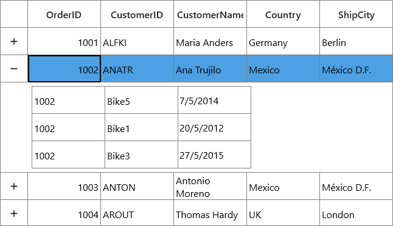

---
layout: post
title: Master-Details View in SfDataGrid
description: Master-Details View in SfDataGrid.
platform: uwp
control: SfDataGrid
documentation: ug
--- 

# Master-Details View

SfDataGrid provides support to represent the hierarchical data in the form of nested tables using Master-Details View. You can expand or collapse the nested tables (`DetailsViewDataGrid`) by using an expander in a row or programmatically.  The number of tables nested with relations is unlimited.

## Generating Master-Details view from IEnumerable

Master-Details View’s relation can be generated for the properties of type [IEnumerable](https://msdn.microsoft.com/en-us/library/system.collections.ienumerable.aspx) in the underlying data object contain.
Follow the below steps to generate the Master-Details View for `IEnumerable`.

* Create the data model with relations (Here, relations are `IEnumerable` type properties)
* Defining relations
  * Auto-generating relations
  * Manually defining relations
   
### Create the data model with relations

Create an `Employee` class with `Sales` and `Orders` property of type [ObservableCollection](https://msdn.microsoft.com/en-us/library/ms668604.aspx) to form the relations. The `Sales` and `Orders` properties are defined as `ObservableCollection<SalesInfo>` and `ObservableCollection<OrderInfo>` respectively. 



public class SalesInfo : INotifyPropertyChanged
{
        private int _orderID;
        private string _salesID;
        private string _productName;
        private ObservableCollection<ProductInfo> products;

        public int OrderID
        {
            get { return _orderID; }
            set
            {
                _orderID = value;
                OnPropertyChanged("OrderID");
            }
        }
        public string SalesID
        {
            get { return _salesID; }
            set
            {
                _salesID = value;
                OnPropertyChanged("SalesID");
            }
        }
        public string ProductName
        {
            get { return _productName; }
            set
            {
                _productName = value;
                OnPropertyChanged("ProductName");
            }
        }
        public event PropertyChangedEventHandler PropertyChanged;

        private void OnPropertyChanged(String name)
        {
            if (PropertyChanged != null)
            {
                PropertyChanged(this, new PropertyChangedEventArgs(name));
            }
        }
}

public class OrderInfo : INotifyPropertyChanged
{
        private int orderId;
        private int _quantiy;

        public int OrderID
        {
            get { return orderId; }
            set
            {
                orderId = value;
                OnPropertyChanged("OrderID");
            }
        }
        public int Quantity
        {
            get { return _quantiy; }
            set
            {
                _quantiy = value;
                OnPropertyChanged("Quantity");
            }
        }
        public event PropertyChangedEventHandler PropertyChanged;

        private void OnPropertyChanged(String name)
        {
            if (PropertyChanged != null)
            {
                PropertyChanged(this, new PropertyChangedEventArgs(name));
            }
        }
}

public class Employee : INotifyPropertyChanged
{
        private int _EmployeeID;
        private int _orderId;
        private string _city;
        private ObservableCollection<SalesInfo> _sales;
        private ObservableCollection<OrderInfo> _orders;

        public int EmployeeID
        {
            get { return this._EmployeeID; }
            set
            {
                this._EmployeeID = value;
                OnPropertyChanged("EmployeeID");
            }
        }
        public int OrderID
        {
            get { return this._orderId; }
            set
            {
                this._orderId = value;
                OnPropertyChanged("OrderID");
            }
        }

        public string City
        {
            get { return _city; }
            set
            {
                _city = value;
                OnPropertyChanged("City");
            }
        }

        public ObservableCollection<SalesInfo> Sales
        {
            get { return _sales; }
            set
            {
                _sales = value;
                OnPropertyChanged("Sales");
            }
        }
        public ObservableCollection<OrderInfo> Orders
        {
            get { return _orders; }
            set
            {
                _orders = value;
                OnPropertyChanged("Orders");
            }
        }

        public event PropertyChangedEventHandler PropertyChanged;

        private void OnPropertyChanged(String name)
        {
            if (PropertyChanged != null)
            {
                PropertyChanged(this, new PropertyChangedEventArgs(name));
            }
        }
}



Create a `ViewModel` class with `Employees` property and it is initialized with several data objects in the constructor. Similarly, the `Sales` and `Orders` property are also initialized.
 


public class ViewModel
{
    ObservableCollection<Employee> _employees;
    public ObservableCollection<Employee> Employees
    {
        get { return _employees; }
        set { _employees = value; }
    }

    public ViewModel()
    {        
        this.GenerateOrders();
        this.GenerateSales();
        _employees = GetEmployeesDetails();
    }
    public ObservableCollection<Employee> GetEmployeesDetails()
    {
        var employees = new ObservableCollection<Employee>();
        employees.Add(new Employee() { EmployeeID = 1, OrderID = 1001, City = "Berlin", Orders = GetOrders(1001), Sales = GetSales(1001) });
        employees.Add(new Employee() { EmployeeID = 2, OrderID = 1002, City = "México D.F.", Orders = GetOrders(1002), Sales = GetSales(1002) });
        employees.Add(new Employee() { EmployeeID = 3, OrderID = 1003, City = "London", Orders = GetOrders(1002), Sales = GetSales(1003) });
        employees.Add(new Employee() { EmployeeID = 4, OrderID = 1004, City = "BERGS", Orders = GetOrders(1002), Sales = GetSales(1004) });
        employees.Add(new Employee() { EmployeeID = 5, OrderID = 1005, City = "Mannheim", Orders = GetOrders(1002), Sales = GetSales(1005) });
        return employees;
    }

    //Orders collection is initialized here.
    ObservableCollection<OrderInfo> Orders = new ObservableCollection<OrderInfo>();
    public void GenerateOrders()
    {
        Orders.Add(new OrderInfo() { OrderID = 1001, Quantity = 10 });
        Orders.Add(new OrderInfo() { OrderID = 1001, Quantity = 10 });
        Orders.Add(new OrderInfo() { OrderID = 1002, Quantity = 20 });
        Orders.Add(new OrderInfo() { OrderID = 1002, Quantity = 20 });
        Orders.Add(new OrderInfo() { OrderID = 1003, Quantity = 50 });
        Orders.Add(new OrderInfo() { OrderID = 1004, Quantity = 70 });
        Orders.Add(new OrderInfo() { OrderID = 1005, Quantity = 20 });
        Orders.Add(new OrderInfo() { OrderID = 1005, Quantity = 20 });
    }
    private ObservableCollection<OrderInfo> GetOrders(int orderID)
    {
        ObservableCollection<OrderInfo> orders = new ObservableCollection<OrderInfo>();
        foreach (var order in Orders)
            if (order.OrderID == orderID)
                orders.Add(order);
        return orders;
    }

    //Sales collection is initialized here.
    ObservableCollection<SalesInfo> Sales = new ObservableCollection<SalesInfo>();
    public void GenerateSales()
    {
        Sales.Add(new SalesInfo() { OrderID = 1001, SalesID = "A00001", ProductName = "Bike1" });
        Sales.Add(new SalesInfo() { OrderID = 1001, SalesID = "A00002", ProductName = "Bike1" });
        Sales.Add(new SalesInfo() { OrderID = 1002, SalesID = "A00003", ProductName = "Cycle" });
        Sales.Add(new SalesInfo() { OrderID = 1003, SalesID = "A00004", ProductName = "Car" });
    }
    private ObservableCollection<SalesInfo> GetSales(int orderID)
    {
        ObservableCollection<SalesInfo> sales = new ObservableCollection<SalesInfo>();
        foreach (var sale in Sales)
            if (sale.OrderID == orderID)
                sales.Add(sale);
        return sales;
    }   
}



### Defining relations in DataGrid
 
#### Auto-generating relations

SfDataGrid will automatically generate relations and inner relations for the `IEnumerable` property types in the data object. This can be enabled by setting `SfDataGrid.AutoGenerateRelations` to `true`.
Bind the collection created in the previous step to `SfDataGrid.ItemsSource` and set the `SfDataGrid.AutoGenerateRelations` to `true`.
 


<syncfusion:SfDataGrid  x:Name="dataGrid"
                        AutoGenerateColumns="True"
                        AutoGenerateRelations="True"
                        ItemsSource="{Binding Employees}" />


dataGrid.AutoGenerateRelations = true;



When relations are auto-generated, you can handle the `SfDataGrid.AutoGeneratingRelations` event to customize or cancel the `GridViewDefinition` before they are added to the `SfDataGrid.DetailsViewDefinition`. 
Here, two relations are created from `Sales` and `Orders` collection property.

#### Manually defining Relations

You can define the Master-Details View’s relation manually using `SfDataGird.DetailsViewDefinition`, when the `SfDataGrid.AutoGenerateRelations` is `false`. 
To define Master-Details View relations, create `GridViewDefinition` and set the name of `IEnumerable` type property (from data object) to `ViewDefinition.RelationalColumn`. Then, add the `GridViewDefinition` to the `SfDataGrid.DetailsViewDefinition`. 



<syncfusion:SfDataGrid x:Name="dataGrid"
                        AutoGenerateColumns="True"
                        AutoGenerateRelations="False"
                        ItemsSource="{Binding Employees}">
    <syncfusion:SfDataGrid.DetailsViewDefinition>
        <!--  FirstLevelNestedGrid1 is created here  -->
        <syncfusion:GridViewDefinition RelationalColumn="Sales">
            <syncfusion:GridViewDefinition.DataGrid>
                <syncfusion:SfDataGrid x:Name="FirstLevelNestedGrid1"
                                       AutoGenerateColumns="True"/>
            </syncfusion:GridViewDefinition.DataGrid>
        </syncfusion:GridViewDefinition>
        <!--  FirstLevelNestedGrid2 is created here  -->
        <syncfusion:GridViewDefinition RelationalColumn="Orders">
            <syncfusion:GridViewDefinition.DataGrid>
                <syncfusion:SfDataGrid x:Name="FirstLevelNestedGrid2"
                                       AutoGenerateColumns="True"/>
            </syncfusion:GridViewDefinition.DataGrid>
        </syncfusion:GridViewDefinition>
    </syncfusion:SfDataGrid.DetailsViewDefinition>
</syncfusion:SfDataGrid>


dataGrid.AutoGenerateRelations = false;

var gridViewDefinition1 = new GridViewDefinition();
gridViewDefinition1.RelationalColumn = "Sales";
gridViewDefinition1.DataGrid = new SfDataGrid() { Name = "FirstLevelNestedGrid1", AutoGenerateColumns = true };

var gridViewDefinition2 = new GridViewDefinition();
gridViewDefinition2.RelationalColumn = "Orders";
gridViewDefinition2.DataGrid = new SfDataGrid() { Name = "FirstLevelNestedGrid2", AutoGenerateColumns = true };

dataGrid.DetailsViewDefinition.Add(gridViewDefinition1);
dataGrid.DetailsViewDefinition.Add(gridViewDefinition2);



In the same way, you can define relations for first level nested grids by defining relations to the `ViewDefinition.DataGrid` of first level nested grid.



<syncfusion:SfDataGrid  x:Name="dataGrid"
                        AutoGenerateColumns="True"
                        AutoGenerateRelations="False"                        
                        ItemsSource="{Binding Employees}">
    <syncfusion:SfDataGrid.DetailsViewDefinition>
        <!--  FirstLevelNestedGrid is created here  -->
        <syncfusion:GridViewDefinition RelationalColumn="Orders">
            <syncfusion:GridViewDefinition.DataGrid>
                <syncfusion:SfDataGrid  x:Name="FirstLevelNestedGrid"
                                        AutoGenerateColumns="True"
                                        AutoGenerateRelations="False">
                    <!--  SecondLevelNestedGrid is created here  -->
                    <syncfusion:SfDataGrid.DetailsViewDefinition>
                        <syncfusion:GridViewDefinition RelationalColumn="Products">
                            <syncfusion:GridViewDefinition.DataGrid>
                                <syncfusion:SfDataGrid  x:Name="SecondLevelNestedGrid" 
                                                        AutoGenerateColumns="True" />
                            </syncfusion:GridViewDefinition.DataGrid>
                        </syncfusion:GridViewDefinition>
                    </syncfusion:SfDataGrid.DetailsViewDefinition>                   
                </syncfusion:SfDataGrid>
            </syncfusion:GridViewDefinition.DataGrid>
        </syncfusion:GridViewDefinition>
    </syncfusion:SfDataGrid.DetailsViewDefinition>
</syncfusion:SfDataGrid>


dataGrid.AutoGenerateRelations = false;

// GridViewDefinition for parent DataGrid
var gridViewDefinition1 = new GridViewDefinition();
gridViewDefinition1.RelationalColumn = "Sales";
var firstLevelNestedGrid = new SfDataGrid() { Name = "FirstLevelNestedGrid", AutoGenerateColumns = true };
firstLevelNestedGrid.AutoGenerateRelations = false;

// GridViewDefinition for FirstLevelNestedGrid
var gridViewDefinition = new GridViewDefinition();
gridViewDefinition.RelationalColumn = "Products";
gridViewDefinition.DataGrid = new SfDataGrid() { Name = "SecondLevelNestedGrid", AutoGenerateColumns = true };
firstLevelNestedGrid.DetailsViewDefinition.Add(gridViewDefinition);
gridViewDefinition1.DataGrid = firstLevelNestedGrid;

dataGrid.DetailsViewDefinition.Add(gridViewDefinition1);



## Populating Master-Details view through events

You can load `ItemsSource` for `DetailsViewDataGrid` asynchronously by handling `SfDataGrid.DetailsViewExpanding`. You can set itemssource in on-demand when expanding record through `GridDetailsViewExpandingEventArgs.DetailsViewItemsSource` property in the `SfDataGrid.DetailsViewExpanding` event handler. 



<syncfusion:SfDataGrid x:Name="dataGrid"
                       AutoGenerateColumns="True"
                       AutoGenerateRelations="True"
                       ItemsSource="{Binding Orders}" />


this.dataGrid.DetailsViewExpanding += dataGrid_DetailsViewExpanding;

void dataGrid_DetailsViewExpanding(object sender, Syncfusion.UI.Xaml.Grid.GridDetailsViewExpandingEventArgs e)
{
    e.DetailsViewItemsSource.Clear();      
    var itemssource = GetItemSource();
    e.DetailsViewItemsSource.Add("ProductDetails", itemssource);   
}

private ObservableCollection<ProductInfo> GetItemSource()
{
    var products = new ObservableCollection<ProductInfo>();
    products.Add(new ProductInfo() { OrderID = 1001, ProductName = "Bike" });
    products.Add(new ProductInfo() { OrderID = 1002, ProductName = "Car" });
    products.Add(new ProductInfo() { OrderID = 1003, ProductName = "Bike1" });
    return products;
}



N> This event will be trigged only when underlying data object contains relations. Otherwise, you have to define dummy relation to notify DataGrid to fire this event.

In the below code snippet, `AutoGenerateRelations` set to false and also relation is defined with some name to `RelationalColumn`. For example, `ProductDetails` is the dummy relational column and underlying data object does not contain the `IEnumerable` type property with name `ProductDetails`.



<syncfusion:SfDataGrid x:Name="dataGrid"
                       AutoGenerateColumns="True"
                       AutoGenerateRelations="False"
                       ItemsSource="{Binding Orders}">
            <syncfusion:SfDataGrid.DetailsViewDefinition>
                <syncfusion:GridViewDefinition RelationalColumn="ProductDetails">
                    <syncfusion:GridViewDefinition.DataGrid>
                        <syncfusion:SfDataGrid x:Name="FirstLevelNestedGrid"  
                                               AutoGenerateColumns="True" />
                    </syncfusion:GridViewDefinition.DataGrid>
                </syncfusion:GridViewDefinition>
            </syncfusion:SfDataGrid.DetailsViewDefinition>
</syncfusion:SfDataGrid>



Now the `ItemsSource` for` DetailsViewDataGrid` can be supplied through `DetailsViewExpanding`s event as mentioned above.

### Loading DetailsViewItemsSource asynchronously

While populating Master-Details view through events, if the data to be loaded is downloaded from an external source or being read from a file, you may get a time delay. In such case, the ‘DetailsViewExpanding’ event will be executed before the I/O processes get completes.
In this case, you can use [async](https://msdn.microsoft.com/en-us/library/hh156513.aspx) and [await](https://msdn.microsoft.com/en-IN/library/hh156528.aspx) to load the data with a time delay and hold the event from executing before the data gets loaded from an external source gets completed.



this.dataGrid.DetailsViewExpanding += dataGrid_DetailsViewExpanding;

private async Task<ObservableCollection<ProductInfo>> GetItemSource()
{
     var products = new ObservableCollection<ProductInfo>();
     await Schedule(() =>
     {
          products.Add(new ProductInfo() { OrderID = 1001, ProductName = "Bike" });
          products.Add(new ProductInfo() { OrderID = 1002, ProductName = "Car" });
          products.Add(new ProductInfo() { OrderID = 1003, ProductName = "Bike1" });
     }, 2000);
     return products;
}

public async Task<bool> Schedule(Action _oncompleteion, int durationMS)
{ 
    DispatcherTimer timer = new DispatcherTimer();
    timer.Interval = TimeSpan.FromMilliseconds(durationMS);
    //Task that causes time delay
    timer.Tick += timer_Tick;            
    _oncompleteion();
    timer.Stop();
    return true;
}

async void dataGrid_DetailsViewExpanding(object sender, Syncfusion.UI.Xaml.Grid.GridDetailsViewExpandingEventArgs e)
{
      e.DetailsViewItemsSource.Clear();
      var itemssource = await GetItemSource();
      e.DetailsViewItemsSource.Add("ProductDetails", itemssource);
}



The declaration of `await` with ‘GetItemSource’ method hold the further process of adding the `DetailsViewItemsSource` until the items are assigned to the `itemssource’. Here the timer is invoked with 2 seconds delay in asynchronous `Schedule` method call in `GetItemSource’ method while adding the DetailsViewDataGrid items.

The `DetailsViewExpanding` method runs synchronously until it reaches its first await expression. After await is reached, it is suspended until the awaited task is complete.

## Defining properties for DetailsViewDataGrid

You can set properties like `AllowEditing`, `AllowFiltering` and `AllowSorting` for `DetailsViewDataGrid` by using the `GridViewDefinition.DataGrid` property.

### When AutoGenerateRelations is false

For manually defined relation, the properties can be directly set to the `ViewDefinition.DataGrid`.



<syncfusion:SfDataGrid x:Name="dataGrid"
                       AutoGenerateColumns="True"
                       AutoGenerateRelations="False"
                       ItemsSource="{Binding Orders}">
            <syncfusion:SfDataGrid.DetailsViewDefinition>
                <syncfusion:GridViewDefinition RelationalColumn="ProductDetails">
                    <syncfusion:GridViewDefinition.DataGrid>
                        <syncfusion:SfDataGrid x:Name="FirstLevelNestedGrid"
                                               AllowEditing="True"
                                               AllowFiltering="True"
                                               AllowResizingColumns="True"
                                               AllowSorting="True"
                                               AutoGenerateColumns="False" />
                    </syncfusion:GridViewDefinition.DataGrid>
                </syncfusion:GridViewDefinition>
            </syncfusion:SfDataGrid.DetailsViewDefinition>
</syncfusion:SfDataGrid>


FirstLevelNestedGrid.AllowEditing = true;
FirstLevelNestedGrid.AllowFiltering = true;
FirstLevelNestedGrid.AllowResizingColumns = true;
FirstLevelNestedGrid.AllowSorting = true;



For two levels of nesting,



<syncfusion:SfDataGrid x:Name="dataGrid"
                       AutoGenerateColumns="True"
                       AutoGenerateRelations="False"
                       ItemsSource="{Binding Employees}">
            <syncfusion:SfDataGrid.DetailsViewDefinition>
            <!--  FirstLevelNestedGrid is created here  -->
                <syncfusion:GridViewDefinition RelationalColumn="Sales">
                    <syncfusion:GridViewDefinition.DataGrid>
                        <syncfusion:SfDataGrid x:Name="FirstLevelNestedGrid"
                                               AutoGenerateColumns="True"
                                               AutoGenerateRelations="False">
                            <syncfusion:SfDataGrid.DetailsViewDefinition>
                            <!--  SecondLevelNestedGrid is created here  -->
                                <syncfusion:GridViewDefinition 
                                                RelationalColumn="Products">
                                    <syncfusion:GridViewDefinition.DataGrid>
                                        <syncfusion:SfDataGrid 
                                                    x:Name="SecondLevelNestedGrid"       
                                                    AllowEditing="True"
                                                    AllowFiltering="True"
                                                    AutoGenerateColumns="True" />           
                                    </syncfusion:GridViewDefinition.DataGrid>
                                </syncfusion:GridViewDefinition>
                            </syncfusion:SfDataGrid.DetailsViewDefinition>
                        </syncfusion:SfDataGrid>
                    </syncfusion:GridViewDefinition.DataGrid>
                </syncfusion:GridViewDefinition>
            </syncfusion:SfDataGrid.DetailsViewDefinition>
</syncfusion:SfDataGrid>


SecondLevelNestedGrid.AllowEditing = true;
SecondLevelNestedGrid.AllowFiltering = true;



### When AutoGenerateRelations is true

When the relation is auto-generated, you can get the `GridViewDefinition.DataGrid` in the `AutoGeneratingRelations` event handler to set the properties.



<syncfusion:SfDataGrid x:Name="dataGrid"
                       AutoGenerateColumns="True"
                       AutoGenerateRelations="True"
                       ItemsSource="{Binding Employees}"/>


this.dataGrid.AutoGeneratingRelations += dataGrid_AutoGeneratingRelations;

void dataGrid_AutoGeneratingRelations(object sender, Syncfusion.UI.Xaml.Grid.AutoGeneratingRelationsArgs e)
{
     e.GridViewDefinition.DataGrid.AllowEditing = true;
     e.GridViewDefinition.DataGrid.AllowFiltering = true;
     e.GridViewDefinition.DataGrid.AllowSorting = true;
     e.GridViewDefinition.DataGrid.AllowResizingColumns = true;        
}



For two levels of nesting,



this.dataGrid.AutoGeneratingRelations += dataGrid_AutoGeneratingRelations;

void dataGrid_AutoGeneratingRelations(object sender, AutoGeneratingRelationsArgs e)
{
     e.GridViewDefinition.DataGrid.AutoGenerateRelations = true;
     e.GridViewDefinition.DataGrid.AutoGeneratingRelations +=  
                                       FirstLevelNestedGrid_AutoGeneratingRelations;
}

Void FirstLevelNestedGrid_AutoGeneratingRelations(object sender,
                               AutoGeneratingRelationsArgs e)   
{
     e.GridViewDefinition.DataGrid.AutoGenerateColumns = true;
     e.GridViewDefinition.DataGrid.AllowEditing = true;
     e.GridViewDefinition.DataGrid.AllowFiltering = true;
}



N> When you make any change in one `DetailsViewDataGrid`, that change will be applied to all DetailsViewDataGrid’s in the same level. For example, when you resize the first column in one `DetailsViewDataGrid`, the same column width is applied to all DetailsViewDataGrid’s at that level. This is applicable for features like filtering, sorting, grouping and re ordering columns also. 

Here, `SalesID` column is sorted in all DetailsViewDataGrid at the same level.

N> `AllowFrozenGroupHeaders`, `FrozenRowsCount`, `FooterRowsCount`, `FooterColumnCount`, `FrozenColumnCount` properties are not supported while using Master Details view.

## Defining columns for DetailsViewDataGrid

The ViewDefinition.DataGrid’s columns can be generated either automatically or manually like parent DataGrid. You can refer Columns section to know more about columns. 

### Auto-generating columns

You can auto-generate the ViewDefinition.DataGrid’s columns by setting the `GridViewDefinition.DataGrid.AutoGenerateColumns` to `true`. You can cancel or customize the column being created for `ViewDefinition.DataGrid` by handling `GridViewDefinition.DataGrid.AutoGeneratingColumn` event.



<syncfusion:SfDataGrid x:Name="dataGrid"                        
                        AutoGenerateColumns="True"
                        AutoGenerateRelations="False"
                        ItemsSource="{Binding Orders}">
    <syncfusion:SfDataGrid.DetailsViewDefinition>
        <syncfusion:GridViewDefinition RelationalColumn="ProductDetails">
            <syncfusion:GridViewDefinition.DataGrid>
                <syncfusion:SfDataGrid x:Name="FirstLevelNestedGrid"
                                        AutoGenerateColumns="True"                                        
                                        AutoGeneratingColumn="FirstLevelNestedGrid_AutoGeneratingColumn" />
            </syncfusion:GridViewDefinition.DataGrid>
        </syncfusion:GridViewDefinition>
    </syncfusion:SfDataGrid.DetailsViewDefinition>
</syncfusion:SfDataGrid>


FirstLevelNestedGrid.AutoGeneratingColumn += FirstLevelNestedGrid_AutoGeneratingColumn;



When relation is auto generated, you can set properties and wire `GridViewDefinition.DataGrid.AutoGeneratingColumn` event in `SfDataGrid.AutoGeneratingRelations` event handler.



void dataGrid_AutoGeneratingRelations(object sender, Syncfusion.UI.Xaml.Grid.AutoGeneratingRelationsArgs e)
{    
     e.GridViewDefinition.DataGrid.AutoGenerateColumns = true;       
     e.GridViewDefinition.DataGrid += FirstLevelNestedGrid_AutoGeneratingColumn;
}



### Manually defining columns

You can directly define the columns to `ViewDefinition.DataGrid` when `AutoGenerateColumns` is `false`. When relation is manually defined, you can define the columns directly to `ViewDefinition.DataGrid` in XAML or C#, by adding desired column to the `SfDataGrid.Columns` collection.
 


<syncfusion:SfDataGrid x:Name="dataGrid"
                       AutoGenerateColumns="True"
                       AutoGenerateRelations="False"
                       ItemsSource="{Binding Orders}">
    <syncfusion:SfDataGrid.DetailsViewDefinition>
        <syncfusion:GridViewDefinition RelationalColumn="ProductDetails">
            <syncfusion:GridViewDefinition.DataGrid>
                <syncfusion:SfDataGrid x:Name="FirstLevelNestedGrid"   AutoGenerateColumns="False">
                    <syncfusion:SfDataGrid.Columns>
                        <syncfusion:GridTextColumn MappingName="OrderID" />
                        <syncfusion:GridTextColumn MappingName="ProductName" />
                    </syncfusion:SfDataGrid.Columns>
                </syncfusion:SfDataGrid>
            </syncfusion:GridViewDefinition.DataGrid>
        </syncfusion:GridViewDefinition>
    </syncfusion:SfDataGrid.DetailsViewDefinition>
</syncfusion:SfDataGrid>



When relation is auto generated, you can define the ViewDefinition.DataGrid’s columns manually through the `SfDataGrid.AutoGeneratingRelations` event handler.



this.dataGrid.AutoGeneratingRelations += dataGrid_AutoGeneratingRelations;

void dataGrid_AutoGeneratingRelations(object sender, Syncfusion.UI.Xaml.Grid.AutoGeneratingRelationsArgs e)
{
    e.GridViewDefinition.DataGrid.AutoGenerateColumns = false;
    e.GridViewDefinition.DataGrid.Columns.Add(new GridTextColumn() { MappingName = "OrderID" });
    e.GridViewDefinition.DataGrid.Columns.Add(new GridTextColumn() { MappingName = "ProductName" });
}



### Creating Custom Column

You can also define your own column type to `ViewDefinition.DataGrid` like parent DataGrid. For more information about creating custom column, refer the Custom Column support. 
After creating the custom column, add the customized renderer to `CellRenderers` collection of `DetailsViewDataGrid`.



this.dataGrid.DetailsViewLoading += dataGrid_DetailsViewLoading;

void dataGrid_DetailsViewLoading(object sender, DetailsViewLoadingAndUnloadingEventArgs e)
{
     if (!e.DetailsViewDataGrid.CellRenderers.ContainsKey("DatePickerRenderer"))
         e.DetailsViewDataGrid.CellRenderers.Add("DatePickerRenderer", new DatePickerRenderer());
}



Now, you can add the custom column to `Columns` collection of `ViewDefinition.DataGrid`.



<syncfusion:SfDataGrid x:Name="dataGrid"
                        AutoGenerateColumns="True"
                        AutoGenerateRelations="False"
                        ItemsSource="{Binding Orders}">
    <syncfusion:SfDataGrid.DetailsViewDefinition>
        <syncfusion:GridViewDefinition RelationalColumn="ProductDetails">
            <syncfusion:GridViewDefinition.DataGrid>
                <syncfusion:SfDataGrid x:Name="FirstLevelNestedGrid"
                                        AllowEditing="True"
                                        AutoGenerateColumns="False">
                    <syncfusion:SfDataGrid.Columns>
                        <syncfusion:GridTextColumn MappingName="OrderID" />
                        <syncfusion:GridTextColumn MappingName="ProductName" />
                        <local:DatePickerColumn DateMapping="DateOfMonth"
                                                DisplayBinding="{Binding DateOfMonth,
                                                                            Converter={StaticResource converter}}"
                                                MappingName="DateOfMonth" />
                    </syncfusion:SfDataGrid.Columns>
                </syncfusion:SfDataGrid>
            </syncfusion:GridViewDefinition.DataGrid>
        </syncfusion:GridViewDefinition>
    </syncfusion:SfDataGrid.DetailsViewDefinition>
</syncfusion:SfDataGrid>



## Handling events for DetailsViewDataGrid

You can handle events for `DetailsViewDataGrid` by wiring events to `ViewDefinition.DataGrid` where sender is `ViewDefinition.DataGrid`. You can get the 
`DetailsViewDataGrid` which actually raises the event by through event argument member `OriginalSender`.

### When AutoGenerateRelations is false

For manually defined relation, the events can be wired from `ViewDefinition.DataGrid` directly in XAML or C#.



<syncfusion:SfDataGrid x:Name="dataGrid"
                       AutoGenerateColumns="True"
                       AutoGenerateRelations="True"
                       ItemsSource="{Binding Orders}">
            <syncfusion:SfDataGrid.DetailsViewDefinition>
                <syncfusion:GridViewDefinition RelationalColumn="ProductDetails">
                    <syncfusion:GridViewDefinition.DataGrid>
                        <syncfusion:SfDataGrid x:Name="FirstLevelNestedGrid"
                                               AutoGenerateColumns="True"                                               
                                               CurrentCellBeginEdit="FirstLevelNestedGrid_CurrentCellBeginEdit"                                               
                                               FilterChanging="FirstLevelNestedGrid_FilterChanging"                                               
                                               SortColumnsChanging="FirstLevelNestedGrid_SortColumnsChanging" />
                    </syncfusion:GridViewDefinition.DataGrid>
                </syncfusion:GridViewDefinition>
            </syncfusion:SfDataGrid.DetailsViewDefinition>
</syncfusion:SfDataGrid>


FirstLevelNestedGrid.CurrentCellBeginEdit += FirstLevelNestedGrid_CurrentCellBeginEdit;
FirstLevelNestedGrid.SortColumnsChanging += FirstLevelNestedGrid_SortColumnsChanging;
FirstLevelNestedGrid.FilterChanging += FirstLevelNestedGrid_FilterChanging;



For second level nested grid,



<syncfusion:SfDataGrid x:Name="dataGrid"
                       AutoGenerateColumns="True"
                       AutoGenerateRelations="False"
                       ItemsSource="{Binding Employees}">
            <syncfusion:SfDataGrid.DetailsViewDefinition>
                <syncfusion:GridViewDefinition RelationalColumn="Sales">
                    <syncfusion:GridViewDefinition.DataGrid>
                        <syncfusion:SfDataGrid x:Name="FirstLevelNestedGrid"
                                               AutoGenerateColumns="True"
                                               AutoGenerateRelations="False">
                            <syncfusion:SfDataGrid.DetailsViewDefinition>
                                <syncfusion:GridViewDefinition 
                                                           RelationalColumn="Products">
                                    <syncfusion:GridViewDefinition.DataGrid>
                                        <syncfusion:SfDataGrid 
                                               x:Name="SecondLevelNestedGrid"
                                               AllowFiltering="True"
                                               AutoGenerateColumns="True"
                                               CurrentCellBeginEdit="SecondLevelNestedGrid_CurrentCellBeginEdit"                                                               
                                               FilterChanging="SecondLevelNestedGrid_FilterChanging"/>
                                    </syncfusion:GridViewDefinition.DataGrid>
                                </syncfusion:GridViewDefinition>
                            </syncfusion:SfDataGrid.DetailsViewDefinition>
                        </syncfusion:SfDataGrid>
                    </syncfusion:GridViewDefinition.DataGrid>
                </syncfusion:GridViewDefinition>                
            </syncfusion:SfDataGrid.DetailsViewDefinition>
</syncfusion:SfDataGrid>


SecondLevelNestedGrid.CurrentCellBeginEdit+=
                                           SecondLevelNestedGrid_CurrentCellBeginEdit;
SecondLevelNestedGrid.FilterChanging += SecondLevelNestedGrid_FilterChanging;

private void SecondLevelNestedGrid_CurrentCellBeginEdit(object sender, CurrentCellBeginEditEventArgs args)
{

}



### When AutoGenerateRelations is true

When the relation is auto-generated, you can get the `GridViewDefinition.DataGrid`in the `AutoGeneratingRelations` event handler to wire the events.



<syncfusion:SfDataGrid x:Name="dataGrid"
                       AutoGenerateColumns="True"
                       AutoGenerateRelations="True"
                       ItemsSource="{Binding Employees}"/>


this.dataGrid.AutoGeneratingRelations += dataGrid_AutoGeneratingRelations;

void dataGrid_AutoGeneratingRelations(object sender, Syncfusion.UI.Xaml.Grid.AutoGeneratingRelationsArgs e)
{
        e.GridViewDefinition.DataGrid.CurrentCellBeginEdit +=  
                                    FirstLevelNestedGrid_CurrentCellBeginEdit;
        e.GridViewDefinition.DataGrid.SortColumnsChanging +=
                                    FirstLevelNestedGrid_SortColumnsChanging;
        e.GridViewDefinition.DataGrid.FilterChanging += 
                                    FirstLevelNestedGrid_FilterChanging;
}

void FirstLevelNestedGrid_CurrentCellBeginEdit(object sender, 
                                    CurrentCellBeginEditEventArgs args)
{

}




For second level nested grid,
 


this.dataGrid.AutoGeneratingRelations += dataGrid_AutoGeneratingRelations;
void dataGrid_AutoGeneratingRelations(object sender, AutoGeneratingRelationsArgs e)
{
     // FirstLevelNestedGrid
     e.GridViewDefinition.DataGrid.AutoGenerateRelations = true;
     e.GridViewDefinition.DataGrid.AutoGeneratingRelations +=                                              
                                         FirstLevelNestedGrid_AutoGeneratingRelations;
}
void FirstLevelNestedGrid_AutoGeneratingRelations(object sender,  
                                                        AutoGeneratingRelationsArgs e)
{
     // SecondLevelNestedGrid
     e.GridViewDefinition.DataGrid.CurrentCellBeginEdit +=
                                       SecondLevelNestedGrid_CurrentCellBeginEdit;  
     e.GridViewDefinition.DataGrid.FilterChanging += 
                                       SecondLevelNestedGrid_FilterChanging;
}



### Getting the parent DataGrid while editing DetailsViewDataGrid

You can get the corresponding parent DataGrid while editing `DetailsViewDataGrid` through its `CurrentCellBeginEdit` event handler.
 


this.FirstLevelNestedGrid.CurrentCellBeginEdit += FirstLevelNestedGrid_CurrentCellBeginEdit;

void FirstLevelNestedGrid_CurrentCellBeginEdit(object sender, CurrentCellBeginEditEventArgs args)
{
    var detailsViewDataGrid = args.OriginalSender as DetailsViewDataGrid;
    var parentDataGrid = detailsViewDataGrid.GetParentDataGrid();
}



Here, sender is `ViewDefinition.DataGrid`. You can get the `DetailsViewDataGrid` which actually raises the event by using `OriginalSender`.

## Column sizing 

SfDataGrid allows you to apply column sizer to `DetailsViewDataGrid` by setting the `GridViewDefinition.DataGrid.ColumnSizer` like parent DataGrid. For more information, refer the Column Sizing section.

### Disable resizing of last column in parent DataGrid 

By default, the `DetailsViewDataGrid`is clipped while resizing the last column of parent DataGrid if the parent DataGrid width is less than the `DetailsViewDataGrid` width. 

You can disable the resizing of last column of parent DataGrid by setting `DetailsViewManager.DisableLastColumnResizing` attached property to `true`. 



<syncfusion:SfDataGrid  x:Name="dataGrid"
                        AllowResizingColumns="True"
                        AutoGenerateColumns="True"
                        AutoGenerateRelations="True"
                        ItemsSource="{Binding Orders}"
                        syncfusion:DetailsViewManager.DisableLastColumnResizing="True" />





DetailsViewManager.SetDisableLastColumnResizing(this.dataGrid, true);



### Resizing parent DataGrid and DetailsViewDataGrid simultaneously

By default, `DetailsViewDataGrid` column width will not be adjusted while resizing the parent DataGrid’s columns. You can adjust DetailsViewDataGrid’s column width simultaneously while resizing parent DataGrid. This can be achieved by handling `DetailsViewLoading` and ResizingColumns` events.

N> It is applicable only when the parent and `DetailsViewDataGrid` having same number of columns.

The column width of `DetailsViewDataGrid` is set based on the parent DataGrid’s column in `DetailsViewLoading` event.



dataGrid.DetailsViewLoading += dataGrid_DetailsViewLoading;

void dataGrid_DetailsViewLoading(object sender, DetailsViewLoadingAndUnloadingEventArgs e)
{
    var parentGrid = e.OriginalSender is DetailsViewDataGrid ? (e.OriginalSender as SfDataGrid) : sender as SfDataGrid;
    if (!CanResize(parentGrid))
        return;
    if (parentGrid.Columns.Count != e.DetailsViewDataGrid.Columns.Count)
        return;
    double width = 0;
    var detailsViewStartColumnIndex = e.DetailsViewDataGrid.ResolveToStartColumnIndex();   
    for (int i = 0; i < parentGrid.Columns.Count; i++)
    {
        width = i == 0 ? parentGrid.Columns[i].ActualWidth - detailsViewStartColumnIndex * 24 : parentGrid.Columns[i].Width;
        if (e.DetailsViewDataGrid.Columns[i].Width != parentGrid.Columns[i].Width)
            e.DetailsViewDataGrid.Columns[i].Width = width;
    }            
}



When the column is resized in parent DataGrid column, then the new `Width`is set to corresponding column of `DetailsViewDataGrid`based on the `ColumnIndex`argument in `ResizingColumns` event.




dataGrid.ResizingColumns += dataGrid_ResizingColumns;

void dataGrid_ResizingColumns(object sender, ResizingColumnsEventArgs e)
{
    var grid = sender as SfDataGrid;          
    if (e.OriginalSender is DetailsViewDataGrid)
        grid = e.OriginalSender as SfDataGrid;
    if (grid.View == null)
        return;
    SetWidth(grid, e.ColumnIndex, e.Width);
}

private void SetWidth(SfDataGrid grid, int scrollColumnIndex, double width)
{
    if (grid.DetailsViewDefinition == null || !grid.DetailsViewDefinition.Any())
        return;
    if (!CanResize(grid))
        return;
    var columnIndex = grid.HelperResolveToGridVisibleColumnIndex(scrollColumnIndex);
    if (columnIndex < 0)
        return;
    var parentstartcolumnnIndex = grid.HelperResolveToStartColumnIndex();
    var indentcolumnsWidth = 0;
    foreach (var definition in grid.DetailsViewDefinition)
    {
        var detailsViewDataGrid = (definition as GridViewDefinition).DataGrid;
        var startcolumnnIndex = detailsViewDataGrid.HelperResolveToStartColumnIndex();
        indentcolumnsWidth = startcolumnnIndex * 24;
        var tempWidth = width - indentcolumnsWidth < 0 ? 0 : width - indentcolumnsWidth;
        detailsViewDataGrid.Columns[columnIndex].Width = scrollColumnIndex == parentstartcolumnnIndex ? tempWidth : width;
        // If DetailsViewDataGrid has DetailsViewDefinition(nested levels), recursively set width upto all levels
        if (detailsViewDataGrid.DetailsViewDefinition != null && detailsViewDataGrid.DetailsViewDefinition.Any())
            SetWidth(detailsViewDataGrid, detailsViewDataGrid.HelperResolveToScrollColumnIndex(columnIndex), detailsViewDataGrid.Columns[columnIndex].Width);
    }
}

private bool CanResize(SfDataGrid dataGrid)
{
    if (dataGrid.DetailsViewDefinition == null && !dataGrid.DetailsViewDefinition.Any())
        return true;
    foreach (var definition in dataGrid.DetailsViewDefinition)
    {
        var detailsViewGrid = (definition as GridViewDefinition).DataGrid;
        if (detailsViewGrid.DetailsViewDefinition == null && !detailsViewGrid.DetailsViewDefinition.Any())
            return CanResize(detailsViewGrid);
        if (detailsViewGrid.Columns.Count != dataGrid.Columns.Count)
            return false;
    }
    return true;
}



The above `HelperResolveToStartColumnIndex`, `HelperResolveToGridVisibleColumnIndex`, `HelperResolveToScrollColumnIndex` helper methods are used to resolve row and column index in `ViewDefinition.DataGrid`.



public static class GridHelperClass
{
    /// 

    /// Resolves the start column index of the ViewDefinition.DataGrid.
    /// 

    /// <param name="dataGrid">
    /// The ViewDefinition.DataGrid
    /// </param>
    /// <returns>
    /// Returns the start column index of the ViewDefinition.DataGrid.
    /// </returns>
    public static int HelperResolveToStartColumnIndex(this SfDataGrid dataGrid)
    {
        int startIndex = 0;
        if (dataGrid.ShowRowHeader)
            startIndex += 1;
        if (dataGrid.GroupColumnDescriptions != null && dataGrid.GroupColumnDescriptions.Any())
            startIndex += dataGrid.GroupColumnDescriptions.Count;
        if (dataGrid.DetailsViewDefinition != null && dataGrid.DetailsViewDefinition.Any())
            startIndex += 1;
        return startIndex;
    }

    /// 

    /// Resolves the visible column index for the specified column index in ViewDefinition.DataGrid.
    /// 

    /// <param name="dataGrid">
    /// The ViewDefinition.DataGrid.
    /// </param>
    /// <param name="visibleColumnIndex">
    /// The visibleColumnIndex.
    /// </param>
    /// <returns>
    /// Returns the corresponding visible column index for the specified column index.
    /// </returns>
    public static int HelperResolveToGridVisibleColumnIndex(this SfDataGrid dataGrid, int visibleColumnIndex)
    {
        var indentColumnCount = (dataGrid.GroupColumnDescriptions != null ? dataGrid.GroupColumnDescriptions.Count : 0) +
            ((dataGrid.DetailsViewDefinition != null && dataGrid.DetailsViewDefinition.Any()) ? 1 : 0);
        int resolvedIndex = visibleColumnIndex - (indentColumnCount + (dataGrid.ShowRowHeader ? 1 : 0));
        return resolvedIndex;
    }

    /// 

    /// Resolves the scroll column index for the specified column index in ViewDefinition.DataGrid.
    /// 

    /// <param name="dataGrid">
    /// The ViewDefinition.DataGrid.
    /// </param>
    /// <param name="gridColumnIndex">
    /// The corresponding column index to get the scroll column index.
    /// </param>
    /// <returns>
    /// Returns the scroll column index for the specified column index.
    /// </returns>
    public static int HelperResolveToScrollColumnIndex(this SfDataGrid dataGrid, int gridColumnIndex)
    {
        var indentColumnCount = ((dataGrid.DetailsViewDefinition != null && dataGrid.DetailsViewDefinition.Any()) ? 1 : 0) +
            (dataGrid.GroupColumnDescriptions != null ? dataGrid.GroupColumnDescriptions.Count : 0);
        return ((dataGrid.ShowRowHeader ? 1 : 0) + indentColumnCount) + gridColumnIndex;
    }
}



You can get the sample from [here](http://www.syncfusion.com/downloads/support/forum/121912/ze/MasterDetailsViewSingleLevel-861233741).

N> To display parent and `DetailsViewDataGrid` in the same line, set `DetailsViewPadding`as Zero.

## Selection

`DetailsViewDataGrid` allows you to select rows or cells based on the `SelectionUnit` property in its parent DataGrid.

### Getting the selected DetailsViewDataGrid

You can get the currently selected `DetailsViewDataGrid` by using the `SelectedDetailsViewGrid` property of parent DataGrid.



var detailsViewDataGrid = this.dataGrid.SelectedDetailsViewGrid;



For accessing nested level SelectedDetailsViewGrid ,



var detailsViewDataGrid = this.dataGrid.SelectedDetailsViewGrid.SelectedDetailsViewGrid;



You can also get the selected `DetailsViewDataGrid` using `GetDataGrid` helper method which returns the DataGrid that contains the current cell.



var detailsViewDataGrid = this.dataGrid.GetDataGrid();



### Getting the SelectedItem, SelectedItems and SelectedIndex of DetailsViewDataGrid

You can access the selected record or records and selected record index of `DetailsViewDataGrid’ by using `SelectedItem`, `SelectedItems` and `SelectedIndex` properties directly.



var detailsViewDataGrid = this.dataGrid.GetDetailsViewGrid(2);
int selectedIndex = detailsViewDataGrid.SelectedIndex;
var selectedItem = detailsViewDataGrid.SelectedItem;
var selectedItems = detailsViewDataGrid.SelectedItems;



You can access DetailsViewDataGrid’s `SelectedItem`, `SelectedItems` and `SelectedIndex` properties by using parent dataGrid’s `SelectedDetailsViewGrid` property also.



int selectedIndex = this.dataGrid.SelectedDetailsViewGrid.SelectedIndex;
var selectedItem = this.dataGrid.SelectedDetailsViewGrid.SelectedItem;
var selectedItems = this.dataGrid.SelectedDetailsViewGrid.SelectedItems;



### Getting the CurrentCell of DetailsViewDataGrid

You can get the `CurrentCell` of `DetailsViewDataGrid` by using the `SelectedDetailsViewGrid` property of parent DataGrid or `CurrentCellBeginEdit` event of `DetailsViewDataGrid`.



var currentCell = this.dataGrid.SelectedDetailsViewGrid.SelectionController.CurrentCellManager.CurrentCell;

this.FirstLevelNestedGrid.CurrentCellBeginEdit += FirstLevelNestedGrid_CurrentCellBeginEdit;

void FirstLevelNestedGrid_CurrentCellBeginEdit(object sender, CurrentCellBeginEditEventArgs args)
{
    var detailsViewDataGrid = args.OriginalSender as DetailsViewDataGrid;
    var currentCell = detailsViewDataGrid.SelectionController.CurrentCellManager.CurrentCelll;
}



You can refer [here](#handling-events) to know about handling events for `DetailsViewDataGrid`.

### Getting the parent DataGrid

You can get the immediate parent DataGrid of corresponding `DetailsViewDataGrid` through `GetParentDataGrid` helper method.



var parentDataGrid = this.dataGrid.SelectedDetailsViewGrid.GetParentDataGrid();



### Getting the DetailsViewDataGrid
 
You can get the `DetailsViewDataGrid` based on row index through `GetDetailsViewGrid` helper method.



var detailsViewDataGrid = this.dataGrid.GetDetailsViewGrid(2);



You can also get the `DetailsViewDataGrid` based on the record index and relational column name using `GetDetailsViewGrid` method.



var detailsViewDataGrid = this.dataGrid.GetDetailsViewGrid(0, "ProductDetails");



### Programmatic Selection in DetailsViewDataGrid

In `DetailsViewDataGrid`, you can add or remove the selection programmatically like parent DataGrid. You can get particular `DetailsViewDataGrid` by using `DetailsViewLoading` event or `GetDetailsViewGrid` method to process the selection operations.

#### Selecting records

You can select the particular record by using `SelectedItem` property. 



this.dataGrid.DetailsViewLoading += dataGrid_DetailsViewLoading;
void dataGrid_DetailsViewLoading (object sender, DetailsViewLoadingAndUnloadingEventArgs e)
{
    var record = e.DetailsViewDataGrid.GetRecordAtRowIndex(1);
    e.DetailsViewDataGrid.SelectedItem = record;
}



Here, the record in first row is selected in `DetailsViewDataGrid`.

You can also select the particular record by using `SelectedIndex` property.



this.dataGrid.DetailsViewLoading += dataGrid_DetailsViewLoading;

void dataGrid_DetailsViewLoading (object sender, DetailsViewLoadingAndUnloadingEventArgs e)
{
    e.DetailsViewDataGrid.SelectedIndex = 1;
}



Here, the record in first position is selected in `DetailsViewDataGrid`.

You can select multiple records by using `SelectedItems` property.

You can refer [here](#_Handling_Events) to know about handling events for `DetailsViewDataGrid`.

#### Row selection

You can select multiple rows by using `SelectRows` method.



var detailsViewDataGrid = this.dataGrid.GetDetailsViewGrid(2);
detailsViewDataGrid.SelectionController.SelectRows(1, 2);



Here, first and second rows are selected in the `DetailsViewDataGrid` which is present in second row of the parent DataGrid.

#### Cell selection

You can select cells also by using `SelectCell` and `SelectedCells` method. You can refer the Selection section.

### Programmatically expand and bring DetailsViewDataGrid into view

SfDataGrid allows you to bring the specified DetailsViewDataGrid in to view by using `DetailsViewManager.BringInToView` method.

Before bringing the `DetailsViewDataGrid` into view, you have to expand the corresponding parent record if it is not already expanded.



// parent DataGrid row index
int parentRowIndex = 25;
RecordEntry record = null;
var recordIndex = this.dataGrid.ResolveToRecordIndex(parentRowIndex);
if (this.dataGrid.View != null && this.dataGrid.View.GroupDescriptions.Any())
    record = (this.dataGrid.View.TopLevelGroup.DisplayElements[recordIndex] is RecordEntry) ? (this.dataGrid.View.TopLevelGroup.DisplayElements[recordIndex] as RecordEntry) : null;            
else
    record = this.dataGrid.View.Records[recordIndex];
if (record == null)
    return;
//Get the DetailsViewManager using Reflection
var propertyInfo = dataGrid.GetType().GetField("DetailsViewManager", System.Reflection.BindingFlags.Instance | System.Reflection.BindingFlags.NonPublic);
            DetailsViewManager detailsViewManager = propertyInfo.GetValue(dataGrid) as DetailsViewManager;
// Expand DetailsView at specified record index
if (!record.IsExpanded)                     this.dataGrid.ExpandDetailsViewAt(this.dataGrid.ResolveToRecordIndex(parentRowIndex));




If the `DetailsViewDataGrid` is already expanded, you can use `ScrollInView` method to bring it into view. Else, you have to use `BringIntoView` method also.



//  find DetailsViewDataRow index based on relational column
int index = 0;
foreach (var def in this.dataGrid.DetailsViewDefinition)
{
    if (def.RelationalColumn == "ProductDetails")
    {
       index = this.dataGrid.DetailsViewDefinition.IndexOf(def);
       index = parentRowIndex + index + 1;
    }
}
var rowcolumnIndex = new RowColumnIndex(index, 1);
// if the DetailsViewDataGrid is already expanded, bring that into view
dataGrid.ScrollInView(rowcolumnIndex);
//Get the DetailsViewDataGrid by passing the corresponding row index and relation name
var detailsViewDataGrid = this.dataGrid.GetDetailsViewGrid(this.dataGrid.ResolveToRecordIndex(parentRowIndex), "ProductDetails");
//if the DetailsViewDataGrid is not already expanded, call BringIntoView method
if (detailsViewDataGrid == null)
{
   detailsViewManager.BringIntoView(index);      
}



You can get the sample from [here](http://www.syncfusion.com/downloads/support/forum/121912/ze/BringToView-1331270914).

### Customizing Selection for DetailsViewDataGrid

You can also customize the selection behavior of `DetailsViewDataGrid` like the parent DataGrid. You can refer selection for more information about customizing selection behavior.
Follow the steps mentioned in selection customization section to customize selection behavior of `DetailsViewDataGrid` and set the customized selection controller to `DetailsViewDataGrid.SelectionController` in `DetailsViewLoading` event. 



public class CustomSelectionController:GridSelectionController
{
    public CustomSelectionController(SfDataGrid dataGrid)
        :base(dataGrid)
    {
    }
}
this.dataGrid.DetailsViewLoading += dataGrid_DetailsViewLoading;
void dataGrid_DetailsViewLoading(object sender, DetailsViewLoadingAndUnloadingEventArgs e)
{
     if (!(e.DetailsViewDataGrid.SelectionController is CustomSelectionController))
        e.DetailsViewDataGrid.SelectionController = new CustomSelectionController(e.DetailsViewDataGrid);
}



N> For customizing selection in second level nested grid, you can refer [here](#defining-properties-for-detailsViewDataGrid).

## Appearance customization

The visual appearance of `DetailsViewDataGrid` can be customized like parent DataGrid through Styling and Templates support in SfDataGrid.
 
### Changing Header appearance of DetailsViewDataGrid

You can customize the header appearance of `DetailsViewDataGrid` , through `HeaderStyle` property of `DetailsViewDataGrid`.



<Page.Resources>
    
</Page.Resources>;
<syncfusion:SfDataGrid  x:Name="dataGrid"
                        AutoGenerateColumns="True"
                        AutoGenerateRelations="False"
                        ItemsSource="{Binding Orders}">
    <syncfusion:SfDataGrid.DetailsViewDefinition>
        <syncfusion:GridViewDefinition RelationalColumn="ProductDetails">
            <syncfusion:GridViewDefinition.DataGrid>
                <syncfusion:SfDataGrid  x:Name="FirstLevelNestedGrid"
                                        AutoGenerateColumns="False"
                                        HeaderStyle="{StaticResource headerStyle}">
                    <syncfusion:SfDataGrid.Columns>
                        <syncfusion:GridTextColumn MappingName="OrderID" />
                        <syncfusion:GridTextColumn MappingName="ProductName" />
                    </syncfusion:SfDataGrid.Columns>
                </syncfusion:SfDataGrid>
            </syncfusion:GridViewDefinition.DataGrid>
        </syncfusion:GridViewDefinition>
    </syncfusion:SfDataGrid.DetailsViewDefinition>
</syncfusion:SfDataGrid>



When the relation is auto-generated, you can assign the customized header style to `ViewDefinition.DataGrid` in `AutoGeneratingRelations` event.



this.dataGrid.AutoGeneratingRelations += dataGrid_AutoGeneratingRelations;
void dataGrid_AutoGeneratingRelations(object sender, Syncfusion.UI.Xaml.Grid.AutoGeneratingRelationsArgs e)
{
    e.GridViewDefinition.DataGrid.HeaderStyle = this.FindResource("headerStyle") as Style;
}



### Hiding header row of Master-Details View
You can hide the header row of `DetailsViewDataGrid` by setting `HeaderRowHeight` property.



<syncfusion:SfDataGrid  x:Name="dataGrid"
                        AutoGenerateColumns="True"
                        AutoGenerateRelations="False"
                        ItemsSource="{Binding Orders}">
    <syncfusion:SfDataGrid.DetailsViewDefinition>
        <syncfusion:GridViewDefinition RelationalColumn="ProductDetails">
            <syncfusion:GridViewDefinition.DataGrid>
                <syncfusion:SfDataGrid  x:Name="FirstLevelNestedGrid"
                                        AutoGenerateColumns="True"
                                        HeaderRowHeight="0" />
            </syncfusion:GridViewDefinition.DataGrid>
        </syncfusion:GridViewDefinition>
    </syncfusion:SfDataGrid.DetailsViewDefinition>
</syncfusion:SfDataGrid>





FirstLevelNestedGrid.HeaderRowHeight = 0;



### Customizing padding of the DetailsViewDataGrid

The padding of `DetailsViewDataGrid` can be customized through the `DetailsViewPadding` property and it will be set to its corresponding parent DataGrid.



<syncfusion:SfDataGrid  x:Name="dataGrid"
                        AutoGenerateColumns="True"
                        AutoGenerateRelations="False"
                        DetailsViewPadding="15"
                        ItemsSource="{Binding Orders}">
    <syncfusion:SfDataGrid.DetailsViewDefinition>
        <syncfusion:GridViewDefinition RelationalColumn="ProductDetails">
            <syncfusion:GridViewDefinition.DataGrid>
                <syncfusion:SfDataGrid  x:Name="FirstLevelNestedGrid" 
                                        AutoGenerateColumns="True" />
            </syncfusion:GridViewDefinition.DataGrid>
        </syncfusion:GridViewDefinition>
    </syncfusion:SfDataGrid.DetailsViewDefinition>
</syncfusion:SfDataGrid>


this.dataGrid.DetailsViewPadding = new Thickness(15);



N> For customizing appearance for second level nested grid, you can refer [here](#defining-properties).

## Expanding and collapsing the DetailsViewDataGrid programmatically

SfDataGrid allows you to expand or collapse the `DetailsViewDataGrid` programmatically in different ways.
 
### Expand or collapse all the DetailsViewDataGrid
 
You can expand or collapse all the `DetailsViewDataGrid` programmatically by using `ExpandAllDetailsView` and `CollapseAllDetailsView` methods.



this.dataGrid.ExpandAllDetailsView();
this.dataGrid.CollapseAllDetailsView();



### Expand DetailsViewDataGrid based on level

You can expand all the `DetailsViewDataGrid` programmatically based on level using `ExpandAllDetailsView` method.



this.dataGrid.ExpandAllDetailsView(2);



Here, all the DetailsViewDataGrids up to second level will be expanded.

### Expand or collapse Details View based on record index	

You can expand or collapse `DetailsViewDataGrid` based on the record index by using `ExpandDetailsViewAt` and `CollapseDetailsViewAt` methods.



this.dataGrid.ExpandDetailsViewAt(0);
this.dataGrid.CollapseDetailsViewAt(0);



## Hiding expander when parent record’s relation property has an empty collection or null

By default, the expander will be visible for all the data rows in parent DataGrid even if its `RelationalColumn` property has an empty collection or null. You can hide the expander from the view when corresponding `RelationalColumn’ property has an empty collection or null, by setting `HideEmptyGridViewDefinition` property as `true`.



<syncfusion:SfDataGrid  x:Name="dataGrid"
                        AutoGenerateColumns="True"
                        AutoGenerateRelations="True"
                        HideEmptyGridViewDefinition="True"
                        ItemsSource="{Binding Orders}" />



## Refreshing UI while adding records to relation property at run time

By default, the expander is hidden in row, when the `HideEmptyGridViewDefinition` is set to `true` and `RelationalColumn` property has an empty collection or null. You can refresh row to display expender when records are added to `RelationalColumn’ property by calling `UpdateDataRow` method. 

For example, if you try to add the new record in `ProductDetails` collection in the parent record having `OrderID` as 1009 and 1010 at run time, the new record is added but the expander is not shown.  But it needs to be shown in UI since `RelationalColumn’ property has record now. In this case, you need to refresh the particular data row to display expander by using `UpdateDataRow` helper method. 



var dataContext = DataContext as OrderInfoRepositiory;

var data = dataContext.Orders.Where(item => item.OrderID == 1009).FirstOrDefault();

var newItem = new List<ProductInfo>();
newItem.Add(new ProductInfo() { OrderID = 1009, ProductName = "Bike" });
data.ProductDetails = newItem;
this.dataGrid.UpdateDataRow(dataGrid.ResolveToRowIndex(data));



## Handling Events

### DetailsViewLoading 

The `DetailsViewLoading` event is raised, when the `DetailsViewDataGrid` is being loaded in to the view (such as scrolling, window size changed and expanding the record using an expander or programmatically).
This event receives two arguments where sender as SfDataGrid and `DetailsViewLoadingAndUnloadingEventArgs` which contains the following member.
`DetailsViewDataGrid` Gets the `DetailsViewDataGrid` which is loaded into view. You can set the customized Renderers, SelectionController, ResizingController, GridColumnDragDropController, and GridColumnSizer to this. But it is not preferable to change the value of the public properties like AllowFiltering, AllowSorting, SelectionUnit, AllowDeleting, etc., here.



this.dataGrid.DetailsViewLoading += dataGrid_DetailsViewLoading;

void dataGrid_DetailsViewLoading(object sender, DetailsViewLoadingAndUnloadingEventArgs e)
{
     if (!(e.DetailsViewDataGrid.SelectionController is CustomSelectionController))
                e.DetailsViewDataGrid.SelectionController = new   CustomSelectionController(e.DetailsViewDataGrid);
}



### DetailsViewUnLoading

The `DetailsViewUnLoading` event is raised when the `DetailsViewDataGrid` is being unloaded from the view. 
This event receives two arguments where sender as SfDataGrid and `DetailsViewLoadingAndUnloadingEventArgs` which contains the following member.
`DetailsViewDataGrid` - Gets the `DetailsViewDataGrid` which was unloaded from the view (such as scrolling, window size changed, Sorting, Grouping, Filtering and collapsing the DetailsViewDataGrid using expander or programmatically).



this.dataGrid.DetailsViewUnloading += dataGrid_DetailsViewUnloading;

void dataGrid_DetailsViewUnloading(object sender, DetailsViewLoadingAndUnloadingEventArgs e)
{         
}



### DetailsViewExpanding

The `DetailsViewExpanding` event is raised when the `DetailsViewDataGrid` is being expanded by using an expander.



this.dataGrid.DetailsViewExpanding += dataGrid_DetailsViewExpanding;

void dataGrid_DetailsViewExpanding(object sender, Syncfusion.UI.Xaml.Grid.GridDetailsViewExpandingEventArgs e)
{
}



### DetailsViewExpanded

The `DetailsViewExpanded` event is raised after the `DetailsViewDataGrid` is expanded by using an expander.




this.dataGrid.DetailsViewExpanded += dataGrid_DetailsViewExpanded;

void dataGrid_DetailsViewExpanded(object sender, GridDetailsViewExpandedEventArgs e)
{
}



### DetailsViewCollapsing

The `DetailsViewCollapsing` event is raised when the `DetailsViewDataGrid` is being collapsed from the view by using an expander.



this.dataGrid.DetailsViewCollapsing += dataGrid_DetailsViewCollapsing;

void dataGrid_DetailsViewCollapsing(object sender, Syncfusion.UI.Xaml.Grid.GridDetailsViewCollapsingEventArgs e)
{
}



### DetailsViewCollapsed

The `DetailsViewCollapsed` event is raised after the `DetailsViewDataGrid` is collapsed by using an expander.



this.dataGrid.DetailsViewCollapsed += dataGrid_DetailsViewCollapsed;

void dataGrid_DetailsViewCollapsed(object sender, GridDetailsViewCollapsedEventArgs e)
{
}



### Cancel expanding or collapsing operations through events

You can cancel expanding operation while expanding the `DetailsViewDataGrid` by using `GridDetailsViewExpandingEventArgs.Cancel` property in the `DetailsViewExpanding` event handler.



this.dataGrid.DetailsViewExpanding += dataGrid_DetailsViewExpanding;

void dataGrid_DetailsViewExpanding(object sender, Syncfusion.UI.Xaml.Grid.GridDetailsViewExpandingEventArgs e)
{
    if ((e.Record as OrderInfo).OrderID == 1002)
        e.Cancel = true;
}



Similarly, the collapsing operation can be canceled through the `GridDetailsViewCollapsingEventArgs.Cancel` property in the `DetailsViewCollapsing` event handler.



this.dataGrid.DetailsViewCollapsing += dataGrid_DetailsViewCollapsing;

void dataGrid_DetailsViewCollapsing(object sender, Syncfusion.UI.Xaml.Grid.GridDetailsViewCollapsingEventArgs e)
{
    if ((e.Record as OrderInfo).OrderID == 1002)
        e.Cancel = true;
}



N> To cancel expanding or collapsing operation in second level nested grid, you can refer [here](#defining-properties-for-detailsViewDataGrid).

## Master-Details View limitations 

Following are the limitations of Master-Details View in SfDataGrid.

1. `DetailsViewDataGrid` does not have GroupDropArea.
2. `DetailsViewDataGrid` does not support `AutoGenerateColumnsMode.ResetAll`. Instead it works based on `Reset`.
3. Master-Details View doesn’t support Data Virtualization.
4. Master-Details View doesn’t support `AllowFrozenGroupHeader`.
5. Master-Details View doesn’t support Freeze Pane.
6. Master-Details View doesn’t support AutoRowHeight.
7. For `DetailsViewDataGrid`, SelectionMode, SelectionUnit, NavigationMode, DetailsViewPadding properties are assigned from its parent grid only. So both parent DataGrid and `DetailsViewDataGrid` cannot have different values for these properties.
