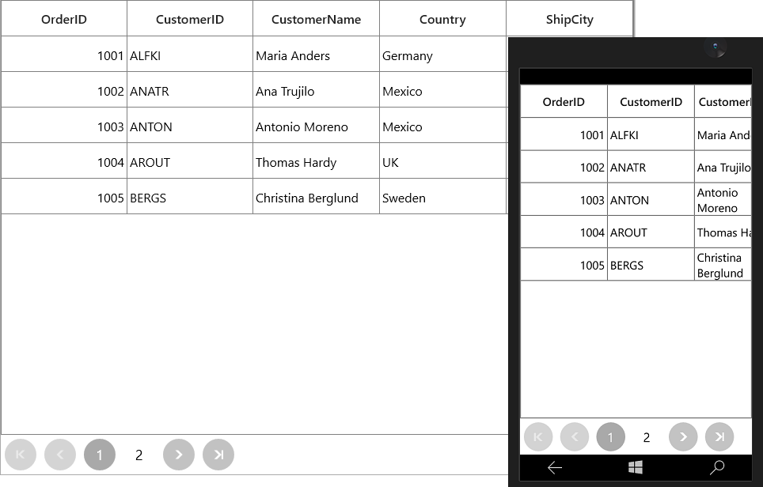
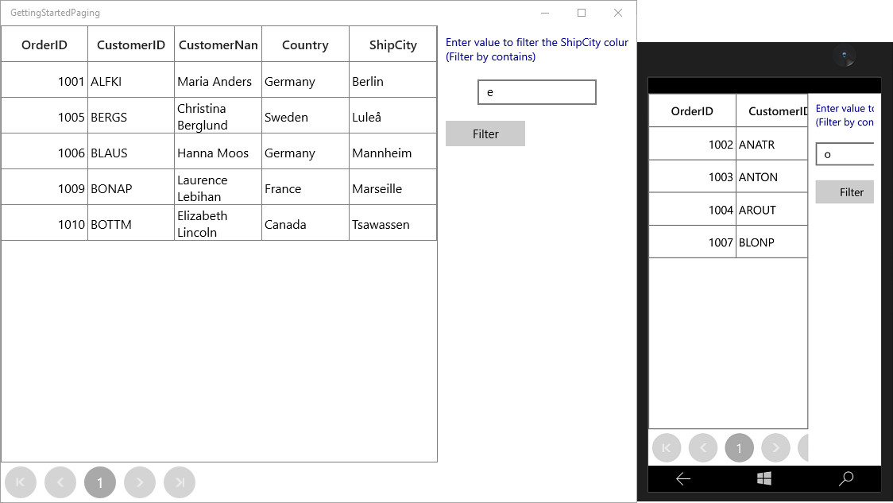
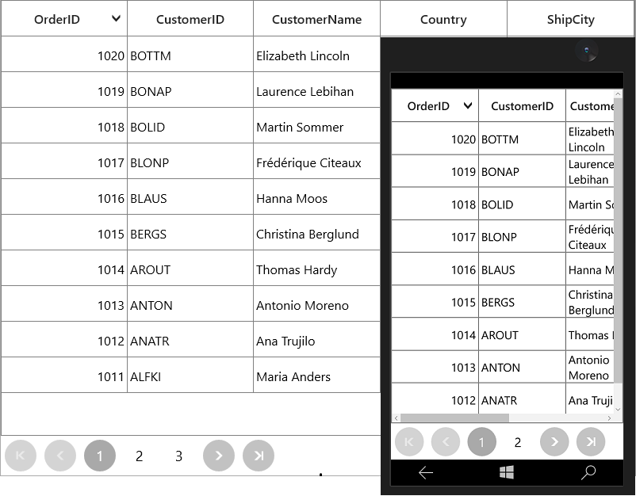

# Paging

SfDataGrid provides support to manipulate the data using SfDataPager control. You can refer [SfDataPager](http://help.syncfusion.com/wpf/sfdatapager) control user guide for more information.

## Getting started

Follow the below steps to bind SfDataGrid with SfDataPager.
 
1. Create IEnumerable collection that you want to bind and set it to `SfDataPager.Source` property.
2. Set [SfDataPager.PageSize](https://help.syncfusion.com/cr/cref_files/uwp/sfdatagrid/Syncfusion.SfGrid.UWP~Syncfusion.UI.Xaml.Controls.DataPager.SfDataPager~PageSize.html) property to specify the number of records to be displayed per page.
3. Bind [SfDataPager.PagedSource](https://help.syncfusion.com/cr/cref_files/uwp/sfdatagrid/Syncfusion.SfGrid.UWP~Syncfusion.UI.Xaml.Controls.DataPager.SfDataPager~PagedSource.html) to [SfDataGrid.ItemsSource](https://help.syncfusion.com/cr/cref_files/uwp/sfdatagrid/Syncfusion.SfGrid.UWP~Syncfusion.UI.Xaml.Grid.SfDataGrid~ItemsSource.html) property. So whenever the page is changed, `PagedSource` will be update based on current page.



xmlns:datapager="using:Syncfusion.UI.Xaml.Controls.DataPager"

<Grid Background="{ThemeResource ApplicationPageBackgroundThemeBrush}">
    <Grid.RowDefinitions>
        <RowDefinition Height="*" />
        <RowDefinition Height="Auto" />
    </Grid.RowDefinitions>

    <syncfusion:SfDataGrid x:Name="dataGrid"                
                            Grid.Row="0"	
                            ItemsSource="{Binding ElementName=dataPager,Path=PagedSource}"/>
    <datapager:SfDataPager x:Name="dataPager"                
                            Grid.Row="1"                
                            PageSize="5"                
                            Source="{Binding Orders}"/>
</Grid>


public class ViewModel
{
    private ObservableCollection<OrderInfo> _orders;
    public ObservableCollection<OrderInfo> Orders
    {
        get { return _orders; }
        set { _orders = value; }
    }

    public ViewModel()
    {
        _orders = new ObservableCollection<OrderInfo>();
        this.GenerateOrders();
    }

    private void GenerateOrders()
    {
        _orders.Add(new OrderInfo(1001, "Maria Anders", "Germany", "ALFKI", "Berlin"));
        _orders.Add(new OrderInfo(1002, "Ana Trujillo", "Mexico", "ANATR", "Mexico D.F."));
        _orders.Add(new OrderInfo(1003, "Antonio Moreno", "Mexico", "ANTON", "Mexico D.F."));
        _orders.Add(new OrderInfo(1004, "Thomas Hardy", "UK", "AROUT", "London"));
        _orders.Add(new OrderInfo(1005, "Christina Berglund", "Sweden", "BERGS", "Lula"));
        _orders.Add(new OrderInfo(1006, "Hanna Moos", "Germany", "BLAUS", "Mannheim"));
        _orders.Add(new OrderInfo(1007, "Frederique Cite aux", "France", "BLONP", "Strasbourg"));
        _orders.Add(new OrderInfo(1008, "Martin", "Spain", "BOLID", "Madrid"));
        _orders.Add(new OrderInfo(1009, "Laurence", "France", "BONAP", "Marseille"));
        _orders.Add(new OrderInfo(1010, "Elizabeth Lincoln", "Canada", "BOTTM", "Tsawassen"));
    }
}

public class OrderInfo
{
    int orderID;
    string customerId;
    string country;
    string customerName;
    string shippingCity;

    public int OrderID
    {
          get {   return orderID;  }
          set {   orderID = value; }
    }

    public string CustomerID
    {
          get {  return customerId; }
          set {  customerId = value; }
    }

    public string CustomerName
    {
          get {  return customerName; }
          set {  customerName = value;}
    }

    public string Country
    {
          get { return country; }
          set  {  country = value; }
    }

    public string ShipCity
    {
         get {  return shippingCity; }
         set {  shippingCity = value; }
    }
    public OrderInfo(int orderId, string customerName, string country, string     
    customerId,string shipCity)
    {
         this.OrderID = orderId;
         this.CustomerName = customerName;
         this.Country = country;
         this.CustomerID = customerId;
         this.ShipCity = shipCity;
    }
}



### Limitations

1. `AddNewRow` is not supported in SfDataGrid.
2. `FilterRow` is not supported in SfDataGrid.

## Load data in on demand

SfDataPager allows you to load data for current page alone using `OnDemandPaging` instead of loading data for all pages.
Follow the below steps to load the `ItemsSource` for page in on demand,

1. Set [SfDataPager.UseOnDemandPaging](https://help.syncfusion.com/cr/cref_files/uwp/sfdatagrid/Syncfusion.SfGrid.UWP~Syncfusion.UI.Xaml.Controls.DataPager.SfDataPager~UseOnDemandPaging.html) as `true`. 
2. Set [SfDataPager.PageCount](https://help.syncfusion.com/cr/cref_files/uwp/sfdatagrid/Syncfusion.SfGrid.UWP~Syncfusion.UI.Xaml.Controls.DataPager.SfDataPager~PageCount.html) based on total number of records and [SfDataPager.PageSize](https://help.syncfusion.com/cr/cref_files/uwp/sfdatagrid/Syncfusion.SfGrid.UWP~Syncfusion.UI.Xaml.Controls.DataPager.SfDataPager~PageSize.html) property.
3. Use [OnDemandLoading](https://help.syncfusion.com/cr/cref_files/uwp/sfdatagrid/Syncfusion.SfGrid.UWP~Syncfusion.UI.Xaml.Controls.DataPager.SfDataPager~OnDemandLoading_EV.html) event to load the `ItemsSource` for current page using [LoadDynamicItems](https://help.syncfusion.com/cr/cref_files/uwp/sfdatagrid/Syncfusion.SfGrid.UWP~Syncfusion.UI.Xaml.Controls.DataPager.SfDataPager~LoadDynamicItems.html) method.
`OnDemandLoading` event is raised when SfDataPager moves to another page and you can load the `ItemsSource` for corresponding page through `OnDemandLoading` event.
[OnDemandLoadingEventArgs](https://help.syncfusion.com/cr/cref_files/uwp/sfdatagrid/Syncfusion.SfGrid.UWP~Syncfusion.UI.Xaml.Controls.DataPager.OnDemandLoadingEventArgs_members.html) has the following members,
1. `StartIndex` - returns the start index based on `PageIndex` (Number of previous pages * PageSize).
2. `PageSize` - denotes the number of records to be displayed in the page.

N> Do not assign `SfDataPager.Source` property while using `OnDemandPaging`.



xmlns:datapager="using:Syncfusion.UI.Xaml.Controls.DataPager"

<Grid>
    <Grid.RowDefinitions>
        <RowDefinition Height="*" />
        <RowDefinition Height="Auto" />
    </Grid.RowDefinitions>

    <syncfusion:SfDataGrid x:Name="dataGrid"
                                               Grid.Row="0"
                                               ItemsSource="{Binding ElementName=dataPager,Path=PagedSource}"/>
    <datapager:SfDataPager x:Name="dataPager" 
                                                  PageCount="3"
                                                  PageSize="10"     
                                                  UseOnDemandPaging="True"
                                                  Grid.Row="1"/>

</Grid>


private ObservableCollection<OrderInfo> source;

public MainWindow()
{
    InitializeComponent();
    dataPager.OnDemandLoading += dataPager_OnDemandLoading;
    source = (this.DataContext as ViewModel).Orders;
}

private void dataPager_OnDemandLoading(object sender, Syncfusion.UI.Xaml.Controls.DataPager.OnDemandLoadingEventArgs args)
{
    dataPager.LoadDynamicItems(args.StartIndex, source.Skip(args.StartIndex).Take(args.PageSize));
}



### Resetting cache

While navigating between the pages, records are loaded through ‘OnDemandLoading’ event and the records of navigated pages will be maintained in cache. If you navigate to already navigated page, the records are loaded from cache instead of loading from ‘OnDemandLoading’ event. 
You can clear the cache by using [PageCollectionView.ResetCache](https://help.syncfusion.com/cr/cref_files/uwp/data/Syncfusion.Data.UWP~Syncfusion.Data.PagedCollectionView~ResetCache.html) method. Once this method is invoked, the ‘OnDemandLoading’ event will be raised while navigating multiple times to the same page.



xmlns:datapager="using:Syncfusion.UI.Xaml.Controls.DataPager"

<datapager:SfDataPager x:Name="dataPager" 
                        PageCount="3"
                        PageSize="10"     
                        UseOnDemandPaging="True"
                        Grid.Row="1"/>


private ObservableCollection<OrderInfo> source;

public MainWindow()
{
    InitializeComponent();
    dataPager.OnDemandLoading += dataPager_OnDemandLoading;
    source = (this.DataContext as ViewModel).Orders;
}

private void dataPager_OnDemandLoading(object sender, Syncfusion.UI.Xaml.Controls.DataPager.OnDemandLoadingEventArgs args)
{
    dataPager.LoadDynamicItems(args.StartIndex, source.Skip(args.StartIndex).Take(args.PageSize));
    //resetting cache for all pages.
  (dataPager.PagedSource as PagedCollectionView).ResetCache();
}



You can also clear the cache to particular page by specifying the `PageIndex` in [PageCollectionView.ResetCacheForPage](https://help.syncfusion.com/cr/cref_files/uwp/data/Syncfusion.Data.UWP~Syncfusion.Data.PagedCollectionView~ResetCacheForPage.html) method.



(dataPager.PagedSource as PagedCollectionView).ResetCacheForPage(this.dataPager.PageIndex);



### Changing PageCount at run time while filtering

You can change the [SfDataPager.PageCount](https://help.syncfusion.com/cr/cref_files/uwp/sfdatagrid/Syncfusion.SfGrid.UWP~Syncfusion.UI.Xaml.Controls.DataPager.SfDataPager~PageCount.html) at runtime based on the records count in ‘OnDemandPaging’. 
Here, PageCount are modified by filtering the records in run time.



xmlns:datapager="using:Syncfusion.UI.Xaml.Controls.DataPager"

<Grid Background="{ThemeResource ApplicationPageBackgroundThemeBrush}">
    <Grid.ColumnDefinitions>
        <ColumnDefinition Width="*" />
        <ColumnDefinition Width="250" />
    </Grid.ColumnDefinitions>

    <Grid.RowDefinitions>
        <RowDefinition Height="*" />
        <RowDefinition Height="Auto" />
    </Grid.RowDefinitions>
    <StackPanel Grid.Column="1">
        <TextBlock Width="250"
                    Margin="10"
                    FontSize="14"
                    Foreground="DarkBlue"
                    Text="Enter value to filter the ShipCity column (Filter by contains)"
                    TextWrapping="Wrap" />
        <TextBox Name="filterTextBox"
                    Width="150"
                    Margin="10" />
        <Button Width="100"
                Margin="10"
                Click="FilterButton_Click"
                Content="Filter" />
    </StackPanel>

    <syncfusion:SfDataGrid x:Name="dataGrid"                                               
                            Grid.Row="0"    
                            ItemsSource="{Binding ElementName=dataPager,Path=PagedSource}"/>
    <datapager:SfDataPager x:Name="dataPager"                                 
                            PageCount="3"                                
                            PageSize="10"                                     
                            UseOnDemandPaging="True"                                
                            Grid.Row="1"/>

</Grid>


public sealed partial class MainPage : Page
{
    private List<OrderInfo> source;
    public MainPage()
    {
        this.InitializeComponent();           
        dataPager.OnDemandLoading += dataPager_OnDemandLoading;
        source = (this.DataContext as ViewModel).Orders;
    }

    private void dataPager_OnDemandLoading(object sender, Syncfusion.UI.Xaml.Controls.DataPager.OnDemandLoadingEventArgs args)
    {            
        dataPager.LoadDynamicItems(args.StartIndex, source.Skip(args.StartIndex).Take(args.PageSize));
    }

    private void FilterButton_Click(object sender, RoutedEventArgs e)
    {
        source = ApplyFilter(source);
        //page count resets based on filtered records.
        if (source.Count() < dataPager.PageSize)
            this.dataPager.PageCount = 1;
        else
        {
            var count = source.Count() / dataPager.PageSize;
            if (source.Count() % dataPager.PageSize == 0)
                this.dataPager.PageCount = count;
            else
                this.dataPager.PageCount = count + 1;
        }
        this.dataPager.MoveToPage(0);

    }
    private List<OrderInfo> ApplyFilter(List<OrderInfo> source)
    {
        //records are filtered based on ShipName column
        return source.Where(item => item.ShipCity.Contains(filterTextBox.Text)).ToList();
    }
}



Here, records are filtered based on the textbox text in clicking event of Filter button. Initially `PageCount` is 3 and it is changed as 1 once the records are filtered.

You can refer the [sample](http://www.syncfusion.com/downloads/support/directtrac/general/ze/ChangingPageCount-412402870.zip) from here.

### Sorting complete collection

You can sort the complete collection with ‘OnDemandPaging’ by using [SfDataGrid.SortColumnsChanging](https://help.syncfusion.com/cr/cref_files/uwp/sfdatagrid/Syncfusion.SfGrid.UWP~Syncfusion.UI.Xaml.Grid.SfDataGrid~SortColumnsChanging_EV.html) event.
In this event, you can sort the complete underlying collection instead of sorting current page alone by resetting the caches.



xmlns:datapager="using:Syncfusion.UI.Xaml.Controls.DataPager"

<Page.DataContext>
    <local:ViewModel/>
</Page.DataContext>
<Grid Background="{ThemeResource ApplicationPageBackgroundThemeBrush}">
    <Grid.RowDefinitions>
        <RowDefinition Height="*" />
        <RowDefinition Height="Auto" />
    </Grid.RowDefinitions>

    <syncfusion:SfDataGrid x:Name="dataGrid"                                               
                            Grid.Row="0"    
                            ItemsSource="{Binding ElementName=dataPager,Path=PagedSource}"/>
    <datapager:SfDataPager x:Name="dataPager"                                 
                            PageCount="3"                                
                            PageSize="10"                                     
                            UseOnDemandPaging="True"                                
                            Grid.Row="1"/>

</Grid>


using Syncfusion.Data.Extensions;

public sealed partial class MainPage : Page
{
    private List<OrderInfo> source;
    public MainPage()
    {
        this.InitializeComponent();
        dataPager.OnDemandLoading += dataPager_OnDemandLoading;
        this.dataGrid.SortColumnsChanging += DataGrid_SortColumnsChanging;
        source = (this.DataContext as ViewModel).Orders;
    }

    private void DataGrid_SortColumnsChanging(object sender, GridSortColumnsChangingEventArgs e)
    {
        (dataPager.PagedSource as PagedCollectionView).ResetCache();
        (dataPager.PagedSource as PagedCollectionView).ResetCacheForPage(dataPager.PageIndex);
        if (e.Action == NotifyCollectionChangedAction.Add || e.Action == NotifyCollectionChangedAction.Replace)
        {
            var sortDesc = e.AddedItems[0];
            if (sortDesc.SortDirection == ListSortDirection.Ascending)
            {
                //records are sorted in ascending order.
                source = source.AsQueryable().OrderBy(sortDesc.ColumnName).Cast<OrderInfo>().ToList();
            }
            else
            {
                //records are sorted descending order.
                source =
                    source.AsQueryable()
                            .OrderByDescending(sortDesc.ColumnName)
                            .Cast<OrderInfo>()
                            .ToList();
            }
            this.dataPager.MoveToPage(dataPager.PageIndex);
        }
    }

    private void dataPager_OnDemandLoading(object sender, Syncfusion.UI.Xaml.Controls.DataPager.OnDemandLoadingEventArgs args)
    {            
        dataPager.LoadDynamicItems(args.StartIndex, source.Skip(args.StartIndex).Take(args.PageSize));
    }     
}



### Loading ItemsSource for page using async and await

When you fetch the data from external server, it takes some time to load the data. In this case, you can delay the loading in `SfDataPager.OnDemandLoading` event using `async` and `await`. 
Here `dataPager_OnDemandLoading` event is defined with `async` keyword to load the data by time delay. GetEmployeesDetailsListAsync method is invoked in `dataPager_OnDemandLoading` with await keyword which holds the execution until returning the data. 



public sealed partial class MainPage : Page
{
    private EmployeeInfoRepository repository;
    public MainPage()
    {
        this.InitializeComponent();
        repository = new EmployeeInfoRepository();
    }

    //async method which return data with some delay
    public async Task<List<Employees>> GetEmployeesDetailsListAsync(int startIndex, int pageSize)
    {
        var employees = new List<Employees>();
        //wait the method Execution to 2000 milliseconds
        Task.Delay(1000).Wait();
        for (int i = startIndex; i < (startIndex + pageSize); i++)
        {
            //Get the Data's to SfDataPager from ViewModel class
            employees.Add(repository.GetEmployees(i));
        }
        return employees;
    }

    //Delegate handler marked as async to use await inside
    private async void dataPager_OnDemandLoading(object sender, OnDemandLoadingEventArgs args)
    {
        var source = await GetEmployeesDetailsListAsync(args.StartIndex, args.PageSize);
        //Data's loaded to SfDataPager dynamically      
        dataPager.LoadDynamicItems(args.StartIndex, source.Take(args.PageSize));          
    }
}



`GetEmployees` method in EmployeeInfoRepository returns the record to SfDataPager.



public class EmployeeInfoRepository
{
    public EmployeeInfoRepository()
    {
    }

    public List<Employees> GetEmployees(int startIndex, int pageSize)
    {
        int j = 0;
        var employees = new List<Employees>();
        for (int i = startIndex; i < (startIndex + pageSize); i++)
        {
            Employees employee = GetEmployee(employees);
            employees.Add(employee);
        }
        return employees;
    } 
}



### Limitations

1. UI Filtering is not supported. You can code in application level to filter the data.
2. Data processing operations (Sorting, Grouping) are done only in the current page. 
3. Deleting is not supported. You can code to delete row in application level. 
