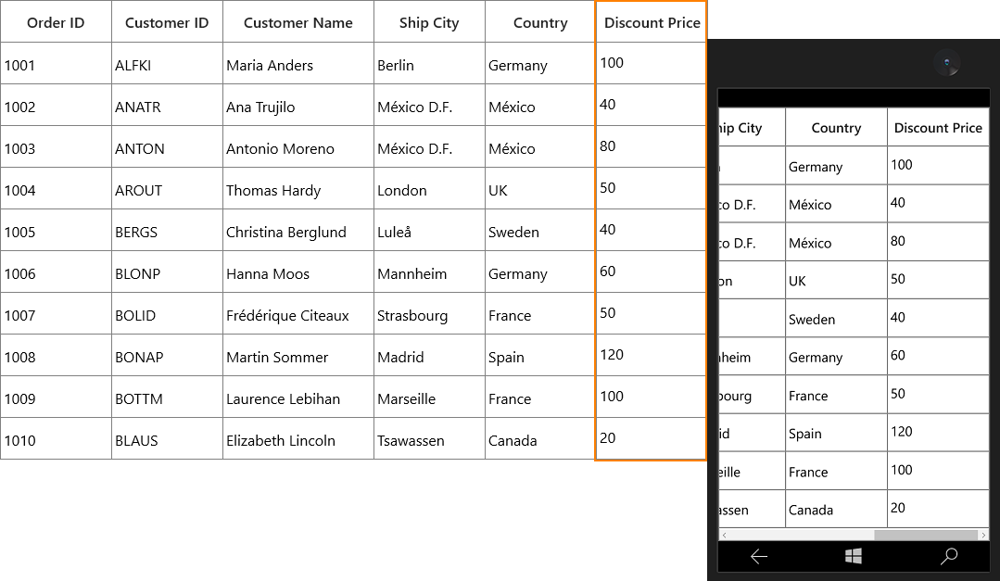
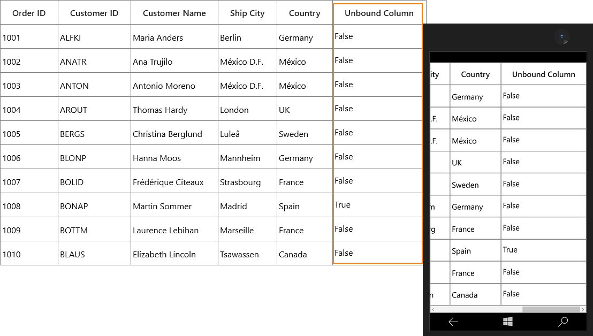
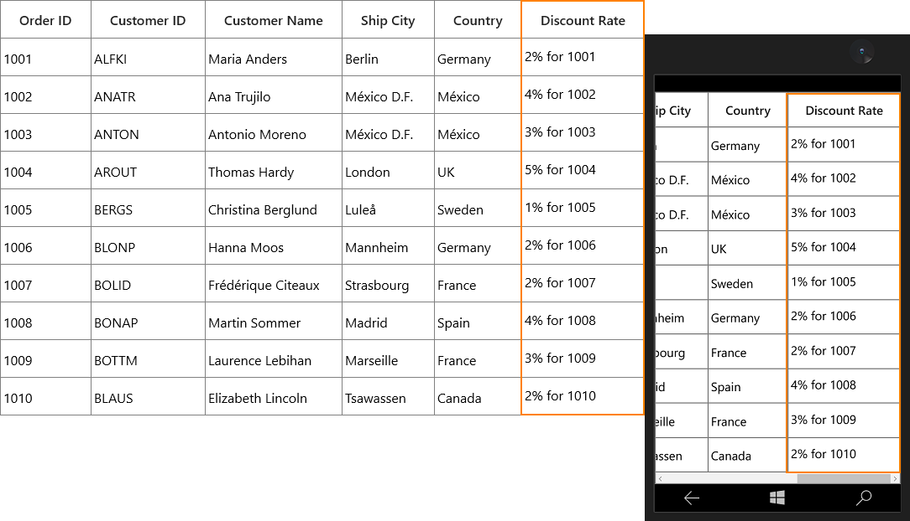
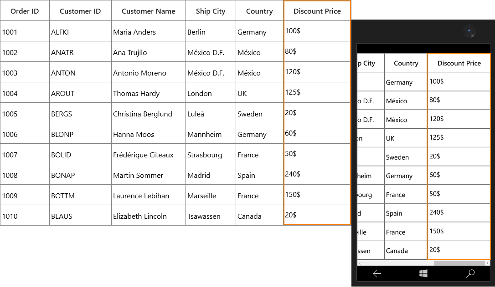
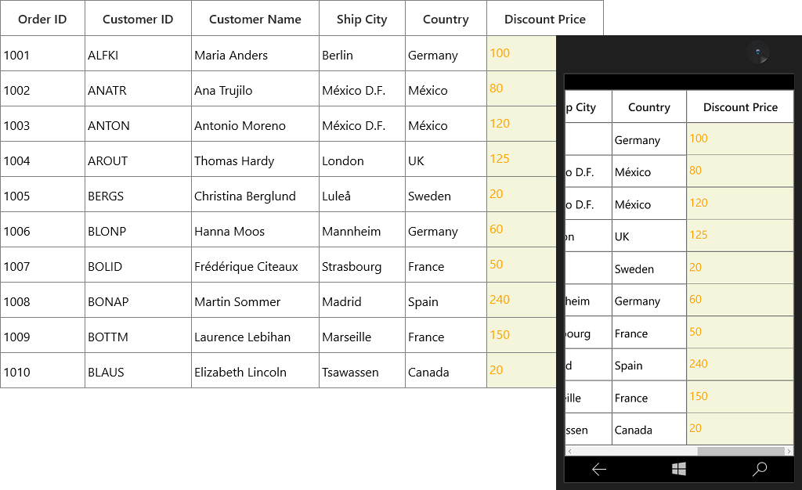

# GridUnBoundColumn

SfDataGrid allows you to add **additional columns** which are **not bound with data object** from underlying data source. You can add unbound column using GridUnBoundColumn class. Unbound columns support for sorting, filtering, grouping, exporting and printing as normal columns.



<syncfusion:SfDataGrid x:Name="dataGrid"                                                                       
                       AutoGenerateColumns="False" 
                       ItemsSource="{Binding Orders}">
    <syncfusion:SfDataGrid.Columns>
        <syncfusion:GridUnBoundColumn Expression="UnitPrice*Discount"
                                      HeaderText="Discount Price"
                                      MappingName="DiscountPrice" />    
    </syncfusion:SfDataGrid.Columns>
</syncfusion:SfDataGrid>


this.dataGrid.Columns.Add(new GridUnBoundColumn() { HeaderText = "Discount Price", MappingName = "DiscountPrice", Expression = "UnitPrice*Discount" });



N> It is mandatory to specify the `GridColumn.MappingName` for `GridUnBoundColumn` with some name to identify the column. It is not necessary to define name of field in the data object.

## Populating data for unbound column

You can populate the data for unbound column by setting `Expression` or `Format` property or through `QueryUnBoundColumnValue` event.
 
### Using Expression

You can specify the arithmetic or logic expression using `Expression` property to compute the display value. By default, `GridUnBoundColumn` evaluates the expression with casing. You can disable the casing while evaluate the expression by setting `CaseSensitive` property to `false`.
 
Below are the list of Arithmetic and logical operations supported.

<table>
<tr>
<th>
Arithmetic operations
</th>
<th>
Operator
</th>
</tr>
<tr>
<td>
Add
</td>
<td>
+
</td>
</tr>
<tr>
<td>
Subtract
</td>
<td>
-
</td>
</tr>
<tr>
<td>
Multiply
</td>
<td>
*
</td>
</tr>
<tr>
<td>
Divide
</td>
<td>
/
</td>
</tr>
<tr>
<td>
Power
</td>
<td>
^
</td>
</tr>
<tr>
<td>
Mod
</td>
<td>
%
</td>
</tr>
<tr>
<td>
Greater Than
</td>
<td>
>
</td>
</tr>
<tr>
<td>
Less Than
</td>
<td>
<
</td>
</tr>
<tr>
<td>
Equal
</td>
<td>
=
</td>
</tr>
<tr>
<td>
GreaterThanOrEqual
</td>
<td>
>=
</td>
</tr>
<tr>
<td>
LessThanOrEqual
</td>
<td>
<=
</td>
</tr>
</table>

Logical Operations

<table>
<tr>
<th>
Logical operations
</th>
<th>
Operators
</th>
</tr>
<tr>
<td>
AND
</td>
<td>
(char)135
</td>
</tr>
<tr>
<td>
OR
</td>
<td>
(char)136
</td>
</tr>
<tr>
<td>
NOT
</td>
<td>
(char)137
</td>
</tr>
</table>



<syncfusion:SfDataGrid x:Name="dataGrid"                                                                       
                       AutoGenerateColumns="False" 
                       ItemsSource="{Binding Orders}">
                       
    <syncfusion:SfDataGrid.Columns>
        <syncfusion:GridUnBoundColumn HeaderText="Unbound Column"
                                      MappingName="UnboundColumn" />
    </syncfusion:SfDataGrid.Columns>
    
</syncfusion:SfDataGrid>


(this.dataGrid.Columns[5] as GridUnBoundColumn).Expression = "Discount * UnitPrice > 0" + (char)135 + "UnitPrice * Quantity > 100";



### Using Format

You can format the values of other columns and display the formatted value in unbound column using `Format` property.



<syncfusion:SfDataGrid x:Name="dataGrid"
                       AutoGenerateColumns="False" 
                       ItemsSource="{Binding Orders}">
                       
    <syncfusion:SfDataGrid.Columns>
        <syncfusion:GridUnBoundColumn Format="'{Discount}% for {OrderID}'"
                                      HeaderText="Discount Rate"
                                      MappingName="Discount" />
    </syncfusion:SfDataGrid.Columns>
    
</syncfusion:SfDataGrid>


this.dataGrid.Columns.Add(new GridUnBoundColumn() { HeaderText = "Discount Rate", MappingName = "Discount", Format = "'{Discount}% for {OrderID}'" });



### Using QueryUnBoundColumnValue event

You can populate the data for unbound column by handling the `QueryUnBoundColumnValue` event. 

`GridUnBoundColumnEventArgs` of the `QueryUnBoundColumnValue` event provides the information about the cell triggered this event. `GridUnBoundColumnValueEventsArgs.OriginalSender` returns the DataGrid fired this event for DetailsView.

You can get or set the `GridUnBoundColumnEventArgs.Value` property based on the `UnBoundAction`.

UnBoundAction - `QueryData` denotes the event triggered to query value and cell information and the
 
UnBoundAction - `CommitData` denotes the event triggered to save the edited value.

 


this.dataGrid.QueryUnboundColumnValue += dataGrid_QueryUnboundColumnValue;

void dataGrid_QueryUnboundColumnValue(object sender, GridUnboundColumnEventsArgs e)
{
    if (e.UnBoundAction == UnBoundActions.QueryData)
    {
        var unitPrice = Convert.ToDouble(e.Record.GetType().GetProperty("UnitPrice").GetValue(e.Record));
        
        var disCount = Convert.ToDouble(e.Record.GetType().GetProperty("Discount").GetValue(e.Record));
        
        var save = unitPrice * disCount;
        
        e.Value = save.ToString() + "$";
    }
}



## Refreshing the unbound column at runtime

You can trigger the `QueryUnBoundColumnValue` event or recalculate the value for the cells of unbound column at runtime by calling `UpdateUnboundColumn` method.



this.dataGrid.CurrentCellEndEdit += DataGrid_CurrentCellEndEdit;

using Syncfusion.UI.Xaml.Grid.Helpers;

private void DataGrid_CurrentCellEndEdit(object sender, CurrentCellEndEditEventArgs args)
{
    this.dataGrid.UpdateUnboundColumn(this.dataGrid.CurrentItem, "Discount");
}



## Editing unbound column

### Cancel the editing for unbound column cell

You can cancel the editing of unbound column cell by handling the `SfDataGrid.CurrentCellBeginEdit` event.



this.dataGrid.CurrentCellBeginEdit += DataGrid_CurrentCellBeginEdit;

private void DataGrid_CurrentCellBeginEdit(object sender, CurrentCellBeginEditEventArgs args)
{
    args.Cancel = args.Column is GridUnBoundColumn;
}



### Saving edited value of unbound column using QueryUnBoundColumnValue.

You can get the edited value of unbound column from `GridUnboundColumnEventsArgs.Value` property of `QueryUnBoundColumnValue` event when UnBoundAction is `CommitData`.



this.dataGrid.QueryUnboundColumnValue += DataGrid_QueryUnboundColumnValue;

private void DataGrid_QueryUnboundColumnValue(object sender, GridUnboundColumnEventsArgs e)
{
    if (e.UnBoundAction == UnBoundActions.CommitData)
    {
        var edittedValue = e.Value;
    }
}



### Read unbound column values

You can get the value of `GridUnBoundColumn` using `GetUnBoundCellValue` method.
 


using Syncfusion.UI.Xaml.Grid.Helpers;

this.dataGrid.CurrentCellValueChanged += DataGrid_CurrentCellValueChanged;

private void DataGrid_CurrentCellValueChanged(object sender, CurrentCellValueChangedEventArgs args)
{
    var updateValue = this.dataGrid.GetUnBoundCellValue(dataGrid.Columns[5], this.dataGrid.CurrentItem);
}



## Styling unbound column

You can customize the style of unbound column by writing style of TargetType `GridCell` or setting `GridColumn.CellStyle` property.

In the below code snippet, `Foreground` and `Background` of the cells in GridUnBoundColumn changed.



<syncfusion:GridUnBoundColumn Expression="UnitPrice*Discount"
                              HeaderText="Discount Price"
                              MappingName="Discount">
                              
    <syncfusion:GridUnBoundColumn.CellStyle>
    
        
        
    </syncfusion:GridUnBoundColumn.CellStyle>
    
</syncfusion:GridUnBoundColumn>



You can refer the [Styling](http://help.syncfusion.com/uwp/sfdatagrid/column-types#styling-gridcolumn) section of `GridColumn` for more information.

## Customize the Unbound column behavior

SfDataGrid allows you to customize the operations like key navigation and UI related interactions by overriding the corresponding renderer associated with the unbound column.
  
Below table lists the available cell types for unbound column.

<table>
<tr>
<th>
Cell Type
</th>
<th>
Renderer
</th>
</tr>
<tr>
<td>
UnBoundTemplateColumn
</td>
<td>
GridUnBoundCellTemplateRenderer
</td>
</tr>
<tr>
<td>
UnBoundTextColumn
</td>
<td>
GridUnBoundCellTextBoxRenderer
</td>
</tr>
</table>

If the `GridUnBoundColumn.EditTemplate` not defined, then the `UnboundTextColumn**`** set as default cell type of `GridUnBoundColumn`.
 
If `GridUnBoundColumn.EditTemplate` property defined, then `UnBoundTemplateColumn` set as cell type of `GridUnBoundColumn`

### Overriding Existing CellType

You can customize the unbound row cell behavior by overriding existing renderer and replace the default one in `SfDataGrid.CellRenderers`.

In the below code snippet, `GridUnBoundCellTextBoxRenderer` is customized to change the foreground and replaced the default renderer with customized renderer in `SfDataGrid.CellRenderers` collection.



this.dataGrid.CellRenderers.Remove("UnBoundTextColumn");
this.dataGrid.CellRenderers.Add("UnBoundTextColumn", new GridUnBoundCellTextBoxRendererExt());

public class GridUnBoundCellTextBoxRendererExt: GridUnBoundCellTextBoxRenderer
{
    public override void OnInitializeDisplayElement(DataColumnBase dataColumn, TextBlock uiElement, object dataContext)
    {
        object cellvalue = null;
        
        if (dataContext != null)
            cellvalue = DataGrid.GetUnBoundCellValue(dataColumn.GridColumn, dataContext);
            
        uiElement.Text = cellvalue == null ? string.Empty : cellvalue.ToString();
         
        uiElement.Foreground = new SolidColorBrush(Colors.Blue);
    }
    
    
    public override void OnInitializeEditElement(DataColumnBase dataColumn, TextBox uiElement, object dataContext)
    {
        object cellvalue = null;
        
        if (dataContext != null)
            cellvalue = DataGrid.GetUnBoundCellValue(dataColumn.GridColumn, dataContext);
            
        uiElement.Text = cellvalue == null ? string.Empty : cellvalue.ToString();
    }
}



### Custom Renderer

You can change the renderer of unbound column by removing the predefined cell type value from `CellRenderers` collection and add the newly derived renderer from `GridVirtualizingCellRenderer`. Refer the [Create the renderer for existing column section](http://help.syncfusion.com/uwp/sfdatagrid/column-types#create-the-renderer-of-existing-column) for more information to create the custom renderer in columns section.

## Templating unbound column

You can load any WPF control in the display mode for `GridUnBoundColumn` by setting `GridColumn.CellTemplate` property. In edit mode, corresponding editor will be loaded based on column type. You can refer the [CellTemplate](http://help.syncfusion.com/uwp/sfdatagrid/column-types#celltemplate-in-gridcolumn) section of `GridColumn` and [GridTemplateColumn](http://help.syncfusion.com/uwp/sfdatagrid/column-types#gridtemplatecolumn) for more information.
