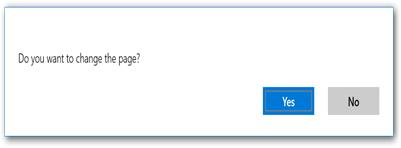

# Programmatically processing paging

## Changing PageIndex at runtime
[SfDataPager](https://help.syncfusion.com/cr/cref_files/uwp/sfdatagrid/frlrfSyncfusionUIXamlControlsDataPagerSfDataPagerClassTopic.html#) exposes the [PageIndex](https://help.syncfusion.com/cr/cref_files/uwp/sfdatagrid/frlrfSyncfusionUIXamlControlsDataPagerSfDataPagerClassPageIndexTopic.html#) property, which denotes the index of currently selected page. You can use this property to set or get the current page of the `SfDataPager`.

<table>
<tr>
<th>
Event</th><th>
Description</th></tr>
<tr>
<td>
{{'[PageIndexChanging](https://help.syncfusion.com/cr/cref_files/uwp/sfdatagrid/frlrfSyncfusionUIXamlControlsDataPagerSfDataPagerClassPageIndexChangingTopic.html#)'| markdownify }}</td><td>
Event triggered before the current page index changed. By using this event, you can cancel the current page changing operation by setting `Cancel` to `true`.</td></tr>
<tr>
<td>
{{'[PageIndexChanged](https://help.syncfusion.com/cr/cref_files/uwp/sfdatagrid/frlrfSyncfusionUIXamlControlsDataPagerSfDataPagerClassPageIndexChangedTopic.html#)'| markdownify }}</td><td>
Event triggered after the current page index changed.</td></tr>
</table>

## Programmatically changing PageCount

[SfDataPager](https://help.syncfusion.com/cr/cref_files/uwp/sfdatagrid/index.html#frlrfSyncfusionUIXamlControlsDataPagerSfDataPagerClassTopic.html) allows you to change the current page using [PageCount](https://help.syncfusion.com/cr/cref_files/uwp/sfdatagrid/frlrfSyncfusionUIXamlControlsDataPagerSfDataPagerClassPageCountTopic.html#) property. you can change the `PageCount` during the run time. 

## Changing PageIndex using method

[SfDataPager](https://help.syncfusion.com/cr/cref_files/uwp/sfdatagrid/index.html#frlrfSyncfusionUIXamlControlsDataPagerSfDataPagerClassTopic.html) allows you to change the current page using built-in methods. For example, you can change the `PageIndex` to last page by calling [MoveToLastPage](https://help.syncfusion.com/cr/cref_files/uwp/sfdatagrid/frlrfSyncfusionUIXamlControlsDataPagerSfDataPagerClassMoveToLastPageTopic.html#)() method. 

`SfDataPager` provides the following methods for changing current page.

<table>
<tr>
<th>
Method</th><th>
Prototype</th><th>
Description</th></tr>
<tr>
<td>
{{'[MoveToFirstPage](https://help.syncfusion.com/cr/cref_files/uwp/sfdatagrid/index.html#frlrfSyncfusionUIXamlControlsDataPagerSfDataPagerClassMoveToFirstPageTopic.html)'| markdownify }}</td><td>
MoveToFirstPage()</td><td>
This method moves the current page index to the first page and displays the first page data.</td></tr>
<tr>
<td>
{{'[MoveToLastPage](https://help.syncfusion.com/cr/cref_files/uwp/sfdatagrid/frlrfSyncfusionUIXamlControlsDataPagerSfDataPagerClassMoveToLastPageTopic.html#)'| markdownify }}</td><td>
MoveToLastPage()</td><td>
This method moves the current page index to the last page and displays the last page data.</td></tr>
<tr>
<td>
{{'[MoveToNextPage](https://help.syncfusion.com/cr/cref_files/uwp/sfdatagrid/frlrfSyncfusionUIXamlControlsDataPagerSfDataPagerClassMoveToNextPageTopic.html#)'| markdownify }}</td><td>
MoveToNextPage()</td><td>
This method moves the current page index to the next page and displays the next page data.</td></tr>
<tr>
<td>
{{'[MoveToPreviousPage](https://help.syncfusion.com/cr/cref_files/uwp/sfdatagrid/frlrfSyncfusionUIXamlControlsDataPagerSfDataPagerClassMoveToPreviousPageTopic.html#)'| markdownify }}</td><td>
MoveToPreviousPage()</td><td>
This method moves the current page index to the previous page and displays the previous page data.</td></tr>
<tr>
<td>
{{'[MoveToPage](https://help.syncfusion.com/cr/cref_files/uwp/sfdatagrid/frlrfSyncfusionUIXamlControlsDataPagerSfDataPagerClassMoveToPageTopic.html#)'| markdownify }}</td><td>
MoveToPage(int pageIndex)</td><td>
This method moves the current page index to the corresponding page index that is passed as an argument.</td></tr>
<tr>
<td>
{{'[MoveToPage](https://help.syncfusion.com/cr/cref_files/uwp/sfdatagrid/frlrfSyncfusionUIXamlControlsDataPagerSfDataPagerClassMoveToPageTopic.html#)'| markdownify }}</td><td>
MoveToPage(int oldPageIndex, int pageIndex)</td><td>
This method moves the old page index to the corresponding page index that is passed as an argument.</td></tr>
<tr>
<td>
{{'[MoveToPage](https://help.syncfusion.com/cr/cref_files/uwp/sfdatagrid/frlrfSyncfusionUIXamlControlsDataPagerSfDataPagerClassMoveToPageTopic.html#)'| markdownify }}</td><td>
MoveToPage(int pageIndex, bool isElipsisElementClicked)</td><td>
This method moves the current page index to the corresponding page index that is clicked by ellipsis button.</td></tr>
</table>

## Handling current page changing using event

You can cancel the current page changing operation by handling [PageIndexChanging](https://help.syncfusion.com/cr/cref_files/uwp/sfdatagrid/index.html#frlrfSyncfusionUIXamlControlsDataPagerSfDataPagerClassPageIndexChangingTopic.html) event.

The following example displays the `MessageDialog` when end-user tries to change the page.



<datapager:SfDataPager x:Name="sfDataPager" 
                         PageSize="5" 
                         NumericButtonCount="5"
                         PageCount="10"
                         PageIndexChanging="sfDataPager_PageIndexChanging"
                         UseOnDemandPaging="True"/>                    


this.sfDataPager.PageIndexChanging += SfDataPager_PageIndexChanging;

private async void sfDataPager_PageIndexChanging(object sender, PageIndexChangingEventArgs args)
{
    MessageDialog messageDialog = new MessageDialog("Do you want to change the page?");
    messageDialog.Commands.Clear();
    messageDialog.Commands.Add(new UICommand { Label = "Yes", Id = 0 });
    messageDialog.Commands.Add(new UICommand { Label = "No", Id = 1 });
    var result = await messageDialog.ShowAsync();
    if ((int)result.Id == 1 )
    {
        args.Cancel = true;
    }
}



