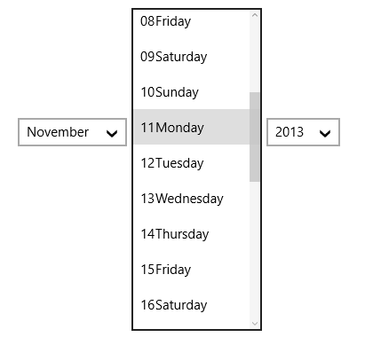
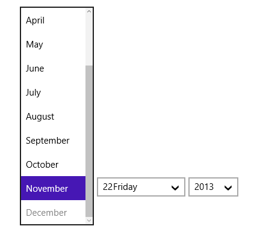

# Displaying Minimum and Maximum Dates

TO display the minimum and maximum dates in SfDateTimeCombo, use DisplayMinDate and DisplayMaxDate properties respectively.

The following code example and screen shots illustrate this.





<Grid Background="{StaticResource ApplicationPageBackgroundThemeBrush}">

<syncfusion:SfDateTimeCombo FormatString="mdy" x:Name="combo" Width="350" HorizontalAlignment="Left"/>   

</Grid> 





combo.DisplayMinDate = new DateTime(2012,10,2);

combo.DisplayMaxDate = new DateTime(2013,11,22);





