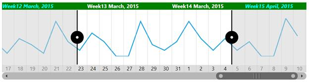
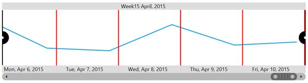
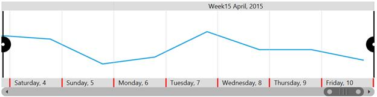
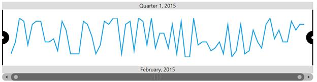
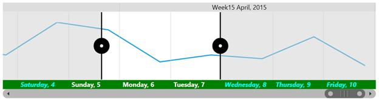
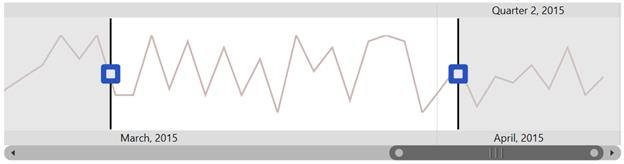
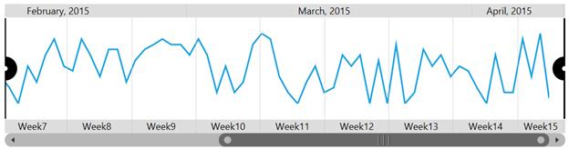

# Customization

## Higher Level Bar Customization

Higher level bar style can be customized using the following properties.

* [`HigherBarGridLineStyle`](http://help.syncfusion.com/cr/cref_files/uwp/sfchart/frlrfSyncfusionUIXamlChartsSfDateTimeRangeNavigatorClassHigherBarGridLineStyleTopic.html#)- Gets or sets the style for upper bar gridlines.



<chart:SfDateTimeRangeNavigator.HigherBarGridLineStyle>

</chart:SfDateTimeRangeNavigator.HigherBarGridLineStyle>



* [`HigherBarTickLineStyle`](http://help.syncfusion.com/cr/cref_files/uwp/sfchart/frlrfSyncfusionUIXamlChartsSfDateTimeRangeNavigatorClassHigherBarTickLineStyleTopic.html#)- Gets or sets the style for ticklines inside the upper bar.



<chart:SfDateTimeRangeNavigator.HigherBarTickLineStyle>

</chart:SfDateTimeRangeNavigator.HigherBarTickLineStyle>



* [`HigherLevelBarStyle`](http://help.syncfusion.com/cr/cref_files/uwp/sfchart/frlrfSyncfusionUIXamlChartsSfDateTimeRangeNavigatorClassHigherLevelBarStyleTopic.html#)- Gets or sets the styles for the higherlabelbar of SfDateTimeRangeNavigator.
* [`HigherLabelStyle`](http://help.syncfusion.com/cr/cref_files/uwp/sfchart/frlrfSyncfusionUIXamlChartsSfDateTimeRangeNavigatorClassHigherLabelStyleTopic.html#)- Gets or sets the higher label style.
* [`SelectedLabelStyle`](http://help.syncfusion.com/cr/cref_files/uwp/sfchart/frlrfSyncfusionUIXamlChartsLabelBarStyleClassSelectedLabelStyleTopic.html#)- Gets or sets the style for labels in the selected region.
* [`Position`](http://help.syncfusion.com/cr/cref_files/uwp/sfchart/frlrfSyncfusionUIXamlChartsLabelBarStyleClassPositionTopic.html#)- Gets or sets position value which is used to position the upper and lower labels inside or outside. 
* [`SelectedLabelBrush`](http://help.syncfusion.com/cr/cref_files/uwp/sfchart/frlrfSyncfusionUIXamlChartsLabelBarStyleClassSelectedLabelBrushTopic.html#) – Gets or sets the color of the labels inside the selected region.
* [`LabelHorizontalAlignment`](http://help.syncfusion.com/cr/cref_files/wpf/sfchart/Syncfusion.SfChart.WPF~Syncfusion.UI.Xaml.Charts.LabelBarStyle~LabelHorizontalAlignment.html#)- An attached property of LabelBarStyle, used to align the labels in level bar.
* [`Background`](http://help.syncfusion.com/cr/cref_files/uwp/sfchart/frlrfSyncfusionUIXamlChartsLabelBarStyleClassBackgroundTopic.html#) – Gets or sets the Background the label bar. 



<chart:SfDateTimeRangeNavigator.HigherLevelBarStyle>

<chart:LabelBarStyle Background="Green" Position="Outside" 

SelectedLabelBrush="White" 

LabelHorizontalAlignment="Center">

<chart:LabelBarStyle.SelectedLabelStyle>

</chart:LabelBarStyle.SelectedLabelStyle>

</chart:LabelBarStyle>

</chart:SfDateTimeRangeNavigator.HigherLevelBarStyle>

<chart:SfDateTimeRangeNavigator.HigherLabelStyle>

</chart:SfDateTimeRangeNavigator.HigherLabelStyle>



The following output is displayed as the result of above code.

## Lower Level Bar Customization

Lower level bar style can be customized using the following properties.

* [`LowerBarGridLineStyle`](http://help.syncfusion.com/cr/cref_files/uwp/sfchart/frlrfSyncfusionUIXamlChartsSfDateTimeRangeNavigatorClassLowerBarGridLineStyleTopic.html#)- Gets or sets the style for lower bar gridlines.



<chart:SfDateTimeRangeNavigator.LowerBarGridLineStyle>

 

</chart:SfDateTimeRangeNavigator.LowerBarGridLineStyle>



* [`LowerBarTickLineStyle`](http://help.syncfusion.com/cr/cref_files/uwp/sfchart/frlrfSyncfusionUIXamlChartsSfDateTimeRangeNavigatorClassLowerBarTickLineStyleTopic.html#)- Gets or sets the style for ticklines in lower bar.



<chart:SfDateTimeRangeNavigator.LowerBarTickLineStyle>

</chart:SfDateTimeRangeNavigator.LowerBarTickLineStyle>



* [`Minimum`](http://help.syncfusion.com/cr/cref_files/uwp/sfchart/frlrfSyncfusionUIXamlChartsSfDateTimeRangeNavigatorClassMinimumTopic.html#)- Gets or sets the Minimum Starting Range of the SfDateTimeRangeNavigator.
* [`Maximum`](http://help.syncfusion.com/cr/cref_files/uwp/sfchart/frlrfSyncfusionUIXamlChartsSfDateTimeRangeNavigatorClassMaximumTopic.html#)- Gets or sets the Maximum Ending Range of the SfDateTimeRangeNavigator.



<chart:SfDateTimeRangeNavigator x:Name="RangeNavigator" Width="700" 

Height="179"   

Minimum="February,2015"

Maximum="March,2015"                                  

XBindingPath="Date" >  </chart:SfDateTimeRangeNavigator>                 



* [`LowerLevelBarStyle`](http://help.syncfusion.com/cr/cref_files/uwp/sfchart/frlrfSyncfusionUIXamlChartsSfDateTimeRangeNavigatorClassLowerLevelBarStyleTopic.html#)- Gets or sets the styles for the lowerlabelbar of SfDateTimeRangeNavigator.
* [`LowerLabelStyle`](http://help.syncfusion.com/cr/cref_files/uwp/sfchart/frlrfSyncfusionUIXamlChartsSfDateTimeRangeNavigatorClassLowerLabelStyleTopic.html#) – Gets or sets the lower label style.



<chart:SfDateTimeRangeNavigator.LowerLevelBarStyle>

<chart:LabelBarStyle Background="Green" Position="Outside"

SelectedLabelBrush="White" 

LabelHorizontalAlignment="Center">

<chart:LabelBarStyle.SelectedLabelStyle>

</chart:LabelBarStyle.SelectedLabelStyle>

</chart:LabelBarStyle>

</chart:SfDateTimeRangeNavigator.LowerLevelBarStyle>

<chart:SfDateTimeRangeNavigator.LowerLabelStyle>

</chart:SfDateTimeRangeNavigator.LowerLabelStyle>



## Thumb Style Customization

SfDateTimeRangeNavigator provides the following properties to customize the left and right thumb.

* [`LeftThumbStyle`](http://help.syncfusion.com/cr/cref_files/uwp/sfchart/frlrfSyncfusionUIXamlChartsSfDateTimeRangeNavigatorClassLeftThumbStyleTopic.html#)- Gets or sets the thumb style for left thumb.
* [`RightThumbStyle`](http://help.syncfusion.com/cr/cref_files/uwp/sfchart/frlrfSyncfusionUIXamlChartsSfDateTimeRangeNavigatorClassRightThumbStyleTopic.html#)- Gets or sets the right thumb style.
* [`SymbolTemplate`](http://help.syncfusion.com/cr/cref_files/uwp/sfchart/frlrfSyncfusionUIXamlChartsThumbStyleClassSymbolTemplateTopic.html#)- Gets or sets the data template for the symbol.



<chart:SfDateTimeRangeNavigator.RightThumbStyle>

<chart:ThumbStyle>

<chart:ThumbStyle.SymbolTemplate>

<DataTemplate>

<Grid>

<Border Name="outerBorder"

Background="#2a52be"                                

Height="26" Width="26" Opacity="1" 

BorderThickness="2" CornerRadius="4"/>

<Border Name="innerBorder"

Background="#e6e6fa" Width="10"                                

Height="10" CornerRadius="1" Opacity="1" />

</Grid>

</DataTemplate>

</chart:ThumbStyle.SymbolTemplate>

</chart:ThumbStyle>

</chart:SfDateTimeRangeNavigator.RightThumbStyle>

<chart:SfDateTimeRangeNavigator.LeftThumbStyle>

<chart:ThumbStyle>

<chart:ThumbStyle.SymbolTemplate>

<DataTemplate>

<Grid>

<Border Name="outerBorder"

Background="#2a52be" Height="26"                                 

Width="26" Opacity="1" BorderThickness="2" 

CornerRadius="4"/>

<Border Name="innerBorder"

Background="#e6e6fa" 

Height="10" Width="10" CornerRadius="1" Opacity="1" />

</Grid>

</DataTemplate>

</chart:ThumbStyle.SymbolTemplate>

</chart:ThumbStyle>

</chart:SfDateTimeRangeNavigator.LeftThumbStyle>



* [`LineStyle`](http://help.syncfusion.com/cr/cref_files/uwp/sfchart/frlrfSyncfusionUIXamlChartsThumbStyleClassLineStyleTopic.html#)- Gets or sets the style for the thumb line.



<chart:SfDateTimeRangeNavigator.LeftThumbStyle>

<chart:ThumbStyle>

<chart:ThumbStyle.LineStyle>

</chart:ThumbStyle.LineStyle>

</chart:ThumbStyle>

</chart:SfDateTimeRangeNavigator.LeftThumbStyle>

<chart:SfDateTimeRangeNavigator.RightThumbStyle>

<chart:ThumbStyle>

<chart:ThumbStyle.LineStyle>

</chart:ThumbStyle.LineStyle>

</chart:ThumbStyle>

</chart:SfDateTimeRangeNavigator.RightThumbStyle>



## Label Customization

User can also set the Interval which they think suitable for their data, this can be done by using Interval Property and can also set format to the labels.

* [`Intervals`](http://help.syncfusion.com/cr/cref_files/uwp/sfchart/frlrfSyncfusionUIXamlChartsSfDateTimeRangeNavigatorClassIntervalsTopic.html#)- Gets or sets intervals collection to render labels of SfDateTimeRangeNavigator.



<chart:SfDateTimeRangeNavigator x:Name="RangeNavigator" Width="700" Height="179" 

ItemsSource="{Binding StockPriceDetails}"                                          

XBindingPath="Date">

<chart:SfDateTimeRangeNavigator.Intervals>

<chart:Interval x:Name="interval1" 

IntervalType="Month"></chart:Interval>

<chart:Interval x:Name="interval2" 

IntervalType="Week"></chart:Interval>   

</chart:SfDateTimeRangeNavigator.Intervals>

<chart:SfDateTimeRangeNavigator.Content >

<chart:SfLineSparkline ItemsSource="{Binding StockPriceDetails}" 

YBindingPath="High" >

</chart:SfLineSparkline>

</chart:SfDateTimeRangeNavigator.Content>

</chart:SfDateTimeRangeNavigator>   



* [`LabelFormatters`](http://help.syncfusion.com/cr/cref_files/uwp/sfchart/frlrfSyncfusionUIXamlChartsIntervalClassLabelFormattersTopic.html#) - Gets or sets string collection to set the label format for the navigator labels.

The following code illustrates how to set label format.



interval1.LabelFormatters = new ObservableCollection<string>(); interval1.LabelFormatters.Add("MMMM,yyyy");    
interval2.LabelFormatters = new ObservableCollection<string>(); interval2.LabelFormatters.Add("ddd");



* [`IntervalType`](http://help.syncfusion.com/cr/cref_files/uwp/sfchart/frlrfSyncfusionUIXamlChartsIntervalClassIntervalTypeTopic.html#)- Gets or sets interval type in which the navigator values should be displayed.

Interval has the following types:

* Year
* Quarter
* Month
* Week
* Day
* Hour

The auto timespan format simplifies the visual representation of data while zooming.

