# Annotation

Annotation is a block of text that can be displayed over a Node or Connector. Annotation is used to textually represent an object with a string that can be edited at run time. You can add Multiple Labels to a Node/Connector.

Create Annotation

You can add an Annotation to a Node/Connector by defining the label object and adding that to the Annotation collections of Node/Connector. The Text property of label defines the text to be displayed. The following code illustrates how to create an Annotation.

<table>
<tr>
<td>
ObservableCollection<NodeViewModel> nodes = new ObservableCollection<NodeViewModel>();  NodeViewModel node = new NodeViewModel()  {  UnitWidth = 100,  UnitHeight = 100,  OffsetX = 100,  OffsetY = 100,  Annotations=new ObservableCollection<IAnnotation>()  {  new AnnotationEditorViewModel()  {  Content="Annotation",  Alignment=ConnectorAnnotationAlignment.Center,  HorizontalAlignment=HorizontalAlignment.Center,  VerticalAlignment=VerticalAlignment.Center,  }  },  Shape = new RectangleGeometry() { Rect = new Rect(0, 0, 10, 10) },  ShapeStyle = this.diagram.Resources["shapestyle"] as Style  };  nodes.Add(node);  diagram.Nodes = nodes;  ObservableCollection<ConnectorViewModel> lines = new ObservableCollection<ConnectorViewModel>();  ConnectorViewModel connector = new ConnectorViewModel()  {  SourcePoint = new Point(200, 50),  TargetPoint = new Point(300, 150),  Segments=new ObservableCollection<IConnectorSegment>()  {  new OrthogonalSegment()  {  Direction=OrthogonalDirection.Bottom,  Length=50  }  },  Annotations = new ObservableCollection<IAnnotation>()  {  new AnnotationEditorViewModel()  {  Content="Annotation",  }  },  TargetDecoratorStyle = this.diagram.Resources["decoratorstyle1"] as Style,  };  lines.Add(connector);  diagram.Connectors = lines;       </td></tr>
</table>
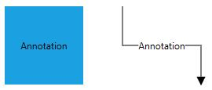

Alignment

Annotation can be aligned relative to the Node boundaries. It has margin, Offset, horizontal and vertical alignment settings. It is quite tricky when all four alignments are used together but gives you more control over alignment.

Offset

The Offset property of label is used to align the labels based on fractions. 0 represents top/left corner, 1 represents bottom/right corner, and 0.5 represents half of width/height.

The following image shows the relationship between the Annotation position (black colored circle) and Offset (fraction values).

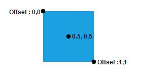

By using Offset property, without creating the template we can arrange the Annotaion.

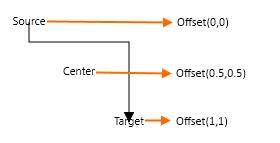

Horizontal and vertical alignments

The HorizontalAlignment property of labels is used to set how the label is horizontally aligned at the label position determined from the fraction values. The VerticalAlignment property is used to set how Annotation is vertically aligned at the Annotation position.

The following table illustrates all the possible alignments visually with **Offset** **(****0****,** **0****).**

<table>
<tr>
<td>
Horizontal Alignment  </td><td>
Vertical Alignment   </td><td>
Output with Offset(0,0)  </td></tr>
<tr>
<td>
Left  </td><td>
Top  </td><td>
{{''| markdownify }}
      </td></tr>
<tr>
<td>
Center  </td><td>
  </td><td>
  {{'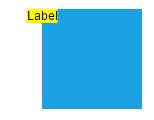'| markdownify }}
    </td></tr>
<tr>
<td>
Right  </td><td>
  </td><td>
{{'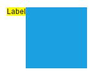'| markdownify }}
  </td></tr>
<tr>
<td>
Left  </td><td>
Center  </td><td>
{{''| markdownify }}
  </td></tr>
<tr>
<td>
Center  </td><td>
  </td><td>
{{'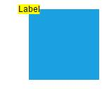'| markdownify }}
  </td></tr>
<tr>
<td>
Right  </td><td>
  </td><td>
{{'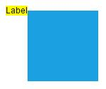'| markdownify }}
  </td></tr>
<tr>
<td>
Left  </td><td>
Bottom  </td><td>
{{'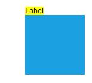'| markdownify }}
    </td></tr>
<tr>
<td>
Center  </td><td>
  </td><td>
{{'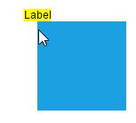'| markdownify }}
  </td></tr>
<tr>
<td>
Right  </td><td>
  </td><td>
{{'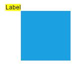'| markdownify }}
  </td></tr>
</table>
The following table illustrates all the possible alignments visually with **Offset****.**

<table>
<tr>
<td>
Horizontal Alignment  </td><td>
Vertical Alignment  </td><td>
Offset  </td><td>
Image  </td></tr>
<tr>
<td>
Center  </td><td>
Top  </td><td>
(0.2,1)  </td><td>
{{'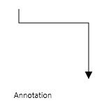'| markdownify }}
  </td></tr>
<tr>
<td>
Right  </td><td>
Middle  </td><td>
(0.5,0.3)  </td><td>
{{'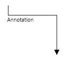'| markdownify }}
  </td></tr>
<tr>
<td>
Left  </td><td>
Bottom  </td><td>
(0.5,0.7)  </td><td>
{{'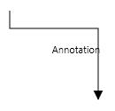'| markdownify }}
  </td></tr>
</table>
The following codes illustrates how to align annotations.

<table>
<tr>
<td>
ObservableCollection<NodeViewModel> nodes = new ObservableCollection<NodeViewModel>();  NodeViewModel node = new NodeViewModel()  {  UnitWidth = 100,  UnitHeight = 100,  OffsetX = 100,  OffsetY = 100,  Annotations=new ObservableCollection<IAnnotation>()  {  new AnnotationEditorViewModel()  {  Content="Annotation",  Offset=new Point(0,0.5),  Alignment=ConnectorAnnotationAlignment.Center,  HorizontalAlignment=HorizontalAlignment.Left,  VerticalAlignment=VerticalAlignment.Center,  }  },  Shape = new RectangleGeometry() { Rect = new Rect(0, 0, 10, 10) },  ShapeStyle = this.diagram.Resources["shapestyle"] as Style  };  nodes.Add(node);  diagram.Nodes = nodes;    </td></tr>
</table>
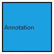

Margin

Margin is an absolute value used to add some blank space in any one of its four sides. You can displace the Annotations with the Margin property. The following code example illustrates how to align an Annotation based on its Offset, horozontalAlignment, VerticalAlignment and Margin values.

<table>
<tr>
<td>
ObservableCollection<NodeViewModel> nodes = new ObservableCollection<NodeViewModel>();  NodeViewModel node = new NodeViewModel()  {  UnitWidth = 100,  UnitHeight = 100,  OffsetX = 100,  OffsetY = 100,  Annotations=new ObservableCollection<IAnnotation>()  {  new AnnotationEditorViewModel()  {  Content="Annotation",  Margin=new Thickness(0,10,0,0),  Offset=new Point(0.5,1),  Alignment=ConnectorAnnotationAlignment.Center,  HorizontalAlignment=HorizontalAlignment.Center,  VerticalAlignment=VerticalAlignment.Top,  }  },  Shape = new RectangleGeometry() { Rect = new Rect(0, 0, 10, 10) },  ShapeStyle = this.diagram.Resources["shapestyle"] as Style  };  nodes.Add(node);  diagram.Nodes = nodes;    </td></tr>
</table>
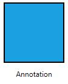

The following code illustrates how to displace Annotation through with the Margin property.

<table>
<tr>
<td>
new AnnotationEditorViewModel()  {  Content="Annotation",  //Based on Offset value, we can align the Annotation  Offset = new Point(0,0),  //Align the Annotation with respect to absolute position  Margin = new Thickness(100,100,0,0),  }    </td></tr>
</table>
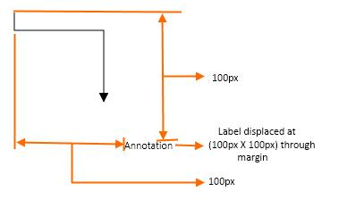

__Annotation__ __Displacement__ __through__ __margin______

Wrapping

When text overflows Node boundaries, you can control it by using text wrapping. So, it is wrapped into multiple lines. The Wrapping property of Annotation defines how the text should be wrapped. The following code illustrates how to wrap a text in a Node.

<table>
<tr>
<td>
ObservableCollection<NodeViewModel> nodes = new ObservableCollection<NodeViewModel>();  NodeViewModel node = new NodeViewModel()  {  UnitWidth = 100,  UnitHeight = 100,  OffsetX = 100,  OffsetY = 100,  Annotations=new ObservableCollection<IAnnotation>()  {  new AnnotationEditorViewModel()  {  Content="Annotation Text Wrapping",  WrapText=TextWrapping.Wrap  }  },  Shape = new RectangleGeometry() { Rect = new Rect(0, 0, 10, 10) },  ShapeStyle = this.diagram.Resources["shapestyle"] as Style  };  nodes.Add(node);  diagram.Nodes = nodes;    </td></tr>
</table>

<table>
<tr>
<td>
Values  </td><td>
Description  </td><td>
Node  </td><td>
Connector                                  </td></tr>
<tr>
<td>
NoWrap  </td><td>
Text will not be wrapped.  </td><td>
{{'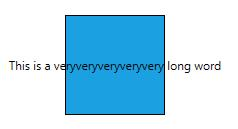'| markdownify }}
    </td><td>
{{'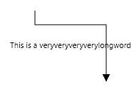'| markdownify }}
  </td></tr>
<tr>
<td>
Wrap  </td><td>
Text-wrapping occurs when the text overflows beyond the available Node width.  </td><td>
  {{''| markdownify }}
  </td><td>
{{'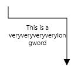'| markdownify }}
  </td></tr>
</table>
Appearance 

You can change the appearance by ViewTemplate. The following code illustrate how to customize the appearance of an Annotation.

[XAML]

<table>
<tr>
<td>
<DataTemplate x:Key="viewtemplate">  <TextBlock Text="{Binding Path=Content, Mode=TwoWay}" FontStyle="Italic"   FontSize="12" FontFamily="TimesNewRomen"  TextDecorations="Underline" FontWeight="Bold"  Foreground="Black"/>   </DataTemplate>    </td></tr>
</table>
[C#]

<table>
<tr>
<td>
ObservableCollection<NodeViewModel> nodes = new ObservableCollection<NodeViewModel>();  NodeViewModel node = new NodeViewModel()  {  UnitWidth = 100,  UnitHeight = 100,  OffsetX = 100,  OffsetY = 100,  Annotations = new ObservableCollection<IAnnotation>()  {  new AnnotationEditorViewModel()  {  Content="Annotation Text",  ViewTemplate=this.diagram.Resources["viewtemplate"] as DataTemplate  }  },  Shape = new RectangleGeometry() { Rect = new Rect(0, 0, 10, 10) },  ShapeStyle = this.diagram.Resources["shapestyle"] as Style  };  nodes.Add(node);  diagram.Nodes = nodes;    </td></tr>
</table>
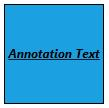

The fill and border appearance of the text can also be customized with appearance specific properties of Annotation. The following code illustrates how to customize background and border of a Annotation.

[XAML]

<table>
<tr>
<td>
<DataTemplate x:Key="viewtemplate">  <Border BorderBrush="Black" BorderThickness="1">  <TextBlock Text="{Binding Path=Content, Mode=TwoWay}"  Background="White"   Foreground="Black"/>  </Border>  </DataTemplate>    </td></tr>
</table>
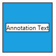

Drag

An Annotation can be displaced from its original position to any preferred location interactively. Dragging is displaced by default. You can enable label dragging with the Constraints property of Node/Connector. The following code illustrates how to enable Annotation **dragging** for Node.

<table>
<tr>
<td>
ObservableCollection<NodeViewModel> nodes = new ObservableCollection<NodeViewModel>();  NodeViewModel node = new NodeViewModel()  {  UnitWidth = 100,  UnitHeight = 100,  OffsetX = 100,  OffsetY = 100,  Constraints=NodeConstraints.Default | NodeConstraints.DragAnnotation,  Annotations = new ObservableCollection<IAnnotation>()  {  new AnnotationEditorViewModel()  {  Content="Annotation Text"  }  },  Shape = new RectangleGeometry() { Rect = new Rect(0, 0, 10, 10) },  ShapeStyle = this.diagram.Resources["shapestyle"] as Style  };  nodes.Add(node);  diagram.Nodes = nodes;    </td></tr>
</table>
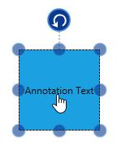

The following code illustrates how to enable DragAnnotation for Connector.

<table>
<tr>
<td>
connector.Constraints = ConnectorConstraints.Default | ConnectorConstraints.DragAnnotation;    </td></tr>
</table>
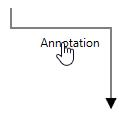

Edit

Diagram provides support to edit an Annotation at runtime, either programmatically or interactively.

Double-clicking any Annotation will enables editing of that. Double-clicking the Node enables first Annotation editing. When the focus of editor is lost, the Annotation for the Node is updated.

The following code illustrates how to edit the Annotation programmatically.

<table>
<tr>
<td>
ObservableCollection<NodeViewModel> nodes = new ObservableCollection<NodeViewModel>();  NodeViewModel node = new NodeViewModel()  {  UnitWidth = 100,  UnitHeight = 100,  OffsetX = 200,  OffsetY = 200,  Annotations = new ObservableCollection<IAnnotation>()  {  new AnnotationEditorViewModel()  {  Content="Annotation",  EditTemplate=this.diagram.Resources["edittemplate"] as DataTemplate,  }  },  Shape = new RectangleGeometry() { Rect = new Rect(0, 0, 10, 10) },  ShapeStyle = this.diagram.Resources["shapestyle"] as Style  };  NodeViewModel node1 = new NodeViewModel()  {  UnitWidth = 100,   UnitHeight = 100,  OffsetX = 350,  OffsetY = 200,  Constraints = NodeConstraints.Default | NodeConstraints.DragAnnotation,  Annotations = new ObservableCollection<IAnnotation>()  {  new AnnotationEditorViewModel()  {  Content="Annotation",  ViewTemplate=this.diagram.Resources["viewtemplate"] as DataTemplate  }  },  Shape = new RectangleGeometry() { Rect = new Rect(0, 0, 10, 10) },  ShapeStyle = this.diagram.Resources["shapestyle"] as Style  };  nodes.Add(node);  nodes.Add(node1);  diagram.Nodes = nodes;    </td></tr>
</table>
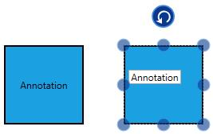

Read Only Annotation

Diagram allows to create read only Annotation. You have to set the readOnly property of Annotation to enable/disable the read only mode. The following code illustrates how to enable **ReadOnly** mode.

<table>
<tr>
<td>
NodeViewModel node1 = new NodeViewModel()  {  UnitWidth = 100,   UnitHeight = 100,  OffsetX = 100,  OffsetY = 100,  Annotations = new ObservableCollection<IAnnotation>()  {  new AnnotationEditorViewModel()  {  Content = "Annotation",  ViewTemplate = this.diagram.Resources["viewtemplate"] as DataTemplate,  ReadOnly = true  }  },  Shape = new RectangleGeometry() { Rect = new Rect(0, 0, 10, 10) },  ShapeStyle = this.diagram.Resources["shapestyle"] as Style  };    </td></tr>
</table>
Multiple Annotations

You can add any number of Annotations to a Node or Connector. The following code illustrates how to add multiple Annotations to a Node.

<table>
<tr>
<td>
ObservableCollection<AnnotationEditorViewModel> annotations = new ObservableCollection<AnnotationEditorViewModel>();    AnnotationEditorViewModel annotation1 = new AnnotationEditorViewModel()  {  Content = "Left",  ViewTemplate=this.diagram.Resources["viewtemplate"] as DataTemplate,  Offset = new Point(0.1, 0.12)  };  AnnotationEditorViewModel annotation2 = new AnnotationEditorViewModel()  {  Content = "Center",  ViewTemplate = this.diagram.Resources["viewtemplate"] as DataTemplate,  Offset = new Point(0.5, 0.5)  };  AnnotationEditorViewModel annotation3 = new AnnotationEditorViewModel()  {  Content = "Right",  ViewTemplate = this.diagram.Resources["viewtemplate"] as DataTemplate,  Offset = new Point(0.82, 0.9)  };  annotations.Add(annotation1);  annotations.Add(annotation2);  annotations.Add(annotation3);  ObservableCollection<NodeViewModel> nodes = new ObservableCollection<NodeViewModel>();  NodeViewModel node = new NodeViewModel()  {  UnitWidth = 100,  UnitHeight = 100,  OffsetX = 200,  OffsetY = 200,  Annotations = annotations,  Shape = new RectangleGeometry() { Rect = new Rect(0, 0, 10, 10) },  ShapeStyle = this.diagram.Resources["shapestyle"] as Style  };  nodes.Add(node);  diagram.Nodes = nodes;    </td></tr>
</table>

