# Commands

There are several commands available in the Diagram as follows.

* Alignment commands
* Spacing commands
* Sizing commands
* Clipboard commands
* Duplicate Command
* Grouping commands
* Flip Commands
* Z-order commands
* Zoom commands
* Reset Command
* Draw Commands
* Nudge commands
* FitToPage commands
* Undo/Redo commands

**Alignment** **Commands******

Alignment commands enable you to align the selected objects such as Nodes and Connectors on a page with respect to a reference object.

The Alignment commands as follows

<table>
<tr>
<td>
Commands  </td><td>
Description  </td></tr>
<tr>
<td>
AlignLeft  </td><td>
The AlignLeft command enables you to align all selected objects along the left corner of the reference object.  </td></tr>
<tr>
<td>
AlignRight  </td><td>
The AlignRight command enables you to align all selected objects along the right corner of the reference object.  </td></tr>
<tr>
<td>
AlignCenter  </td><td>
The AlignCenter command enables you to center all selected objects vertically. It aligns selected objects to the center with respect to the horizontal axis by changing the x-coordinate of the object.  </td></tr>
<tr>
<td>
AlignTop  </td><td>
The AlignTop command enables you to align all selected objects along the top surface of the reference object.  </td></tr>
<tr>
<td>
AlignBottom  </td><td>
The AlignBottom command enables you to align all selected objects along the bottom surface of the reference object.   </td></tr>
<tr>
<td>
AlignMiddle  </td><td>
The AlignMiddle command enables you to center all selected objects horizontally. It aligns selected objects to the center with respect to the vertical axis by changing the y-coordinate of the object.  </td></tr>
</table>

The following code example illustrates how to align all the selected objects at the left side of selection boundary.

<table>
<tr>
<td>
IGraphInfo graphinfo = diagramcontrol.Info as IGraphInfo;  // sets diration as left  graphinfo.Commands.AlignTop.Execute(null);    </td></tr>
</table>

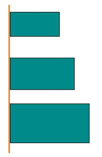
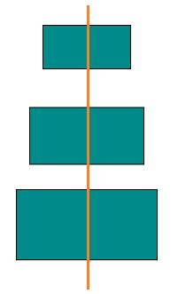
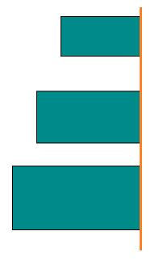

**Spacing** **Commands******

Spacing commands enable you to place selected objects on the page at equal intervals from each other. The objects are spaced within the bounds of the first and last objects in the selection.

The following code example illustrates how to execute the space commands.

<table>
<tr>
<td>
IGraphInfo graphinfo = diagramcontrol.Info as IGraphInfo;  // Equally spaces the selected nodes horizontally  graphinfo.Commands.SpaceAcross.Execute(null);  // Equally spaces the selected nodes vertically  graphinfo.Commands.SpaceDown.Execute(null);    </td></tr>
</table>
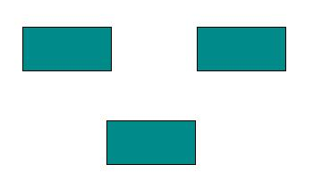
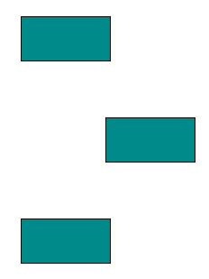

**Sizing** **Commands******

Object size commands enable selected Diagram objects on the page to be resized. The selected objects are resized in proportion to the first object in the selection list.

The following code example illustrates how to execute the size commands.

<table>
<tr>
<td>
IGraphInfo graphinfo = diagramcontrol.Info as IGraphInfo;  //Scales the selected items to the size of first selected object  graphinfo.Commands.SameSize.Execute(null);  //Vertically scales the selected items to the height of first selected object  graphinfo.Commands.SameHeight.Execute(null);  //Horizontally scales the selected items to the width of first selected object  graphinfo.Commands.SameWidth.Execute(null);    </td></tr>
</table>
<table>
<tr>
<td>
Before  {{'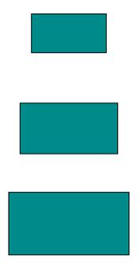'| markdownify }}
  </td><td>
After   {{'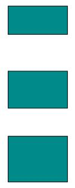'| markdownify }}
{{'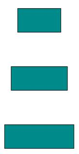'| markdownify }}
{{'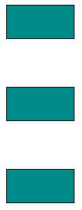'| markdownify }}
  </td></tr>
</table>
******Clipboard** **Commands******

Clipboard commands are used to perform cut, copy, and paste operations. 

Clipboard commands allow you to cut or copy selected Diagram objects to the Clipboard and paste the valid Clipboard content into the Diagram.

The following code illustrates how to execute the clipboard commands.

<table>
<tr>
<td>
IGraphInfo graphinfo = diagramcontrol.Info as IGraphInfo;  //Cuts the selected elements from the Diagram to the Diagram’s clipboard  graphinfo.Commands.Cut.Execute(null);  //Copies the selected elements from the Diagram to the Diagram’s clipboard.  graphinfo.Commands.Copy.Execute(null);  //Pastes the Diagram’s clipboard data (nodes/connectors) into the Diagram.  graphinfo.Commands.Paste.Execute(null);    </td></tr>
</table>
********

****
****

**Duplicate** **Command******

This command copies the selected objects from the diagram and pastes the copied content into the diagram.                           

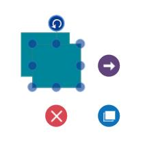

**Grouping** **Command******

Grouping commands are used to group/ungroup the selected elements on the diagram.

The following code illustrates how to execute the group commands

<table>
<tr>
<td>
IGraphInfo graphinfo = diagramcontrol.Info as IGraphInfo;  //Groups the selected elements.  graphinfo.Commands.Group.Execute(null);  //UnGroups the selected elements.  graphinfo.Commands.UnGroup.Execute(null);    </td></tr>
</table>
******Flip** **Commands******

Flip commands are used to mirror a diagram object’s content.

**Parameter******

To customize flipping, a parameter of type IFlipParameter has to be passed.

**IFlipParameter** **Properties******

<table>
<tr>
<td>
**Property******  </td><td>
**Description******  </td><td>
**Value******  </td></tr>
<tr>
<td>
Flip  </td><td>
Gets or sets whether the object is to be mirrored horizontally, vertically, or both  </td><td>
Enum  FlipFlip.HorizontalFlip  Flip.VerticalFlipFlip.Flip  </td></tr>
</table>
******Execute** **Flip** **Command******

<table>
<tr>
<td>
// Flip Command  (diagramcontrol.Info as IGraphInfo).Commands.Flip.Execute(null);    </td></tr>
</table>
****If the parameter is null, the object will be flipped both horizontally and vertically.

<table>
<tr>
<td>
IGraphInfo graphinfo = diagramcontrol.Info as IGraphInfo;  FlipParameter flipParam = new FlipParameter();  // Horizontal Flip  flipParam.Flip = Flip.HorizontalFlip;  graphinfo.Commands.Flip.Execute(flipParam);  // Vertical Flip  flipParam.Flip = Flip.VerticalFlip;  graphinfo.Commands.Flip.Execute(flipParam);    </td></tr>
</table>
Without Flip

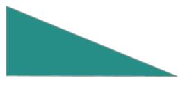
****

With Flip

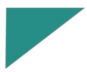
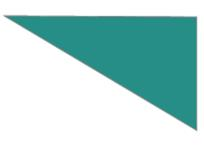

**********Z** **–** **Order** **Command******

Z – Order commands enable you to visually arrange the selected objects such as Nodes and Connectors on the page.

**BringToFront** **command******

The BringToFront command visually brings the selected element to the front over all other overlapped elements. 

The following code illustrates how to execute BringToFront command.

<table>
<tr>
<td>
IGraphInfo graphinfo = diagramcontrol.Info as IGraphInfo;  //Brings to front  graphinfo.Commands.BringToFront.Execute(null);    </td></tr>
</table>
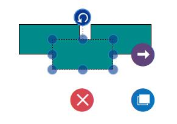

**SendToBack** **command**

The SendToBack command visually moves the selected elements behind all the other overlapped elements. 

The following code illustrates how to execute the SendToBack command.

<table>
<tr>
<td>
IGraphInfo graphinfo = diagramcontrol.Info as IGraphInfo;  // Send To Back  graphinfo.Commands.SendToBack.Execute(null);    </td></tr>
</table>

**SendBackward** **command**

The SendBackward command visually moves the selected elements behind the underlying element.

The following code illustrates how to execute the SendBackward command.

<table>
<tr>
<td>
IGraphInfo graphinfo = diagramcontrol.Info as IGraphInfo;  // Send To Backward  graphinfo.Commands.SendBackward.Execute(null);    </td></tr>
</table>

******BringForward** **command******

The BringForward command visually moves the selected element over the nearest overlapping element.

The following code illustrates how to execute the BringForward command.

<table>
<tr>
<td>
IGraphInfo graphinfo = diagramcontrol.Info as IGraphInfo;  // Brings To Forward  graphinfo.Commands.BringForward.Execute(null);    </td></tr>
</table>

**Zoom** **Commands******

Zoom commands are used to  zoom-in and zoom-out the Diagram view.

To execute zoom commands, parameters of type IZoomParameter (IZoomManipulationParameter, IZoomPositionParameter, or IZoomPointerParameter) have to be passed.

**IZoomManipulationParameter** **Properties******

<table>
<tr>
<td>
**Property******  </td><td>
**Description******  </td><td>
**Value******  </td></tr>
<tr>
<td>
ManipulationArgs****  </td><td>
Gets or sets the ManipulationDelta  RoutedEventArgs associated with the desired zoom function.****  </td><td>
ManipulationDeltaRoutedEvent  Args****  </td></tr>
</table>
******IZoomPositionParameter** **Property******

<table>
<tr>
<td>
**Property******  </td><td>
**Description******  </td><td>
**Value******  </td></tr>
<tr>
<td>
ZoomTo  </td><td>
Gets or sets the zoom level to which the diagram is to be zoomed.****  </td><td>
double  </td></tr>
<tr>
<td>
ZoomFactor  </td><td>
Gets or sets the percentage of scale value for each ZoomIn or ZoomOut function.****  </td><td>
double  </td></tr>
<tr>
<td>
FocusPoint  </td><td>
Gets or sets the point of focus while zooming.****  </td><td>
Point  </td></tr>
<tr>
<td>
ZoomCommand  </td><td>
Gets or sets whether zoom in or zoom out has to be performed.****  </td><td>
Enum ZoomCommandZoomCommand.  ZoomInZoomCommand.ZoomOut****  </td></tr>
</table>
******IZoomPointerParameter** **Property******

<table>
<tr>
<td>
**Property******  </td><td>
**Description******  </td><td>
**Value******  </td></tr>
<tr>
<td>
PointerArgs  </td><td>
Gets or sets the PointerRoutedEventArgs associated with the desired zoom function.****  </td><td>
PointerRoutedEventArgs****  </td></tr>
<tr>
<td>
ZoomCommand  </td><td>
Gets or sets whether zoom in or zoom out has to be performed****  </td><td>
Enum  <table> <tr> <td> ZoomCommandZoomCommand.ZoomInZoomCommand.ZoomOut  </td></tr>
</table>
### 

</td></tr>
</table>
****The following code illustrates how to zoom-in/zoom-out the diagram.

<table>
<tr>
<td>
IGraphInfo graphinfo = diagramcontrol.Info as IGraphInfo;  //Zoom to a particular scale.  graphinfo.Commands.Zoom.Execute(new ZoomPositionParamenter()   {   ZoomTo = 2, ZoomCommand = ZoomCommand.ZoomOut   });  //Zoom out based on zoom factor.  graphinfo.Commands.Zoom.Execute(new ZoomPositionParamenter()   {   ZoomFactor = 2, ZoomCommand = ZoomCommand.ZoomOut   });    </td></tr>
</table>
******Reset** **Commands******

Reset commands are used to reset horizontal Offset, vertical Offset, and zoom level of the Diagram.

To execute a reset command, a parameter of type IReset has to be passed.

<table>
<tr>
<td>
**Property******  </td><td>
**Description** ****  </td><td>
**Value******  </td></tr>
<tr>
<td>
Reset  </td><td>
Gets or sets the reset function****  </td><td>
Enum ResetReset.Zoom – To reset zoom level to 1,Reset.Pan – To reset Offsets to 0,Reset.ZoomPan****  </td></tr>
</table>
******Execute** **ResetCommand******

<table>
<tr>
<td>
IGraphInfo graphinfo = diagramcontrol.Info as IGraphInfo;  // Reset  graphinfo.Commands.Reset.Execute(new ResetParameter() { Reset = Reset.Zoom });  ****  </td></tr>
</table>
******Draw** **Commands******

Draw commands are used to draw connections. They take parameters of type IDrawParameter.

<table>
<tr>
<td>
**Property******  </td><td>
**Description******  </td><td>
**Value******  </td></tr>
<tr>
<td>
DrawingTool  </td><td>
Gets or sets a tool to draw.****  </td><td>
Enum DrawingToolDrawingTool.Connector****  </td></tr>
<tr>
<td>
Point  </td><td>
Gets or sets the start point for drawing.****  </td><td>
Point  </td></tr>
<tr>
<td>
Node  </td><td>
Gets or sets the source Node of the new connection****  </td><td>
Object  </td></tr>
<tr>
<td>
Port  </td><td>
Gets or sets the source port of the new connection****  </td><td>
Object  </td></tr>
<tr>
<td>
PressedEventArgs  </td><td>
Gets or sets the PressedEventArgs.****  </td><td>
PointerRoutedEventArgs****  </td></tr>
</table>
******Execute** **DrawCommand******

<table>
<tr>
<td>
void Button_PointerPressed(object sender, PointerRoutedEventArgs e)  {  IGraphInfo graphinfo = diagramcontrol.Info as IGraphInfo;  Point SourcePoint = new Point(200,200);    graphinfo.Commands.Draw.Execute(  new DrawParameter(  DrawingTool.Connector,  e,  SourcePoint,  SourceNode,  SourcePort));  }  ****  </td></tr>
</table>
******Undoing** **and** **Redoing** **Actions******

The Undo command reverses the last editing action performed. For example, some of the basic operations performed on diagram objects such as translation, rotation, resizing, grouping, ungrouping, changing z-order, addition, deletion, and so on, can be reversed. The Redo command restores the last editing action if no other actions have occurred since the last undo. ****

**Nudge** **Command******

Nudge commands move the selected elements towards up, down, left or right by 1 pixel.

The Nudge Commands as follows

<table>
<tr>
<td>
Commands  </td><td>
Description  </td></tr>
<tr>
<td>
NudgeUp  </td><td>
The NudgeUp command moves the selected object towards the top by 1 pixel.   </td></tr>
<tr>
<td>
NudgeDown  </td><td>
The NudgeDown command moves the selected object towards the bottom by 1 pixel.   </td></tr>
<tr>
<td>
NudgeLeft  </td><td>
The NudgeLeft command moves the selected object towards the left by 1 pixel.   </td></tr>
<tr>
<td>
NudgeRight  </td><td>
The NudgeRight command moves the selected object towards the right by 1 pixel.   </td></tr>
</table>

The following code illustrates how to execute Nudge command.

<table>
<tr>
<td>
IGraphInfo graphinfo = diagramcontrol.Info as IGraphInfo;  //Nudges up  graphinfo.Commands.MoveUp.Execute(null);    </td></tr>
</table>
**FitToPage** **Command******

FitToPage commands are used to bring the entire Diagram into the view.

<table>
<tr>
<td>
**Command******  </td><td>
**Description******  </td><td>
**Value******  </td></tr>
<tr>
<td>
FitToPage  </td><td>
Gets or sets whether the Diagram is to fit into the view in terms of its width, height, or entirety.  </td><td>
Enum FitToPageFitToPage.FitToPageFitToPage.FitToHeightFitToPage.FitToWidth  </td></tr>
<tr>
<td>
Margin  </td><td>
Gets or sets the margin value from the view to Diagram.  </td><td>
Thickness  </td></tr>
</table>
The following code illustrates how to execute FitToPage command.

<table>
<tr>
<td>
IGraphInfo graphinfo = diagramcontrol.Info as IGraphInfo;  graphinfo.Commands.FitToPage.Execute(  new FitToPageParameter()  {  Margin = new Thickness(25),  //To fit the diagram with respect to width/height use FitToWidth or FitToHeight.  FitToPage = FitToPage.FitToPage  });  (or)  graphinfo.Commands.FitToPage.Execute(null);    </td></tr>
</table>
**Command** **Manager******

Command manager is used to map between user gestures (keyboard, mouse) with commands. Refer to the following table for inbuilt commands with Key Gesture and Mouse Gesture.

List of Commands and Key Gesture:

<table>
<tr>
<td>
**Command******  </td><td>
**Key******  </td><td>
**Key** **Modifiers******  </td></tr>
<tr>
<td>
Copy  </td><td>
C  </td><td>
Control  </td></tr>
<tr>
<td>
Cute  </td><td>
X  </td><td>
Control  </td></tr>
<tr>
<td>
Paste  </td><td>
V  </td><td>
Control  </td></tr>
<tr>
<td>
Duplicate  </td><td>
D  </td><td>
Control  </td></tr>
<tr>
<td>
Undo  </td><td>
Z  </td><td>
Control  </td></tr>
<tr>
<td>
Redo  </td><td>
Y  </td><td>
Control  </td></tr>
<tr>
<td>
MoveLeft  </td><td>
Left  </td><td>
  </td></tr>
<tr>
<td>
MoveRight  </td><td>
Right  </td><td>
  </td></tr>
<tr>
<td>
MoveUp  </td><td>
Up  </td><td>
  </td></tr>
<tr>
<td>
MoveDown  </td><td>
Down  </td><td>
  </td></tr>
<tr>
<td>
Delete  </td><td>
Delete  </td><td>
  </td></tr>
<tr>
<td>
SelectAll  </td><td>
A  </td><td>
Control  </td></tr>
<tr>
<td>
Group  </td><td>
G  </td><td>
Control  </td></tr>
<tr>
<td>
UnGroup  </td><td>
G  </td><td>
Control  </td></tr>
<tr>
<td>
SendToBack  </td><td>
[  </td><td>
Control+Shift  </td></tr>
<tr>
<td>
SendBackward  </td><td>
[  </td><td>
Control  </td></tr>
<tr>
<td>
BringToFront  </td><td>
]  </td><td>
Control+Shift  </td></tr>
<tr>
<td>
BringForward  </td><td>
]  </td><td>
Control  </td></tr>
</table>
List of Commands and Key Gestures with Parameter:

<table>
<tr>
<td>
**Command******  </td><td>
**Key******  </td><td>
**KeyModifier******  </td><td>
**Parameter******  </td></tr>
<tr>
<td>
Zoom  </td><td>
-  </td><td>
Control  </td><td>
new ZoomPositionParamenter { ZoomCommand=ZoomCommand.ZoomOut}  </td></tr>
<tr>
<td>
Zoom  </td><td>
+  </td><td>
Control  </td><td>
new ZoomPositionParamenter { ZoomCommand = ZoomCommand.ZoomIn }  </td></tr>
<tr>
<td>
Reset  </td><td>
0  </td><td>
Control  </td><td>
new ResetParameter { Reset = Diagram.Reset.ZoomPan }  </td></tr>
<tr>
<td>
FitToPage  </td><td>
0  </td><td>
Control+ Menu  </td><td>
new FitToPageParameter { FitToPage = Diagram.FitToPage.FitToPage, Margin = new Thickness(20) }  </td></tr>
</table>
List of Commands and Mouse Gesture with Parameter

<table>
<tr>
<td>
**Command******  </td><td>
**Scroll** **State******  </td><td>
**Parameter******  </td></tr>
<tr>
<td>
Vertical Scroll using ‘Zoom’ command  </td><td>
Scroll  </td><td>
new ZoomPointerParamenter { ZoomCommand = ZoomCommand.VerticalScroll}  </td></tr>
</table>
List of Commands and Key and Mouse Gesture with Parameter:

<table>
<tr>
<td>
**Command**  </td><td>
**KeyModifier**  </td><td>
**Scroll** **State**  </td><td>
**Parameter**  </td></tr>
<tr>
<td>
Horizontal Scroll using ‘Zoom’ command  </td><td>
Shift  </td><td>
Scroll  </td><td>
new ZoomPointerParamenter { ZoomCommand = ZoomCommand.HorizondalScroll}  </td></tr>
<tr>
<td>
Zoom  </td><td>
Control  </td><td>
Scroll  </td><td>
new ZoomPointerParamenter { ZoomCommand = ZoomCommand.ZoomIn | ZoomCommand.ZoomOut}  </td></tr>
</table>
**Note****:******

When different commands are registered for the same key / mouse gestures, you need to handle the command while execution.

**********Custom** **command******

User defined commands can also be created and mapped with existing gesture by using command manager. The following code example explains how to register mouse key gesture with Parameter to Save Command (Control + S).

**Create** **a** **user** **defined** **command****:** **Save** **command******

<table>
<tr>
<td>
//Create ICommand  private ICommand _save;  public ICommand Save  {  get { return _save;}  set { _save = value; }  }    //Initialize Command  Save = new DelegateCommand(OnSaveCommand);    // Execute Command  private async void OnSaveCommand(Object obj)  {  var picker = new FileSavePicker();    // set appropriate file types    picker.FileTypeChoices.Add(".xaml", new List<String> {".xaml"});  picker.DefaultFileExtension = ".xaml";  Object parameter = (obj as IGestureParameter).Parameter;  picker.SuggestedFileName = parameter.ToString();  StorageFile file = await picker.PickSaveFileAsync();  using (var filestream = await file.OpenStreamForWriteAsync())  {  sfdiagram.Save(fileStream);  }  }  </td></tr>
</table>
Map and user defined command with key gesture:****

<table>
<tr>
<td>
//Add new Commands to CommandManager - Cntrl + S -> Save    sfdiagram.CommandManager.Commands.Add  (  new GestureCommand()  {  Command = Save,  Gesture = new Gesture  {  KeyModifiers = ModifierKeys.Control,  KeyState = KeyStates.Down,  Key = Key.S  },  // Parameter is the name of the file (.xmal)  Parameter = "diagram"  }  );    </td></tr>
</table>
