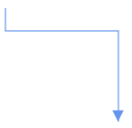
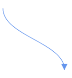
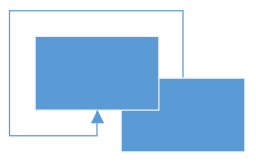
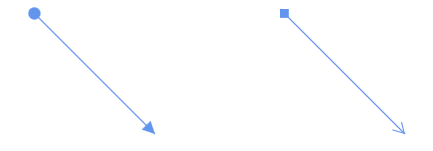
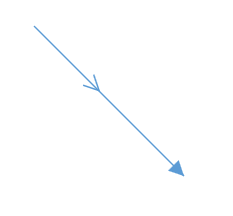
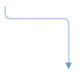
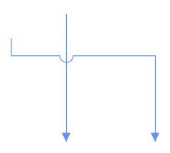
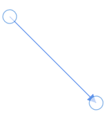
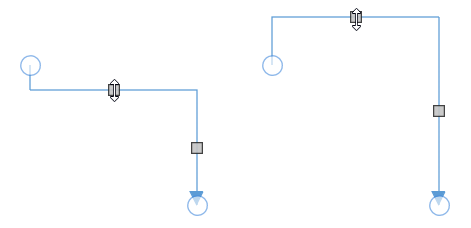
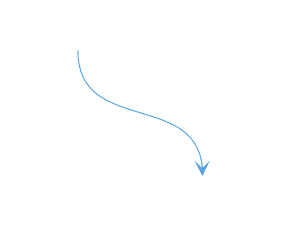

# Connector

Connectors are objects used to create link between two Points, Nodes or ports to represent the relationships between them.

## Define Connector

Connector can be created by defining the start and end points. The Path to be drawn can be defined with a collection of segments. The `SourcePoint` and `TargetPoint` properties of Connector allow you to define the end points of a Connector.



<!--Style for the Connector-->

    </Setter.Value>
  </Setter>
  <Setter Property="TargetDecoratorStyle">
    <Setter.Value>
      
    </Setter.Value>
  </Setter>
</Style>

<!--Initialize the Sfdiagram-->
<syncfusion:SfDiagram x:Name="diagram" DefaultConnectorType="Line">
  <syncfusion:SfDiagram.Connectors>
  <!--Initialize the ConnectorCollection-->
    <syncfusion:ConnectorCollection>
    <!--Initialize the Connector-->
      <syncfusion:ConnectorViewModel SourcePoint="100,100" TargetPoint="200,200">
      </syncfusion:ConnectorViewModel>
    </syncfusion:ConnectorCollection>
  </syncfusion:SfDiagram.Connectors>
</syncfusion:SfDiagram>




//Define the ConnectorType
diagram.DefaultConnectorType = ConnectorType.Line;
//Define the ConnectorCollection
diagram.Connectors = new ConnectorCollection();
//Define the Connector
ConnectorViewModel connector = new ConnectorViewModel()
{
    //Define the Source and TargetPoint
    SourcePoint = new Point(100, 100),
    TargetPoint = new Point(200, 200),
};
//Adding Connector to Collection
(diagram.Connectors as ConnectorCollection).Add(connector);




### Connectors from stencil

Connectors can be predefined and added to the stencil. You can drop those Connectors into the Diagram, when required. 

For more information about adding Connectors from stencil, refer to [Stencil](/uwp/sfdiagram/stencil "Stencil").

### Connectors through data source

Connectors are automatically generated based on the relationships defined through the data source. For more information about data source, refer to [Data Source](/uwp/sfdiagram/datasource "DataSource").

### Draw Connectors

Connectors can be interactively drawn by clicking and dragging on the Diagram surface by using Drawing Tool. For more information about drawing Connectors, refer to [Draw Connectors](/uwp/sfdiagram/tools#drawing-tools:connectors "Draw Connectors").

## Connect Nodes

The `SourceNode` and `TargetNode` properties allow to define the Nodes to be connected.




//Define the NodeCollection
diagram.Nodes = new NodeCollection();
//Defining the Node
NodeViewModel node1 = AddNode(100,"Node1");
NodeViewModel node2 = AddNode(250,"Node2");
//Adding Node to Collection
(diagram.Nodes as NodeCollection).Add(node1);
(diagram.Nodes as NodeCollection).Add(node2);
//Define the ConnectorCollection
diagram.Connectors = new ConnectorCollection();
//Define the Connector
ConnectorViewModel connector1 = new ConnectorViewModel()
{
    SourceNode=node1,
    TargetNode=node2,
    ConnectorGeometryStyle = this.Resources["ConnectorStyle"] as Style,
};
//Adding Connector to Collection
(diagram.Connectors as ConnectorCollection).Add(connector1);

//Creating NodeViewModel
public NodeViewModel AddNode(double offsetX, string text)
{
    NodeViewModel node = new NodeViewModel();
    node.UnitHeight = 60;
    node.UnitWidth = 100;
    node.OffsetX = offsetX;
    node.OffsetY = 100;
    node.Shape = new RectangleGeometry { Rect = new Rect(0, 0, 10, 10) };   
    return node;
}




The `SourceNodeID` and `TargetNodeID` properties also allows to define the nodes to be connected.

N> By default, connections are created at the intersecting point of Segments and Node bounds. The connection between any specific point of Source and Target Nodes can be achieved with Ports.

## Connections with Ports

The `SourcePort`/`SourcePortID` and `TargetPort`/`TargetPortID` properties allow to create connections between some specific points of Source/Target Nodes. 

For Connections with Ports, please refer to [Port](https://help.syncfusion.com/uwp/sfdiagram/port "Port").

## Segments

The path of the Connector is defined with a collection of `Segments`.

### Straight

Straight segment allows to create a straight line. To create a straight line, you should specify the segment as `StraightSegment` and add a straight segment to collection.



//Define the ConnectorCollection
diagram.Connectors = new ConnectorCollection();
//Define the Connector
ConnectorViewModel connector = new ConnectorViewModel()
{
    SourcePoint = new Point(100, 100),
    TargetPoint = new Point(200, 200),
    //Define the SegmentCollection
    Segments = new ObservableCollection<IConnectorSegment>()
    {
        new StraightSegment()      
    }
};
//Adding Connector to Collection
(diagram.Connectors as ConnectorCollection).Add(connector);




### Orthogonal

Orthogonal segments are used to create segments that are perpendicular to each other. Set the segment as `OrthogonalSegment` to create the default orthogonal segment.



//Define the ConnectorCollection
diagram.Connectors = new ConnectorCollection();
//Define the Connector
ConnectorViewModel connector = new ConnectorViewModel()
{
    SourcePoint = new Point(100, 100),
    TargetPoint = new Point(200, 200),
    //Define the SegmentCollection
    Segments = new ObservableCollection<IConnectorSegment>()
    {
        new OrthogonalSegment()      
    }
};
//Adding Connector to CollectionS
(diagram.Connectors as ConnectorCollection).Add(connector);




### CubicCurveSegment

Cubic curve segments are used to create curve segments and the curves are configurable with the control points.To create a Curve line, you should specify the segment as `CubicCurveSegment` and add a CubicCurveSegment  to collection.




//Adding Connector to Collection
(diagram.Connectors as ConnectorCollection).Add(connector);
//Define the ConnectorCollection
diagram.Connectors = new ConnectorCollection();
//Define the Connector
ConnectorViewModel connector = new ConnectorViewModel()
{
    SourcePoint = new Point(100, 100),
    TargetPoint = new Point(200, 200),
    //Define the SegmentCollection
    Segments = new ObservableCollection<IConnectorSegment>()
    {
        new CubicCurveSegment()      
    }
};
//Adding Connector to Collection
(diagram.Connectors as ConnectorCollection).Add(connector);




#### Avoid overlapping

Orthogonal segments are automatically re-routed, in order to avoid overlapping with the source and target Nodes.

N> Overlapping with Source and Target nodes are only avoided. Other nodes are not considered as obstacles.

## Decorator

Start and end points of a Connector can be decorated with some customizable shapes like arrows, circles, diamond or path. You can decorate the connection end points with the `SourceDecorator` and `TargetDecorator` properties of Connector. 

The `SourceDecoratorStyle` and `TargetDecoratorStyle` properties allows to define the shape of the decorators.

The `SourceDecoratorPivot` and `TargetDecoratorPivot` properties allows to Customize the position of the decorators in the connector.

## SegmentDecorators
 
 `SegmentDecorator` property allows to customize the shape within the Connector. `SegmentDecoratorStyle` property allows to customize the Style of SegmentDecorator.
 
 
 
 
 //Define the collection of SegmentDecorator
SegmentDecorators = new ObservableCollection<ISegmentDecorator>()
{
    //Define the SegmentDecorator
    new SegmentDecorator()
    {
        //Define the Shape of SegmentDecorator
        Shape = "M0,0 L10,5 L0,10",
        Length =0.4
    }
}

 
 
 

 

## Corner radius

Corner radius allows to create Connectors with rounded corners. The radius of the rounded corner is set with `CornerRadius` property.




<!--Initialize the Sfdiagram-->
<syncfusion:SfDiagram x:Name="diagram">
  <syncfusion:SfDiagram.Connectors>
    <syncfusion:ConnectorCollection>
      <!--Initialize the Connector-->
      <syncfusion:ConnectorViewModel SourcePoint="100,100" TargetPoint="200,200" CornerRadius="10">
      </syncfusion:ConnectorViewModel>
    </syncfusion:ConnectorCollection>
  </syncfusion:SfDiagram.Connectors>
</syncfusion:SfDiagram>





//Define the ConnectorCollection
diagram.Connectors = new ConnectorCollection();
//Define the Connector
ConnectorViewModel connector1 = new ConnectorViewModel()
{
    //Define the CornerRadius
    CornerRadius = 10,
    SourcePoint = new Point(100, 100),
    TargetPoint = new Point(200, 200),
};
//Adding Connector to Collection
(diagram.Connectors as ConnectorCollection).Add(connector1);




## Padding

Padding is used to leave space between the Connector’s end point and the object to where it is connected. The `SourcePadding` and `TargetPadding` properties of Connector define the space to be left between the connection end points and the source and target Nodes of Connector.




//Define the ConnectorCollection
diagram.Connectors = new ConnectorCollection();
//Define the Connector
ConnectorViewModel connector1 = new ConnectorViewModel()
{
    SourceNode=node1,
    TargetNode=node2,
    //Space between SourceNode and SourceObject
    SourcePadding=5,
    //Space between TargetNode and TargetObject
    TargetPadding = 5,
    ConnectorGeometryStyle = this.Resources["ConnectorStyle"] as Style,
};
//Adding Connector to Collection
(diagram.Connectors as ConnectorCollection).Add(connector1);




## Bridging

Line Bridging creates a bridge for lines to smartly cross over other lines, at points of interaction. When two lines Connectors meet each other, the line with higher z-order (upper one) draws an arc over the underlying Connector. Bridging can be enabled/disabled either with the `Constraints` property of Connector or with `GraphConstraints`.

The Direction of Bridge can be customized with property `BridgeDirection`.



<Grid>
  <!--Initialize the SfDiagram with Constraints and BridgeDirection-->
  <syncfusion:SfDiagram x:Name="diagram" BridgeDirection="Bottom" Constraints="Bridging">
    <syncfusion:SfDiagram.Connectors>
      <!--Initialize the ConnectorCollection-->
      <syncfusion:ConnectorCollection>
        <!--Initialize the Connector-->
        <syncfusion:ConnectorViewModel SourcePoint="88,183" TargetPoint="250,300">
        </syncfusion:ConnectorViewModel>
        <syncfusion:ConnectorViewModel SourcePoint="150,156" TargetPoint="150,300">
        </syncfusion:ConnectorViewModel>
      </syncfusion:ConnectorCollection>
    </syncfusion:SfDiagram.Connectors>
  </syncfusion:SfDiagram>
</Grid>





//Define the BridgeDirection
diagram.BridgeDirection = BridgeDirection.Bottom;
//Define Constraints
diagram.Constraints = diagram.Constraints | GraphConstraints.Bridging;
//Define the ConnectorCollection
diagram.Connectors = new ConnectorCollection();
//Define the Connector
ConnectorViewModel connector = new ConnectorViewModel()
{
    SourcePoint = new Point(88, 183),
    TargetPoint = new Point(250, 300)
};
//Adding Connector to Collection
(diagram.Connectors as ConnectorCollection).Add(connector);
ConnectorViewModel connector1 = new ConnectorViewModel()
{
    SourcePoint = new Point(150, 156),
    TargetPoint = new Point(150, 300),
};
(diagram.Connectors as ConnectorCollection).Add(connector1);




N> Bezier segments do not support Bridging.

#### BridgeSpace

The `BridgeSpace` property allows to customize the size of bridge in a connector.




//Define the BridgeDirection
diagram.BridgeDirection = BridgeDirection.Bottom;
//Define Constraints
diagram.Constraints = diagram.Constraints | GraphConstraints.Bridging;
//Define the ConnectorCollection
diagram.Connectors = new ConnectorCollection();
//Define the Connector
ConnectorViewModel connector = new ConnectorViewModel()
{
    //Define the Bridge space of the connector
    BridgeSpace=30,
    SourcePoint = new Point(88, 183),
    TargetPoint = new Point(250, 300),
};
//Adding Connector to Collection
(diagram.Connectors as ConnectorCollection).Add(connector);
ConnectorViewModel connector1 = new ConnectorViewModel()
{
    SourcePoint = new Point(150, 156),
    TargetPoint = new Point(150, 300),
};
(diagram.Connectors as ConnectorCollection).Add(connector1);




## Appearance

StrokeThickness, Stroke and style of the Connector and Decorators can be customized with a set of defined properties.




<!--Style for ConnectorGeometryStyle-->





//Define the ConnectorCollection
diagram.Connectors = new ConnectorCollection();
//Define the Connector
ConnectorViewModel connector1 = new ConnectorViewModel()
{
    SourcePoint = new Point(100, 100),
    TargetPoint = new Point(200, 200),
    ConnectorGeometryStyle=this.Resources["ConnectorStyle"] as Style,
};
//Adding Connector to Collection
(diagram.Connectors as ConnectorCollection).Add(connector1);




## Interaction

#### Draw Connector

* On drawing a connector, `ObjectDrawn` event will notify the DragState and Item. To explore about arguments, please refer to [ObjectDrawn](https://help.syncfusion.com/cr/cref_files/uwp/Syncfusion.SfDiagram.UWP~Syncfusion.UI.Xaml.Diagram.ObjectDrawnEventArgs.html) . 

### Connection Editing

* Each segment and end points of a selected Connector is editable with some specific handles/thumbs.

### End point handles

Source and target points of the selected connectors are represented with two handles. Clicking and dragging those handles help you to adjust the source and target points.

* If any changes made in the source thumb of the connector ,`ConnectorSourceChangedEvent` will notify the DragState, Connector Item with its old and new values.To explore about arguments ,please refer to [ChangedEventArgs](https://help.syncfusion.com/cr/cref_files/uwp/Syncfusion.SfDiagram.UWP~Syncfusion.UI.Xaml.Diagram.ConnectorChangedEventArgs.html) .

* If any changes made in the target thumb of the connector ,`ConnectorTargetChangedEvent` will notify the DragState and CauseValue Connector Item with its old and new values.
* Unknown- On dragging the target thumb of available connector, will notify the Cause as `UnKnown`.
* Drawing- On drawing a connector in an Element will notify the Cause as `Drawing`.

To explore about arguments, please refer to [ChangedEventArgs](https://help.syncfusion.com/cr/cref_files/uwp/Syncfusion.SfDiagram.UWP~Syncfusion.UI.Xaml.Diagram.ConnectorChangedEventArgs.html) . 

* If any changes made in the segment of the connector,`ConnectorEditingEvent` will notify the DragState, Item and ThumbType.To explore about arguments, please refer to [ConnectorEditingEventArgs](https://help.syncfusion.com/cr/cref_files/uwp/Syncfusion.SfDiagram.UWP~Syncfusion.UI.Xaml.Diagram.ConnectorEditingEventArgs.html) .

### Straight segment editing

* End point of each straight segment is represented by a thumb that enables to edit the segment.

### Orthogonal thumbs

* Orthogonal thumbs allow to adjust the length of adjacent segments by clicking and dragging it.
* When necessary, some segments are added or removed automatically, when dragging the segment. This is to maintain proper routing of orthogonality between segments.

### Bezier thumbs

* Bezier segments are annotated with two thumbs to represent the control points. Control points of the curve can be configured by clicking and dragging the control thumbs.

## Constraints

The `Constraints` property of Connector allows to enable/disable certain features of Connectors. For more information about	constraints, refer to [Connector Constraints](/uwp/sfdiagram/constraints#connector-constraints "Connector Constraints").

