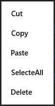

# Context Menu

In graphical user interface (GUI), a ContextMenu is a type of Menu that appears when you perform right-click operation. Nested level of Context Menu items can be created. Diagram provided some in-build ContextMenu items and allows to define custom menu items.

## Default Context Menu

The `ContentMenu` Constraint helps you to enable/disable the context menu. Diagram provides some default context menu items to ease the execution of some frequently used commands. 

The following code illustrates how to enable/disable the default context menu items.



//Disable context menu
diagram.Constraints = GraphConstraints.Default & ~GraphConstraints.ContextMenu;

//Enable context menu
diagram.Constraints = GraphConstraints.Default | GraphConstraints.ContextMenu;



## Customize Context Menu

Apart from the default ContextMenu items, you can define some additional menu items by using `Menu` property of SfDiagram, Node and Connector. Those additional items have to be defined and added to `MenuItems` Property. 

The following code example illustrates how to add custom context menu items to Menu property of SfDiagram.



//Defines custom ContextMenu Items
DiagramMenuItem menu = new DiagramMenuItem() 
	{
		Content = "Delete", 
		Command = (diagram.Info as IGraphInfo).Commands.Delete,
	};
Diagram.Menu.MenuItems.Add(menu);



### Menu for Node and Connector

The default value of `Menu` property for Node and Connector is null.

The following code example illustrates how to set ContextMenu and ContextMenuItems to Node.



//Enables Menu
node.Constraints = node.Constraints | NodeConstraints.Menu;
node.Constraints = node.Constraints & ~NodeConstraints.InheritMenu;
node.Menu = new DiagramMenu();
node.Menu.MenuItems=new ObservableCollection<DiagramMenuItem>();
//Defines custom ContextMenu Items
DiagramMenuItem mi = new DiagramMenuItem()
{
	Content = "Delete",
	Command = (diagram.Info as IGraphInfo).Commands.Delete
};
(node.Menu.MenuItems as ICollection<DiagramMenuItem>).Add(mi);



You can be notified with events when you click the custom menu items. The following code example illustrates the how to define the event for custom context menu.



menu.ClickedEvent += menu_ClickedEvent;

private void menu_ClickedEvent(object sender, MenuItemClickedEventArgs args)
{
	//Source – in which object Event get fired
    //Item - MenuItem     
}



## Context Menu Events

You would be notified with events when you click the menu items. The following code example illustrates how to define those events.



(Diagram.Info as IGraphInfo).MenuItemClickedEvent += MainPage_MenuItemClickedEvent;

void MainPage_MenuItemClickedEvent(object sender, MenuItemClickedEventArgs args)
{
	//Source – in which object Event get fired
    //Item - MenuItem     
}


