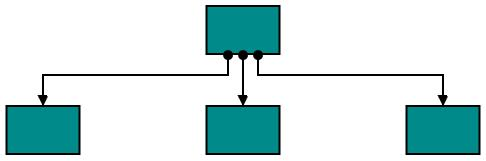
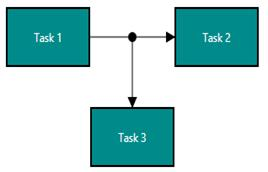
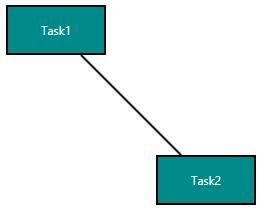
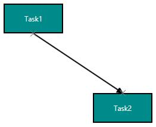
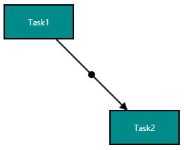
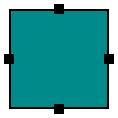
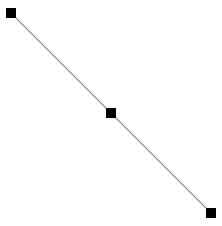
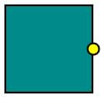

#Port

Essential Diagram for UWP provides support to define custom ports for making connections.

When a Connector is connected between two Nodes, its end points are automatically docked to Node’s nearest boundary as shown in the following image.

Port act as the connection points of node and allows to create connections with only specific points as shown in the following image.

##Node Port

###Add ports to Node

To add a collection port, you need to define the port object and add it to Ports property of Node. The `NodeOffsetX` and `NodeOffsetY` property of Port accepts an object of fractions and used to determine the position of Ports. The following code illustrates how to add ports when initializing the Node.

The following code illustrates how to add ports to Node.



//Creates the Node collection
ObservableCollection<NodeViewModel> nodes = new ObservableCollection<NodeViewModel>();

//Creates NodePort
NodePort port = AddPort(0, 0.5);
NodePort port1 = AddPort(1, 0.5);
NodePort port2 = AddPort(0.5, 0);
NodePort port3 = AddPort(0.5, 1);

//Creates Node
NodeViewModel node = new NodeViewModel()
{
	UnitWidth = 100,
	UnitHeight = 100, 
	OffsetX = 400,
	OffsetY = 100,
	Ports = new ObservableCollection<NodePort>()
	{
		port,
		port1,
		port2,
		port3
	},
	Shape = new RectangleGeometry() { Rect = new Rect(0, 0, 10, 10) },
	ShapeStyle = this.diagram.Resources["shapestyle"] as Style
};

//Adds the Node to the SfDiagram
nodes.Add(node);
diagram.Nodes = nodes;

private NodePort AddPort(double p1, double p2)
{
	NodePort port = new NodePort()
	{
		//Sets the Port size
		Width = 10,
		Height = 10,
		
		// Specifies the port offset – fraction value relative
		NodeOffsetX = p1,
		NodeOffsetY = p2,
		
		//Sets the UnitMode
		UnitMode = UnitMode.Fraction,
		
		//Specifies the PortVisibility
		PortVisibility = PortVisibility.Visible,
		
		//Customizes the appearance
		Shape = new RectangleGeometry() { Rect = new Rect(0, 0, 10, 10) },
		ShapeStyle = this.diagram.Resources["portshapestyle"] as Style
	};
	port.Constraints = PortConstraints.Inherit & ~PortConstraints.InheritPortVisibility;
	return port;
}



##ConnectorPort

###Add Port to Connector
To add a collection port, you need to define the port object and add it to `Ports` property of Connector. The `Length` property of Port accepts an object of fractions and used to determine the position of Ports. The following code illustrates how to add ports to the Connector.

The following code illustrates how to add ports to Connector.



//Creates the Node collection
ObservableCollection<NodeViewModel> nodes = new ObservableCollection<NodeViewModel>();

//Creates ConnectorPort
ConnectorPort port = AddConnectorPort(0);
ConnectorPort port1 = AddConnectorPort(0.5);
ConnectorPort port2 = AddConnectorPort(1);
        
//Creates the Connector collection	  		
ObservableCollection<ConnectorViewModel> lines = new ObservableCollection<ConnectorViewModel>();

//Create the Connector
ConnectorViewModel connector = new ConnectorViewModel()
{
	//Creates the Port collection
	Ports = new ObservableCollection<ConnectorPort>()
	{
       	port,
              port1,
              port2
       },
       SourcePoint = new Point(100, 100),
       TargetPoint = new Point(300, 300),               
};

//Adds the connector to the SfDiagram
lines.Add(connector);
diagram.Connectors = lines;

private ConnectorPort AddConnectorPort(double p)
{
	ConnectorPort connectorport = new ConnectorPort()
       {
       		  Length = p,
              UnitMode = UnitMode.Fraction,
              PortVisibility = PortVisibility.Visible,
              Shape = new RectangleGeometry() { Rect = new Rect(0, 0, 10, 10) },
              ShapeStyle = this.diagram.Resources["portshapestyle"] as Style,
              Constraints = PortConstraints.Inherit & ~PortConstraints.InheritPortVisibility
       };
       return connectorport;
}



##Connect with ports

Connector’s `SourcePort` and `TargetPort` properties allow to create connections between some specific points of Source/Target Nodes. For more information about creating connections with port, refer to [Connections with Ports](/uwp/sfdiagram/Connector#Connections-with-Ports "Connections with Ports").

##Appearance

You can change the shape of port by using its shape property. The appearance of ports can be customized with a set of style specific properties.

The following code illustrates how to change the appearance of port.

[XAML]





[C#]



//Creates NodePort
NodePort port = new NodePort()
{
	Width = 15,
	Height = 15,
	
	//Specifies the port position
	NodeOffsetX = p1,
	NodeOffsetY = p2,
	
	//Sets the UnitMode
	UnitMode = UnitMode.Fraction,
	
	//Specifies the PortVisibility
	PortVisibility = PortVisibility.Visible,
	
	//Customizes the appearance
	Shape = new EllipseGeometry() { RadiusX = 10, RadiusY = 10 },
	ShapeStyle = this.diagram.Resources["portshapestyle"] as Style
};



##Constraints

The Constraints property allows to enable/disable certain behaviors of ports. For more information about port constraints, refer to [Port Constraints](/uwp/sfdiagram/Constraints#PortConstraints "Port Constraints").