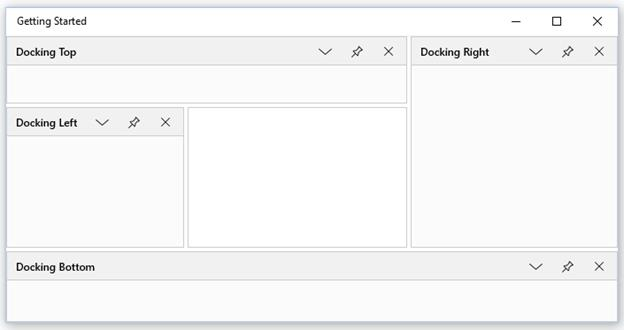
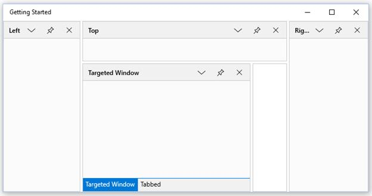
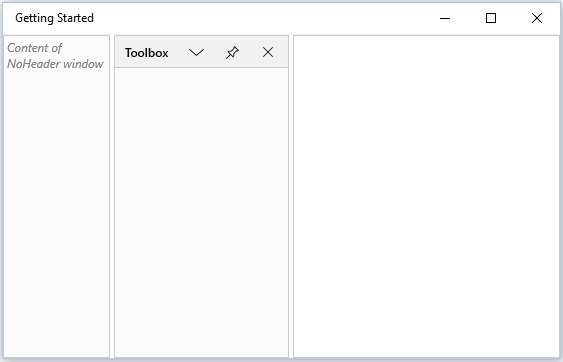

# Docking Window

Docking windows is one of the state of `SfDockingManager`. Since Dock is the default value, so initially all the children stay as Docking Window.

## Configuring Window in Different Sides

The five sides that can be docked are

* Left
* Right
* Top
* Bottom
* Tabbed

To dock four children of a `SfDockingManager` in 4 different sides, then use `SideInDockedMode` property with the required values.





<layout:SfDockingManager x:Name="docking">

<ContentControl layout:SfDockingManager.Header="Docking Left"
                layout:SfDockingManager.SideInDockedMode="Left"/>

<ContentControl layout:SfDockingManager.Header="Docking Top"
                layout:SfDockingManager.SideInDockedMode="Top"/>

<ContentControl layout:SfDockingManager.Header="Docking Right"
                layout:SfDockingManager.SideInDockedMode="Right"/>

<ContentControl layout:SfDockingManager.Header="Docking Bottom"
                layout:SfDockingManager.SideInDockedMode="Bottom"/>

</layout:SfDockingManager>





## Docking Window in Various Targets

Docking window can also be docked at any side of the Target Docking Window through an attached property named `TargetNameInDockedMode`.

Also to set as Tabbed Window, the window should aware of a Target window name. The following code helps to arrange children of `SfDockingManager` that targets a single Docking window docked along Left, Top, Right and Tabbed.





<layout:SfDockingManager>

<ContentControl layout:SfDockingManager.Header="Targeted Window" x:Name="DockingWindow1"/>

<!--Targeted to Docking Window1 on Top Side-->

<ContentControl layout:SfDockingManager.Header="Top"
                layout:SfDockingManager.SideInDockedMode="Top"
				layout:SfDockingManager.TargetNameInDockedMode="DockingWindow1"/>

<!--Targeted to DockingWindow1 on Right Side-->

<ContentControl layout:SfDockingManager.Header="Right"
                layout:SfDockingManager.SideInDockedMode="Right"
				layout:SfDockingManager.TargetNameInDockedMode="DockingWindow1"/>

<!--Targeted to DockingWindow1 on Left Side-->

<ContentControl layout:SfDockingManager.Header="Left"
                layout:SfDockingManager.SideInDockedMode="Left"
				layout:SfDockingManager.TargetNameInDockedMode="DockingWindow1"/>

<!--Targeted to DockingWindow to tab-->

<ContentControl layout:SfDockingManager.Header="Tabbed"
                layout:SfDockingManager.SideInDockedMode="Tabbed"
				layout:SfDockingManager.TargetNameInDockedMode="DockingWindow1"/>

</layout:SfDockingManager>





## Enabling or Disabling the Header Visibility

`NoHeader` is an attached property, that is used to hide the header of Dock Window. Default value of `NoHeader` is False, to hide the Header turn its value to True.





<layout:SfDockingManager>

<ContentControl layout:SfDockingManager.Header="Toolbox"/>

<ContentControl layout:SfDockingManager.Header="Solution Explorer"
                layout:SfDockingManager.NoHeader="True">
                
<TextBlock Text="Content of NoHeader window" FontStyle="Italic"
           Foreground="Gray" TextWrapping="Wrap"/>

</ContentControl>

</layout:SfDockingManager>





## Enabling or Disabling the Dock Functionality

The `CanDock` attached property can help to enable or disable the docking functionality by setting its value as True or False. By default, its value is True, to disable this functionality turn its value to False.





<layout:SfDockingManager>

<ContentControl layout:SfDockingManager.Header="Toolbox"
                layout:SfDockingManager.CanDock="False"/>

</layout:SfDockingManager>



