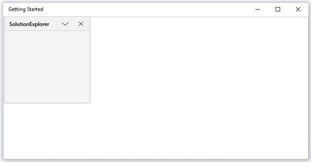

# Floating Window

Floating window is one of the state in the `SfDockingManager`. To make children of the `SfDockingManager` as Float, set its `DockState` values as Float.





<layout:SfDockingManager>

<ContentControl layout:SfDockingManager.Header="SolutionExplorer"
                layout:SfDockingManager.DockState="Float"/>

</layout:SfDockingManager>





## Enabling or Disabling the Float functionality

The `CanFloat` attached property helps to enable or disable the floating functionality by setting its value as True or False respectively. By default, its value is True, to disable this functionality turn its value to False.





<layout:SfDockingManager>

<ContentControl layout:SfDockingManager.Header="SolutionExplorer"
                layout:SfDockingManager.CanFloat="False"/>

</layout:SfDockingManager>





## Positioning on Desire Location

The `FloatWindow` can be placed at any desired location. To position the `FloatWindow` at the desired location with the required rectangle bounds, call `SetFloatingWindowRect` method of the `SfDockingManager`.





<layout:SfDockingManager x:Name="docking">

<ContentControl x:Name="child1" layout:SfDockingManager.Header="SolutionExplorer"
                                layout:SfDockingManager.DockState="Float"/>

</layout:SfDockingManager>





SfDockingManager.SetFloatingWindowRect(child1, new Rect(200, 0, 200, 200));





