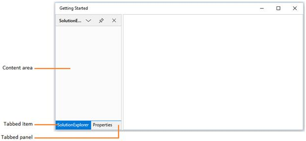
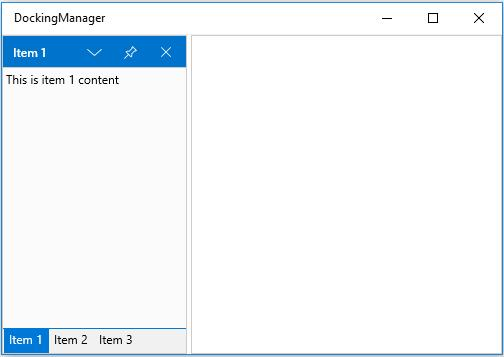
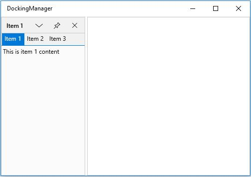
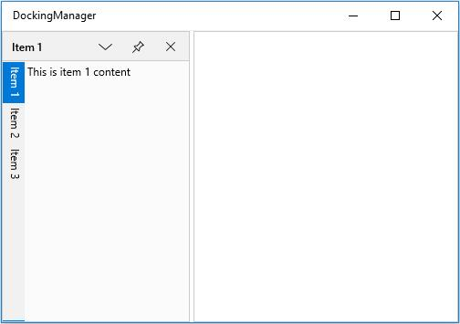
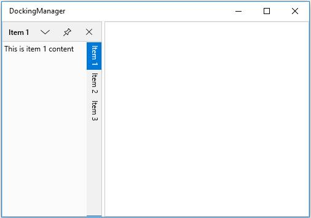

# Tabbed Window

Child window can be arranged as Tabbed window by setting `TargetName` and side value as Tabbed using the property `SideInDockedMode`.





<layout:SfDockingManager>

<ContentControl layout:SfDockingManager.Header="SolutionExplorer" Name="SolutionExplorer"
                layout:SfDockingManager.SideInDockedMode="Top"
				/>

<ContentControl layout:SfDockingManager.Header="Properties"
                layout:SfDockingManager.SideInDockedMode="Tabbed"
				layout:SfDockingManager.TargetNameInDockedMode="SolutionExplorer"/>

</layout:SfDockingManager>





## Tab Alignments

By default, tabs of the docked windows are placed at bottom. To place the tabs of the docked window at different sides, set the property `DockTabPlacement` with desired values such as `Top`, `Bottom`, `Left` and `Right`.

* Setting `DockTabPlacement` as `Bottom`





<syncfusion:SfDockingManager DockTabPlacement="Bottom" x:Name="dockingManager">

<ContentControl x:Name="dock1" syncfusion:SfDockingManager.Header="Item 1"
                               syncfusion:SfDockingManager.DockState="Dock">

<TextBlock Text="This is item 1 content"/>

</ContentControl>

<ContentControl syncfusion:SfDockingManager.Header="Item 2"
                syncfusion:SfDockingManager.DockState="Dock"
				syncfusion:SfDockingManager.SideInDockedMode="Tabbed"
				syncfusion:SfDockingManager.TargetNameInDockedMode="dock1">

<TextBlock Text="This is item 2 content"/>

</ContentControl>

<ContentControl syncfusion:SfDockingManager.Header="Item 3"
                syncfusion:SfDockingManager.DockState="Dock"
				syncfusion:SfDockingManager.SideInDockedMode="Tabbed"
				syncfusion:SfDockingManager.TargetNameInDockedMode="dock1">

<TextBlock Text="This is item 3 content"/>

</ContentControl>

</syncfusion:SfDockingManager>





dockingManager.DockTabPlacement = Syncfusion.UI.Xaml.Controls.Layout.TabPlacement.Bottom;





* Setting `DockTabPlacement` as `Top`





<syncfusion:SfDockingManager DockTabPlacement="Top" x:Name="dockingManager">

<ContentControl x:Name="dock1" syncfusion:SfDockingManager.Header="Item 1"
                               syncfusion:SfDockingManager.DockState="Dock">

<TextBlock Text="This is item 1 content"/>

</ContentControl>

<ContentControl syncfusion:SfDockingManager.Header="Item 2"
                syncfusion:SfDockingManager.DockState="Dock"
				syncfusion:SfDockingManager.SideInDockedMode="Tabbed"
				syncfusion:SfDockingManager.TargetNameInDockedMode="dock1">

<TextBlock Text="This is item 2 content"/>

</ContentControl>

<ContentControl syncfusion:SfDockingManager.Header="Item 3"
                syncfusion:SfDockingManager.DockState="Dock"
				syncfusion:SfDockingManager.SideInDockedMode="Tabbed"
				syncfusion:SfDockingManager.TargetNameInDockedMode="dock1">

<TextBlock Text="This is item 3 content"/>

</ContentControl>

</syncfusion:SfDockingManager>





dockingManager.DockTabPlacement = Syncfusion.UI.Xaml.Controls.Layout.TabPlacement.Top;





* Setting `DockTabPlacement` as `Left`





<syncfusion:SfDockingManager DockTabPlacement="Left" x:Name="dockingManager">

<ContentControl x:Name="dock1" syncfusion:SfDockingManager.Header="Item 1"
                               syncfusion:SfDockingManager.DockState="Dock">

<TextBlock Text="This is item 1 content"/>

</ContentControl>

<ContentControl syncfusion:SfDockingManager.Header="Item 2"
                syncfusion:SfDockingManager.DockState="Dock"
				syncfusion:SfDockingManager.SideInDockedMode="Tabbed"
				syncfusion:SfDockingManager.TargetNameInDockedMode="dock1">

<TextBlock Text="This is item 2 content"/>

</ContentControl>

<ContentControl syncfusion:SfDockingManager.Header="Item 3"
                syncfusion:SfDockingManager.DockState="Dock"
				syncfusion:SfDockingManager.SideInDockedMode="Tabbed"
				syncfusion:SfDockingManager.TargetNameInDockedMode="dock1">

<TextBlock Text="This is item 3 content"/>

</ContentControl>

</syncfusion:SfDockingManager>





dockingManager.DockTabPlacement= Syncfusion.UI.Xaml.Controls.Layout.TabPlacement.Left;





* Setting `DockTabPlacement` as `Right`





<syncfusion:SfDockingManager DockTabPlacement="Right" x:Name="dockingManager">

<ContentControl x:Name="dock1" syncfusion:SfDockingManager.Header="Item 1"
                               syncfusion:SfDockingManager.DockState="Dock">

<TextBlock Text="This is item 1 content"/>

</ContentControl>

<ContentControl syncfusion:SfDockingManager.Header="Item 2"
                syncfusion:SfDockingManager.DockState="Dock"
				syncfusion:SfDockingManager.SideInDockedMode="Tabbed"
				syncfusion:SfDockingManager.TargetNameInDockedMode="dock1">

<TextBlock Text="This is item 2 content"/>

</ContentControl>

<ContentControl syncfusion:SfDockingManager.Header="Item 3"
                syncfusion:SfDockingManager.DockState="Dock"
				syncfusion:SfDockingManager.SideInDockedMode="Tabbed"
				syncfusion:SfDockingManager.TargetNameInDockedMode="dock1">

<TextBlock Text="This is item 3 content"/>

</ContentControl>

</syncfusion:SfDockingManager>





dockingManager.DockTabPlacement = Syncfusion.UI.Xaml.Controls.Layout.TabPlacement.Right;





