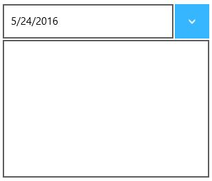

# Configuring Content

Content and DropDownContent can be added to the SfDropDownButton control as follows:

## Content

Set the Content property to display a content with both dropdown open and close.


<input:SfDropDownButton Content="5/24/2016"/>



## DropDownContent

Set the DropDownContent property to display a content when the dropdown is open.


<input:SfDropDownButton Content="5/24/2016">

<input:SfDropDownButton.DropDownContent>

<input:SfCalendar x:Name="calendar"/>

</input:SfDropDownButton.DropDownContent>

</input:SfDropDownButton>



