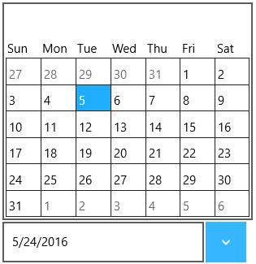

# Customizing DropDown

## DropDown direction

The direction of drop down can be changed using DropDownDirection property.


<input:SfDropDownButton Content="5/24/2016" DropDownDirection="Top" x:Name="dropdownbutton">

<input:SfDropDownButton.DropDownContent>

<input:SfCalendar/>

</input:SfDropDownButton.DropDownContent>

</input:SfDropDownButton>





dropdownbutton.DropDownDirection = Syncfusion.UI.Xaml.Controls.Input.DropDownDirection.Top;



## DropDown height

The height of drop down can be changed using DropDownHeight property.



<input:SfDropDownButton Content="5/24/2016" DropDownHeight="250" x:Name="dropdownbutton">

<input:SfDropDownButton.DropDownContent>

<input:SfCalendar/>

</input:SfDropDownButton.DropDownContent>

</input:SfDropDownButton>





dropdownbutton.DropDownHeight = 250.0;



## IsDropDownOpen

Drop down can be programmatically opened or closed using the property IsDropDownOpen.

