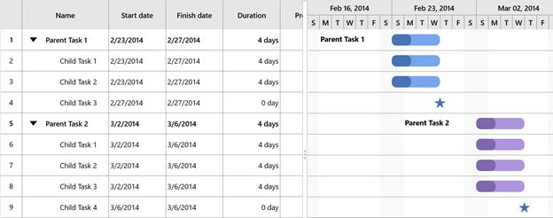

# Appearance
## Customization
This topic gives an overview on how to customize the TaskBar in the Gantt chart. 
### Visual Customization
The following properties are used for visual customization of the TaskBar. 
* [`ParentTaskBarBrush`](https://help.syncfusion.com/cr/cref_files/uwp/Syncfusion.SfGantt.UWP~Syncfusion.UI.Xaml.Gantt.SfGantt~ParentTaskBarBrushProperty.html) – To customize the parent taskbar brush.
* [`ParentProgressIndicatorBrush`](https://help.syncfusion.com/cr/cref_files/uwp/Syncfusion.SfGantt.UWP~Syncfusion.UI.Xaml.Gantt.SfGantt~ParentProgressIndicatorBrushProperty.html) – To customize the parent progress brush.
* [`TaskBarBrush`](https://help.syncfusion.com/cr/cref_files/uwp/Syncfusion.SfGantt.UWP~Syncfusion.UI.Xaml.Gantt.SfGantt~TaskBarBrushProperty.html) – To customize the taskbar brush. 
* [`TaskProgressIndicatorBrush`](https://help.syncfusion.com/cr/cref_files/uwp/Syncfusion.SfGantt.UWP~Syncfusion.UI.Xaml.Gantt.SfGantt~TaskProgressIndicatorBrushProperty.html) – To customize the task progress brush.
* [`MilestoneBrush`](https://help.syncfusion.com/cr/cref_files/uwp/Syncfusion.SfGantt.UWP~Syncfusion.UI.Xaml.Gantt.SfGantt~MilestoneBrushProperty.html) – To customize the milestone brush.
Following code snippet shows how to use these properties for the visual customization of the TaskBar.
<table>
<tr>
<td>
        <gantt:SfGantt x:Name="GanttControl" ItemsSource="{Binding TaskCollection}"
                       ParentTaskBarBrush="#33ffbe06" 
                       ParentProgressIndicatorBrush="#FFffbe06"
                       TaskBarBrush="#3390a84e" 
                       TaskProgressIndicatorBrush="#FF90a84e"
                       MilestoneBrush="#999999">
        </gantt:SfGantt>
</td>
</tr>
</table>

### Template Customization
The following properties are used for customizing the template of the TaskBar. 
* [`ParentTaskBarTemplate`](https://help.syncfusion.com/cr/cref_files/uwp/Syncfusion.SfGantt.UWP~Syncfusion.UI.Xaml.Gantt.SfGantt~ParentTaskBarTemplate.html) – To customize the header task in the Gantt chart.
* [`TaskBarTemplate`](https://help.syncfusion.com/cr/cref_files/uwp/Syncfusion.SfGantt.UWP~Syncfusion.UI.Xaml.Gantt.SfGantt~TaskBarTemplateProperty.html) – To customize the child task in the Gantt chart.
* [`MilestoneTemplate`](https://help.syncfusion.com/cr/cref_files/uwp/Syncfusion.SfGantt.UWP~Syncfusion.UI.Xaml.Gantt.SfGantt~MilestoneTemplate.html) – To customize the milestone task in the Gantt chart.

N> The basic functionalities of the TaskBar like resizing, drag and drop and tooltip are available only when the template has the predefined name and the drag and drop/resizing thumbs. Otherwise the custom TaskBar will appear with the defined template, but you cannot access these features of Gantt.
**Xaml**
<table>
<tr>
<td>
<Grid>
  <Grid.Resources>
            <local:TextConverter x:Key="TextConverter"></local:TextConverter>
            <local:ProgressColorConverter x:Key="ProgressFillConverter"></local:ProgressColorConverter>
            <local:ColorConverter x:Key="TaskFillConverter"></local:ColorConverter>

            <!--TaskBar Template-->
            <ControlTemplate x:Key="TaskBarTemplate">
                <Grid x:Name="PART_TaskGrid">
                    <Grid.ColumnDefinitions>
                        <ColumnDefinition Width="Auto"/>
                        <ColumnDefinition Width="Auto"/>
                        <ColumnDefinition Width="*"/>
                        <ColumnDefinition Width="Auto"/>
                        <ColumnDefinition Width="Auto"/>
                    </Grid.ColumnDefinitions>
                    <Grid Grid.Column="2">
                        <!--Bound the task height and task width-->
                        <Rectangle x:Name="PART_TaskBar" HorizontalAlignment="Left"
                                           Height="{Binding ActualTaskHeight}"   
                                           Width="{Binding TaskWidth}"
                                           Fill="{Binding Converter={StaticResource TaskFillConverter}}" 
                                           RadiusX="10" RadiusY="10" ></Rectangle>
                        <!--Bound the progress width-->
                        <Rectangle x:Name="PART_ProgressBar" Width="{Binding ProgressWidth}"
                                           HorizontalAlignment="Left" RadiusX="10" 
                                           RadiusY="10"
                                           Height="{Binding ActualTaskHeight}"
                                           Fill="{Binding Converter={StaticResource ProgressFillConverter}}"/>
                    </Grid>
                </Grid>
            </ControlTemplate>
            <!--Parent task template-->
            <ControlTemplate x:Key="ParentTaskBarTemplate">
                <Grid>
                    <TextBlock Margin="-150,0,150,0"  FontWeight="Bold" Text="{Binding Converter={StaticResource TextConverter}}"></TextBlock>
                    <Grid>
                        <!--Bound the task height and task width-->
                        <Rectangle x:Name="PART_TaskBar" HorizontalAlignment="Left"
                                           Height="{Binding ActualTaskHeight}" 
                                           Width="{Binding TaskWidth}"
                                           Fill="{Binding Converter={StaticResource TaskFillConverter}}"
                                           RadiusX="10" RadiusY="10" ></Rectangle>
                        <!--Bound the progress width-->
                        <Rectangle x:Name="PART_ProgressBar" Width="{Binding ProgressWidth}"
                                           HorizontalAlignment="Left" RadiusX="10" 
                                           RadiusY="10"
                                           Height="{Binding ActualTaskHeight}"
                                           Fill="{Binding Converter={StaticResource ProgressFillConverter}}"/>
                    </Grid>
                </Grid>
            </ControlTemplate>
            <!--Milestone Template-->
            <ControlTemplate x:Key="MilestoneTemplate">
                <Grid>
                    <Grid.ColumnDefinitions>
                        <ColumnDefinition Width="*"/>
                        <ColumnDefinition Width="Auto"/>
                        <ColumnDefinition Width="Auto"/>
                    </Grid.ColumnDefinitions>
                    <Viewbox Grid.Column="1">
                        <!--Bound the task height and task width-->
                        <Path x:Name="PART_TaskBar" HorizontalAlignment="Left"
                                      Data="M1540.22,2082.07L1546.95,2102.78 1568.73,2102.78 1551.11,2115.58 1557.84,2136.29 1540.22,2123.49 1522.6,2136.29 1529.33,2115.58 1511.71,2102.78 1533.49,2102.78 1540.22,2082.07z"
                                      Stretch="Uniform" Width="{Binding TaskWidth}" Height="{Binding ActualTaskHeight}"
                                      Fill="#4773b5">
                        </Path>
                    </Viewbox>
                </Grid>
            </ControlTemplate>
        </Grid.Resources>
        <gantt:SfGantt x:Name="GanttControl" ItemsSource="{Binding TaskCollection}"
                       DisplayTaskNames="False" 
                       MilestoneTemplate="{StaticResource MilestoneTemplate}"
                       ParentTaskBarTemplate="{StaticResource ParentTaskBarTemplate}" 
                       TaskBarTemplate="{StaticResource TaskBarTemplate}">
        </gantt:SfGantt>
</Grid>
</td>
</tr>
</table>

Please find the demo sample from the following link [Template Demo](http://www.syncfusion.com/downloads/support/directtrac/general/ze/TemplateSupport1085883211.zip# ""). 
