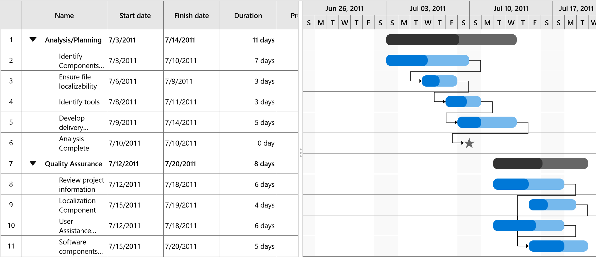

# Appearance

The SfGantt control provides options to customize the look and feel of the task visual. 

**Visual Customization**
Color of parent taskbar, task bar, milestone and progress bar can be customized by using the following properties. 

* [`ParentTaskBarBrush`](https://help.syncfusion.com/cr/cref_files/uwp/Syncfusion.SfGantt.UWP~Syncfusion.UI.Xaml.Gantt.SfGantt~ParentTaskBarBrushProperty.html) – Specifies the color for the parent taskbar.
* [`ParentProgressIndicatorBrush`](https://help.syncfusion.com/cr/cref_files/uwp/Syncfusion.SfGantt.UWP~Syncfusion.UI.Xaml.Gantt.SfGantt~ParentProgressIndicatorBrushProperty.html) – Specifies the color for the parent progress bar.
* [`TaskBarBrush`](https://help.syncfusion.com/cr/cref_files/uwp/Syncfusion.SfGantt.UWP~Syncfusion.UI.Xaml.Gantt.SfGantt~TaskBarBrushProperty.html) – Specifies the color for the taskbar.
* [`TaskProgressIndicatorBrush`](https://help.syncfusion.com/cr/cref_files/uwp/Syncfusion.SfGantt.UWP~Syncfusion.UI.Xaml.Gantt.SfGantt~TaskProgressIndicatorBrushProperty.html) – Specifies the color for task progress bar.
* [`MilestoneBrush`](https://help.syncfusion.com/cr/cref_files/uwp/Syncfusion.SfGantt.UWP~Syncfusion.UI.Xaml.Gantt.SfGantt~MilestoneBrushProperty.html) – Specifies the color for the milestone.

The following code sample explains the visual customization of the TaskBar.


        <gantt:SfGantt x:Name="GanttControl" ItemsSource="{Binding TaskCollection}"
                       ParentTaskBarBrush="#33ffbe06" 
                       ParentProgressIndicatorBrush="#FFffbe06"
                       TaskBarBrush="#3390a84e" 
                       TaskProgressIndicatorBrush="#FF90a84e"
                       MilestoneBrush="#999999">
        </gantt:SfGantt>


**Template Customization**
You can also customize the template for the taskbar,parent taskbar and milestone by using the [`ParentTaskBarTemplate`](https://help.syncfusion.com/cr/cref_files/uwp/Syncfusion.SfGantt.UWP~Syncfusion.UI.Xaml.Gantt.SfGantt~ParentTaskBarTemplate.html),[`TaskBarTemplate`](https://help.syncfusion.com/cr/cref_files/uwp/Syncfusion.SfGantt.UWP~Syncfusion.UI.Xaml.Gantt.SfGantt~TaskBarTemplateProperty.html) and [`MilestoneTemplate`](https://help.syncfusion.com/cr/cref_files/uwp/Syncfusion.SfGantt.UWP~Syncfusion.UI.Xaml.Gantt.SfGantt~MilestoneTemplate.html) properties respectively.

The following code sample illustrates the template customization.


        <gantt:SfGantt x:Name="GanttControl" ItemsSource="{Binding TaskCollection}"
                       DisplayTaskNames="False">
            <!--TaskBar Template-->
            <gantt:SfGantt.TaskBarTemplate>
                <ControlTemplate>
                    <Grid x:Name="PART_TaskGrid">
                        <Grid.ColumnDefinitions>
                            <ColumnDefinition Width="Auto"/>
                            <ColumnDefinition Width="Auto"/>
                            <ColumnDefinition Width="*"/>
                            <ColumnDefinition Width="Auto"/>
                            <ColumnDefinition Width="Auto"/>
                        </Grid.ColumnDefinitions>
                        <Grid Grid.Column="2">
                            <!--Bound task height, task width and task brush-->
                            <Rectangle x:Name="PART_TaskBar" HorizontalAlignment="Left"
                                           Height="{Binding ActualTaskHeight}" Width="{Binding TaskWidth}"
                                           Fill="{Binding TaskBrush}" RadiusX="10" RadiusY="10" ></Rectangle>
                            <!--Bound task height, progress width and progress brush--> 
                            <Rectangle x:Name="PART_ProgressBar" Width="{Binding ProgressWidth}"
                                           HorizontalAlignment="Left" RadiusX="10" RadiusY="10"
                                           Height="{Binding ActualTaskHeight}"
                                           Fill="{Binding ProgressBrush}"/>
                        </Grid>
                    </Grid>
                </ControlTemplate>
            </gantt:SfGantt.TaskBarTemplate>

            <!--Milestone Template-->
            <gantt:SfGantt.MilestoneTemplate>
                <ControlTemplate>
                    <Grid>
                        <Grid.ColumnDefinitions>
                            <ColumnDefinition Width="Auto"/>
                            <ColumnDefinition Width="*"/>
                            <ColumnDefinition Width="Auto"/>
                        </Grid.ColumnDefinitions>
                        <Viewbox Grid.Column="1">
                            <!--Bound task height, task width and task brush-->
                            <Path x:Name="PART_TaskBar" HorizontalAlignment="Left"
                                      Data="M1540.22,2082.07L1546.95,2102.78 1568.73,2102.78 1551.11,2115.58 1557.84,2136.29 1540.22,2123.49 1522.6,2136.29 1529.33,2115.58 1511.71,2102.78 1533.49,2102.78 1540.22,2082.07z"
                                      Stretch="Uniform" Width="{Binding TaskWidth}" Height="{Binding ActualTaskHeight}"
                                      Fill="{Binding TaskBrush}">
                            </Path>
                        </Viewbox>
                    </Grid>
                </ControlTemplate>
            </gantt:SfGantt.MilestoneTemplate>

            <!--Parent task template-->
            <gantt:SfGantt.ParentTaskBarTemplate>
                <ControlTemplate>
                    <Grid>
                        <!--Bound task height, task width and task brush-->
                        <Rectangle x:Name="PART_TaskBar" HorizontalAlignment="Left"
                                   Height="{Binding ActualTaskHeight}" Width="{Binding TaskWidth}"
                                   Fill="{Binding TaskBrush}" RadiusX="10" RadiusY="10" ></Rectangle>
                        <!--Bound task height, progress width and progress brush-->
                        <Rectangle x:Name="PART_ProgressBar" Width="{Binding ProgressWidth}"
                                   HorizontalAlignment="Left" RadiusX="10" RadiusY="10"
                                   Height="{Binding ActualTaskHeight}"
                                   Fill="{Binding ProgressBrush}"/>
                    </Grid>
                </ControlTemplate>
            </gantt:SfGantt.ParentTaskBarTemplate>
        </gantt:SfGantt>


