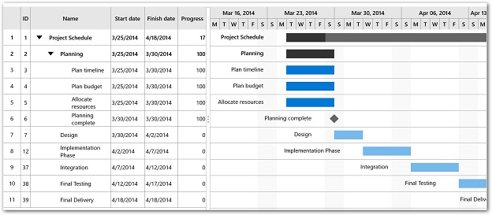
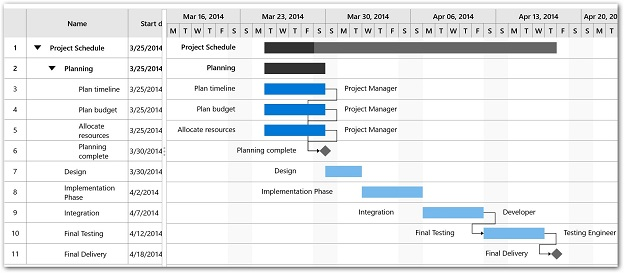
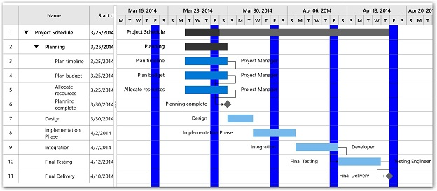

# Getting started

The following section provides an assistance to create a simple Gantt application and to configure it.

## Referencing Essential Studio Components in your Solution

### Adding SDK reference

1.Open the Reference Manager window from project.
2.Choose Windows > Extensions > Syncfusion Controls for UWP XAML.

### Adding assembly reference

Individual reference can be added to the project instead of SDK “Syncfusion Controls for UWP XAML” which refers all the controls in the Syncfusion control library.

In the Add Reference window, browse and choose the reference assembly from the following location.

**[Installed location]**\Syncfusion\Essential Studio\\**[Installed version]**\Assemblies for Universal Windows\10.0\

The following list of assemblies needs to be added as reference to use SfGantt control in any application,

<table>
<tr>
<th>
Required assemblies
</th>
<th>
Description
</th>
</tr>
<tr>
<td>
Syncfusion.SfGantt.UWP
</td>
<td>
Syncfusion.SfGantt.UWP assembly contains classes that handles all the operations in Gantt.
</td>
</tr>
<tr>
<td>
Syncfusion.Data.UWP
</td>
<td>
Syncfusion.Data.UWP assembly is dependent assembly for Syncfusion.SfGrid.UWP
</td>
</tr>
<tr>
<td>
Syncfusion.SfGrid.UWP
</td>
<td>
Syncfusion.SfGrid.UWP assembly contains classes that handles all UI operations of tree grid view in the Gantt.
</td>
</tr>
<tr>
<td>
Syncfusion.SfInput.UWP
</td>
<td>
Syncfusion.SfInput.UWP contains various editor controls (such as SfNumericTextBox, SfDateTimeEdit and etc) which are used in the tree grid view.
</td>
</tr>
<tr>
<td>
Syncfusion.SfShared.UWP
</td>
<td>
Syncfusion.SfShared.UWP is dependent assembly for Syncfusion.SfInput.UWP.
</td>
</tr>
</table>

## Adding SfGantt manually

1.After adding the required assembly references to the project as discussed in the Reference Essential Studio Components in your Solution section.

2.Add the “Syncfusion.UI.Xaml.Gantt” namespace to the application as shown below.





xmlns:gantt="using:Syncfusion.UI.Xaml.Gantt"





using Syncfusion.UI.Xaml.Gantt;





3.Instance the Gantt as like in the below code.





<gantt:SfGantt></gantt:SfGantt>





SfGantt sfGantt = new SfGantt();





## Adding SfGantt from toolbox

Drag and drop the Gantt control from the toolbox to your application.

Now the “Syncfusion Controls for UWP XAML” reference is added to the application references and the xmlns namespace code is generated in MainWindow.xaml as below.

## Create data model

You need to create a collection of TaskDetails objects to populate task in SfGantt.



public class ProjectTrackerViewModel
{
    public ProjectTrackerViewModel()
    {
        _taskCollection = this.GetData();
    }

    private ObservableCollection<TaskDetail> _taskCollection;

    /// 

    /// Gets or sets the appointment item source.
    /// 

    /// <value>The appointment item source.</value>
    public ObservableCollection<TaskDetail> TaskCollection
    {

        get { return _taskCollection; }

        set { _taskCollection = value; }

    }

    /// 

    /// Gets the data.
    /// 

    /// <returns></returns>
    public ObservableCollection<TaskDetail> GetData()
    {
        ObservableCollection<TaskDetail> Schedule = new ObservableCollection<TaskDetail>();

        Schedule.Add(new TaskDetail
        {
            Name = "Project Schedule",
            ID = "1"
        });

        ObservableCollection<TaskDetail> ScheduleProcess = new ObservableCollection<TaskDetail>();

        ScheduleProcess.Add(new TaskDetail
        {
            Name = "Planning",
            ID = "2"
        });

        ScheduleProcess.Add(new TaskDetail
        {
            StartDate = new DateTime(2014, 3, 30),
            FinishDate = new DateTime(2014, 4, 2),
            Name = "Design",
            ID = "7"
        });

        ScheduleProcess.Add(new TaskDetail
        {
            StartDate = new DateTime(2014, 4, 2),
            FinishDate = new DateTime(2014, 4, 7),
            Name = "Implementation Phase",
            ID = "12"
        });

        ScheduleProcess.Add(new TaskDetail
        {
            StartDate = new DateTime(2014, 4, 7),
            FinishDate = new DateTime(2014, 4, 12),
            Name = "Integration",
            ID = "37"
        });

        ScheduleProcess.Add(new TaskDetail
        {
            StartDate = new DateTime(2014, 4, 12),
            FinishDate = new DateTime(2014, 4, 17),
            Name = "Final Testing",
            ID = "38"
        });

        ScheduleProcess.Add(new TaskDetail
        {
            StartDate = new DateTime(2014, 4, 18),
            FinishDate = new DateTime(2014, 4, 18),
            Name = "Final Delivery",
            ID = "39"
        });

        Schedule[0].Children = ScheduleProcess;

        ObservableCollection<TaskDetail> Planning = new ObservableCollection<TaskDetail>();

        Planning.Add(new TaskDetail
        {
            StartDate = new DateTime(2014, 3, 25),
            FinishDate = new DateTime(2014, 3, 30),
            Name = "Plan timeline",
            ID = "3",
            Progress = 100
        });

        Planning.Add(new TaskDetail
        {
            StartDate = new DateTime(2014, 3, 25),
            FinishDate = new DateTime(2014, 3, 30),
            Name = "Plan budget",
            ID = "4",
            Progress = 100
        });

        Planning.Add(new TaskDetail
        {
            StartDate = new DateTime(2014, 3, 25),
            FinishDate = new DateTime(2014, 3, 30),
            Name = "Allocate resources",
            ID = "5",
            Progress = 100
       });

       Planning.Add(new TaskDetail
       {
            StartDate = new DateTime(2014, 3, 30),
            FinishDate = new DateTime(2014, 3, 30),
            Name = "Planning complete",
            ID = "6",
            Progress = 100
        });
		
ScheduleProcess[0].Children = Planning;

        return Schedule;
    }
}



## Binding data

To bind the data source of the SfGantt, set **ItemsSource** property as shown below.





<gantt:SfGantt ItemsSource="{Binding TaskCollection}" />





SfGantt sfGantt = new SfGantt();
sfGantt.ItemsSource = (this.DataContext as ProjectTrackerViewModel).TaskCollection;





## Defining visible columns

By default, the grid view is manipulated with Name, Start Date, Finish Date, Duration, Progress, Predecessor and Resources columns.

You can also customize the visible columns of grid view using **VisibleGridColumns** property in SfGantt.

The following code example illustrates how this can be done.





<gantt:SfGantt VisibleGridColumns="Id,Name,StartDate,FinishDate,Progress" 
               ItemsSource="{Binding TaskCollection}" >
</gantt:SfGantt>





SfGantt sfGantt = new SfGantt();

sfGantt.ItemsSource = (this.DataContext as ProjectTrackerViewModel).TaskCollection;

sfGantt.VisibleGridColumns = TaskAttributes.ID | TaskAttributes.Name | TaskAttributes.StartDate |
                             TaskAttributes.FinishDate | TaskAttributes.Progress;
						   




## Sorting

You can enable sorting using **AllowSorting** property. Sorting functionality to arrange the tasks in ascending or descending order based on a column.

The below code illustrates how to enable sorting in the Gantt control.





<gantt:SfGantt ItemsSource="{Binding TaskCollection}" AllowSorting="True" >

</gantt:SfGantt>





SfGantt sfGantt = new SfGantt();

sfGantt.ItemsSource = (this.DataContext as ProjectTrackerViewModel).TaskCollection;

sfGantt.AllowSorting = true;





## Editing

You can enable editing using **AllowEditing** property in the Gantt. Editing can be done by cell editing in grid or drag/resize the task bar or progress bar in chart view, also drag and drop to establish relationship between the two tasks.

The below code illustrates enabling the editing in Gantt.





<gantt:SfGantt ItemsSource="{Binding TaskCollection}" AllowEditing="True" >

</gantt:SfGantt>





SfGantt sfGantt = new SfGantt();

sfGantt.ItemsSource = (this.DataContext as ProjectTrackerViewModel).TaskCollection;

sfGantt.AllowEditing = true;





N>Currently editing is not available in the Windows Phone.

## Task relationships

You can visualize the relationship between two tasks in the Gantt. These relationships are categorized into four types based on the start and finish date of the task.

* Start to Start(SS) - You cannot start a task until the other task also starts.
* Start to Finish(SF) - You cannot finish a task until the other task finishes.
* Finish to Start(FS) - You cannot start a task until the other task completes.
* Finish to Finish(FF) - You cannot finish a task until the other task completes.

The relationship can be created between two tasks, by adding the task relationship in predecessor collection for the task in the TaskDetails.

The below code illustrates adding the predecessor in the tasks.



ScheduleProcess[4].Predecessors.Add(new TaskRelationship()
{
    ID = "37",
    Relationship = Relationship.FinishToStart
});

ScheduleProcess[5].Predecessors.Add(new TaskRelationship()
{
    ID = "38",
    Relationship = Relationship.FinishToStart
});

Planning[3].Predecessors.Add(new TaskRelationship()
{
    ID = "3",
    Relationship = Relationship.FinishToStart
});

Planning[3].Predecessors.Add(new TaskRelationship()
{
    ID = "4",
    Relationship = Relationship.FinishToStart
});

Planning[3].Predecessors.Add(new TaskRelationship()
{
    ID = "5",
    Relationship = Relationship.FinishToStart
});



## Resources

In Gantt control, you can display and assign the resource for each task.

1.Create the resource collection to be displayed in Gantt.



private GanttResourceCollection _resourceCollection;

/// 

/// Gets or sets the SfGantt resources.
/// 

/// <value>The SfGantt resources.</value>
public GanttResourceCollection ResourceCollection
{
    get { return _resourceCollection; }
    set { _resourceCollection = value; }
}

/// 

/// Gets the resources for the project.
/// 

/// <returns></returns>
private GanttResourceCollection GetResources()
{
    GanttResourceCollection Resources = new GanttResourceCollection();
    Resources.Add(new GanttResource { ID = "1", Name = "Project Manager" });
    Resources.Add(new GanttResource { ID = "2", Name = "Developer" });
    Resources.Add(new GanttResource { ID = "3", Name = "Testing Engineer" });
    return Resources;
}



2.Bind the resource collection to the property **ProjectResources** property in SfGantt.





<gantt:SfGantt ItemsSource="{Binding TaskCollection}" ProjectResources="{Binding ResourceCollection}" >

</gantt:SfGantt>





SfGantt sfGantt = new SfGantt();

sfGantt.ItemsSource = (this.DataContext as ProjectTrackerViewModel).TaskCollection;

sfGantt.ProjectResources = (this.DataContext as ProjectTrackerViewModel)..ResourceCollection;





3.Assign the resource to the tasks.



public ObservableCollection<TaskDetail> GetData()
{
    this._resourceCollection = this.GetResources();

    //To define resource for a task.
    Planning[0].Resources.Add("1");
    Planning[1].Resources.Add("1");
    Planning[2].Resources.Add("1");
    ScheduleProcess[3].Resources.Add("2");
    ScheduleProcess[4].Resources.Add("3");
}



## Non-working days

To highlight and customize the weekends in the Gantt. By default, Saturday and Sunday is considered as weekends.

* **ShowNonWorkingDays** property can be used to enable or disable the non-working 
* **NonWorkingDays** property can be used to customize the weekends.
* **NonWorkingDaysBackground** property can be used change the weekends highlighting color.

The below code illustrates how to display the weekend as Friday.





<gantt:SfGantt ItemsSource="{Binding TaskCollection}" NonWorkingDays="Friday" NonWorkingDaysBackground="Blue" >
        <gantt:SfGantt.TimescaleSettings>
            <gantt:TimescaleSettings>
                <gantt:TimescaleSettings.TopTier>
                    <gantt:TimescaleTier IntervalType="Weeks"></gantt:TimescaleTier>
                </gantt:TimescaleSettings.TopTier>
                <gantt:TimescaleSettings.BottomTier>
                    <gantt:TimescaleTier IntervalType="Days"></gantt:TimescaleTier>
                </gantt:TimescaleSettings.BottomTier>
            </gantt:TimescaleSettings>
        </gantt:SfGantt.TimescaleSettings>
</gantt:SfGantt>





SfGantt sfGantt = new SfGantt();

sfGantt.ItemsSource = (this.DataContext as ProjectTrackerViewModel).TaskCollection;

sfGantt.NonWorkingDays = Days.Friday;

sfGantt.NonWorkingDaysBackground = new SolidColorBrush(Colors.Blue);

sfGantt.TimescaleSettings.TopTier.IntervalType = IntervalType.Weeks;

sfGantt.TimescaleSettings.BottomTier.IntervalType = IntervalType.Days;





N>To display non-working days the interval type must be week or lesser interval type as days, hours and minutes.
