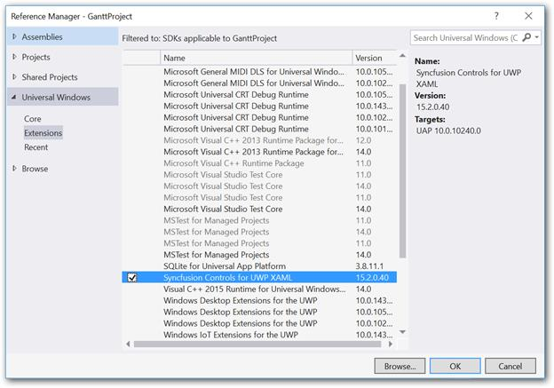
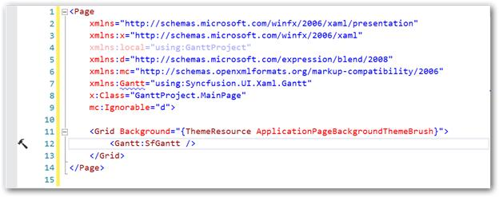
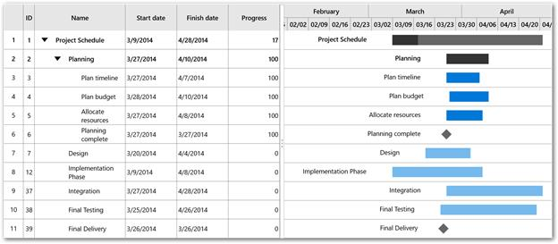
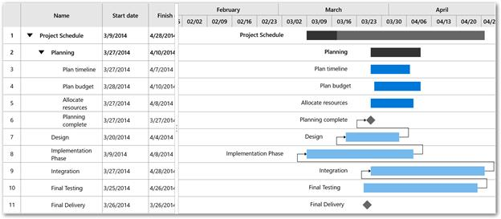
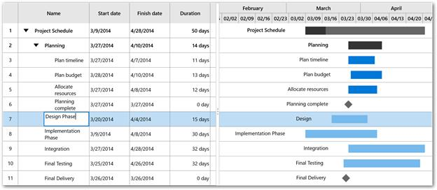
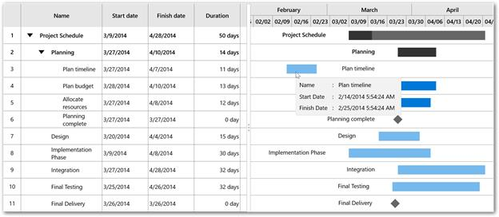
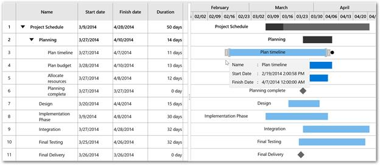
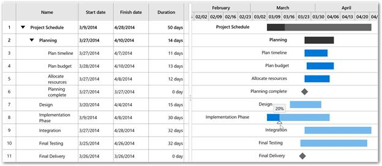
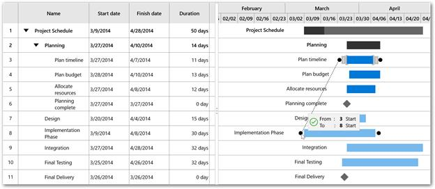
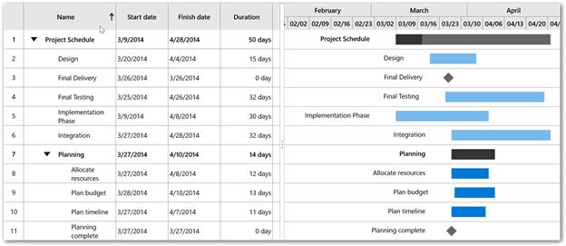

# Getting started

The following section provides an assistance to create a simple Gantt application and to configure it.

## Referencing Essential Studio Components in your Solution

### Adding SDK reference

1. Open the Reference Manager window from project.
2. Choose Windows > Extensions > Syncfusion Controls for UWP XAML.

### Adding assembly reference

Individual reference can be added to the project instead of SDK “Syncfusion Controls for UWP XAML” which refers all the controls in the Syncfusion control library.

In the Add Reference window, browse and choose the reference assembly from the following location.

**[****Installed** **location****]\**Syncfusion\Essential Studio**\[****Installed** **version****]\**Assemblies for Universal Windows\10.0\Syncfusion.SfGantt.UWP.dll

## Create a simple Gantt

In this walkthrough, you will create a new application that contains the SfGantt which includes the below topics.

* Adding SfGantt
* Create data model
* Binding data
* Defining visible columns
* Task relationships
* Resources
* Non-working days
* Editing
* Sorting

### Adding SfGantt

1.Add the required assembly references to the project as discussed in the Reference Essential Studio Components in your Solution section.

2.Add the “Syncfusion.UI.Xaml.Gantt” namespace to the application as shown below.


xmlns:gantt="using:Syncfusion.UI.Xaml.Gantt"




using Syncfusion.UI.Xaml.Gantt;



1.Create an instance of SfGantt control.


<gantt:SfGantt></gantt:SfGantt>




SfGantt gantt=new SfGantt();



### Adding SfGantt from toolbox

Drag and drop the Gantt control from the toolbox to your application.

Now the “Syncfusion Controls for UWP XAML” reference is added to the application references and the xmlns namespace code is generated in MainWindow.xaml as below.

### Create data model

You need to create a collection of TaskDetails objects for populating SfGantt.


public class ProjectTrackerViewModel

{

public ProjectTrackerViewModel()

{

_taskCollection = this.GetData();

}

private ObservableCollection<TaskDetail> _taskCollection;

/// 

/// Gets or sets the appointment item source.

/// 

/// <value>The appointment item source.</value>

public ObservableCollection<TaskDetail> TaskCollection

{

get

{

return _taskCollection;

}

set

{

_taskCollection = value;

}

}

/// 

/// Gets the data.

/// 

/// <returns></returns>

public ObservableCollection<TaskDetail> GetData()

{

ObservableCollection<TaskDetail> Schedule = new ObservableCollection<TaskDetail>();

Schedule.Add(

new TaskDetail

{

StartDate = new DateTime(2014, 2, 3),

FinishDate = new DateTime(2014, 3, 6),

Name = "Project Schedule",

ID = "1"

});

ObservableCollection<TaskDetail> ScheduleProcess = new ObservableCollection<TaskDetail>();

ScheduleProcess.Add(

new TaskDetail

{

StartDate = new DateTime(2014, 3, 20),

FinishDate = new DateTime(2014, 3, 27),

Name = "Planning",

ID = "2"

});

ScheduleProcess.Add(

new TaskDetail

{

StartDate = new DateTime(2014, 3, 20),

FinishDate = new DateTime(2014, 4, 4),

Name = "Design",

ID = "7"

});

ScheduleProcess.Add(

new TaskDetail

{

StartDate = new DateTime(2014, 3, 9),

FinishDate = new DateTime(2014, 4, 8),

Name = "Implementation Phase",

ID = "12"

});

ScheduleProcess.Add(

new TaskDetail

{

StartDate = new DateTime(2014, 3, 27),

FinishDate = new DateTime(2014, 4, 28),

Name = "Integration",

ID = "37"

});

ScheduleProcess.Add(

new TaskDetail

{

StartDate = new DateTime(2014, 3, 25),

FinishDate = new DateTime(2014, 4, 26),

Name = "Final Testing",

ID = "38"

});

ScheduleProcess.Add(

new TaskDetail

{

StartDate = new DateTime(2014, 3, 26),

FinishDate = new DateTime(2014, 3, 26),

Name = "Final Delivery",

ID = "39"

});

Schedule[0].Children = ScheduleProcess;

ObservableCollection<TaskDetail> Planning = new ObservableCollection<TaskDetail>();

Planning.Add(

new TaskDetail

{

StartDate = new DateTime(2014, 3, 27),

FinishDate = new DateTime(2014, 4, 7),

Name = "Plan timeline",

ID = "3",

Progress = 100

});

Planning.Add(

new TaskDetail

{

StartDate = new DateTime(2014, 3, 28),

FinishDate = new DateTime(2014, 4, 10),

Name = "Plan budget",

ID = "4",

Progress = 100

});

Planning.Add(

new TaskDetail

{

StartDate = new DateTime(2014, 3, 27),

FinishDate = new DateTime(2014, 4, 8),

Name = "Allocate resources",

ID = "5",

Progress = 100

});

Planning.Add(

new TaskDetail

{

StartDate = new DateTime(2014, 3, 27),

FinishDate = new DateTime(2014, 3, 27),

Name = "Planning complete",

ID = "6",

Progress = 100

});

ScheduleProcess[0].Children = Planning;

return Schedule;

}

}



### Binding data

To bind the data source of the SfGantt, set ItemsSource property as shown below.


<gantt:SfGantt ItemsSource="{Binding TaskCollection}" />




SfGantt gantt=new SfGantt() {ItemsSource = this.taskDetails.TaskCollection};



### Defining visible columns

By default, the grid has the following columns as Name, Start Date, Finish Date, Duration, Progress, Predecessor and Resources.

You can also define the visible columns using VisibleGridColumns property in SfGantt.

The following code example illustrates how this can be done.


<gantt:SfGantt VisibleGridColumns="Id,Name,StartDate,FinishDate,Progress" ItemsSource="{Binding TaskCollection}" />




SfGantt gantt = new SfGantt();

gantt.ItemsSource = this.taskDetails.TaskCollection;

gantt.VisibleGridColumns = TaskAttributes.ID | TaskAttributes.Name | TaskAttributes.StartDate | TaskAttributes.FinishDate | TaskAttributes.Progress;



### Task relationships

You can show the relationship between two tasks in Gantt control. These relationships are categorized into four types based on the start and finish date of the task.

* Start to Start(SS)
* Finish to Start(FS)
* Start to Finish(SF)
* Finish to Finish(FF)

The relationship can be created between two tasks, by adding the task relationship in predecessor collection for every task in TaskDetails class.

The below code illustrates adding the predecessor in the tasks.


Planning[3].Predecessors.Add(new TaskRelationship() { ID = "7", Relationship = Relationship.FinishToStart });

ScheduleProcess[1].Predecessors.Add(new TaskRelationship() { ID = "12", Relationship = Relationship.FinishToStart });

ScheduleProcess[2].Predecessors.Add(new TaskRelationship() { ID = "37", Relationship = Relationship.FinishToStart });

ScheduleProcess[3].Predecessors.Add(new TaskRelationship() { ID = "38", Relationship = Relationship.FinishToStart });



### Resources

In Gantt control, you can allocate the resources for each task.  To allocate the resources for a task, you need to add the respective resource id defined in ProjectResourceCollection property.

The below code illustrates how to allocate a resource for a task.



private GanttResourceCollection _resourceCollection;

/// 

/// Gets or sets the gantt resources.

/// 

/// <value>The gantt resources.</value>

public GanttResourceCollection ResourceCollection

{

get { return _resourceCollection; }

set { _resourceCollection = value; }

}

/// 

/// Gets the resources for the project.

/// 

/// <returns></returns>

private GanttResourceCollection GetResources()

{

GanttResourceCollection Resources = new GanttResourceCollection();

Resources.Add(new GanttResource { ID = "1", Name = "Planning" });

Resources.Add(new GanttResource { ID = "2", Name = "Design" });

Resources.Add(new GanttResource { ID = "3", Name = "Implementation Phase" });

Resources.Add(new GanttResource { ID = "4", Name = "Integration" });

Resources.Add(new GanttResource { ID = "5", Name = "Final Testing" });

return Resources;

}

public ObservableCollection<TaskDetail> GetData()

{

this._resourceCollection = this.GetResources();

//To define resource for a task.

ScheduleProcess[0].Resources.Add("0");

ScheduleProcess[1].Resources.Add("1");

ScheduleProcess[2].Resources.Add("2");

ScheduleProcess[3].Resources.Add("3");

ScheduleProcess[4].Resources.Add("4");

ScheduleProcess[5].Resources.Add("5");

}




<gantt:SfGantt ItemsSource="{Binding TaskCollection}" ProjectResources="{Binding ResourceCollection}" >

</gantt:SfGantt>




SfGantt gantt=new SfGantt();

gantt.ItemsSource = this.taskDetails.TaskCollection;

gantt.ProjectResources = this.taskDetails.ResourceCollection;



### Non-working days

To highlight the weekends, you can use ShowNonWorkingDays property in SfGantt. By default, Saturday and Sunday is considered as weekends. You can change the weekends by defining the NonWorkingDays property. Also, you can set the color to highlight the weekends using NonWorkingDaysBackground property in SfGantt.

The below code illustrates how to display the weekend as Friday.


<gantt:SfGantt ItemsSource="{Binding TaskCollection}" NonWorkingDays="Friday" NonWorkingDaysBackground="Blue" >

<gantt:SfGantt.TimescaleSettings>

<gantt:TimescaleSettings>

<gantt:TimescaleSettings.TopTier>

<gantt:TimescaleTier IntervalType="Weeks"></gantt:TimescaleTier>

</gantt:TimescaleSettings.TopTier>

<gantt:TimescaleSettings.BottomTier>

<gantt:TimescaleTier IntervalType="Days"></gantt:TimescaleTier>

</gantt:TimescaleSettings.BottomTier>

</gantt:TimescaleSettings>

</gantt:SfGantt.TimescaleSettings>

</gantt:SfGantt>




SfGantt gantt=new SfGantt();

gantt.ItemsSource = this.taskDetails.TaskCollection;

gantt.NonWorkingDays =Days.Friday;

gantt.NonWorkingDaysBackground = new SolidColorBrush(Colors.Blue);

gantt.TimescaleSettings.TopTier.IntervalType = IntervalType.Weeks;

gantt.TimescaleSettings.BottomTier.IntervalType = IntervalType.Days;



N>To display non-working days the interval type must be week or lesser interval type as days, hours and minutes.

### Editing

SfGantt provides support for editing in grid and chart view. You can enable the editing by setting AllowEditing property in SfGantt. Editing can be done by cell editing in grid or drag/resize the task bar or progress bar in chart view.

The below code illustrates enabling the editing in Gantt.


<gantt:SfGantt ItemsSource="{Binding TaskCollection}" AllowEditing="True" >

</gantt:SfGantt>




SfGantt gantt=new SfGantt();

gantt.ItemsSource = this.taskDetails.TaskCollection;

gantt.AllowEditing = true;



Cell Editing

Dragging Task

Resizing Task

Dragging Progress Bar

Editing also allows you to create the relationship by drag and drop as shown in the below screenshot.

### Sorting

In SfGantt sorting functionality, can be enabled by AllowSorting property. You can sort by clicking the grid column header.

The below code illustrates how to enable sorting.


<gantt:SfGantt ItemsSource="{Binding TaskCollection}" AllowSorting="True" >

</gantt:SfGantt>





SfGantt gantt=new SfGantt();

gantt.ItemsSource = this.taskDetails.TaskCollection;

gantt.AllowSorting = true;



