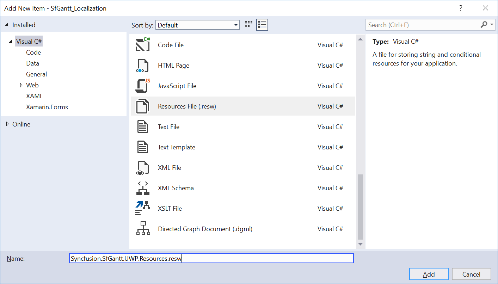

# Localization 

Localization is the process of translating the application resources into different languages for specific cultures. You can localize the SfGantt by adding a resource file. Application culture can be changed by setting the `PrimaryLanguageOverride` in the MainPage() constructor.

In the following code example, application culture is configured to French language.



public MainPage()
{
    this.InitializeComponent();
    ApplicationLanguages.PrimaryLanguageOverride = "fr";
}   



To localize the SfGantt based on `PrimaryLanguageOverride` using resource files, use the following steps: 

1. Right-click the project, click **Add**, and then click **NewFolder**, name the folder as **Resources**.

2.	Right-click the **Resources** folder, click **Add**, and then click **NewFolder**, name the folder as **[culture name]**. The culture name indicates name of language and country. 

For example, you will have to give name as **fr-FR** for French culture.

3.	Right-click the **[culture name]** folder, click **Add**, and then click **NewItem**.

4.	In the Add New Item dialog, click the Resource File, and name the filename as **Syncfusion.SfGantt.UWP.Resources.resw**.

5.	Add the Name/Value pair in Resource Designer of **Syncfusion.SfGantt.UWP.Resources.resw** file, and change its corresponding value to corresponding culture.

You can download the sample for localizing the Gantt from [here](http://www.syncfusion.com/downloads/support/directtrac/general/ze/SfGantt_Localization-817789850.zip)